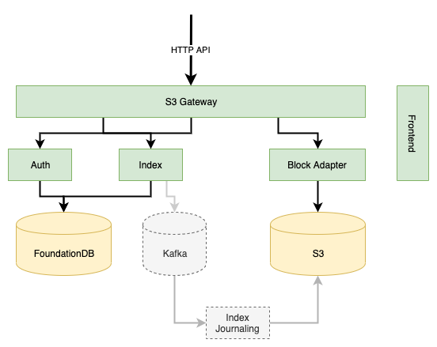

# lakeFS


This is a draft for a design document describing the capabilities and 
implementation of lakeFS 0.1

## Full Documentation

For full documentation, including in-depth architecture, design, API reference and deployment see [https://docs.lakefs.io](https://docs.lakefs.io/?utm_source=github)

## Goals

lakeFS is data lake management solution, offering at a high level the following capabilities:

1. Cross-lake ACID operations - change several objects/collections as one atomic operations to avoid inconsistencies during complex migrations/recalculations
2. Reproducibility - Travel backwards in time and match versions of data to the code that generated it
3. Deduping by default - No more copying input/sample data to side directories that are later a nightmare to manage and track (see #2)
4. Collaboration - allow teams to share data and approve changes to data including review and validation steps
5. Production Safety - Accidentally deleted/overwritten/corrupted a critical collection? revert instantly.
6. Format agnostic - use Parquet, image files, csv's, all of the above. It doesn't matter. Works with structured or unstructured data

## How?

To achieve this, we require 4 main capabilities:

1. Git-like semantics that can scale to many petabytes of data (or terabytes of metadata)
   1. Committing and rolling back versions
   2. [Snapshot Isolation](https://en.wikipedia.org/wiki/Snapshot_isolation) in such that one branch's changes are completely isolated from other branches
   3. Branching and merging is (relatively) cheap to perform and should be done often
   4. transaction support (i.e. throw-away branch that gets merged on commit and discarded on rollback)
2. Sit between processing and data: this will allow us to observe who/how data is being read and written
   1. Strongly consistent writes and reads, including list-after-write and read-after-write (removing the need for S3Guard/EMRFS/etc.)
3. API compatibility with common Object Stores, starting with the S3 API (see API subset bellow)
4. Metadata journaling to allow view materialization, corruption recovery and allowing migration out of the service

## Non-Goals

1. Improve performance/durability/availability
2. Compute/orchestration management. This should be a solution added to existing systems without migration costs or upfront investment
3. S3 API compatibility for anything other than what Spark/Hadoop/ML tooling is currently using (i.e. object-level versioning, static website hosting, torrents, etc)

## High level Architecture



### Configuration

when running the lakefs binary, you can pass a yaml configuration file:

```shell script
$ lakefs --config /path/to/configuration.yaml
``` 

Here's an example configuration file:

```yaml
---
logging:
  format: text # or json
  level: DEBUG # or INFO, WARN, ERROR, NONE
  output: "-" # for stdout, or a path to a log file

metadata:
  db:
    # Make sure the DB connection string includes search_path (no need to create this schema beforehand)
    uri: "postgres://localhost:5432/postgres?search_path=lakefs_index&sslmode=disable"

auth:
  db:
    # Make sure the DB connection string includes search_path (no need to create this schema beforehand)
    uri: "postgres://localhost:5432/postgres?search_path=lakefs_auth&sslmode=disable"
  encrypt:
    # This value must be set by the user.
    # In production it's recommended to read this value from a safe place like AWS KMS or Hashicorp Vault
    secret_key: "10a718b3f285d89c36e9864494cdd1507f3bc85b342df24736ea81f9a1134bcc09e90b6641393a0a89d1a645dcf990fbd5f48cae092a5eee7b804e45c7d6a20e6b840e8124334312e01dde9a087228485512feb0780f4589d01fd2cc825dbb1925c3968c95083c2fca5ac07d61a10d15fdb6f43236dc5347dddfa3e7852f1654410ef53082b0007f33387dcdfd735c5b48e61991ceef3e8bba7267af4f0383a73af07b0c767ddd78b9a771ccb8be3d6662191f1b76d0e725ac59f1a63d110b018c2d0a727097ed9363fcb3f822d8dc7f12584bda25182cd74fece779977ca24caf774a3d5e3579228b27bbac99a5b7384367a5a6f3da629d00159edec45bc8fa"


blockstore:
  type: s3 # or ["local", "mem"]
  s3:
    region: us-east-1 
    profile: default # optional, implies using a credentials file
    credentials_file: /path/to/.aws/credentials # optional, will use the default AWS path if not specified
    credentials: # optional, will use these hard coded credentials if supplied
      access_key_id: "AKIA..."
      access_secret_key: "..."
      session_token: "..."
  
  # if instead of S3 you'd like to write the data itself locally (for testing only!)
  local:
    path: ~/lakefs/data

gateways:
  s3:
    listen_address: "0.0.0.0:8000"
    domain_name: s3.example.com
    region: us-east-1

api:
  listen_address: "0.0.0.0:8001"
```

### Building & Running Locally

1. Install Dependencies (varies based on OS):
    1. [Docker](https://docs.docker.com/get-docker/)
    2. [PostgreSQL](https://www.postgresql.org/download/) (>=11)
    3. [Node](https://nodejs.org/en/download/) (10+) and [NPM](https://www.npmjs.com/get-npm)
    4. [GNU Make](https://www.gnu.org/software/make/)
2. Generate static assets:

   ```bash
   $ make gen
   ```

3. Run tests (full suite including Go's Race Detector):

   ```bash
   $ make test
   ```

4. Build a static binary:

   ```bash
   $ make build
   ```

5. You should end up with 2 binaries in your work directory: `lakefs` and `lakectl`. See the [docs](https://docs.lakefs.io/quickstart.html) on how to run them.

### Running Load Tests
 
After building as in the previous step, you should have a third binary, `lakefs-loadtest`. Run `lakefs-loadtest --help` for details.
