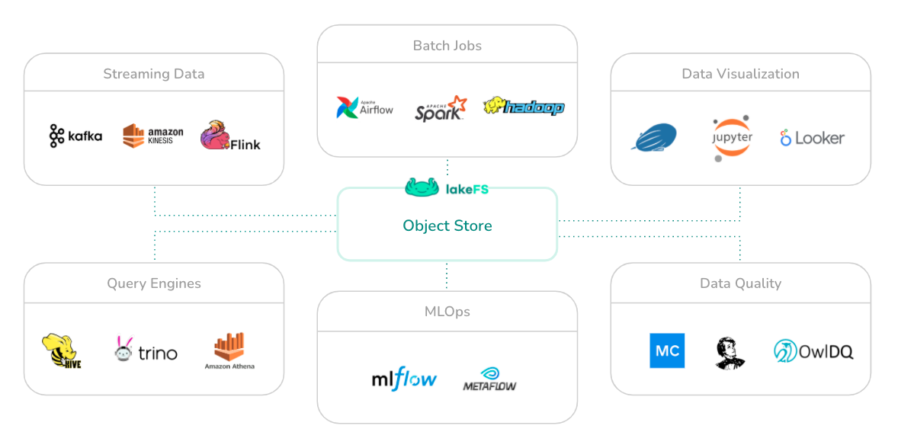

<p align="center">
  
</p>

<p align="center">
	<a href="docs/contributing.md" alt="Hacktoberfest">
		</a>
	<a href="https://raw.githubusercontent.com/treeverse/lakeFS/master/LICENSE" alt="License">
		</a>
	<a href="https://github.com/treeverse/lakeFS/actions?query=workflow%3AGo+branch%3Amaster++" alt="Go">
		</a>
	<a href="https://github.com/treeverse/lakeFS/actions?query=workflow%3ANode+branch%3Amaster++" alt="Node">
		</a>
</p>


## लेकफस क्या है

लकेफस एक ओपन सोर्स लेयर है जो ऑब्जेक्ट स्टोरेज के डेटा लक्स को तन्यकता एवं प्रबंधनीयता प्रदान करती है।


लेकफस के साथ आप जटिल ईटीएल जॉब्स से लेकर डेटा साइंस और एनालिटिक्स तक, रिपीटेबल, एटॉमिक और वर्जन डेटा लेक ऑपरेशंस का निर्माण कर सकते हैं।

लेकफस अपने अंतर्निहित भंडारण सेवा के रूप में AWS S3 या गूगल क्लाउड संग्रहण का समर्थन करता है। यह S3 के साथ संगत है, और स्पार्क, हाइव, एडब्ल्यूएस एथेना, प्रेस्टो, आदि जैसे सभी आधुनिक डेटा फ्रेमवर्क के साथ मूल रूप से काम करता है।


<p align="center">
  
</p>


अधिक जानकारी के लिए [आधिकारिक दस्तावेज] (https://docs.lakefs.io) देखें।

<div style="background: #ffdddd border: 3px solid #dd4444; margine: 15px;">


## क्षमताओं

**डेटा के लिए विकास पर्यावरण**
* **प्रयोग** - उपकरणों का प्रयास करें, संस्करणों को अपग्रेड करें और अलगाव में कोड परिवर्तनों का मूल्यांकन करें।
* **पुनरुत्पादन-क्षमता** - अपने डेटा लेक के सुसंगत संस्करण के लिए किसी भी समय वापस जाएं।

**निरंतर डेटा एकीकरण**
* **सर्वोत्तम प्रथाओं को लागू करके सुरक्षित रूप से नए डेटा को सम्मिलित करें** - सुनिश्चित करें कि नए डेटा स्रोत आपकी झील की सर्वोत्तम प्रथाओं जैसे प्रारूप और स्कीमा प्रवर्तन, नामकरण सम्मेलन, आदि का पालन करते हैं।
* **मेटाडेटा सत्यापन** - उत्पादन डेटा वातावरण में प्रवेश करने से परिवर्तन को रोकने के।

**सतत डेटा परिनियोजन**
* **डेटा में परिवर्तन को तुरंत वापस लाएं** -यदि आपके उपभोक्ताओं के लिए निम्न गुणवत्ता का डेटा सामने आता है, तो आप अपने डेटा झील के पूर्व, सुसंगत और सही स्नैपशॉट पर तुरंत वापस लौट सकते हैं।
* **क्रॉस संग्रह स्थिरता लागू करें** - उपभोक्ताओं को डेटा के कई संग्रह प्रदान करते हैं, जिन्हें एक परमाणु, पुन: प्रयोज्य, क्रिया में सिंक्रनाइज़ किया जाना चाहिए।
* **सक्षम करके डेटा गुणवत्ता के मुद्दों को रोकें**
  - उपयोगकर्ताओं / उपभोक्ताओं को इसे उजागर करने से पहले उत्पादन डेटा का परीक्षण।
  - गुणवत्ता के मुद्दों से बचने के लिए आपके DAG में मध्यवर्ती परिणामों का परीक्षण।

## शुरू करना

#### डॉकर (MacOS, लिनक्स)

1. सुनिश्चित करें कि आपके पास आपके कंप्यूटर पर डॉकर और डॉकटर कम्पोज स्थापित है।
2. निम्न आदेश चलाएँ:

   ```bash
   curl https://compose.lakefs.io | docker-compose -f - up
   ```

3. अपने वेब ब्राउज़र में एक प्रारंभिक व्यवस्थापक उपयोगकर्ता सेट करने के लिए, लॉगिन करने और एपीआई अनुरोध भेजने के लिए उपयोग किया जाता है [http://127.0.0.1:8000/setupades(http://127.0.0.1:8000/setup) खोलें।


#### डॉकर (विंडोज)
1. सुनिश्चित करें कि आपने डॉकर इंस्टॉल किया है।

2. पॉवरशेल  में निम्न कमांड चलाएँ:
   ```shell script
   Invoke-WebRequest https://compose.lakefs.io | Select-Object -ExpandProperty Content | docker-compose -f - up
   ``` 

3. अपने वेब ब्राउज़र में एक प्रारंभिक व्यवस्थापक उपयोगकर्ता सेट करने के लिए, लॉगिन करने और एपीआई अनुरोध भेजने के लिए उपयोग किया जाता है [http://127.0.0.1:8000/setupades(http://127.0.0.1:8000/setup) खोलें।

#### बाइनरी डाउनलोड करें

वैकल्पिक रूप से, आप लकेफस बायनेरी डाउनलोड कर सकते हैं और उन्हें सीधे चला सकते हैं।

बायनेरिज़ पर उपलब्ध हैं [https://github.com/treeverse/lakeFS/releases](https://github.com/treeverse/lakeFS/releases).


#### एक भंडार स्थापित करना

कृपया अपना स्थानीय लेकफ़ास्ट इंस्टॉलेशन स्थापित करने के लिए [गाइड टू गेट स्टार्टेड] (https://docs.lakefs.io/quickstart/repository) का अनुसरण करें।

लकेफस स्थापित करने के बारे में अधिक विस्तृत जानकारी के लिए, कृपया [प्रलेखन] पर जाएँ।(https://docs.lakefs.io).

## समुदाय
अद्यतित रहें और लकेफस समर्थन प्राप्त करें:

- [Slack](https://join.slack.com/t/lakefs/shared_invite/zt-g86mkroy-186GzaxR4xOar1i1Us0bzw) (हमारी टीम और अन्य उपयोगकर्ताओं से मदद पाने के लिए).
- [Twitter](https://twitter.com/lakeFS) (अपडेट और खबर के लिए फॉलो करें)
- [YouTube](https://www.youtube.com/channel/UCZiDUd28ex47BTLuehb1qSA) (वीडियो ट्यूटोरियल से सीखें)
- [Contact us](https://lakefs.io/contact-us/) (किसी भी चीज के लिए)


## अधिक जानकारी

- [लेकफस प्रलेखन](https://docs.lakefs.io)
-यदि आप योगदान करना चाहते हैं, तो हमारे [योगदान मार्गदर्शक] देखें(https://docs.lakefs.io/contributing).

## लाइसेंसिंग

लेकफस पूरी तरह से स्वतंत्र और खुला स्रोत है और [Apache 2.0 लाइसेंस] के तहत लाइसेंस प्राप्त है (https://www.apache.org/licenses/LICENSE-2.0).

