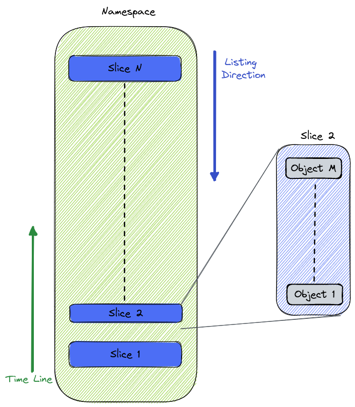

# Uncommitted Garbage Collector

## Motivation

Uncommitted data which is no longer referenced (due to any staged data deletion or override, reset branch etc.) is not being deleted by lakeFS.
This may result in excessive storage usage and possible compliance issues.
To solve this problem two approaches were suggested:
1. A batch operation performed as part of an external process (GC)
2. An online solution inside lakeFS

Several attempts for an online solution have been made, most of which are documented [here](https://github.com/treeverse/lakeFS/blob/master/design/rejected/hard-delete.md).
This document will describe the **offline** GC process for uncommitted objects.

## Design

Garbage collection of uncommitted data will be performed using the same principles of the current GC process.
The basis for this is a GC Client (i.e. _Spark_ job) consuming objects information from both lakeFS and directly from the underlying object storage,
and using this information to determine which objects be deleted from the namespace.

The GC process is composed of 3 main parts:
1. Listing namespace objects
2. Listing of lakeFS repository committed objects
3. Listing of lakeFS repository uncommitted objects

Objects that are found in 1 and are not in 2 or 3 can be safely deleted by the Garbage Collector.

### 1. Listing namespace objects

For large repositories, object listing is a very time-consuming operation - therefore we need to find a way to optimize it.
The suggested method is to split the repository structure into fixed size (upper bounded) slices.
These slices can then be scanned independently using multiple workers.
In addition, taking advantage of the common property of the listing operation, which lists objects in a lexicographical order, we can create the slices in a manner which
enables additional optimizations on the GC process (read further for details).
To resolve indexing issues with existing repositories that have a flat filesystem, suggested to create these slices under a `data` prefix. 

### 2. Listing of lakeFS repository committed objects

Similar to the way GC works today, use repository meta-ranges and ranges to read all committed objects in the repository. 

### 3. Listing of lakeFS repository uncommitted objects

Expose a new API in lakeFS which writes repository uncommitted objects information into data formatted files and save them in a 
dedicated path in the repository namespace

### Required changes by lakeFS

The following are necessary changes in lakeFS in order to implement this proposal successfully.

#### Objects Path Conventions

Uncommitted GC must scan the bucket in order to find objects that are not referenced by lakeFS.
To optimize this process, suggest the following changes:

1. Store lakeFS data under `<namespace>/data/` path
2. Divide the repository data path into time-and-size based slices.
3. Slice name will be a time based, reverse sorted unique identifier.
4. LakeFS will create a new slice on a timely basis (for example: hourly) or when it has written < MAX_SLICE_SIZE > objects to the slice.
5. Each slice will be written by a single lakeFS instance in order to track slice size.
6. The sorted slices will enable partial scans of the bucket when running the optimized GC.

#### StageObject

The StageObject operation will only be allowed on addresses outside the repository's storage namespace. This way, 
objects added using this operation are never collected by GC.

#### [Get/Link]PhysicalAddress 

1. GetPhysicalAddress to return a validation token along with the address (or embedded as part of the address).
2. The token will be valid for a specified amount of time and for a single use.
3. lakeFS will need to track issued tokens/addresses, and delete them when tokens are expired/used
4. LinkPhysicalAddress to verify token valid before creating an entry.
    1. Doing so will allow us to use this time interval to filter objects that might have been uploaded and waiting for
       the link API and avoid them being deleted by the GC process.
    2. Objects that were uploaded to a physical address issued by the API and were not linked before the token expired will
       eventually be deleted by the GC job.
>**Note:** These changes will also solves the following [issue](https://github.com/treeverse/lakeFS/issues/4438)

#### Track copied objects in ref-store

lakeFS will track copy operations of uncommitted objects and store them in the ref-store for a limited duration.
GC will use this information as part of the uncommitted data to avoid a race between the GC job and rename operation.
lakeFS will periodically scan these entries and remove copy entries from the ref-store after such time that will 
allow correct execution of the GC process.  

#### S3 Gateway CopyObject

When performing a shallow copy - track copied objects in ref-store.
GC will read the copied objects information from the ref-store, and will add them to the list of uncommitted.
lakeFS will periodically clear the copied list according to timestamp.

1. Copy of staged object in the same branch will perform a shallow copy as described above
2. All other copy operations will use the underlying adapter copy operation.

#### CopyObject API
Clients working through the S3 Gateway can use the CopyObject + DeleteObject to perform a Rename or Move operation.
For clients using the OpenAPI this could have been done using StageObject + DeleteObject.
To continue support of this operation, introduce a new API to Copy an object similarly to the S3 Gateway functionality

#### PrepareUncommittedForGC

A new API which will create files from uncommitted object information (address + creation date). These files
will be saved to `_lakefs/retention/gc/uncommitted/run_id/uncommitted/` and used by the GC client to list repository's uncommitted objects.
At the end of this flow - read copied objects information from ref-store and add it to the uncommitted data.
For the purpose of this document we'll call this the `UncommittedData`
>**Note:** Copied object information must be read AFTER all uncommitted data was collected

### GC Flows

The following describe the GC process run flows on a repository:

#### Flow 1: Clean Run

1. Listing namespace objects
   1. List all objects directly from object store (can be done in parallel using the slices) -> `Store DF`
   2. Skip slices that are newer than < TOKEN_EXPIRY_TIME >
2. Listing of lakeFS repository uncommitted objects
   1. Mark uncommitted data
      1. List branches
      2. Run _PrepareUncommittedForGC_ on all branches
   2. Get all uncommitted data addresses
         1. Read all addresses from `UncommittedData` -> `Uncommitted DF`
    >**Note:** To avoid possible bug, `Mark uncommitted data` step must complete before listing of committed data
3. Listing of lakeFS repository committed objects
   1. Get all committed data addresses
      1. Read all addresses from Repository commits -> `Committed DF`
4. Find candidates for deletion
   1. Subtract committed data from all objects (`Store DF` - `Committed DF`)
   2. Subtract uncommitted data from all objects (`Store DF` - `Uncommitted DF`)
   3. Filter files in special paths
   4. The remainder is a list of files which can be safely removed
5. Save run data (see: [GC Saved Information](#gc-saved-information)) 

#### Flow 2: Optimized Run

Optimized run uses the previous GC run output, to perform a partial scan of the repository to remove uncommitted garbage.

##### Step 1. Analyze Data and Perform Cleanup for old entries (GC client)

1. Read previous run's information
   1. Previous `Uncommitted DF`
   2. Last read slice
   3. Last run's timestamp
2. Listing of lakeFS repository uncommitted objects  
    See previous for steps
3. Listing of lakeFS repository committed objects (optimized)
   1. Read addresses from repository's new commits (all new commits down to the last GC run timestamp) -> `Committed DF`
4. Find candidates for deletion
   1. Subtract `Committed DF` from previous run's `Uncommitted DF`
   2. Subtract current `Uncommitted DF` from previous run's `Uncommitted DF`
   3. The result is a list of files that can be safely removed

>**Note:** This step handles cases of objects that were uncommitted during previous GC run and are now deleted

##### Step 2. Analyze Data and Perform Cleanup for new entries (GC client)

1. Listing namespace objects (optimized)
   1. Read all objects directly from object store
   2. Skip slices that are newer than < TOKEN_EXPIRY_TIME >
   3. Using the slices, stop after reading the last slice read by previous GC run -> `Store DF`
2. Find candidates for deletion
   1. Subtract `Committed DF` from `Store DF`
   2. Subtract current `Uncommitted DF` from `Store DF`
   3. Filter files in special paths
   4. The remainder is a list of files which can be safely removed
3. Save run data (see: [GC Saved Information](#gc-saved-information))

### GC Saved Information

For each GC run, save the following information using the GC run id as detailed in this [proposal](https://github.com/treeverse/cloud-controlplane/blob/main/design/accepted/gc-with-run-id.md):
1. Save `Uncommitted DF` in `_lakefs/retention/gc/uncommitted/run_id/uncommitted/` (Done by _PrepareUncommittedForGC_)
2. Create and add the following to the GC report:
   1. Run start time
   2. Last read slice
   3. Write report to `_lakefs/retention/gc/uncommitted/run_id/`

## Limitations

* Since this solution relies on the new repository structure, it is not backwards compatible. Therefore, another solution will be required for existing 
repositories
* Even with the given optimizations, the GC process is still very much dependent on the amount of changes that were made on the repository
since the last GC run.

## Performance Requirements

TLDR; [Bottom Line](#minimal-performance-bottom-line)

The heaviest operation during the GC process, is the namespace listing. And while we added the above optimizations to mitigate
this process, the fact remains - we still need to scan the entire namespace (in the Clean Run mode).
As per this proposal, we've created an experiment, creating 20M objects in an AWS S3 bucket divided into 2K prefixes (slices), 10K objects in each prefix.
Performing a test against the bucket using a Databricks notebook on a c4.2xlarge cluster, with 16 workers we've managed to list the entire bucket in approximately 1 min.

Prepare Uncommitted for GC:
For 5M uncommitted objects on 1K branches, the object lists are divided into 3 files, as we are targeting the file size to be approximately 20MB.
It takes approximately 30 seconds to write the files, and uploading them to S3 will take ~1 min. using a 10 Mbps connection.

Reading committed and uncommitted data from lakeFS is very much dependent on the repository properties. Tests performed on very large repository with
~120K range files (with ~50M distinct entries) and ~30K commits resulted in listing of committed data taking ~15 minutes.

Identifying the candidates for deletion is a minus operation between data frames, and should be done efficiently and its impact on the total runtime is negligible.
Deleting objects on S3 can be done in a bulk operation that allows passing up to 1K objects to the API.
Taking into account a HTTP timeout of 100 seconds per request, 10 workers and 1M objects to delete - the deletion process
should take at **most** around 2.5 hours

### Minimal Performance Bottom Line

* On a repository with 20M objects
* 1K branches, 30K commits and 5M uncommitted objects
* 1M stale objects to be deleted
* Severe network latencies

**The entire process should take approximately 3 hours**

