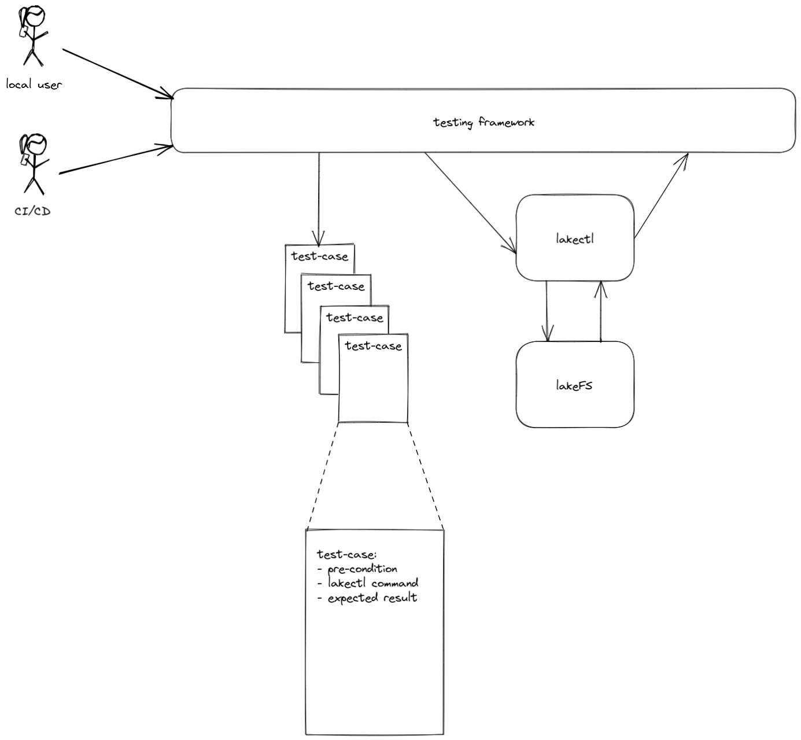

# lakectl Testing

## Purpose

This document describes the design of a testing framework aimed at testing our CLI, namely `lakectl`.
It specifies the requirements from the system and a set of technical questions we need to answer. Each question (in fact, each option), is accompanied by pros and cons, to help us understand which options will answer our needs the best. These are obviously not the only aspects to these decisions, and so, this document and the decisions derived from, are subject to reviews and suggestions.
This document does not specify the cli tests to run, but the system intended to run them

## Requirements
* Usable both locally and as part of CI/CD
* Ease of use - adding new tests should be as easy as possible. Moreover, adding new tests, or modifying existing ones, should not draw modifications to the testing framework itself
  * It is obvious that changing the test **format** (e.g. expanding) will require framework modifications, in order to support the modified format
* Decoupling of Framework and Data - the test data format should contain all the required info for the test itself, regardless of the framework design. In other words, we would like the ability to rewrite/replace the framework and still use the same tests data
*

## What We Want To Test 

The goal is to the test `lakectl` correctness. At the very least we would like to verify that:
* CLI input is parsed correctly
* The correct requests are sent to the server (if any)
* Server result is formatted correctly
* Both erroneous input and error results from the server are formatted correctly
* CLI Internal errors are handled correctly

This testing framework is not designed to perform end-to-end tests (i.e. server correctness) or performance, for that matter

## Architecture

### Architecture Outline

### Test Case Structure

The test case structure should contain at least the following details:
* pre-condition: the system state right before the tested command starts. This can be a function name to call, a mock type to use or a file containing lakectl commands to run in order to bring the system to that state (in case real server is in use)
* lakectl command: a string with the `lakectl` command to test.
* expected result: the expected output of a correct execution of the above command. This can be a string or, better, a file containing the output string

In the future we might consider expending this structure with more fields, to allow extended functionality
 
### How should we use `lakefs` backend

Here are some of the pros and cons of each approach

#### **Live Server**

On the upside:
* Straightforward - the implementation is already there, just bring the server up.
  * Moreover, `lakefs` modifications are immediately reflected into the tests
* The best possible simulation - this is the real server `lakectl` is communicating with

And then, on the downside:
* Bringing up the server requires additional dependencies - underlying storage, DB etc. While this supports the advantage of testing a **real** server environment, it complicates the test setup, and although this is easily solved by containers, it still worth mentioning
* Performance-wise, creating a server environment for each test (thousands of them, ideally) is very expensive. We can, of course, group several tests (all of them?) to use a single server session, but this will eliminate the isolative and stateless nature of the tests, which is undesired
* Flexibility is limited to `lakefs` server implementation. This means that testing `lakectl` behavior, with improbable response from `lakefs` server (e.g. timeout, disconnection etc.) becomes very difficult

#### Mock

Advantages:
* Totally independent from the environment. No need for DB, underlying storage, or any other future dependency that may be added to `lakefs` server. Moreover, future removal of any dependency from `lakefs` (Postgres?!) will not require framework modification. And, once again, although this advantage is pretty much diminished by the usage of containers, it is still worth noting
* No uptime, as the mock is a part of the test itself
* Totally stateless - again, as the mock is part of each test
* Maximal flexibility - each desired server response can be easily hard-coded
* No need for initial state setup steps
* Server bugs are not included

Disadvantages:
* Requires implementation - unlike `lakefs` server, we currently don't have a mock
* Requires (a lot of) maintenance - every new feature and every bug fix in `lakefs` may, and probably will, need to be reflected in the mock
* Does not test the client with the actual server.  E.g. if the client expects a particular response but the server sends a different response, the test passes but client behaviour will be different.

#### Conclusion ?

For the long term it look like the better approach is to use a full scale mock, which should evolve as tests are created. While this will certainly have an impact on new tests creation ease, the benefits of lack independency on `lakefs` are too important to ignore, especially when dealing with a young product such as `lakefs` which may be subdued to significant changes in the future

### How should we test `lakectl`

While the decision on `lakefs` usage above, has many significant aspects, the 2 approaches on how to test `lakectl` - as a binary or as code - seems to have much lesser impact. Here are some of the advantages and disadvantages of both

#### Testing `lakectl` Binary

Pros:
* Tests are performed on the real binary and includes all the surroundings, such as env variables
* Allows usage of 3rd party testing tools, that were designed to test CLIs

Cons:
* May be hard to debug a failed test

#### Testing `lakectl` Code with Golang Tests

Pros:
* As simple as it gets - use golang testing framework on function `main()`
* No need to build `lakectl` binary as part of the test
* Easy to debug - just use your favorite IDE/debugger

Cons:
* Everything that happens before `main()` is lost (process start etc.)
* Might be challenging to create the same env as the process

#### Conclusion ?

As it seems, the 2 approaches are pretty similar, so no clear cut here. I believe that the simplicity that comes with testing `lakectl` code with golang, will make our life easier and although it will not test the real binary, the benefits are non negligible

## Conclusion

At the design review meeting we came to the following understandings:
* lakectl tests will be implemented as part of Esti system tests
* lakectl will be tested only as a binary
  * lakectl binary location will be passed as env variable
* By default, real lakefs server will be used, for everything currently possible with lakefs. Mocks will (probably) be used at a later phase, to test behaviors that are difficult to achieve in a real server environment
* Good flows are the first ones to be covered, then bad flows/common error scenarios. Specific errors reported by users will be covered as needed
