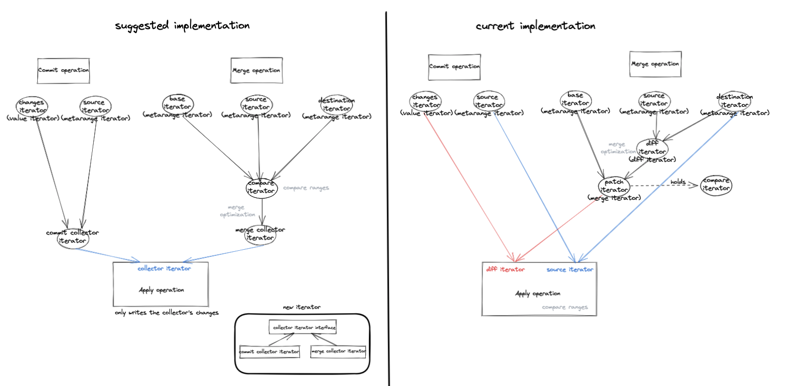

# Design: Refactor the Merge Operation

## Problem Description
Currently, as part of our design:
* Apply is used for both commit and merge
* Merge iterator is implemented using the Diff iterator

Our code for the merge operation got to a level where it's too complex and it is very hard to follow when inserting changes.

## Goals
* Simplify the merge implementation to make it easier to insert new changes
* Create code structure that will allow optimization of the merge operation

## Proposed Design

### Separate between Diff and Merge:
Currently, the merge operation uses the diff iterator and patches it with the merge iterator.
Instead of using the diff iterator that holds source iterator and destination iterator, we can use a compare iterator that will get three iterators: source, destination and base. That way, we can optimize the code by comparing the 3 iterators together and skipping ranges by need.

### Separate between Apply and Merge:
Currently, all the implementation of passing on the iterators and choosing what to write is implemented in Apply for both commit and merge. To separate the operations, we can create a new collector iterator interface. It will keep the changes that need to be written.
Next()- returns range or record to write, does not have NextRange().
The collector iterator will use the compare iterator to know the changes - If a range has been added, deleted or if there is a conflict.
Then the apply operation instead of comparing ranges and choosing what to write will get the collector iterator, will pass on it, and will write the results with the metaRangeWriter.
