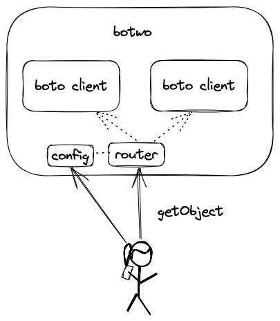
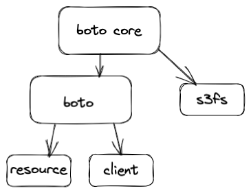

# Design: Co-Existing with Boto

## Problem Description

Existing code bases where paths are scattered throughout the codebase (which is rather common for DE/DS code) have a hard time incorporating the lakeFS S3 gateway for several reasons:
1. Clients (namely, boto3 and pandas) don't support multiple S3 endpoints with differing credentials. This makes it hard to migrate only a subset of the data to be in lakeFS because the client, once initialized, can talk to either lakeFS or S3 but not both.
2. Once data is migrated from S3 to lakeFS, even if the repo has the same name as the previous bucket, it's still not a drop-in replacement, because in lakeFS you'd also need to specify the version ref (branch/commit/tag) you're using, as a prefix.

Solving 1 is hard because it requires a big infrastructure change: instead of using a single initialized client (sometimes it's a default or global one), now multiple clients need to be introduced (one for S3, one for lakeFS) with custom logic for when to use which one.
Solving 2 is hard because it involves changing many paths scattered throughout the code base: some are dynamically generated by the code, some come from env vars or configuration files - it's not always easy to ensure coverage.

## Goals
* Run two boto client side-by-side with minimal changes to user's existing code
* Users should do the minimal set of changes possible in code to integrate lakeFS

## Non Goals
* Provide new features that weren't previously possible through lakeFS

## Value Propositions
When a user with an existing python code that uses boto3 client to access s3 wants to move only part of their buckets/prefixes to lakefs, botwo allows using lakefs and s3 together with minimum code changes.

## Proposed Design


The botwo package provides a boto3 like client with two underlying boto3 clients.
It handles several things for the user:
* Holds two boto clients and routes the requests between them by the bucket/prefix configuration. 
For example: user can route all requests to s3 with `Bucket` to lakeFs with `Bucket/main/` in lakeFS (Bucket = repository name).
* Maps 1:1 with the boto AWS service API. All botwo client AWS functions will be generated on the fly according to boto3 client AWS functions.
* Holds special treatment for functions that operate on multiple buckets like `upload_part_copy`. If more such functions are added to s3 in the future, we will need to implement them as well.
* It has more functionality like the event-system that will be implemented by using one of its clients (the default one).

## Alternatives Considered

### Route the requests to lakefs endpoint by the prefix
```
s3 = boto3.client('s3')
if bucket == "bucket_a" and prefix == "my_path":
  client.endpoint_url  = 'https://lakefs.example.com'
```
Does not work because once you initialize boto client with parameters you can’t change them in run time.

### Method Overriding

Monkey patching / overriding base class functions in boto3 with inheritance.
Does not work because Boto3 functions are generated on the fly from service definitions, so there is no static put_object function to inherit from.

### Creating custom resource-class using the events system

When extending a resource class using the [events system][Extensibility guide], there is no inheritance relationship between the base class and the custom class. It results in a base class enriched with the functions and attributes of the custom class.
It allows only to replace the bucket and prefix names.

### Route all the requests to lakefs server and implement the bucket configuration there
It can result in server load because requests like put_object can call directly to s3.

### Wrap boto core fs
Possible but complex because we will need to implement boto core interface which has a lot of functionality.

## Usage

Before introducing the new client, the user interacts only with S3:
```
import boto3

s3 = boto3.client('s3')

s3.get_object(Bucket="test-bucket", Key="test/object.txt") # in a lot of places
```

With the new client: change in every place in the code where a boto S3 client is initialized:

```
import boto3
import botwo

client1 = boto3.client('s3')
client2 = boto3.client('s3', endpoint_url='https://lakefs.example.com')

mapping = [
  {
    "bucket_name": "bucket-a",
    "client": "lakefs",
    "key_prefix": "dev/"
  },
  {
    "bucket_name": "example-old-bucket",
    "mapped_bucket_name": "example-repo",
    "client": "lakefs",
    "key_prefix": "main/"
  },
  { 
    "bucket_name": "*", # default
    "client": "s3",
  }
]

s3 = botwo.client({"s3": client1, "lakefs": client2}, mapping)

s3.get_object(Bucket="test-bucket", Key="test/object.txt") # stays the same
```

Every time s3 function is called, it will go over the mapping bucket list by order and stop if there is a match.
If there isn't a match it will go to the default client (the user must provide a default client).

## Open Questions


* There are two different abstractions within the boto3 SDK for making AWS service requests: client and resource.
  * Client - provides low-level AWS service access, maps 1:1 with the AWS service API.
  * Resource - provides high-level, object-oriented API. It exposes sub-resources and collections of AWS resources and has actions (operations on resources).
```
s3 = boto3.resource('s3')
obj = s3.Object(bucket_name='boto3', key='test.py')
```
  This proposal provides a solution only for boto client, It can be expended to resource as well per user requests. 

* Pandas: there are two ways to access s3 - Boto and s3fs-supported pandas API (S3Fs is a Pythonic file interface to S3. It builds on top of botocore) which is not addressed as well.


[Extensibility guide]: https://boto3.amazonaws.com/v1/documentation/api/latest/guide/events.html