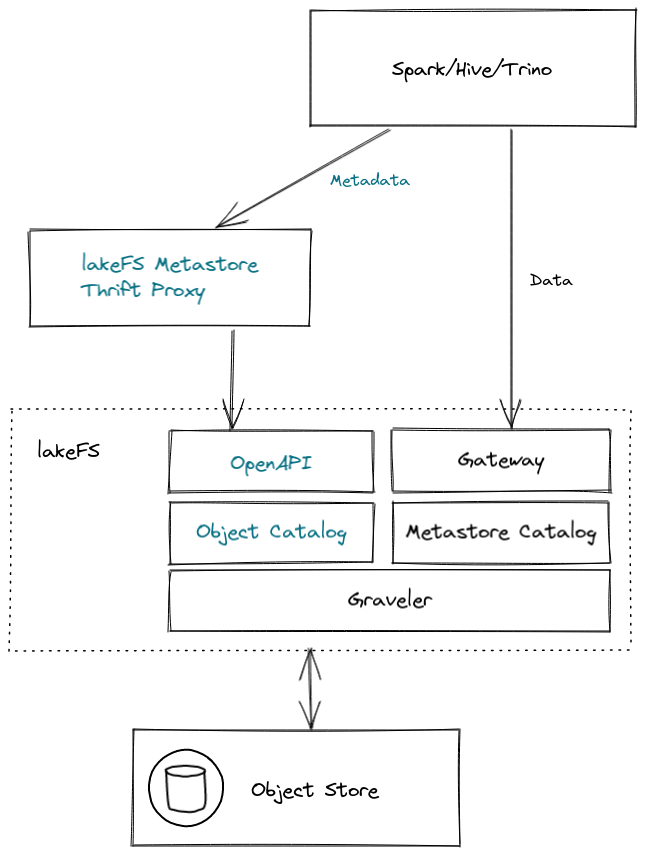
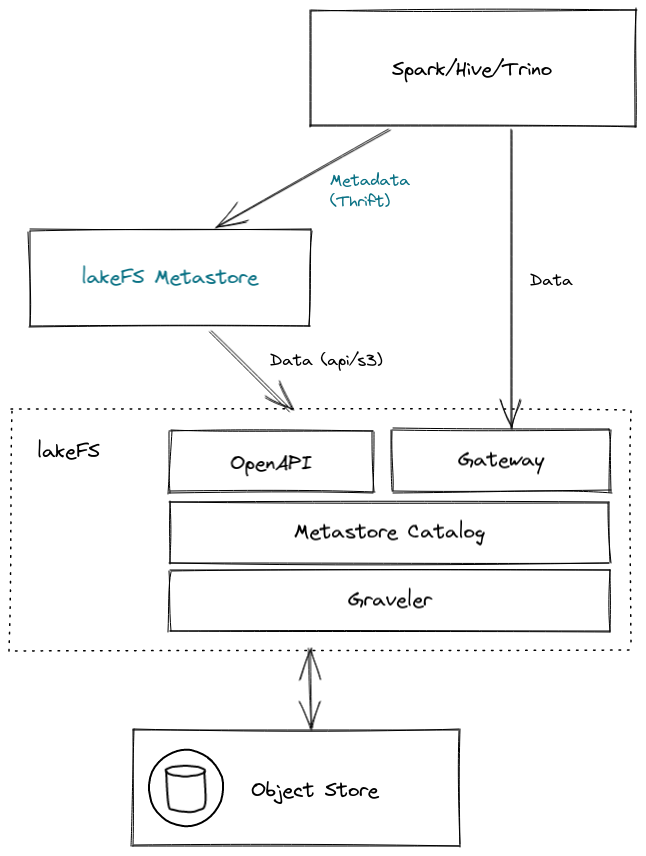

# Next Generation Metastore

### Overview

Hive metastore is a component that stores all the structure information of objects like tables and partitions in the warehouse including column and column type information, the serializers and deserializers necessary to read and write data and the corresponding object store locations.
This design document describes the lakeFS proposal for a metastore as part of our solution for managing metastore information along with object-store data.

### Goals

- Metastore entities are versioned: using the same commit and branching abilities that lakeFS provides
- Metastore entities are versioned together with the data: an atomic merge operation should contain both data mutations as well as metastore mutations.
- Metastore entities are diff-able: can view the changes made to the metadata (metastore data model) between commits
- Maintain some compatibility with existing HMS, or at least a narrow set of its versions and API
- Extend functionality to also support next-generation table formats in addition to hive-style tables (Notably, Iceberg and Delta Lake) - long term goal.


### Non-Goals

- Support storing metadata inside existing Hive Metastore implementations
- Provide any significant change in performance or throughput of metadata operations
- Provide compatibility with other specific versions of Hive or Hive Metastore (like Glue)


### Design Diagram



In this diagram:
1. Spark/Hive/Trino - data and metadata clients (connects using Thrift endpoint)
1. lakeFS Metastore Thrift Proxy - acts as the client's metastore by implementing the Hive Metastore Thrift protocol
1. lakeFS - Includes the metatore implementation by:
   - Additional operations on OpenAPI that will serve the metastore information and operations like we have for objects.
   - Metadata catalog that will use Graveler and store metastore information.

The diagram shows how Spark/Hive/Trino connects to the lakeFS metastore proxy (which replaces Hive Metastore).
The request to the metastore proxy will invoke the equivalent operation on lakeFS's OpenAPI.
In turn, lakeFS will use the metastore catalog implemented by Graveler.


### Design Diagram Alt.

Alternative design that will be discussed



In this diagram:
1. Spark/Hive/Trino - data and metadata clients (connects using Thrift endpoint)
1. lakeFS Metastore - acts as the client's metastore by implementing the Hive Metastore Thrift protocol and manage the metastore data on top of lakeFS
1. lakeFS - same lakeFS with additional support for the metastore data format. Implementing a way to include custom data format for diff / merge.

The diagram shows how Spark/Hive/Trino connects to the lakeFS metastore (which replaces Hive Metastore) and uses lakeFS as the storage and versioning engine.
The request to the lakeFS metastore will access the relevant repository branch under lakeFS to read/write/list metastore information.
lakeFS will have to extend the diff/merge functionality in order to support a better versioning support to the data the lakeFS metastore choose to store.


### Data Model

Using Gravler we can implement a Metastore catalog for all the metadata properties. Alternative, store metastore catalog over lakeFS (discover item that should be discussed).
As the metastore entries describes the tables, partitions and fields and not the files themselves each entry size is a little bigger than the current metadata we keep on each entry. The largest structure holds ~15 fields, some nested but in total it holds bytes to several KB.
Using the same ordered key-value exposed by Graveler we can model the entities used by Hive Metastore:

- Databases
- Tables
- Partitions
- Indices
- Functions
- Columns 
- Constraints
- Serdes

Hive Metastore keep the above entries information inside SQL tables. Keep the same data using Graveler will require mapping the same data as a set of key/value entries. Each entry can be represent an entity in our model.
Because the data model holds [relationships](diagrams/hive_metastore_database_diagram.png) we need to handle diff/merge differently as the current Graveler model compares single entries based on same key. Changes in database or table level, can be easily handle if one entry represents the change, but there are cases where we will need to understand the context. Like partition part of a table or table part of database.
One of the items for discovery is choosing the best way to model the information, in order to have a better way to diff/merge changes in metastore data. The chosen key format will effect how underlying ranges are split, the cost of lookup of nested information and etc.

Example of how we can map keys to different entities:

```
db/db1 -> {name, description, locationUri, parameters, privileges, ownerName, ownerType}
db/db2 -> {name, description, locationUri, parameters, privileges, ownerName, ownerType}
db/db1/table/tbl1 -> {tableName,dbName,owner,createTime,lastAccessTime,retention,sd,partitionKeys,...}
db/db1/table/tbl2 -> {tableName,dbName,owner,createTime,lastAccessTime,retention,sd,partitionKeys,...}
db/db2/table/tbl1 -> {tableName,dbName,owner,createTime,lastAccessTime,retention,sd,partitionKeys,...}
...
```

Location - entities location points to the object store location use a global location called warehouse location to store the data.  The location is a path to a directory.
The location can't reference the lakeFS underlying storage (physical address) as it doesn't contain the structure and object names. We can look into integrating with lakeFS's Hadoop FS where mapping object locations under gateway address can be directly access using 'lakefs://' schema.

The above list of entries are just part of the data model that Hive Metastore provides and the one we assume it is required to work. Supporting the full interface will map the additional entities we will support with one exception we like to discover which is statistics to verify if the same storage should include the statistics, do we need to provide diff/merge the same way and can we update statistics for committed metastore information.


### Thrift API

Implementing the Hive Metastore 2.3.x API will be the starting point of lakeFS Metastore. The must of the Thrift interface of the metastore is CRUD operation on the data model (entities listed above)
Spark works with Hive Metastore version 2.3.9 (https://spark.apache.org/docs/latest/sql-data-sources-hive-tables.html), but can also work with version 3.x.
Trino can work with Hive 2 and 3, while having specific capabilities enabled for version 3.
Must of the Hive Metastore Thrift interface kept backward compatibility. The v2.3.x and v3.x interfaces are almost identical, where version 3 adds Catalog and Workload management metadata.

Implementing Thrift interface include code generation (stub/skeleton), as part of the server side we implement, we should consider using additional code generation or dynamic code that will enable us implement the proxy and pass the request to the lakeFS OpenAPI implementation. It can reduce the work needed and prevent bugs.

Hooks - The Thrift interface includes a set of API endpoints with the suffix '_environment_context', which allow the caller to pass additional information to the hooks. The hooks mechanism in Hive Metastore is a Java interface implementation that the metastore loads and calls on specific operations. We will not support this mechanism at first, but we can have a reference implementation of what to expect in case of adding it to our hooks mechanism


### Discovery

Hive Metastore implementation provides a reference implementation we can test and explore. It still needs to be discovered how to extend functionality to enable versioning.

Finding out more about the following items will help us evaluate our design options:

1. lakeFS metastore implementation over lakeFS or as part of lakeFS. Manage Agreed. Manage the metadata over lakeFS or over a new Graveler based catalog. What is the relationship between lakeFS repository and the metastore 1:1, 1:m or n:m.
1. Passing lakeFS's reference/branch information from the metastore client. Explore ways to pass repository/branch/ref information from the client to our metastore.
1. Co-exist with other metastores - very similar to the current work on side-by-side work with lakeFS and the current object-storage, the user like to run the same application with minimum changes, while enabling some of the data to live inside lakeFS. What needs to change or requirements in order to have the same in the metadata level? Do we need to sync information, manage part of the data and enable mapping on the client side? Can we replace the client side implementation? Do we need to spin different endpoints to serve different repositories, branches in lakeFS for parts of the metadata? Fallback to existing metastore?
1. Authentication with lakeFS - currently lakeFS secure all access by authenticating each request. What will be with our metastore data? As Hive metastore doesn't holds this concepts.
1. Data model - best way to model the metadata information into Graveler to enable 3-way diff / merge that will work in optimal way. Enable diff and merge with context, for example, when a column is added we need to know on which table and merge can identify two new partitions to the same table without a conflict. Graveler diff/merge works on key/value base, each entry doesn't represent an entry in our metadata and even in cases it does when we report a diff, we need go report the context and/or relationship of the entry. For example adding a partition to a table, we should present in the diff the database/schema/table in the context of the change in order to enable the user the understanding of what was changed. We need to diff with base to understand if the partition was added or just modified on both ends and it wasn't a conflict. This is different from the current use of diff in Graveler level where it does the above for a single entry based on checksum.
1. How do we store statistics - can it be stored with the rest of the metadata? Include in merge/diff? Can be updated on committed data?
1. Do we need to implement support in hooks and in which level? New kind of hooks that keeps the same data model? Supporting the hooks by loading Java classes as today.
