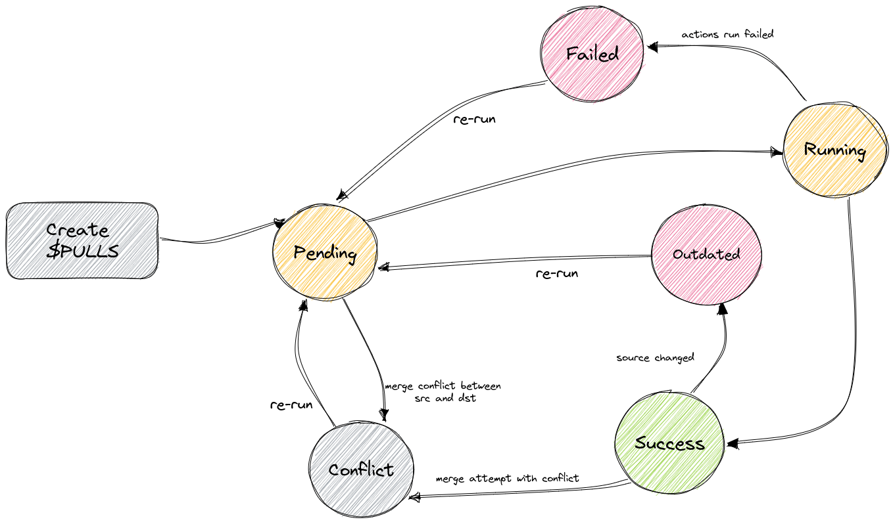

# $PULLS Proposal

This proposal tries to bridge between two proposals: [pull-request](pull-request.md) and [checks](https://github.com/treeverse/lakeFS/blob/280c5b741df5e1e051958b8adde826364c6df614/design/open/branch_checks.md)
and provide long-running CI/CD processes while laying the foundation for future "pull-request" like feature.

## How it will work

Introduce a new entity called $PULLS at the branch level. The $PULLS entity is identified by a source branch and destination branch. 
Each source-destination is associated to a single $PULLS instance.
Define a new hook type - `on-pull` which will run whenever a new $PULLS instance is created.
The actions will run on the source branch, and will allow merging after job is successful.

[//]: # ($PULLS high level design is similar to the one described in the [checks]&#40;https://github.com/treeverse/lakeFS/blob/280c5b741df5e1e051958b8adde826364c6df614/design/open/branch_checks.md&#41; proposal)

[//]: # (with one distinction:)

[//]: # (The $PULLS process will be performed entirely on the source branch, which means that execution of the check as well as the validation is done on the *source branch*)

### $PULLS States

$PULLS will have to following states:

* `PENDING` - Initial state, will transition to either `CONFLICT` or `RUNNING`
* `CONFLICT` - Conflict exists between source and destination
* `RUNNING` - While waiting for actions to complete execution
* `OUTDATED` - In case source branch has changed during or after hooks execution
* `SUCCESS` - All actions completed successfully
* `FAILED` - Some actions failed

For `OUTDATED` and `FAILED` $PULLS it will be possible to re-run the actions. We can start with re-running the entire job and
introduce running only failed actions in the future.

### Creating a new $PULLS instance

POST `/api/v1/repositories/{repository}/branches/{sourceBranch}/$PULLS/{destinationBranch}`

On creation the following occurs:

1. Check for conflicts between source and destination branch - if conflict is found, do not run actions and set state appropriately
2. Run actions and set state to `RUNNING`

This will return the $PULLS instance ID, that can be used later for querying and merging etc.

### Querying $PULLS

GET `/api/v1/repositories/{repository}/branches/{sourceBranch}/$PULLS/{destinationBranch}`

Will return the status, corresponding actions RunID

### Merge $PULLS

On merge check for the status of the $PULLS instance and attempt to perform a merge operation between the given source and destination branches.
The merge will fail in the case a merge conflict exists.
This can be done using the current merge API by adding an optional parameter for the $PULLS id.

### $PULLS enforcement

Enforcement will be done in the repository level - using the branch protection rules.
Define a new rule `BranchProtection_RequirePull` which when set, will prohibit merge into branch not via a $PULLS instance.

## Required Changes

### Commit

On commit, we will need to go over all the $PULLS where the given branch is the source branch and update them accordingly

### Merge

Add checks for $PULLS state

### Actions

* Add a new hook type: `on-pull`
* Implement asynchronous (pollable) hooks
* Implement hooks re-run

## UI

Introduce a new tab called $PULLS, that lists all the repository's $PULLS and their states.

From this view, it will be possible to create new $PULLS, re-run failed $PULLS and perform merge on successful $PULLS.

