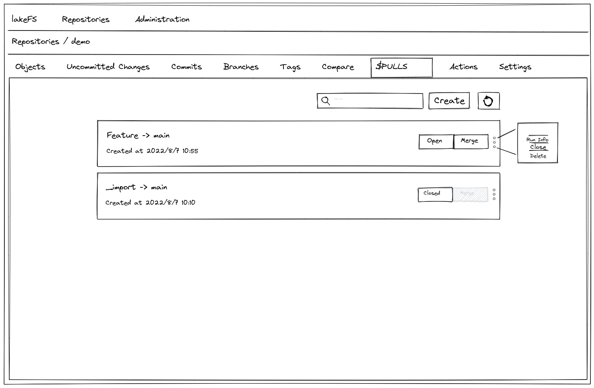
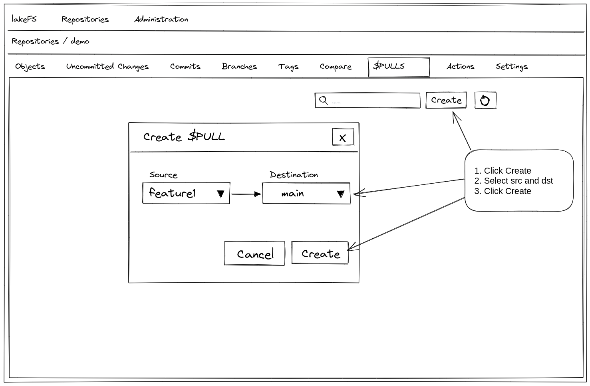

# $PULLS Proposal

This proposal tries to bridge between two proposals: [pull-request](pull-request.md) and [checks](https://github.com/treeverse/lakeFS/blob/280c5b741df5e1e051958b8adde826364c6df614/design/open/branch_checks.md)
and provide long-running CI/CD processes while laying the foundation for future "pull-request" like feature.

## How it will work

Introduce a new entity called $PULLS at the repository level. The $PULLS entity is identified by a source branch and destination branch. 
Each source-destination pair can have only a single `OPEN` $PULLS instance.
Define a new hook type - `on-pull` which will run whenever a new $PULLS instance is created.
The actions will run on the source branch, and will allow merging after job is successful.

### $PULLS Object

$PULLS will be saved in the ref-store under the key: 
`$PULLS/<src-branch>/<dest-branch>/<$PULLS-id>`

The $PULLS object will contain the following data:

* `Source Branch`
* `Source Ref` - The source branch head at the time of creation
* `Destination Branch`
* `Run ID` - The actions associated run id, may be empty

### $PULLS States

$PULLS will have to following states:

* `OPEN`
* `CLOSED`
* `MERGED`

### Creating a new $PULLS instance

POST `/api/v1/repositories/{repository}/branches/{sourceBranch}/$PULLS/{destinationBranch}`

On creation the following occurs:

1. Check for conflicts between source and destination branch - if conflict is found, do not run actions and display an appropriate message
2. Run actions - and associate RunID with instance

This will return the $PULLS instance ID, that can be used later for querying and merging etc.

### Querying $PULLS

GET `/api/v1/repositories/{repository}/branches/{sourceBranch}/$PULLS/{destinationBranch}/{id}`

Will return the status, corresponding actions RunID

### Delete $PULLS

DELETE `/api/v1/repositories/{repository}/branches/{sourceBranch}/$PULLS/{destinationBranch}/{id}`

### $PULLS enforcement

Enforcement will be done in the repository level - using the branch protection rules.
Define a new rule `BranchProtection_RequirePull` which when set, will prohibit merge into branch not via a $PULLS instance.

### Merge $PULLS

Add an optional parameter to the Merge API for the $PULLS id. 
When performing a merge with a $PULLS id, perform the following preliminary checks:
1. Verify source reference id with source branch head
2. Verify actions run successful
3. Attempt to perform merge (Subject to failure on conflict / hooks)
4. Upon successful merge - change $PULLS state to `MERGED`
5. On the event of failure in any of the previous steps - provide a meaningful error

### Re-run Actions

In the event of failed actions run, it will be possible to re-run the job via the Actions view
TBD: How to update runID of $PULLS instance on re-run
TBD: Re-run of `on-pull` should be in the context of the branch and not of the specific ref. This is in contrast to how we would like to re-run
all other types of hooks which should run on the same reference.  
**Optional solution:** Do not implement re-run in actions context, instead implement rerun on $PULLS which will in fact,
create a new run using the updated branch head and update the associated run id.

## Required Changes

### Branch Protection

* Add new branch protection rule for $PULLS
* Modify relevant APIs and add check for $PULLS branch protection rule

### Commit

On commit, we will need to go over all the $PULLS where the given branch is the source branch and update them accordingly

### Merge

* Add checks for $PULLS state

### Actions

* Add a new hook type: `on-pull`
* Implement asynchronous (pollable) hooks
* Implement hooks re-run

## UI

Introduce a new tab called $PULLS, that lists all the repository's $PULLS and their states.

From this view, it will be possible to create new $PULLS, re-run failed $PULLS and perform merge on successful $PULLS.

