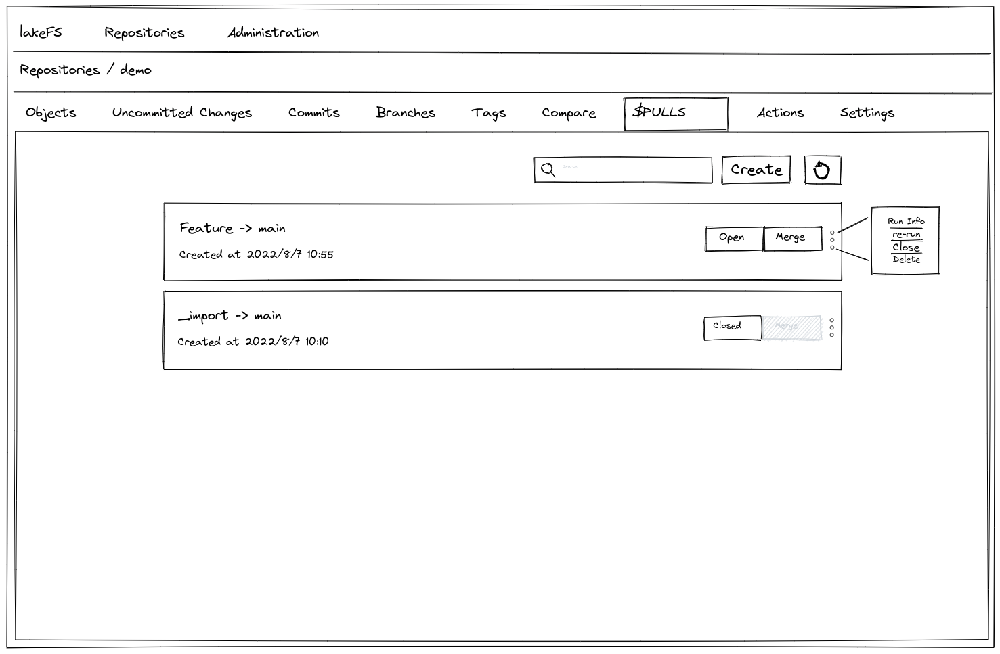
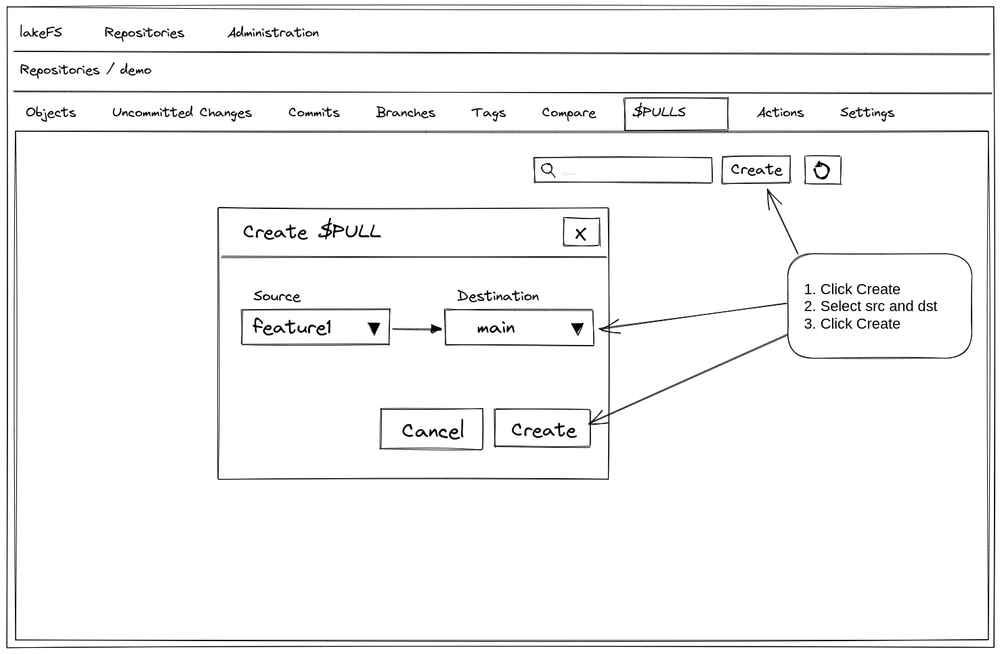

# $PULLS Proposal

This proposal tries to bridge between two proposals: [pull-request](pull-request.md) and [checks](https://github.com/treeverse/lakeFS/blob/280c5b741df5e1e051958b8adde826364c6df614/design/open/branch_checks.md)
and provide long-running CI/CD processes while laying the foundation for future "pull-request" like feature.

## Goals

* Allow long CI/CD processes
* Enable branch protection feature for merge 

## Non-Goals

* Collaboration
  * Reviews / change requests
  * Discussions
  * Approvals
* Required actions

## Suggestion 1: Pull Requests

### How it will work

Introduce a new entity called $PULLS at the repository level. The $PULLS entity is identified by a source branch and destination branch. 
Each source-destination pair can have only a single `OPEN` $PULLS instance.
Define a new hook type - `on-pull` which will run whenever a new $PULLS instance is created.
The actions will run on the source branch, and will allow merging after job is successful.

#### $PULLS Object

$PULLS will be saved in the ref-store under the key: 
`$PULLS/<src-branch>/<dest-branch>/<$PULLS-id>`

The $PULLS object will contain the following data:

* `Source Branch`
* `Source Ref` - The source branch head at the time of creation
* `Destination Branch`
* `Run ID` - The actions associated run id, may be empty

#### $PULLS States

$PULLS will have the following states:

* `OPEN`
* `CLOSED`
* `MERGED`

#### Creating a new $PULLS instance

POST `/api/v1/repositories/{repository}/branches/{sourceBranch}/$PULLS/{destinationBranch}`

On creation the following occurs:

1. Check for conflicts between source and destination branch - if conflict is found, do not run actions and display an appropriate message
2. Run actions - and associate RunID with instance

This will return the $PULLS instance ID, that can be used later for querying and merging etc.

#### Querying $PULLS

GET `/api/v1/repositories/{repository}/branches/{sourceBranch}/$PULLS/{destinationBranch}/{id}`

Will return the status, corresponding actions RunID

#### Delete $PULLS

DELETE `/api/v1/repositories/{repository}/branches/{sourceBranch}/$PULLS/{destinationBranch}/{id}`

#### $PULLS enforcement

Enforcement will be done in the repository level - using the branch protection rules.
Define a new rule `BranchProtection_RequirePull` which when set, will prohibit merge into branch not via a $PULLS instance.

#### Merge $PULLS

Add an optional parameter to the Merge API for the $PULLS id. 
When performing a merge with a $PULLS id, perform the following preliminary checks:
1. Verify source reference id with source branch head
2. Verify actions run successful
3. Attempt to perform merge (Subject to failure on conflict / hooks)
4. Upon successful merge - change $PULLS state to `MERGED`
5. On the event of failure in any of the previous steps - provide a meaningful error

#### Re-run Actions

PUT `/api/v1/repositories/{repository}/branches/{sourceBranch}/$PULLS/{destinationBranch}/{id}`

In the event of failed actions run, it will be possible to re-run the job via the $PULLS context.
This will in fact - create a new trigger for the `on-pull` hook, and update the $PULLS instance with a new run ID.
By "re-running" the actions via the $PULLS, we are able to decouple the $PULLS feature from the hooks re-run requirement,
which can be implemented in the future.

### Required Changes

#### Branch Protection

* Add new branch protection rule for $PULLS
* Modify relevant APIs and add check for $PULLS branch protection rule
* UI: On Add, provide options to select rules. Allow editing of rules.

#### Merge

* Add checks for $PULLS state

#### Actions

* Add a new hook type: `on-pull`
* Implement asynchronous (pollable) hooks
* Implement hooks re-run

### UI

Introduce a new tab called $PULLS, that lists all the repository's $PULLS and their states.

From this view, it will be possible to create new $PULLS, re-run failed $PULLS and perform merge on successful $PULLS.

## Suggestion 2: Keep it minimal - Manual Triggers

### How it will work

Introduce a new trigger type to lakeFS actions: `manual-trigger`.
Once defined in a lakeFS action, it will be possible to trigger the action 
manually with a mandatory reference (branch/commit/tag).The lakeFS action 
will run on the provided reference and the results will be available in the 
just like any other action run.

A branch protection rule will be added to the repository level, that will 
enforce actions to be run on the source ref before merge.

### Required Changes

#### Branch Protection

* Add new branch protection rule for $ACTION_RUN
* Modify relevant APIs and add check for $ACTION_RUN branch protection rule
* UI: On Add, provide options to select rules. Allow editing of rules.

#### Merge

* Add checks for Branch Protection rule fulfillment.

#### Actions

* Add a new trigger type: `manual-trigger`
* Implement asynchronous (pollable) hooks. Once might state we can start 
  without, but the whole reason for implementing any of the suggestion is 
  the ability to run long-running actions which are not bounded by the 
  timeout of a pending HTTP request. 

Open questions:
* Should hook re-run be implemented at first?
  * We can get away with not implementing it, and implement it in the future.
    It means that reruns would occur by pushing a new commit to the source 
    branch. Not ideal, but reruns are mostly useful for transient failures.
