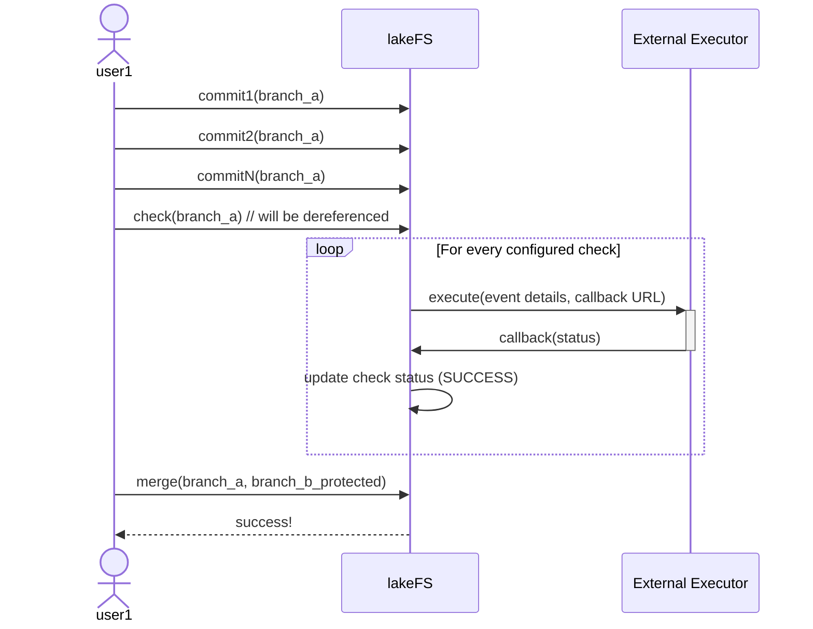
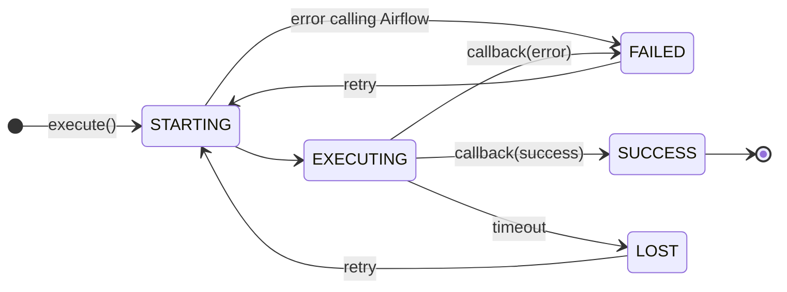

# Branch Checks

## User Story

In order to achieve CI/CD for data, data engineering teams would like to validate the data itself before allowing to merge into a production branch.
These validations might take longer than a typical HTTP request.

## Goals

Currently, lakeFS hooks allow running `pre-*` type hooks as blocking operations: They execute in a manner that is tied to an HTTP request.
This puts a pretty short time window for hooks to complete in.

Distributed processing frameworks such as Apache Spark typically have a long startup time and might take minutes (or even hours) to complete.

The main goal of this proposal is to allow such validations to occur with a very long timeout (configurable, but could be days).

## Non-Goals

Out of scope for this proposal is any collaboration features that are typically associated with PRs (that provide similar functionality to the one being proposed).

## High Level design

This proposal adds a `Check` primitive to lakeFS branches. a Check is similar to a hook: it calls out to some external component with information about a modification or event that occurred in the system.

The user flow for checks is the following:

1. configure checks
1. ensure all *mandatory* checks have passed for the given branch's HEAD
1. merge said branch into a protected one.

Merging into any protected branch requires all mandatory checks to have completed successfully for the current HEAD:



## Implementation

#### Check configuration

Checks are configured under `_lakefs_actions/` within a lakeFS repository's root. Any YAML file within the directory can contain checks, similarly to hooks.
Here's what a check would look like:

```yaml
name: Ensure Event counts are within bounds
checks:
  - id: great_expectations_validate_events
    type: webhook
    properties:
      url: "http://<host:port>/checks/great_expectations"
      query_params:
        condition: expect_table_row_count_to_be_between(min_value=2000, max_value=5000)
      headers:
        secret_header: "{{ ENV.MY_SECRET }}"
```

#### Check event syntax

```json
{
  "repository_id": "example-repo",
  "branch_id": "branch_a",
  "source_ref": "0307e79ab5afef2b0726a8c13896f716033b1acd8454e22210bd43a2f72a94a9",
  "check_id": "great_expectations_validate_events",
  "storage_namespace": "s3://path/to/storage/",
  "callback_token": "abc123",
  "output_url": "presigned URL or another HTTP POST-able URL"
}
```

#### Check triggering

Checks are triggered when the `check(repository_id, ref_id)` endpoint is called in the lakeFS API.
When running check() with a branch or tag, it will be dereferenced: checks are valid for a given commit ID.


#### Check execution

Like hooks, checks could have multiple type implementations (Airflow, Webhooks, etc). Initially, only Airflow is supported.

`execute()` will trigger a new [DAG run using the Airflow REST API](https://airflow.apache.org/docs/apache-airflow/stable/stable-rest-api-ref.html#operation/get_dag_runs), passing as conf the settings as shown above (including the callback token)

#### Check status



#### Retrying checks

From the `lost` and `failed` statuses, users can trigger a retry operationthat will cause the execute function to run again for the given check.
This is used when transient errors occur (or a timeout).

#### Getting check status

##### `/api/v1/repositories/{repoID}/refs/{refID}/checks`

```json
{
  "checks": [
    {"id": "great_expectations_validate_events", "status": "SUCCESS", "execution_id": "1234"},
    {"id": "other_check", "status": "EXECUTING", "execution_id": "45678"},
    {"id": "yet_another_check", "status": "LOST", "execution_id": "8900"},
  ]
}
```

#### Callback API

Each execution will send a `callback_token` to the executing system (Airflow, for now).

`POST /api/v1/repositories/{repoID}/refs/{refID}/checks/{checkID}?token={callback_token}`

```json
{
  "status": "SUCCESS",
  "metadata": {},
}
```

Where metadata is a simple `Map<string, string>` mapping to be sent by the executing system.

When lakeFS receives a callback, it checks that the provided token is the last one issued for that (check, commit). 
Any previous token issued will be ignored.

#### Merging into a protected branch

A branch may define 0 or more checks that must be in a state of SUCCESS for the ref being merged into it.
Once a merge is issued, the server will dereference the source branch and get back its list of checks to validate this status.

This could be done using a pre-merge hook that runs this validation, or at a higher level using the branch protection settings.

#### CLI

`lakectl checks run <ref uri> [--id <check id>] ` to run the checks for the given ref

`lakectl checks list <ref uri>` to show checks and their state for the given ref

`lakectl checks retry <ref uri> --id <check id>` to retry a check that is failed or lost.

`lakectl checks show <ref uri> --id <check id>` to retrieve check information for the given ID (including its log)


#### UI

On the commit info screen, show checks and their status as configured for that commit
clicking on a check will navigate to the actions screen to show the output and information about the check, including a retry button (if failed or lost)

Mockups TBD
