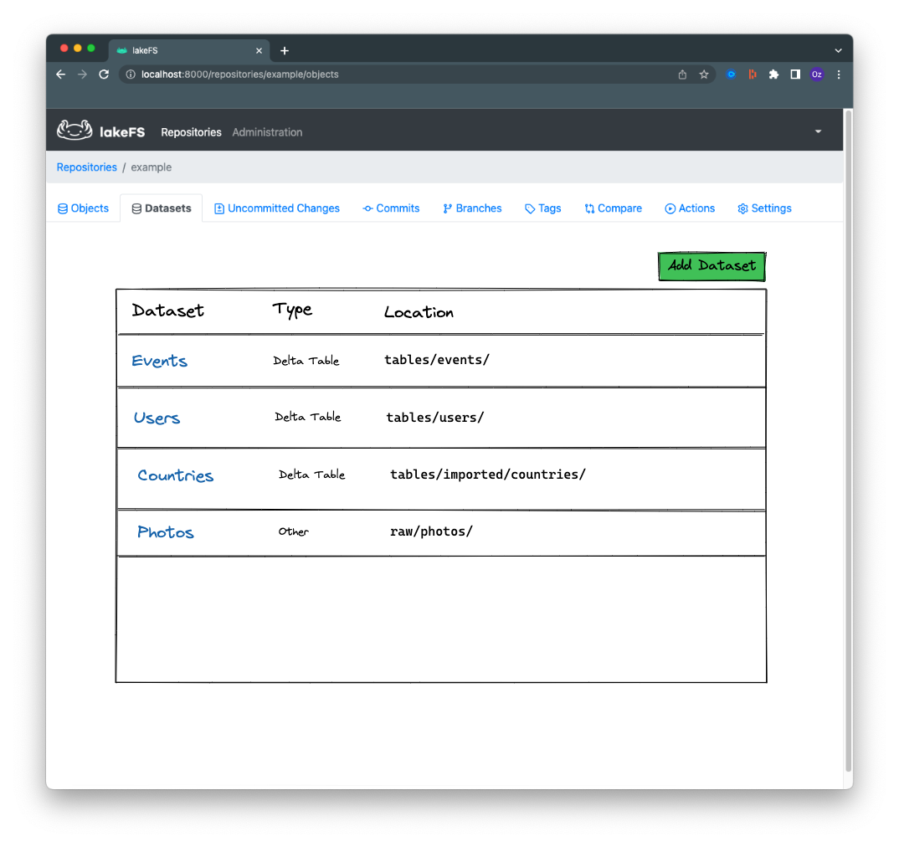
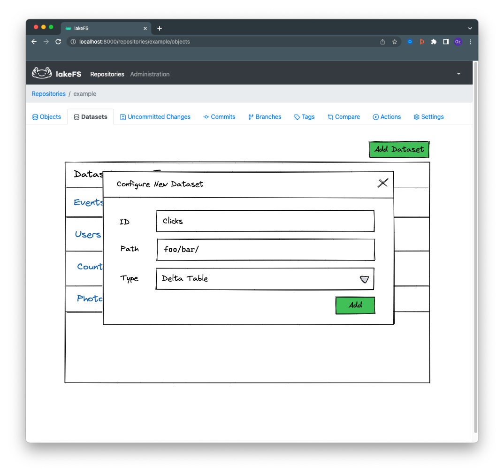
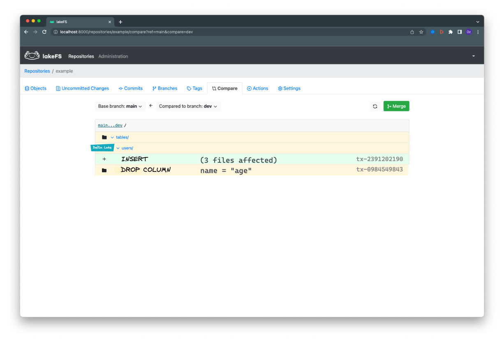

# Proposal: Native Delta Lake Diff

## User Story

As a data engineer, I'm working on an isolated branch during development and testing of new pipelines (or modifications to existing ones).
Since I'm using Delta Lake as a table format, I'd like to understand how changing my code modifies the data I'm testing on.

## Goal

Allow extending the diff functionality beyond the simple object-wise comparison that is currently supported.
For tables known to be Delta Lake tables, show a logical diff based on the log metadata as exposed by the [Delta History API](https://docs.delta.io/latest/delta-utility.html#retrieve-delta-table-history).

## Non goals

This is still in early stages: this proposal doesn't cover logical merges or other functionality based on the metadata provided by Delta Lake.


## Implementation

In order to show a "logical" diff of delta tables, we need the following in place:

1. A way to define a subset of a repository as a Delta Table
1. Given a delta table, be able to compare 2 versions of it and get a logical diff
1. UX: Be able to retrieve this from the lakeFS API, SDKs, CLI and UI

### Defining Datasets

Diffing Delta tables requires knowing where a Delta table is located within a repository.
A single repository can potentially hold any number of Delta tables at different prefixes.

To support this, we will add a new primitive to lakeFS: `Dataset`.

A Dataset has 2 important properties:
- id (`string`: a logical name for the dataset, e.g. `events`)
- root location (`string`: path relative to the root of the repository)
- Dataset type: (`enum{"Delta Lake", "Other"}`: representing the type of dataset at that location)
- Description (`string`: arbitrary information about the dataset)

By default, every repository has exactly 1 Dataset with the following attributes:

- root location: `""`
- Dataset type: `"Other"`

This retains backwards compatibility with existing repositories.

#### Datasets API

`GET    /api/v1/repositories/<id>/datasets/` - list configured datasets for this repository
`GET    /api/v1/repositories/<id>/datasets/<id>` - return the dataset location and type for the given path
`DELETE /api/v1/repositories/<id>/datasets/<id>` - remove a dataset definition (does not remove data from the dataset)
`PUT    /api/v1/repositories/<id>/datasets/<id>` - update an existing dataset setting
`POST   /api/v1/repositories/<id>/datasets/` - configure a new dataset
`GET    /api/v1/repositories/<id>/datasets/<id>/{leftRef}/diff/{rightRef}` - diff datasets

##### Nesting

To retain backwards compatibility, we are OK with datasets being nested within one another.
For any given object or prefix, the Dataset they belong to will be the most specific one that includes the given path.

Example:

Say we have 2 datasets configured:

- `{"id": "A", "root_location": "foo/", "type": "Other"}`
- `{"id": "B", "root_location": "foo/bar/", "type": "Delta Lake"}`

`path="foo/baz/x"`, will belong to `A` because it isn't covered by `B`

`path="foo/bar/"`, will belong to `B` because it matches its `root_location`

`path="foo/bar/baz/"`, will belong to `B` because it is the most specific covering dataset (longest `root_location` to match path)

#### Diffing algorithms

lakeFS will be able to use a different diff algorithm for every dataset type.

The current diff API `/repositories/{repository}/refs/{leftRef}/diff/{rightRef}` will be extended and will be able to return a new `path_type`: `[added, removed, changed, conflict, prefix_changed, dataset]`

```json
{
  "pagination": {
    "has_more": true,
    "next_offset": "string",
    "results": 0,
    "max_per_page": 0
  },
  "results": [
    {
      "type": "prefix_changed",
      "path": "a/b/c/",
      "path_type": "common_prefix",
      "size_bytes": 0
    }
    {
      "type": "prefix_changed",
      "path": "foo/",
      "path_type": "dataset", // <-- Notice the new path type
      "size_bytes": 0
    }
  ]
}
```
Currently, when users see type `prefix_changed`, it means having to recurse by calling `diff` again with the `prefix` parameter set to the `path` of the given prefix. This is true for `path_type = "common_prefix"`.

Here, we're returning `path_type = 'dataset'` - this means that we'll need to use the dataset diff API instead of the 

#### Diffing the dataset

`GET /api/v1/repositories/<id>/datasets/<id>/{leftRef}/diff/{rightRef}`:

```json
{
  "pagination": {
    "has_more": true,
    "next_offset": "string",
    "results": 0,
    "max_per_page": 0
  },
  "results": [
    {
      "id": "7a2b6453-2297-4e53-b4c9-c82b30becbda", // <-- commitInfo.txnId
      "operation": "DELETE", // <--  commitInfo.operation
      "operation_parameters": { // <-- commitInfo.operationParameters
        "predicate": "(email = 'pii@example.com')"
      },
      "summary": { // <-- commitInfo.operationMetrics
        "numRemovedFiles": "1",
        "numCopiedRows": "16",
        "numAddedChangeFiles": "0",
        "executionTimeMs": "26661",
        "numDeletedRows": "1",
        "scanTimeMs": "1089",
        "numAddedFiles": "1",
        "rewriteTimeMs": "25572"
      },
    },
    {
      "id": "7126c5bf-84e7-4fd4-b4f2-066ea2b42a35",
      "operation": "OPTIMIZE",
      "operation_parameters": {
        "predicate": "[]",
        "zOrderBy": "[]",
        "batchId": "0",
        "auto": false,
      },
      "operation_metrics": {
        "numRemovedFiles": "17",
        "numRemovedBytes": "15340",
        "p25FileSize": "978",
        "minFileSize": "978",
        "numAddedFiles": "1",
        "maxFileSize": "978",
        "p75FileSize": "978",
        "p50FileSize": "978",
        "numAddedBytes": "978"
      },
    }
  ]
}
```

## UI: Datasets and Delta Diff

### Basic Datasets tab



### Adding / modifying a dataset



### Diffing a dataset



## Limitations

1. This proposal doesn't cover the implementation details on how to extract and maintain the necessary metadata for Delta support
1. With the addition of "Datasets", we add another repository-level primitive. This adds to overall system complexity
