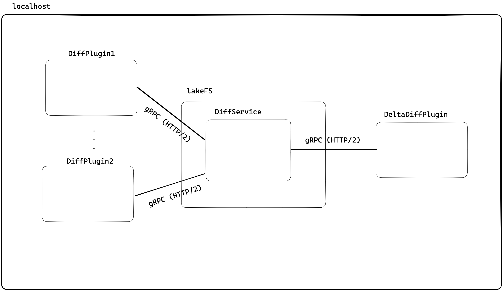
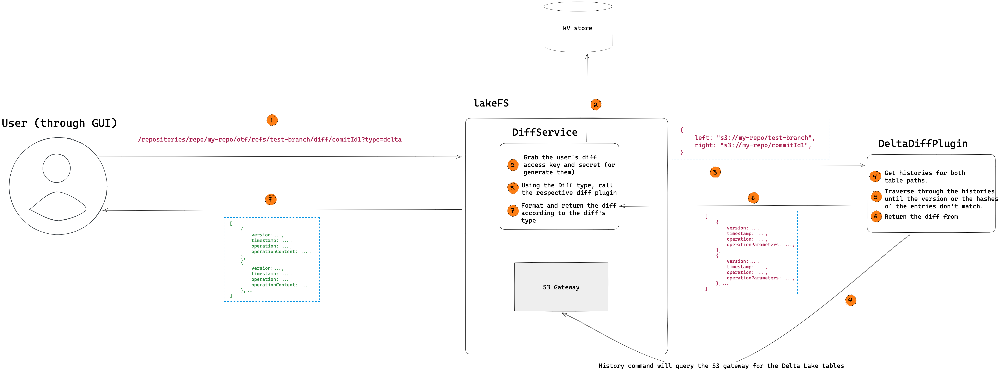

# Delta Table Differ

## User Story

Jenny the data engineer runs a new retention-and-column-remover ETL over multiple Delta Lake tables. To test the ETL before running on production, she uses lakeFS (obviously) and branches out to a dedicated branch `exp1`, and runs the ETL pointed at `exp1`.
The output is not what Jenny planned... The Delta Table is missing multiple columns and the number of rows just got bigger!
She would like to debug the ETL run. In other words, she would want to see the Delta table history changes inserted applied in branch `exp1` since the commit that she branched from.

---

## Goals and scope

1. For the MVP, support only Delta table diff.
2. The system should be open for different data comparison implementations.
3. The diff itself will consist of metadata changes only, in the form of the operation histories of the two tables, and the change in the number of rows.
4. The diff will be a "three-dots" diff (like `git log branch1...branch2`). Basically showing the log changes that happened in one branch and not in the other.
5. UI: GUI only.
6. Reduce user friction as much as possible.

---

## Non-Goals and off-scope

1.  The Delta diff will be limited to the available Delta Log entries (the JSON files).

---

## High-Level design

### Considered architectures

##### Diff as part of the lakeFS server

Implement the diff functionality within lakeFS.  
Delta doesn't provide a Go SDK implementation, so we'll need to implement the Delta data model and interface ourselves, which is not something we aim to do.
In addition, this couples future diff implementations to Go (which might result in similar problems).

##### Diff as a standalone RESTful server

The diff implementation will be implemented in one of the available Delta Lake SDK languages and will be called RESTfully from lakeFS to get the diff results.
Users will run and manage the server and add communication details to the lakeFS configuration file.  
The problem with this approach is the friction added for the users. We intend to integrate a diff experience as seamlessly as possible, yet this solution is adding the overhead of managing another server alongside lakeFS.

##### Diff as bundled Rust/WebAssembly in lakeFS

Using the `delta-rs` package to build the differ, and bundling it into the lakeFS binary using `cgo` (to communicate with Rust's FFI) or a Web Assembly package that will use Go as the Web Assembly runtime/engine.  
Multiple languages can be compiled to WebAssembly which is a great benefit, yet the engines that are needed to run WebAssembly runtime in Go are implemented in other languages (not Go) and are unstable and raise compilation complexity and maintenance.

##### Diff as an external binary executable

We can trigger a diff binary from lakeFS using the `os.exec` package and get the output generated by that binary.
This is almost where we want to be, except that we'll need to somehow validate that the lakeFS server and the executable are using the same "API version" to communicate, so that the output of the binary would match the expected one from lakeFS. In addition, I would like to decrease the amount of deserialization needed to be implemented to interpret the returned DTO (maintainability and extensibility-wise).

### Chosen architecture

#### The Microkernel/Plugin Architecture

The Microkernel/Plugin architecture is composed of two entities: a single "core system" and multiple "plugins".  
In our case, the lakeFS server act as the core system, and the different diff implementations, including the Delta diff implementation, will act as plugins.  
We'll use `gRPC` as the transport protocol, which makes the language of choice almost immaterial (due to the use of protobufs as the transferred data format)
as long as it's self-contained (theoretically it can also be not system-runtime-dependent but then the cost will be an added requirement for running lakeFS- runtime support).

#### Plugin system consideration

* The plugin system should be flexible enough such that it won't impose a language restriction, so that in the future we could have lakeFS users take part in plugins creation (not restricted to diffs).
* The plugin system should support multiple OSs.
* The plugin system should be easy enough to write plugins.

#### Hashicorp Plugin system

Hashicorp's battle-tested [`go-plugin`](https://github.com/hashicorp/go-plugin) system is a plugin system over RPC (used in Terraform, Vault, Consul, and Packer).
Currently, it's only designed to work over a local network.  
Plugins can be written and consumed in almost every major language. This is achieved by supporting [gRPC](http://www.grpc.io/) as the communication protocol.
* The plugin system works by launching subprocesses and communicating over RPC (both `net/rpc` and `gRPC` are supported).
  A single connection is made between any plugin and the core process. For gRPC-based plugins, the HTTP2 protocol handles [connection multiplexing](https://freecontent.manning.com/animation-http-1-1-vs-http-2-vs-http-2-with-push/).
* The plugin and core system are separate processes, which means that a crash of a plugin won't cause the core system to crash (lakeFS in our case).


[(excalidraw file)](diagrams/microkernel-overview.excalidraw)

---

## Implementation


[(excalidraw file)](diagrams/delta-diff-flow.excalidraw)

#### DiffService

The DiffService will be an internal component in lakeFS which will serve as the Core system.  
In order to realize which diff plugins are available, we shall use new configuration values:
1. `LAKEFS_PLUGINS_LOCATION`
   The DiffService will use this location to search for the required plugin. Defaults to lakeFS's binary directory.
2. `LAKEFS_PLUGIN_DIFF_{TYPE OF DIFF}`
   The DiffService will use the name of binary provided by this env var to perform the diff. For instance, `LAKEFS_PLUGIN_DIFF_DELTA=deltaDiffBinary`
   The DiffService will use the [plugins' location](https://github.com/hashicorp/terraform/blob/main/plugins.go) and the diff binary to load the plugin and request a diff.
   The **type** of diff will be sent as part of the request to lakeFS as specified [here](#API).
   The communication between the DiffService and the plugins, as explained above, will be through the `go-plugin` package (`gRPC`).

#### Delta Diff Plugin

Implemented using [delta-rs](https://github.com/delta-io/delta-rs) (Rust), this plugin will perform the diff operation using table paths provided by the DiffService through a `gRPC` call.  
To query the Delta Table from lakeFS, the plugin will generate an S3 client (this is a constraint imposed by the `delta-rs` package) and send a request to lakeFS's S3 gateway.  
The diff algorithm:
1. Run the Delta [HISTORY command](https://docs.delta.io/latest/delta-utility.html#history-schema) on both table paths.
2. Traverse through the [returned "commitInfo" entry vector ](https://github.com/delta-io/delta-rs/blob/main/rust/src/delta.rs#L888)
starting from the **last** version fo each entry vector: 
    1. While the returned entry versions **aren't** equal:
        1. If the bigger version is the _"left"'s_ version, add the entry to the returned history list.
        2. Traverse one version back of the bigger version entry's history.
    2. While the versions > 0: 
        1. Create a hash for the entry based on fields: `timestamp`, `operation`, `operationParameters` , and `operationMetrics` values.
        2. Compare the hashes of the versions.
        3. If they **aren't equal**, add the "left"'s entry to the returned history list, else break and **return the history vector**.
        4. Traverse one version back in both vectors.
3. Return an empty history vector.

### Authentication

The `delta-rs` package generates an S3 client which will be used to communicate back to lakeFS (through the S3 gateway).  
In order for the S3 client to communicate with lakeFS (or S3 in general) it needs to pass an AWS Access Key Id and Secret access key.  
Since applicative credentials are not obligatory, the users that sent the request for a diff might not have such, and even if they have,
they cannot send them through the GUI (which is the UI we chose to implement this feature for the MVP).
To overcome this scenario, we'll use special diff credentials as follows:
1. User makes a Delta Diff request.
2. The DiffService checks if the user has "diff credentials" in the DB:
    1. If there are such credentials, it will use them.
    2. If there aren't such, it will generate the credentials and save them: `{AKIA: DIFF-<>, SAK: <>}`. The `DIFF` prefix will be used to identify "diff credentials".
3. The DiffService will pass the credentials to the Delta Diff plugin during the call as environment variables (or part of the `gRPC` call).

### API

- GET `/repositories/repo/{repo}/otf/refs/{left_ref}/diff/{right_ref}?type={diff_type}`
    - Tagged as experimental
    - **Response**:
  ```json
  [
       {
           "version": 1,
           "timestamp":1515491537026,
           "operation":"INSERT",
           "operationContent":{
               "operationParameters": {
                  "mode":"Append",
                  "partitionBy":"[]"
                }
      },
      ...
  ]
  ```

---

### Packaging

1. We will package the binary with the lakeFS release.
2. We will also update the Dockerfile to include the binary within it.

---

## Metrics

### Applicative Metrics
- Diff runtime
- The total number of versions returned - this is the number of files that were read from lakeFS. This is basically the size of a Delta Log. We can use it later on to optimize reading.

### Business Statistics
- The number of unique requests - get the number of Delta Lake users.
