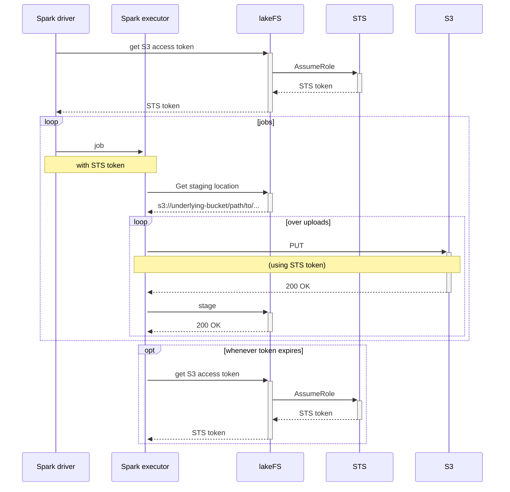

# Proposal: Generate STS credentials on lakeFS server and use them in LakeFSFileSystem and the metadata client

## What

Add an API to lakeFS that generates temporary S3 credentials using STS.
Place the requesting user's ID on that token as the session identifier (and
probably a bunch more tags, one of which can say "lakeFS").  And change
lakeFSFS and the metadata client to get and use these credentials from that
API.

This requires running lakeFS with a role allowed to use STS, so all of this
should probably be optional.

## Why

Using LakeFSFileSystem today requires configuring _two_ sets of credentials:
* IAM credentials to access lakeFS (for metadata);
* IAM credentials to access S3 (for data).

The current simplifies lakeFS configuration!  But in exchange client configuration
becomes:

1. More confusing: which access key goes where?  how do we use _other_ S3
   authentication methods?
1. More difficult: need to manage S3 access keys across Spark clusters and
   users, which can be difficult in many organizations.
1. Less secure: users will probably end up sharing credentials for the same
   role, or using their own S3 user access keys.

This proposal is _optional_ because it makes lakeFS configuration more
difficult.  But you need to do it **only once**: lakeFS administrators will
need to run lakeFS with a role that allows using STS to generate a token,
which will still be difficult in some organizations.

In exchange, it gives:

* **Simpler configuration** for _every_ Spark user.
* **Usage S3 security audit** on S3: the token will be marked as generated
  _by_ lakeFS _for_ that user.  This makes S3 audit logs usable again.

## Diagram

This shows upload, but download is pretty much the same.  Drivers only renew
tokens when they have to.

