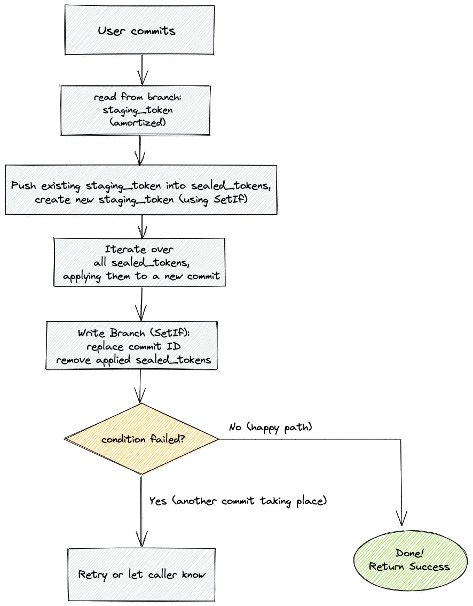
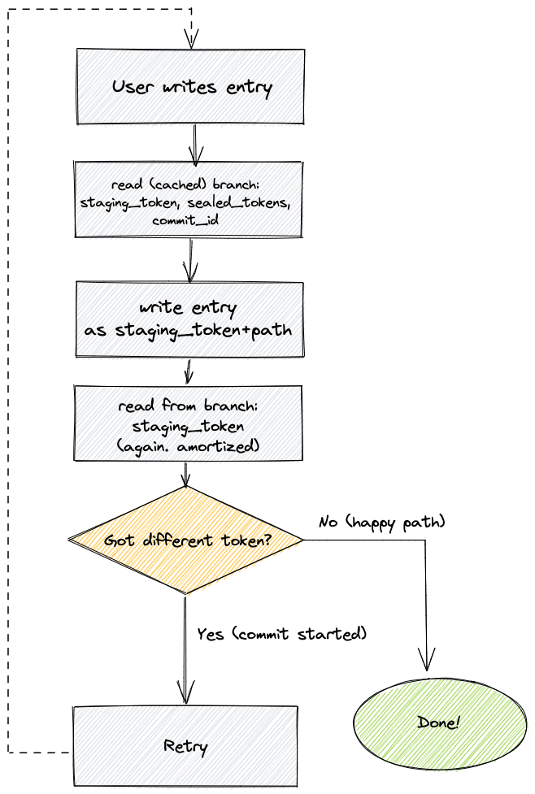
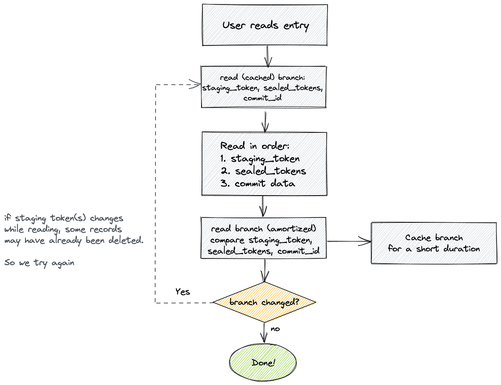

# Design proposal - lakeFS on KV

lakeFS stores 2 types of metadata:

1. Immutable metadata, namely committed entries - stored as ranges and metaranges in the underlying object store)
2. Mutable metadata, namely IAM entities, branch pointers and uncommitted entries

This proposal describes an alternative implementation for the **mutable** metadata.
Currently, this type of metadata is stored on (and relies on the guarantees provided by) a PostgreSQL database.

In this proposal, we detail a relatively narrow database abstraction - one that could be satisfied by a wide variety of database systems.
We also detail how lakeFS operates on top of this abstraction, instead of relying on PostgreSQL specific behavior

## Goals

1. Make it easy to run lakeFS as a managed service in a multitenant environment
1. Allow running production lakeFS systems on top of a database that operations teams are capable of managing, as not all ops teams are versed in scaling PostgreSQL.
1. Increase users trust in lakeFS, in terms of positioning: PostgreSQL is apparently not the first DB that comes to mind in relation to scalability
1. Make lakeFS easier to experiment with: Allow running a local lakeFS server without any external dependencies (e.g. no more `docker-compose` in the quickstart)

## Non-Goals

1. Improve performance, latency or throughput of the system
1. Provide new features, capabilities or guarantees that weren't previously possible in the lakeFS API/UI/CLI

## Design

At the heart of the design, is a simple Key/Value interface, used for all mutable metadata management.

### Semantics

Order operations by a "happens before" operation: operation A happened before operation B if A
finished before B started.  If operation A happened before B then we also say that B happened
after A.  (As usual, these are not a total ordering!)

#### Consistency guarantees

* If a write succeeds, successive reads and listings will return the contents of either that
  write or of some other write that did not happen before it.

* A successful read returns the contents of some write that did not happen after it.

* A listing returns the contents of some writes that did not happen after it.

* A successful commit holds the contents of some listing of the entire keyspace.

* Mutating operations (commits and writes) may succeed or fail.  When they fail, their contents
  might still be visible.

#### Consistency **non**-guarantees

These guarantees do *not* give linearizability of any kind.  In particular, these are some
possible behaviours.

1. **Impossible ordering by application logic (the "1-3-2 problem"):** I write an application
   that reads a number from a file, increments it, and writes back the same file (this
   application performs an unsafe increment).  I start with the file containing "1", and run the
   application twice concurrently.  An observer (some process that repeatedly reads the file)
   may observe the value sequence "1", "3", "2".  If the observer commits each version, it can
   create a **history** of these values in this order.
2. **Non-monotonicity (the "B-A-N-A-N-A-N-A-... problem :banana:"):** A file has contents "B".
   I start a continuous committer (some process that repeatedly commits).  Now I run two
   concurrent updates: one updates the file contents to "N", the other updates the file contents
   to "A".  Different orderings can cause histories that look like "B", "A", "N", "A", "N", "A",
   "N", ... to any length.

### Key/Value Store interface

This is roughly the API:

```go
type Store interface {
    // Get returns a value for the given key, or ErrNotFound if key doesn't exist
    Get(key []byte) (value []byte, err error)
    // Scan returns an iterator that scans keys in byte order, starting at or after the `start` position
    Scan(start []byte) (iter KeyValueIterator, err error)
    // Set stores the given value, overwriting an existing value if one exists
    Set(key, value []byte) error
    // Delete will delete the key/value at key, if any
    Delete(key []byte) error
    // SetIf returns an ErrPredicateFailed error if the valuePredicate passed
    //  doesn't match the currently stored value. SetIf is a simple compare-and-swap operator:
    //  valuePredicate is either the existing value, or an opaque value representing it (hash, index, etc).
    //  this is intentianally simplistic: we can model a better abstraction on top, keeping this interface simple for implementors
    SetIf(key, value, valuePredicate []byte) error
}
```

Note: This API is roughly the one needed and is subject to change/tweaking. 
It is meant to illustrate the required capabilities in order to build a functioning lakeFS system on top.

#### KV requirements

- read-after-write consistency: a read that follows a successful write should return the written value or newer
- keys could be enumerated lexicographically, in ascending byte order
- supports a key-level conditional operation based on a current value - or essentially, allow modeling a CAS operator

#### Databases that meet these requirements (Examples):

- PostgreSQL
- MySQL
- Embedded Pebble/RocksDB (great option for a "quickstart" environment?)
- MongoDB
- AWS DynamoDB
- FoundationDB
- Azure Cosmos
- Azure Blob Store
- Google BigTable
- Google Spanner
- Google Cloud Storage
- HBase
- Cassandra (or compatible systems such as ScyllaDB)
- Raft (embedded, or server implementations such as Consul/ETCd)
- Persistent Redis (Redis Enterprise, AWS MemoryDB)
- Simple in-memory tree (for simplifying and speeding up tests?)

### Data Modeling: IAM

The API that exposes and manipulates IAM entities is already modeled as a lexicographically ordered key value store (pagination is based on sorted entity IDs, which are strings).

Relationships are modeled as auxiliary keys. For example, modeling a user, a group and a membership would look something like this (pseudo code):

```go
func WriteUser(kv Store, user User) error {
    data := proto.MustMarshal(user)
    kv.Set([]byte(fmt.Sprintf("iam/users/%s", user.ID)), data)
}

func WriteGroup(kv Store, group Group) error {
    data := proto.MustMarshal(group)
    kv.Set([]byte(fmt.Sprintf("iam/groups/%s", group.ID)), data)
}

func AddUserToGroup(kv Store, user User, group Group) error {
    data := proto.MustMarshal(&Membership{GroupID: group.ID, UserID: user.ID})
    kv.Set([]byte(fmt.Sprintf("iam/user_groups/%s/%s", user.ID, group.ID)), data)
}

func ListUserGroups(kv Store, userID string) []string {
    groupIds := make([]string, 0)
    prefix := []byte(fmt.Sprintf("iam/user_groups/%s/", user.ID))
    iter := kv.Scan(prefix)
    for iter.Next() {
        pair := iter.Pair()
        if !bytes.HasPrefix(pair.Key(), prefix) {
            break
        }
        membership := Membership{}
        proto.MustUnmarshal(&membership)
        groupIds = append(groupId, membership.GroupID)
    }
    ...
    return groupIds
}
```

It is possible to create a 2-way index for many-to-many relationships, but this is not generally required - it would be simpler to simply do a scan when needed and filter only the relevant values.
This is because the IAM keyspace is relatively very small - it would be surprising if the biggest lakeFS installation to ever exist would contain more than, say, 50k users.

Some care does need to be applied when managing these secondary indices - for example, when deleting an entity, secondary indices need to be pruned first, to avoid inconsistencies. 

### Graveler Metadata - Commits, Tags, Repositories

These are simpler entities - commits and tags are immutable and could potentially be stored on the object store and not in the key/value store (they are cheap either way, so it doesn't make much of a difference).
Repositories and tags, are also returned in lexicographical order, which map well to the suggested abstraction. Commits are usually returned using parent traversal, so no scanning takes place anyway. 

There are no special concurrency requirements for these entities, apart for last-write-wins which is already the case for all modern stores.

### Graveler Metadata - Branches and Staged Writes

This is where concurrency control gets interesting, and where lakeFS is expected to provide a **correct** system whose semantics are well understood (lakeFS currently [falls short](https://github.com/treeverse/lakeFS/issues/2405) in that regard).

Concurrency is more of an issue here because of how a commit works: when a commit starts, it scans the currently staged changes, applies them to the current commit pointed to by the branch, updating the branch reference and removing the staged changes it applied.

Getting this right means we have to take care of the following:

1. Ensure all staged changes that finished successfully before the commit started are applied as part of the commit (causality)
1. Ensure acknowledged writes end up either in a resulting commit, or staged to be committed (no lost writes)

To do this, we will employ 2 mechanisms:

1. [Optimistic Concurrency Control](https://en.wikipedia.org/wiki/Optimistic_concurrency_control) on the branch pointer using `SetIf()`
1. Reliance on write [idempotency](https://en.wikipedia.org/wiki/Idempotence) provided by Graveler (i.e., Writing the same exact entry, with the same identity - will not appear as a change)

This is what the proposed implementation will look like:

#### Committer flow

We add an additional field to each `Branch` object: In addition to the existing `staging_token`, we add an array of strings named `sealed_tokens`.

1. get branch, find current `staging_token`
1. use `SetIf()` to update the branch (if not modified by another process): push existing `staging_token` into `sealed_tokens`, set new UUID as `staging_token`. The branch is assuming to be represented by a single key/value pair that contains the `staging_token`, `sealed_tokens` and `commit_id` fields.
1. take the list of sealed tokens, and using the [`CombinedIterator()`](https://github.com/treeverse/lakeFS/blob/master/pkg/graveler/combined_iterator.go#L11), turn them into a single iterator to be applied on top of the existing commit
1. Once the commit has been persisted (metaranges and ranges stored in object store, commit itself stored to KV using `Set()`), perform another `SetIf()` that updates the branch key/value pair again: replacing its commit ID with the new value, and clearing `sealed_tokens`, as these have materialized into the new commit.
1. If `SetIf()` fails, this means another commit is happening/has happened on the same branch. Can either retry (use backoff), and fail the request or let the caller know (fail the request) and let the user retry if needed.

An important property here is delegating safety vs liveness to a single optimistic `SetIf()` operation: if a commit fails somewhere along the process, a subsequent commit would simply pick up where the failed one left off,
adding the current staging_token into the set of changes to apply. In an environment where there aren't many concurrent commits on the same branch, and that commits mostly succeed - the size of `sealed_tokens` would be relatively small. As an optimization, compaction strategies could be added to merge tokens together, but this *might not be necessary*, at least not for use cases we're familiar with.
This assumption must be tested - we should expose good metrics and log this information: how many `sealed_tokens` each branch holds. If we do see cases where this grows big, we might have to prioritize compaction.

*Note: for branches that receive many frequent commits (i.e. streaming use cases) we can actually recognize contention: if we have a retry loop where we try to commit and fail because `SetIf()` returns an error, we can add some exponential backoff within the internal retry loop noted above. This could be helpful to help prevent "retry storms" where high contention results in even higher contention.*



#### Caching branch pointers and amortized reads

In the current design, for each read/write operation we add a single amortized read of the branch record as well.
Let's define an "amortized read" as the act of batching requests for the same branch for a short duration, thus amortizing the DB lookup cost across those requests.

For this design, we don't want to change this, at least for most requests: Add 1 additional wait time for a KV lookup that could be amortized across requests for the same branch.

To do this, we introduce a small in-memory cache (can utilize the same caching mechanism that already exists for IAM).
Please note: this *does not violate consistency*, see the [Read flow](#reader-flow) and [Writer flow](writer-flow) below to understand how.

#### Writer flow

1. Read the branch's existing staging token: if branch exists in the cache, use it! Otherwise, do an amortized read (see [above](#caching-branch-pointers-and-amortized-reads)) and cache the result for a very short duration.
1. Write to the staging token received - this is another key/value record (e.g. `"graveler/staging/${repoId}/${stagingToken}/${path}"`)
1. Read the branch's existing staging token **again**. This is always an amortized read, not a cache read. If we get the same `staging_token` - great, no commit has *started while writing* the record, return success to the user. For a system with low contention between writes and commits, this will be the usual case.
1. If the `staging_token` *has* changed - **retry the operation**. If the previous write made it in time to be included in the commit, we'll end up writing a record with the same identity - an idempotent operation.



#### Reading/Listing flow

1. Read the branch's existing staging token(s): if branch exists in the cache, use it! Otherwise, do an amortized read (see [above](#caching-branch-pointers-and-amortized-reads)) and cache the result for a very short duration.
1. The length of `sealed_token` list will typically be *empty* or very small, see ((above)[#committer-flow])
1. We now use the existing `CombinedIterator` to read through all staging tokens and underlying commit.
1. Read the branch's existing staging token(s) **again**. This is always an amortized read, not a cache read. If it hasn't changed - great, no commit has *started while reading* the record, return success to the user. For a system with low contention between writes and commits, this will be the usual case.
1. If it has changed, we're reading from a stale set of staging tokens. A committer might have already deleted records from it. Retry the process.



#### Important Note - exclusion duration

It is important to understand that the current pessimistic approach locks the branch for the entire duration of the commit. 
This takes time proportional to the amount of changes to be committed and is unbounded. All writes to a branch are blocked for that period of time.

With the optimistic version, readers and writers end up retrying in during exactly 2 "constant time" operations during a commit: during the initial update with a new `staging_token`, and again when clearing `sealed_tokens`.
The duration of these operations is of course, not constant - it is (well, should be) very short, and not proportional to the size of the commit in any way.
### Open Questions

1. Complexity cost - How complex is the system after implementing this? What would a real API look like? Serialization?
1. Performance - How does this affect critical path request latency? How does it affect overall system throughput?
1. Flexibility - Where could the narrow `Store` API become a constraint? What *won't* we be able to implement going forward due to lack of guarantees (e.g. no transactions)?
1. Alternatives - As this is also a solution to milestone #3, how does it fare against [known](https://github.com/treeverse/lakeFS/pull/1688) [proposals](https://github.com/treeverse/lakeFS/pull/1685)? 
