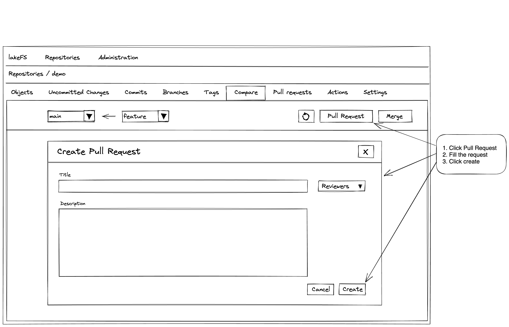
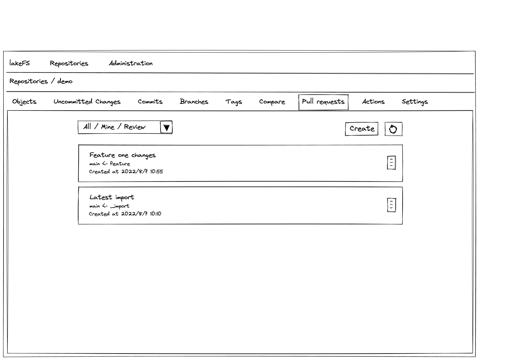
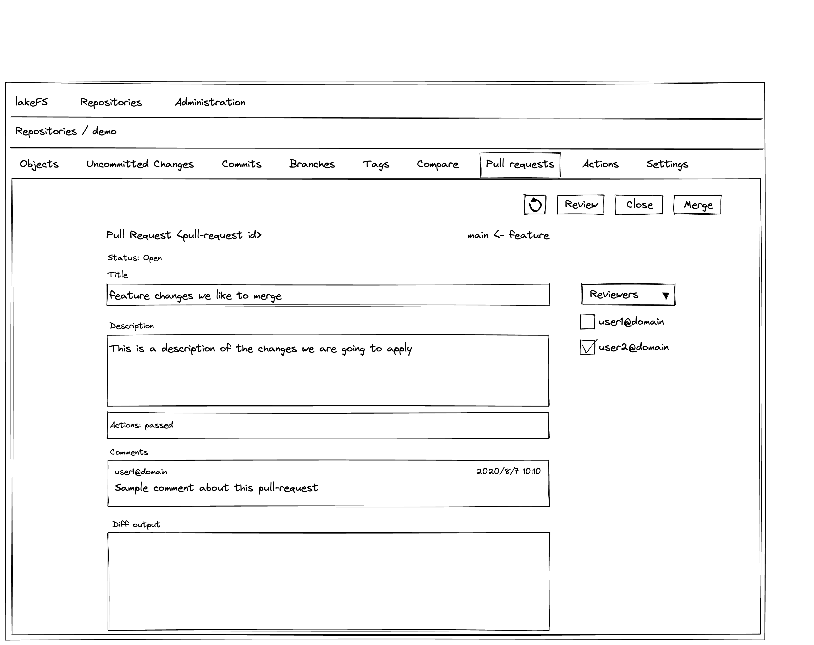

# Pull-request Proposal

Enable a way to submit changes to a branch by creating a request to merge changes.
The pull-request captures the merge operation we request to apply.

### Goals

- Capture request to merge a branch to a target branch
- Mechanism to review, discuss and merge changes before applying to a branch
- Automation using actions can verify / provide feedback on pull-request

### How it will work

Introduce a new resource called pull-request at the repository level.
The pull-request will hold owner (the user who created the PR), description, assignee, reviewers the source and target branches.
Each reviewer can set approved/reject/clear response on the PR and add comments to the discussion. Comments associated to a PR will be rendered as a list ordered by time.
New comments are appended to the end of the discussion and will include a time stamp, commenter and the text with the comment.
PR will enable a merge operation when at least one reviewer approves or when no reviewers are assigned.
PR will enable request to close PR at any time.
A combination of source/target branch can only have one open PR at a time, previous pull-requests will be merged or closed. An open pull-request will include all the committed changes in the source branch automatically.
Merging the PR will perform a merge request between the source/target branch. Merge failure will keep the PR open and a successful one will close the PR as merged.
When a repository is deleted, all pull-requests will be deleted. When a source or destination branches are deleted - the associated pull-requests are closed.

##### Actions

No change in current support with pre/post merge. These actions will be triggered when the PR is merged.
A new event called 'pull-request' will be triggered when a pull-request and invoke all the associated actions related to the PR.
Actions will be queued or at least run on the latest commit in the source branch.
The event will be triggered on PR creation and every push of new commit to the source branch will trigger the event.
The action will have access to source branch data for verification after verification there are no conflict between the source and the target branch.

### Mockup Screens

#### Create Pull Request

Create pull-request can be done through the 'Compare' or 'Pull requests' tabs.
The following is a mock of the Compare tab, while clicking the 'Pull Request' button.
The dialog will enable to enter the pull-request information, source/target branch and reviewers.
Clicking 'Create' will switch to the pull-request view in the 'Pull requests' tab.

#### Pull request list

Pull request list shown by clicking the 'Pull requests' tab.
The list can be filtered by 'All' for all pull-requests, 'My' created by me or 'Reviews' show the assigned pull-requests.
Clicking a pull-request will render the full pull-request information
This view will enable creating additional pull requests if needed.

#### Pull request edit/view

Pull request information view will enable editing of all the pull-request information, adding comments, close, close or merge the pull-request - depends on the pull-request status.

