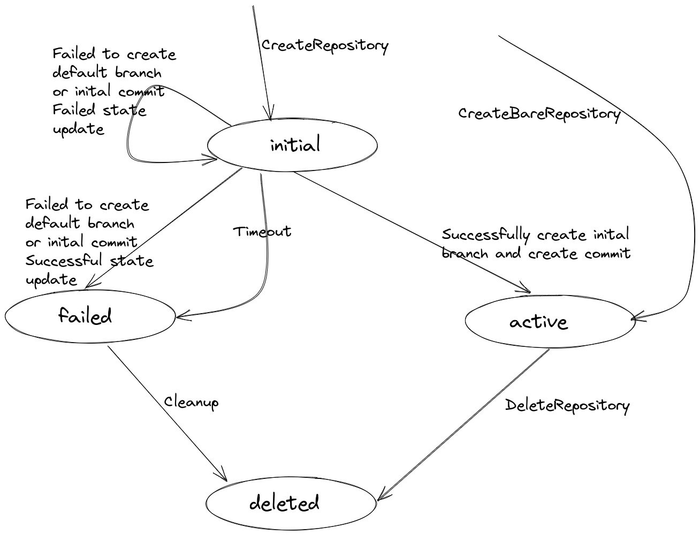

# Respository Operations Error Handling

## Abstract
As part of porting our DB from SQL to KV Store we are facing certain limitations forced by the latter. One of the main differences between the two is the support of transactions. While SQL DBs enjoy the benefit of atomic transactional operations, and therefore can bind several DB operations and guarantee the completion, or rollback, of the entire transaction, KV Stores does not support this functionality and each operation has to stand on its own.
This document purpose is to describe the way a `Repository` is currently being created and deleted by `graveler`, describe the challenges it poses when using it over KV Store and propose possible solutions

## Challenges
### CreateRepository
`CreateRepository` operation create a `Repository` entry, a default `Branch` entry and first `Commit`. All DB operations are executed under a single transaction and so, a failure at a later step (e.g. `Commit` or `Branch` creation) is rolled back and the DB remains consistent and clean (i.e. No `Repository` DB Entry without correlated default `Branch` and first `Commit`).
With KV in mind, the transaction protection is absent and the above transaction is translated to 3 stand-alone operations. A failure in a later step does not derive an automatic cleanup of the previously successful steps and so a failure in creating the default-branch (or any following step, for that matter) will leave the DB with a Repository entry with no default-branch associated. This Repository is unusable on one hand, and cannot be recreated on the other, as there is a "valid" repository entry in the KV Store

### CreateBareRepository
`CreateBareRepository` is brought here as it uses the same logic to create the `Repository` entry. The `Repository` is created with neither a default `Branch` nor an initial `Commit`. At first sight, it seems that failure in `CreateRepositry`, after the `Repository` entry is created, can be treated as a successful `CreateBareRepository` but this is not the case, as `CreateBareRepository` is a plumbing command that is meant to be used alongside `RestoreRefs`. Creating a `bare Repository` is not part of the common usage of `lakeFS` and should be treated as such

### DeleteRepository
`DeleteRepository` operation cleans a `Repository`, and all its correlated entities, from the DB. That is, all `Branch`, `Commit` and `Tag` entries correlated to that repository are deleted in a single transaction. Any failure during the above, fails the entire transaction.
When using KV, as the transaction protection is absent, each deletion can fail independently, making the operation partially done, or in any unknown state. This can be problematic in various aspects, as the DB needs to maintain consistency - an entity (e.g. a `Branch`) that is not correlated to a valid `Repository` cannot be allowed to be accessible. On a less severe aspect, having it lying in our KV as an unreachable object, is also not ideal, although it does not compromise the correctness

### Other Operations During Repository Creation/Deletion
Looking at a simple operation, such as `Branch` creation, the SQL DB is, once again, very beneficial and protective, making it certain the `Branch` cannot be created unless the `Repository` is fully created successfully. Otherwise, the `Repository` is either mid-creation or failed and rolled back, making it `not-exist` either ways. The same goes for the repository deletion, that, once started is guaranteed to either complete successfully or turn undone.
Once again, with KV Store as underlying DB, all these guarantees are no longer valid and it is now possible for a `CreateBranch` operation to find a created `Repository` before its default `Branch` was created, which may allow, as an example, creating a `Branch` with the default `Branch` name, causing the default `Branch` creation to fail. If we look at repository deletion, it will be possible to start a `Branch` creation operation, and delete the `Repository` at the same time, leaving an accessible `Branch` with no correlated `Repository`. Creating a `Repository` with the same name as the delete one will cause the aforementioned `Branch` to appear as if it was created in the new `Repository` and so on

## Solution
The proposed solution introduces 2 new elements to solve the above, in terms of DB consistency a.k.a **Correctness**:
* A `repository_state` that will allow to correctly differ `Repository` in use, from an useless `Repository` due to error, deletion etc
* A `unique_identifier` for each `Repository` that will allow to differ it from other (previously created and possibly deleted) `Repository` that had the same `RepositoryID`. This will allow to correlate entities to the correct `Repository` entity, in case of `RepositoryID` collision (due to entities left from a previously deleted `Repository` with the same `RepositoryID`)
In addition:
* A garbage cleaning mechanism will remove zombie entities, and maintain our KV Store clean and as compact as possible. This GC will identify useless `Repository` entities and will reattempt to delete all the correlated entities, which are now easily recognizable with the addition of the new `unique_identifier`. Note that this GC is not a part of maintaining the DB consistency

### Repository State
Introduce a new attribute - `repository_state` - to recognize a failed or otherwise irrelevant `Repository` entities. Based on the `state`, a `Repository` that was not completely created, can be identified and treated as `not_exist` as well as a `Repository` in the middle of deletion.
These unused `Repository` entries, which now can be easily detected, can later be cleaned by a future garbage cleaner, to maintain the KV cleanliness and to reduce its size.
The new `repository_state` attribute can have one of four values: `initial`, `active`, `deleted` or `failed`
* Upon creation, a `Repository` entry will have an `initial` state, to indicate it is not usable yet. It will also indicate that this `Repository` is soon to be valid for usage, so other threads/processes treat it as such
  * A failure in the next creation steps - default `Branch`, initial `Commit` or any other future step, will transfer the `Repository` to state `failed`, if possible. If that cannot be achieved (e.g. the creating process crashed, or KV connectivity is lost) the `Repository` can stay in state `initial` as it is still unused
  * If during creation, a `Repository` with identical ID (name) is found, the creation of the new `Repository` is stopped before any update to the `KV` is done. This is similar to the current behavior and will be done regardless of the existing `Repository` status
* When retrieving a `Repository` it will only be retrieved if it is in `active` status. Otherwise an error will be returned.
  * If the `Repository` entry does not exist, an `ErrRepositoryNotFound` will be returned
  * If the `Repository` entry exists and is not in `active` state - **TBD #1** - should we return `ErrRepositoryNotFound` here too? Maybe a new error - `ErrRepositoryDeletionInProgress`-ish?
* Deleting a `Repository` will be done by first setting the `Repository` state to `deleted`, making it immediately unavailable. Once the `Repository` is set to deleted all its correlated entities can be removed safely, as none of them should be accessible. In case of a failure at any step, the `Repository` and all its entities remain unreachable due to the `deleted` status.
  * A failure to set the `Repository` state to `deleted`, will result in no change to `KV` and so the data remains consistent. The error from the failed update operation will be returned
  * Once all the associated entities were successfully deleted, the `Repository` entry itself can be deleted too
  * Any failure to delete any entity during the deletion process, still leaves the DB in consistent state as the `Repository` entity, and by that its correlated entities, are unreachable due to the `deleted` state

[(excalidraw file)](diagrams/repository-state-transitions.excalidraw)

### Repository Unique Identifier
Each `Repository` will have a `unique_identifier` (To be discussed later) which can differ it from other repositories with the same **Name** (`RepositoryID`). This will provide us with the ability to differ object correlated with different repositories with the same **Name**, from different points in time. Each repository will have a designated KV partition, identified by its **Name** and `unique_identifier` and all correlated objects will be handled in this partition, making it possible to identify objects correlated only to an `active` `Repository`. Moreover, as the `unique_identifier` is an attribute of the `Repository`, in order to create the partition name, the `Repository` entity must be acquired, and so non-exist or unusable `Repository` entries will make unreachable partitions and, in turn, unreachable entities, making it safe to use any reachable entity

### Cleaning Up an `initial` Repository
A `Repository` entity with `initial` status is either being created (which will soon change the status to `active`), or already failed to create without changing status to `failed` (due to, for example, a crashed process). We will decide a `Repository` is failed if it is in `initial` state, and a sufficient time from its creation has passed. In that case, we will change the `Repository` state to `failed` and make him a candidate for deletion.
This can be checked every time the `Repository` is accessed (trivial) and by a designated cleanup procedure (part of the above mentioned GC, or a designated scan at startup).
 
##  Flows
### CreateRepository
* Create a `Repository` entity with its given `RepositoryID`, randomly generated `UniqueID` and `State` = `initial`, under the common `graveler` partition
  * If failed return the error (`graveler.ErrNotUnique` will be returned in case a `Repository` entity with the same `RepositoryID` exists)
    * If the entity was not created - no harm done
    * If it was created and the failure is due to inability to get the response - entity is in `initial` state and will eventually be turned `failed`
* Generate the partition key for the new `Repository`, from its `RepositoryID` and `unique_identifier`
* Create the initial `Commit` with a `CommitID` (same as it is done today) and store it with the partition key generated above
  * If failed - try to set the `Repository` entry state to `failed` and return the error from the KV layer
  * If cannot set the `Repository` state to `failed` it is still consistent, as it is still in `initial` state
* Create the default `Branch` set to the initial `CommitID` and store it with the partition key generated above
  * If failed - try to set the `Repository` entry state to `failed` and return the error from the KV layer
  * If cannot set the `Repository` state to `failed` it is still consistent, as it is still in `initial` state
* SetIf the `Repository` state to `active`
  * If failed - try to set the `Repository` entry state to `failed` and return the error from the KV layer
  * If cannot set the `Repository` state to `failed` it is still consistent, as it is still in `initial` state
* Success

### CreateBareRepository
Only the repository is created so this is pretty trivial
* Create a `Repository` entity with its given `RepositoryID`, randomly generated `UniqueID` and `State` = `active`, under the common `graveler` partition
* Return the result of the creation operation. If failed to create due to existence, return `graveler.ErrNotUnique`

### GetRepository
* Get the `Repository` with the given `RepositoryID` from the common `graveler` partition
  * If not found return `graveler.ErrRepositoryNotFound`
  * If found and status equals `active` - return the `Repository` entity - Success
  * Otherwise, return error (according to the state? **TBD #1**)

### DeleteRepository
* Get the `Repository`, using the `GetRepository` flow above 
  * In case of error return the error
* SetIf the `Repository` state to `deleted`
  * If failed return the error
* Generate the partition key for the `Repository`, from its `RepositoryID` and `unique_identifier`
* Scan through the branches in the partition partition and for each `Branch`:
  * Delete all the relevant staged objects (based on `staging_token` and `sealed_tokens`) - same as with `DeleteBranch`
  * If an error occurs at each step, return the error - the `Repository` is already marked as deleted and so it and all its correlated entities are unreachable
* Delete the `Branch`
  * If failed - return the error
* Scan through the rest of the partition and delete all objects. That is `Commit`s and `Tag`s
  * With any failure, return the error
* If all deletions above are successful, delete the `Repository` itself
  * If failed return the error

### ListRepositories
* List repositories should only return `active` entities. That can be achieved by identifying and skipping `Repository` entries with status other than `active`

### Other Operations During Repository Creation/Deletion
* All operations that require a valid `Repository` should start with `GetRepository`. This will prevent the usage of `Repository` in mid creation (with SQL DB it is impossible to reach this entity)
* If a `Repository` is being deleted when it is assumed to exists (e.g. `CreateBranch` operation that starts when the `Repository` exists and `active`, then the `Repository` is removed and only then the `Branch` is created in the KV) will leave the created entity unreachable, as the `Repository` does no longer exist (or is not `active` anymore) and so, though the newly created entity exists, it exists as unreachable garbage. This is similar of an entity being created, than the `Repository` is deleted and the entity removed with it

## Garbage Collection - Nice to Have
The above proposed solution provides the correctness needed for graveler. In addition, a dedicated garbage collection can help and maintain the KV Store cleaner and, as a result, smaller.
The logic is very simple, given the solution above is implemented:
* Scan through all the `Repository` entities in the common `graveler` partition
* For each `Repository`:
  * If it is in `active` state - ignore
  * If it is in `deleted` or `failed` state - delete it applying the same steps as described above for `DeleteRepository`
  * If it is in `initial` state - decide if it should move to `failed` and if so, set to `failed` and try to delete, as described above
Run periodically (**TBD** How often?) as a background worker and upon error just skip the `Repository`.

## Open Questions
1. What error value should we return for a `GetRepository` when the repository is in `deleted` or `failed` state?
  * `ErrRepositoryNotFound`? (might be a problem as a user may attempt to create such a `Repository` and fail).
  * Some new `ErrResourceBusy`/`ErrRepositoryDeletionInProgress`?
2. `Repository`'s `unique_identifier` - nanoid? xid? `RepositoryID`+creation-timestamp?
  * Crucial to decide now as this is a major part of the implementation
3. What is a sufficient timeout to decide an `initial` `Repository` is `failed`?
