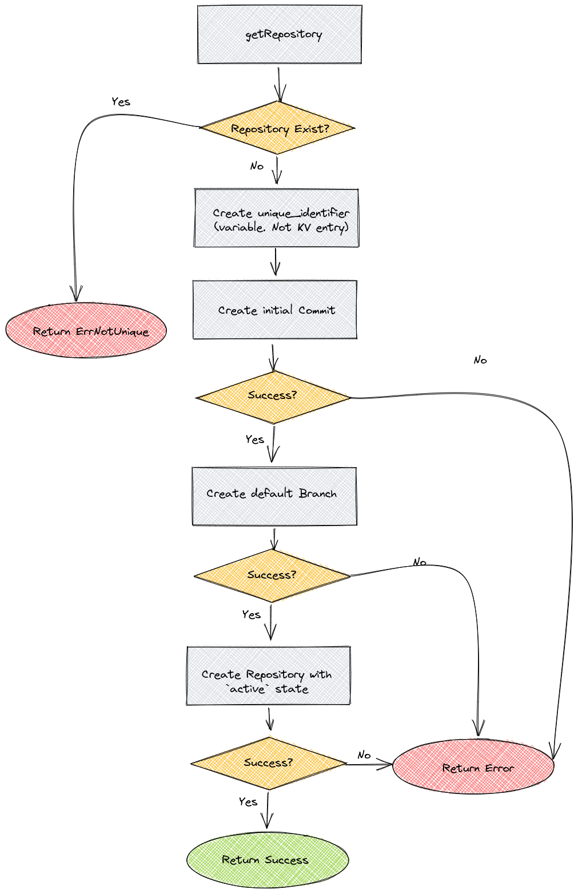
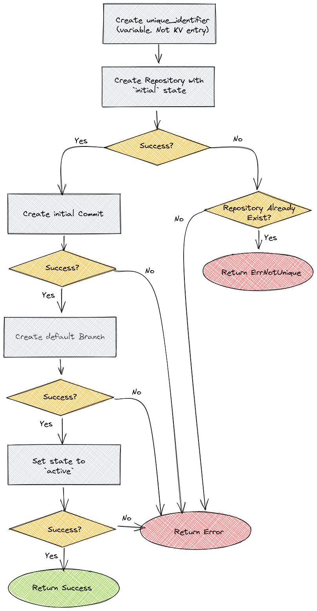

# Respository Operations Error Handling

## Abstract
As part of porting our DB from SQL to KV Store we are facing certain limitations forced by the latter. One of the main differences between the two is the support of transactions. While SQL DBs enjoy the benefit of atomic transactional operations, and therefore can bind several DB operations and guarantee the completion, or rollback, of the entire transaction, KV Stores does not support this functionality and each operation has to stand on its own.
This document purpose is to describe the way a `Repository` is currently being created and deleted by `graveler`, describe the challenges it poses when using it over KV Store and propose possible solutions

## Challenges
### CreateRepository
`CreateRepository` operation create a `Repository` entry, a default `Branch` entry and first `Commit`. All DB operations are executed under a single transaction and so, a failure at a later step (e.g. `Commit` or `Branch` creation) is rolled back and the DB remains consistent and clean (i.e. No `Repository` DB Entry without correlated default `Branch` and first `Commit`).
With KV in mind, the transaction protection is absent and the above transaction is translated to 3 stand-alone operations. A failure in a later step does not derive an automatic cleanup of the previously successful steps and so a failure in creating the default-branch (or any following step, for that matter) will leave the DB with a Repository entry with no default-branch associated. This Repository is unusable on one hand, and cannot be recreated on the other, as there is a "valid" repository entry in the KV Store

### CreateBareRepository
`CreateBareRepository` is brought here as it uses the same logic to create the `Repository` entry. The `Repository` is created with neither a default `Branch` nor an initial `Commit`. At first sight, it seems that failure in `CreateRepositry`, after the `Repository` entry is created, can be treated as a successful `CreateBareRepository` but this is not the case, as `CreateBareRepository` is a plumbing command that is meant to be used alongside `RestoreRefs`. Creating a `bare Repository` is not part of the common usage of `lakeFS` and should be treated as such

### DeleteRepository
`DeleteRepository` operation cleans a `Repository`, and all its correlated entities, from the DB. That is, all `Branch`, `Commit` and `Tag` entries correlated to that repository are deleted in a single transaction. Any failure during the above, fails the entire transaction.
When using KV, as the transaction protection is absent, each deletion can fail independently, making the operation partially done, or in any unknown state. This can be problematic in various aspects, as the DB needs to maintain consistency - an entity (e.g. a `Branch`) that is not correlated to a valid `Repository` cannot be allowed to be accessible. On a less severe aspect, having it lying in our KV as an unreachable object, is also not ideal, although it does not compromise the correctness

### Other Operations During Repository Creation/Deletion
Looking at a simple operation, such as `Branch` creation, the SQL DB is, once again, very beneficial and protective, making it certain the `Branch` cannot be created unless the `Repository` is fully created successfully. Otherwise, the `Repository` is either mid-creation or failed and rolled back, making it `not-exist` either ways. The same goes for the repository deletion, that, once started is guaranteed to either complete successfully or turn undone.
Once again, with KV Store as underlying DB, all these guarantees are no longer valid and it is now possible for a `CreateBranch` operation to find a created `Repository` before its default `Branch` was created, which may allow, as an example, creating a `Branch` with the default `Branch` name, causing the default `Branch` creation to fail. If we look at repository deletion, it will be possible to start a `Branch` creation operation, and delete the `Repository` at the same time, leaving an accessible `Branch` with no correlated `Repository`. Creating a `Repository` with the same name as the delete one will cause the aforementioned `Branch` to appear as if it was created in the new `Repository` and so on

## Solution
The proposed solution introduces 2 new elements to solve the above, in terms of DB consistency a.k.a **Correctness**:
* A `repository_state` that will allow to correctly differ `Repository` in use, from an useless `Repository` due to error, deletion etc
* A `unique_identifier` for each `Repository` that will allow to differ it from other (previously created and possibly deleted) `Repository` that had the same `RepositoryID`. This will allow to correlate entities to the correct `Repository` entity, in case of `RepositoryID` collision (due to entities left from a previously deleted `Repository` with the same `RepositoryID`)
In addition:
* A garbage cleaning mechanism will remove zombie entities, and maintain our KV Store clean and as compact as possible. This GC will identify useless `Repository` entities and will reattempt to delete all the correlated entities, which are now easily recognizable with the addition of the new `unique_identifier`. Note that this GC is not a part of maintaining the DB consistency

The proposed solution is to be introduced in 2 steps:
* **Step 1 (Must)**: the minimum necessary to solve the above challenges in terms of corrections. This step will introduce the minimal naive solution to provide the correctness on the expense of efficiency, usability and cleanliness. As part **Step 1** implementation, a repository might become temporarily unavailable (deletion in progress) and entities might be left hanging unreachable, due to failure in creation. This step alone is enough to support the correctness requirements, and so, the next steps are a nice-to-have
* **Step 2 (Nice to Have)**: will improve some of the limitations that introduced by **Step 1**. It will eliminate the unreachable entities and will introduce an improved response time to repository deletion, making the `RepositoryID` reusable quicker. It will prepare the ground works for the `Cleaner` and make all entities reachable to it
The background `Cleaner` that periodically cleans unreachable entities. These are entities that are unreachable to the `ref/manager`, but are still reachable to the `Cleaner`, due to the improvements introduced in **Step 2**

### Repository State
Introduce a new attribute - `repository_state` - to recognize a failed or otherwise irrelevant `Repository` entities. Based on the `state` a `Repository` can be treated as `deleting` and become unusable (**Step 1**) and later (**Step 2**) a new state will allow to identify a `Repository` that was not completely created and treated as `not_exist` (this situation will only be possible as part of **Step 2** improvements, and so is not a concern in **Step 1**)
The new `repository_state` attribute can be either `active` or `deleting`. **Step 2** will introduce a 3rd state - `initial`

### Repository Unique Identifier
Each `Repository` will have a `unique_identifier` which will be used as a partition key, under which all repository related objects (Branches, Commits, Tags, but not staging areas, as these have dedicated partitions) will reside.
* Identify the exact repository object and differ it from other repository objects with the same `RepositoryID` - a possible state if you consider failed repository creation attempts and their possible leftovers. This will allow to correctly distinguish between a `Branch` named "aBranch" that belongs to a current "aRepo" `Repository` from a branch object with the same name, belongs to a previously failed "aRepo" `Repository`
* Is reconstructible from the `Repository` object. That can be a field with a generated identifier, a combination of `RepositoryID` and creation timestamp (that is already kept on the object), or any other solution that provides the requirements

The idea behind this `unique_identifier` as a partition key is that in order to retrieve it, one must have access to the correct `Repository` object, and so, once the `Repository` object is gone, the partition with all the entities in it becomes unreachable

### Cleaning Up an `initial` Repository
A `Repository` entity with `initial` status is either being created (which will soon change the status to `active`), or already failed to create without changing status to `failed` (due to, for example, a crashed process). We will decide a `Repository` is failed if it is in `initial` state, and a sufficient time of 2 minutes, has passed from its creation attempt. In that case, the `Repository` state will be changed to `failed`, making it a candidate for deletion.
The status set attempt will occur as part of any access (`GetRepository`) that finds the repository with a status `initial` and a creation time earlier then 2 minutes ago. Note that an attempt to create a repository, that finds a repository with the same name and `status` initial, may move it to status `failed`
This status change will also be performed by a future designated cleanup procedure (part of the above mentioned Cleaner, or a designated scan at startup).
 
##  Flows
### GetRepository - **Step 1**
* Get the `Repository` with the given `RepositoryID` from the common `graveler` partition
  * If not found return `ErrRepositoryNotFound`
  * If found and status equals `active` - return the `Repository` entity - Success
  * Otherwise, return (new) error `ErrRepositoryDeleting`

### GetRepository - **Step 2**
Step 2 introduces a 3rd state - `initial`. In case a repository is in state initial for more than 2 minutes, it is declared deleted
* Get the `Repository` with the given `RepositoryID` from the common `graveler` partition
  * If not found return `ErrRepositoryNotFound`
  * If found and status equals `active` - return the `Repository` entity - Success
  * If found and status equals `initial`
    * If creation timestamp is less than 2 minutes ago - return `ErrRepositoryNotFound`
    * Otherwise set state to `deleting`
  * Return (new) error `ErrRepositoryDeleting`

### CreateRepository - **Step 1**
* Try to get the `Repository`
  * if exist return `ErrNotUnique`
* Create the `unique_identifier` for this repository (variable, not `KV` entity)
* Create the initial-Commit, under the `Repository` partition (based on `unique_identifier`)
  * If failed return the error. The repository not created, so a retry can be attempted. The commit is possibly created and left unreachable
* Create the default-Branch, under the `Repository` partition
  * If failed return the error. The repository is not created. The branch is possibly left unreachable and the initial-commit is definitely left unreachable
* Create the repository with state `active` (`SetIf` with nil predicate) and return the result

Once the flow is completed, all entities are in place and the repository is perfectly usable. In any case of failure during the flow, there might be some hanging entities (commit and branch) but these are unreachable, as the repository, which holds the `unique_identifier` for the partition, is not created. As for **Step 1** these entities are left to hang forever

### CreateRepository - **Step 2**
Step 2 introduces a 3rd state - `initial`.
* Create the `unique_identifier` for this repository (variable, not `KV` entity)
* Create the repository with state `initial` (`SetIf` with nil predicate)
  * If failed with `ErrPredicateFailed` return `ErrNotUnique`
  * If failed with other error return the error. It is possible the repository is created in the KV, but it is in `initial` state and is unusable
* Create the initial-Commit under the `Repository` partition (based on `unique_identifier`)
  * If failed return the error. The repository is in state `initial`. The commit is possibly created under the repository partition but is unreachable as the partition is associated with an unreachable repository.
* Create the default-Branch, under the `Repository` partition
  * If failed return the error. The repository is in state `initial`. The branch is possibly created and the initial-commit is definitely created but both are under the repository partition and are unreachable as the partition is associated with an unreachable repository

If a failure occurs in any step before completion, the repository entry stays in 

### CreateBareRepository
Only the repository is created so this is pretty trivial
* Create a `Repository` entity with its given `RepositoryID`, randomly generated `UniqueID` and `State` = `active`, under the common `graveler` partition
* Return the result of the creation operation. If failed to create due to existence, return `graveler.ErrNotUnique`

### DeleteRepository - **Step 1**
* Get the Repository, if does not exist, return `ErrNotFound`
* Set the repository state to `deleting`
  * If failed return the KV error
* Get the `unique_identifier` from the repository entry
* Scan the partition, identified by the `unique_identifier` and delete all entities.
  * If any failure occurs, return the error
* Delete the repository entry and return the result

### DeleteRepository - **Step 2**
* Get the Repository, if does not exist, return `ErrNotFound`
* Set the repository state to `deleting`
  * If failed return the KV error
* Add an entry to `graveler_delete` partition with the `RepositoryID` and `unique_identifier`. This step will allow multiple repositories with the same `RepositoryID` to be in deletion, and so if a the deletion operation fails or takes a long time, the `RepositoryID` is not being blocked. The `graveler_delete` repository will be scanned ny the `Cleaner` that should be introduced as part of **Step 2**
  * If fail, return the error. The repository already marked as `deleted` and a deletion retry is the only possible operation at this phase
* Delete the repository entry from the `graveler` repository and return the result
After a successful run of this flow, the repository is, technically, deleted and the `RepositoryID` is free to be used. The `Cleaner` should find this repository in the `graveler_deleted` partition and delete all its entities

### ListRepositories
* List repositories should only return `active` entities. That can be achieved by identifying and skipping `Repository` entries with status other than `active`

### Other Operations During Repository Creation/Deletion
* All operations that require a valid `Repository` should start with `GetRepository`. This will prevent the usage of `Repository` in mid creation (with SQL DB it is impossible to reach this entity)
* If a `Repository` is being deleted when it is assumed to exists (e.g. `CreateBranch` operation that starts when the `Repository` exists and `active`, then the `Repository` is removed and only then the `Branch` is created in the KV) will leave the created entity unreachable, as the `Repository` does no longer exist (or is not `active` anymore) and so, though the newly created entity exists, it exists as unreachable garbage. This is similar of an entity being created, than the `Repository` is deleted and the entity removed with it

## Trash Cleaner - Nice to Have
The above proposed solution provides the correctness needed for graveler. In addition, a dedicated Trash Cleaner should help and maintain the KV Store clean and, as a result, smaller.
The logic is very simple, given the solution above is implemented:
* Scan through all the keys entities in the common `graveler_deleted` partition
* For each entry get the relevant partition key (This is the repository partition, based on its `unique_identifier`)
* Scan through the partition and delete all entities
* If all entities are successfully deleted, delete the entry from `graveler_deleted`
* If a failure occurs at any step above, just skip this entry from `graveler_deleted` and move to the next one

# Decision
The decision is based on the following understandings:
* Correctness is No.1 goal and cannot be compromised:
  - A deleted repository cannot be accessed nor its related entities (branches, commits etc.)
  - A creation of an already exist repository cannot succeed
* In order to achieve correctness we allow the following:
  - Repository deletion can be a long operation (having all the repository entities deleted)
  - Repository deletion can fail, and may be retried
  - We can block the `RepositoryID` from being reused, until a successful completion of the deletion
* Cleanliness - although nice, is not a must. We can allow garbage - entities related to a deleted repository - to stay in the DB
  - These entities cannot be accessible, and cannot be mistaken as valid ones, or related to existing repositories

Based on that, the implementation plan is as follows. **Step 1** is to be implemented immediately and **Step 2** remains as a future plan:

**Step 1:** [Introduce repository `state` and `unique_identifier`](https://github.com/treeverse/lakeFS/issues/3713):
  - Add a state attribute to repository. 2 possible values: `active`, `deleting`
  - Add a `unique_identifier` attribute to repository. This will be the name of the partition to create all entities related to that repository (branches commits and tags)
    - **Note**: The format of the partition key can either include the `RepositoryID` or not. This can be up to the implementation and is not limited, as long is it provides a 1:1 mapping between a repository object and the correlated partition. One option is a combination of the `RepositryID` and its creation timestamp, which will save the need to introduce yet another field
  - Repositories are created as `active`
    - `unique_identifier` is created/generated as a first step
    - Initial-Commit and default-Branch are created **BEFORE** the repository, making sure a repository entry with state `active` is always valid. Both are created under the partition with the `unique_identifier`
    - Bare repository, obviously, is not preceded by these
    - A failure in any step of the creation process, may leave the initial-commit and the default-branch hanging and unaccessible. At this point there is no option to clean these, as the partition key cannot be reconstructed unless the repository entry exist, which implies a successful completion of the create flow.
  - A delete operation sets the repository state to `deleted` and attempts to delete all repository's entities - this can be done by scanning through the partition key deleting all objects. Once the partition is cleared, the last entry to delete is the repository itself (exist in `graveler` partition)
    - Any failure leaves the repository in state `deleting`, and the `RepositoryID` still in use
    - A repository with state `deleting` can only be accessed by `DeleteRepository` (retry)

Step 1, though naive, is a complete solution to repository management over KV. It guarantees a repository that is not completely created remains inaccessible, as well as a deleted repository. It does limit the reuse ability of the `RepositoryID` during the deletion process, but as this process will eventually complete (given enough retry attempts) the `RepositoryID` will be available for reuse, eventually

**Step 2:** [Improved deletion time](https://github.com/treeverse/lakeFS/issues/3714) and [introducing The Cleaner](https://github.com/treeverse/lakeFS/issues/3715)
  - Add a new repository `state` value - `initial`
  - Repositories are created as `initial` and after a successful creation of initial-commit and default-branch, are moved to `active`
  - A failure in the repository creation flow leaves it as `initial` which is unused on one hand, and not (yet) deleted on the other hand
  - Any access to a repository that is `initial` checks its creation timestamp, and if it is older than 2 minutes, the repository is "declared" as failed by setting its state to `deleted` 
  - A new partition is introduced - `gravler_deleted`. This partition holds keys to deleted repositories that are not yet cleaned from the KV and is used by The Cleaner. Keys are in the format of `repo/<REPO_ID>/<UNIQUE_IDENTIFIER>` and so it allows multiple entries for the same `RepositoryID`
  - A delete operation sets the repository state to `deleted`, creates an entry in the `graveler_deleted` partition and deletes the key from `graveler` partition
  - The Cleaner, as described above, periodically scans through `graveler_deleted` and deletes all entities associated with each repository entry