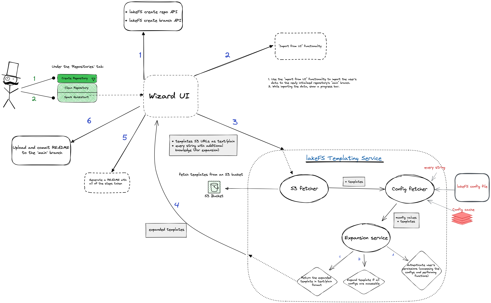

# TimeToValue: Wizard MVP Design

## Description

This design document will specify a possible solution for the time-to-value [wizard MVP](https://github.com/treeverse/lakeFS/issues/3411).  
The wizard will provide a quick and clear way to start interacting with lakeFS.
It will do that by allowing the users to
1. Initialize a new repository with a given namespace (and name) with a ‘main’ default branch.
2. Import their data (write metadata) into the new repository’s main branch by specifying the data’s S3 bucket namespace.
3. Get custom Spark configurations (and possibly custom Hive metastore configurations) to access lakeFS using the S3 Gateway (this is for the MVP).
4. Summarise all actions performed (or skipped) in a README file which will be at the root of the initialized repository.

---

## System Overview


[(excalidraw file)](diagrams/wizard.excalidraw)

### Wizard UI Component

The wizard UI component is responsible for the user’s Spark onboarding process. The process is as follows:
1. Create a repository (named as the user wishes) and a ‘main’ branch in it.
2. Import the user’s data to ‘main’ and display a progress bar (which will show a link to required permissions). Only available on cloud-deployed lakeFS.
3. Generate Spark configurations: the wizard will return Spark configurations for the users to use in their Spark core-site.xml file, [databricks key-value format](https://docs.databricks.com/clusters/configure.html#spark-configuration), or [EMR JSON](https://docs.aws.amazon.com/emr/latest/ReleaseGuide/emr-configure-apps.html) ([core-site](https://docs.aws.amazon.com/emr/latest/ReleaseGuide/emr-configure-apps.html)).
   1. Asks the user to enter the lakeFS endpoint (by default it will be https://`location.host`)
   2. Asks the user for the runtime environment of Spark: one of [Databricks, AWS EMR, spark-submit] ([Figma design](https://www.figma.com/file/haD9y599LzW6LvsYBI2xWU/Spark-use-case?node-id=31%3A200))
4. Create a README file with all actions performed and commit it as a first commit to the ‘main’ branch of the created repository. If the Spark configuration step was performed, additional Metastore guidelines will be provided in the README.

### Templating Service

The [templating service](https://github.com/treeverse/lakeFS/pull/3373) is responsible for fetching, authenticating, and expanding the required templates and returning them to the client.  
**Process**:  
1. Get the S3 templates (locations should be specified in the incoming request). The files must be valid [`html/template`](https://pkg.go.dev/html/template) or [`text/template`](https://pkg.go.dev/text/template) parsable template texts.
2. Use configured template functions to validate the user’s permissions to perform the required actions.
3. Expand templates and return them in a JSON file (key = template’s file location).

---

## APIs

### Templating Service

- **Endpoint**: `/api/v1/templates`  
- **Method**: `GET`
- **Parameters**:
  - Template URLs (`template_location`): `[]string` - retrieved from query string.
  - Any other configurations required for the templates: `string` - retrieved from query string
- **Return value**:
    ```json
    {
        "<template_location value>": {
            "expanded": <the expanded template as string>,
            "secrets": ["<secret1>", "<secret2>"...]  // Optional
        },
        ...
    }
    ```
  - The `secrets` key specifies secret values that were returned in the template. Such use-case is credentials generation. 
  Credentials are generated if the templates demand it and the requesting user has permissions to do so. For more [information](https://github.com/treeverse/lakeFS/pull/3373/files#diff-13af9ea2283c616ad842b97fa99ebe40db9373a9f04ae56382b6d1442a4484efR89) and [examples](#example-templates).
- **Errors**:
  1. 403- Forbidden:
     1. *Error code 1*: The requesting user is forbidden from accessing the configurations or functionality (like generating credentials).
  2. 400- Bad request: 
     1. *Error code 1*: The request is missing information necessary for the template’s expansion.
  3. 500- Internal server error: 
     1. *Error code 1*: The lakeFS server cannot access some of the provided template locations.

---

## Possible Flows

### Example template

**Databricks Spark configurations**  
Location: s3://org-super-bucket/spark/databricksConfig.props
```properties
spark.hadoop.fs.s3a.impl=org.apache.hadoop.fs.s3a.S3AFileSystem
{{with $creds := new_credentials}}
spark.hadoop.fs.s3a.access_key={{$creds.Key}}
spark.hadoop.fs.s3a.secret_key={{$creds.Secret}}
{{end}}
spark.hadoop.fs.s3a.endpoint={{ .querystring.lakefs_url }}
spark.hadoop.fs.s3a.path.style.access=true
```

### Happy flow - All steps

1. The user clicks on ‘Create Repository’, then clicks on ‘Spark Quickstart’
2. The wizard starts by showing an input textbox for the users to type the repo name. The user types ‘spark-repo’
3. The wizard creates a repo named ‘spark-repo’ and sets a default ‘main’ branch.
4. The wizard asks the users if they want to import existing data to lakeFS. The user specifies the location of the bucket (after they validated that the lakeFS role has the right permissions and that the bucket has the correct policy), and clicks ‘OK’.
   1. A progress bar or counter will show the progress of the import process and will signal once it’s over.
5. The wizard will ask the user: “How are you using Spark”, and will offer three alternatives: Databricks, AWS EMR and spark-submit. The user chooses ‘Databricks’. It also asks the user for their lakeFS endpoint (and will show a default placeholder pointing to the current URL). The user types the endpoint.
6. The wizard will send a GET request to the templating service with a query string of the format:  
    ```
    ?lakefs_url=<url>&template_location=s3://org-super-bucket/spark/databricksConfig.props
    ```
7. The templating service will fetch the templates from the provided locations, expand the `.querystring.lakefs_url` parameter for both templates and return a json response of the format:
    ```json
    {
        "s3://org-super-bucket/spark/databricksConfig.props": {
            "expended": [the expanded Spark template as a string],
            "secrets": [“<secret1>”, “<secret2>”...]
        }
    }
    ```
8. The wizard will present each configuration in a different snippet view for the users to copy and paste into their configuration files.
9. The wizard will generate a README file as follows:
    ```markdown
    1. Created a repository "spark-repo" and branch "main".
    2. Imported data from <S3 location>.
    3. Generated the following configurations:
       <Spark configurations with [“<secret1>”, “<secret2>”...] hidden>
    4. Instructions to configure Hive Metastore with lakeFS.
    5. Generated this README file and committed it.
    ```
    and upload and commit it to lakeFS.

### Happy flow - Spark template only

1. The user clicks on ‘Create Repository’, then clicks on ‘Spark Quickstart’
2. The wizard starts by showing an input textbox for the users to enter the repo name. The user types ‘spark-repo’
3. The wizard creates a repo named ‘spark-repo’ and sets a default ‘main’ branch.
4. The wizard asks the users if they want to import existing data to lakeFS. The user skips this step using the skip button.
5. The wizard asks the user: “How are you using Spark”, and offers three alternatives: Databricks, AWS EMR, and spark-submit. The user chooses ‘Databricks’. It also asks the user for their lakeFS endpoint (and will show a default placeholder pointing to the current URL). The user types the endpoint.
6. The wizard sends a GET request to the templating service with a query string of the format:
    ```
    ?lakefs_url=<url>&template_location=s3://org-super-bucket/spark/databricksConfig.props
    ```
7. The templating service will fetch the template from the provided location, expand the `.querystring.lakefs_url` parameter for the template and return a JSON response of the following format:
    ```json
    {
      "s3://org-super-bucket/spark/databricksConfig.props": {
        "expended": [the expanded Spark template as a string],
        "secrets": [“<secret1>”, “<secret2>”...]
      }
    }
    ```

8. The wizard presents each configuration in a snippet view for the users to copy and paste into their configuration file.
9. The wizard will generate a README file as follows:
    ```markdown
        1. Created a repository "spark-repo" and branch "main".
        2. Generated the following configurations:
           <Spark configurations with [“<secret1>”, “<secret2>”...] hidden>
        3. Instructions to configure Hive Metastore with lakeFS.
        4. Generated this README file and committed it.
    ```
    and upload and commit it to lakeFS.

### Happy flow - Import only

1. The user clicks on ‘Create Repository’, then clicks on ‘Spark Quickstart’
2. The wizard starts by showing an input textbox for the users to enter the repo name. The user types ‘spark-repo’
3. The wizard creates a repo named ‘spark-repo’ and sets a default ‘main’ branch.
4. The wizard asks the users if they want to import existing data to lakeFS. The user specifies the location of the bucket (after they validated that the lakeFS role has the right permissions and that the bucket has the correct policy), and clicks ‘OK’.
A progress bar or a counter will show the progress of the import process and will signal once it’s over.
5. The wizard asks the user: “How are you using Spark”, and offers three alternatives: Databricks, AWS EMR, and spark-submit. The user skips this step using the skip button.
6. The wizard will generate a README file as follows:
   ```markdown
   1. Created a repository "spark-repo" and branch "main".
   2. Imported data from <S3 location>
   3. Generated this README file and committed it.
   ```
   and upload and commit it to lakeFS.

### Sad flow - No import permissions

1. The user clicks on ‘Create Repository’, then clicks on ‘Spark Quickstart’
2. The wizard starts by showing an input textbox for the users to enter the repo name. The user types ‘spark-repo’
3. The wizard creates a repo named ‘spark-repo’ and sets a default ‘main’ branch.
4. The wizard asks the users if they want to import existing data to lakeFS. The user specifies the location of the bucket, and clicks ‘OK’.
   1. The import functionality panics as there are no permissions to access the given storage.
   2. The wizard will show an error message like: “Please verify your lakeFS server and storage have the required permissions” and link to the docs to show the needed permissions.
5. Continue as above 
- The generated README will not include the import step.

### Sad flow - No credentials' generation permissions

1. The user clicks on ‘Create Repository’, then clicks on ‘Spark Quickstart’
2. The wizard starts by showing an input textbox for the users to enter the repo name. The user types ‘spark-repo’
3. The wizard creates a repo named ‘spark-repo’ and sets a default ‘main’ branch.
4. The wizard asks the users if they want to import existing data to lakeFS. The user skips this step using the skip button.
5. The wizard asks the user: “How are you using Spark”, and offers three alternatives: Databricks, AWS EMR, and spark-submit. The user chooses ‘Databricks’. It also asks the user for their lakeFS endpoint (and will show a default placeholder pointing to the current URL). The user types the endpoint.
6. The wizard sends a GET request to the templating service with a query string of the format:
    ```
    ?lakefs_url=<url>&template_location=s3://org-super-bucket/spark/databricksConfig.props
    ```
7. The templating service will fetch the template from the provided location and will fail to generate the user’s credentials as the requesting user doesn’t have the permissions required.
8. The templating service will return **‘403 Forbidden: error code 1’** to the wizard.
9. The wizard will prompt a message saying that the user doesn’t have the required permissions for generating credentials.
10. Continue with the flow as described above…

### Sad flow - Missing template properties

1. The user clicks on ‘Create Repository’, then clicks on ‘Spark Quickstart’
2. The wizard starts by showing an input textbox for the users to enter the repo name. The user types ‘spark-repo’
3. The wizard creates a repo named ‘spark-repo’ and sets a default ‘main’ branch.
4. The wizard asks the users if they want to import existing data to lakeFS. The user skips this step using the skip button.
5. The wizard asks the user: “How are you using Spark”, and offers three alternatives: Databricks, AWS EMR, and spark-submit. The user chooses ‘Databricks’. It also asks the user for their lakeFS endpoint (and will show a default placeholder pointing to the current URL). The user types an **empty endpoint**.
6. The wizard sends a GET request to the templating service with a query string of the format:
    ```
    ?template_location=s3://org-super-bucket/spark/databricksConfig.props
    ```
7. The templating service will fail to satisfy the `lakefs_url` template property and will return **‘400 Bad Request: error code 1’** to the wizard.
8. The wizard will prompt a message saying that some needed information were not specified and that he should make sure he typed everything along the way.
9. Continue with the flow as described above…

### Sad flow - No bucket permissions

1. The user clicks on ‘Create Repository’, then clicks on ‘Spark Quickstart’
2. The wizard starts by showing an input textbox for the users to enter the repo name. The user types ‘spark-repo’
3. The wizard creates a repo named ‘spark-repo’ and sets a default ‘main’ branch.
4. The wizard asks the users if they want to import existing data to lakeFS. The user skips this step using the skip button.
5. The wizard asks the user: “How are you using Spark”, and offers three alternatives: Databricks, AWS EMR, and spark-submit. The user chooses ‘Databricks’. It also asks the user for their lakeFS endpoint (and will show a default placeholder pointing to the current URL). The user types the endpoint.
6. The wizard sends a GET request to the templating service with a query string of the format:
    ```
    ?lakefs_url=<url>&template_location=s3://org-super-bucket/spark/databricksConfig.props
    ```
7. The templating service tries to fetch the template from the provided location and will fail to do so as the server doesn’t have sufficient permissions.
8. The templating service will return **‘500 Internal Server Error: error code 1’** to the wizard.
9. The wizard will prompt a message saying that the server could not access the bucket.
10. Continue with the flow as described above…

---

## Monitoring

### Metrics

1. Templating service was called
    ```json
    {
        "class": "templating_service",
        "name": "calling_service",
        "value": "<service name>"
    }
    ```
2. Templating service- status 200
    ```json
    {
        "class": "templating_service",
        "name": "successful_call",
        "value": "<service name>"
    }
    ```
3. Templating service - status 500 - no access to provided template location
    ```json
    {
        "class": "templating_service",
        "name": "no_access",
        "value": "<service name>"
    }
    ```
4. Templating service - status 5xx - general
    ```json
    {
        "class": "templating_service",
        "name": "5xx",
        "value": "<service name>"
    }
    ```
5. Templating service - status 4xx - general
    ```json
    {
        "class": "templating_service",
        "name": "4xx",
        "value": "<service name>"
    }
    ```
