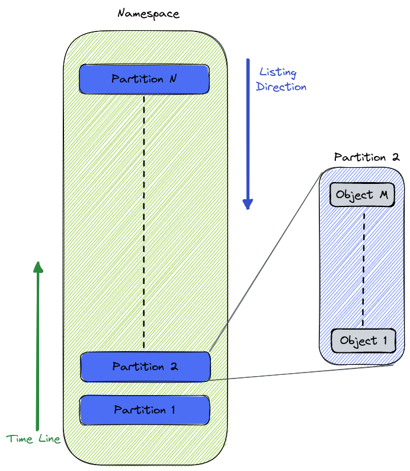

# Uncommitted Garbage Collector

## Motivation

Uncommitted data which is no longer referenced (due to any staged data deletion or override, reset branch etc.) is not being deleted by lakeFS.
This may result in excessive storage usage and possible compliance issues.
To solve this problem two approaches were suggested:
1. A batch operation performed as part of an external process (GC)
2. An online solution inside lakeFS

Several attempts for an online solution have been made, most of which are documented [here](https://github.com/treeverse/lakeFS/blob/master/design/rejected/hard-delete.md).
This document will describe the **offline** GC process for uncommitted objects.

## Design

Garbage collection of uncommitted data will be performed using the same principles of the current GC process.
The basis for this is a GC Client (i.e. _Spark_ job) consuming objects information from both lakeFS and directly from the underlying object storage,
and using this information to determine which objects be deleted from the namespace.

The GC process is composed of 3 main parts:
1. Listing namespace objects
2. Listing of lakeFS repository committed objects
3. Listing of lakeFS repository uncommitted objects

Objects that are found in 1 and are not in 2 or 3 can be safely deleted by the Garbage Collector.

### 1. Listing namespace objects

For large repositories, object listing is a very time-consuming operation - therefore we need to find a way to optimize it.
The suggested method is to split the repository structure into fixed size (upper bounded) partitions.
These partitions can then be scanned independently using multiple workers.
In addition, taking advantage of the common property of the listing operation, which lists objects in a lexicographical order, we can create the partitions in a manner which
enables additional optimizations on the GC process (read further for details).

### 2. Listing of lakeFS repository committed objects

Similar to the way GC works today, use repository meta-ranges and ranges to read all committed objects in the repository. 

### 3. Listing of lakeFS repository uncommitted objects

Creating special meta-ranges and ranges using branches' uncommitted data, we can leverage the already existing GC logic to
quickly read all uncommitted objects in the repository.

### Required changes by lakeFS

The following are necessary changes in lakeFS in order to implement this proposal successfully.

#### Objects Path Conventions

Uncommitted GC must scan the bucket in order to find objects that are not referenced by lakeFS.
To optimize this process, suggest the following changes:

1. Divide the repository namespace into time-and-size based partitions.
2. Partition name will be a time based, reverse sorted unique identifier.
3. LakeFS will create a new partition on a timely basis (for example: hourly) or when it has written < TBD > objects to the partition.
4. Each partition will be written by a single lakeFS instance in order to track partition size.
5. The sorted partitions will enable partial scans of the bucket when running the optimized GC.

#### StageObject

The StageObject operation will only be allowed on addresses outside the repository's storage namespace. This way, objects added using this operation are never collected by GC.

#### [Get/Link]PhysicalAddress 

1. GetPhysicalAddress to return a validation token along with the address (or embedded as part of the address).
2. The token will be valid for a specified amount of time and for a single use.
3. lakeFS will need to track issued tokens/addresses, and delete them when tokens are expired/used
4. LinkPhysicalAddress to verify token valid before creating an entry.
    1. Doing so will allow us to use this time interval to filter objects that might have been uploaded and waiting for
       the link API and avoid them being deleted by the GC process.
    2. Objects that were uploaded to a physical address issued by the API and were not linked before the token expired will
       eventually be deleted by the GC job.
>**Note:** These changes also solves an existing bug where an issued physical address which was committed can be overwritten by Link

#### S3 Gateway CopyObject

1. Copy object in the same branch will work the same - creating a new staging entry using the existing entry information.
2. For objects that are not part of the branch, use the underlying adapter copy operation.

#### Move/RenameObject
Clients working through the S3 Gateway can use the CopyObject + DeleteObject to perform a Rename or Move operation.
For clients using the OpenAPI this could have been done using StageObject + DeleteObject.
To continue support of this operation, introduce a new API to rename an object which will be scoped to a single branch.

#### PrepareUncommittedForGC

A new API which will create meta-ranges and ranges for a given branch using its uncommitted data. These files
will be saved in a designated path used by the GC client to list branch's uncommitted objects.  
For the purpose of this document we'll call this the `BranchUncommittedMetarange`

### GC Flows

The following describe the GC process run flows on a repository:

#### Flow 1: Clean Run

1. Listing namespace objects
   1. List all objects directly from object store (can be done in parallel using the partitions) -> `Store DF`
   2. Skip partitions that are newer than < TOKEN_EXPIRY_TIME >
2. Listing of lakeFS repository uncommitted objects
   1. Mark uncommitted data
      1. List branches
      2. Run _PrepareUncommittedForGC_ on all branches
   2. Get all uncommitted data addresses
      1. For each branch
         1. Read all addresses from branch `BranchUncommittedMetarange` -> `Uncommitted DF`
    >**Note:** To avoid possible bug, uncommitted listing must happen before listing of committed data
3. Listing of lakeFS repository committed objects
   1. Get all committed data addresses
      1. Read all addresses from Repository commits -> `Committed DF`
4. Find candidates for deletion
   1. Subtract committed data from all objects (`Store DF` - `Committed DF`)
   2. Subtract uncommitted data from all objects (`Store DF` - `Uncommitted DF`)
   3. Filter files in special paths
   4. The remainder is a list of files which can be safely removed
5. Save run information under the GC path
    1. The current run's `Uncommitted DF` (as a parquet file)
    2. The last read partition
    3. The GC run start timestamp

#### Flow 2: Optimized Run

Optimized run uses the previous GC run output, to perform a partial scan of the branch to remove uncommitted garbage.

##### Step 1. Analyze Data and Perform Cleanup for old entries (GC client)

1. Read previous run's information
   1. Previous `Uncommitted DF`
   2. Last read partition
   3. Last run's timestamp
2. Listing of lakeFS repository uncommitted objects  
    See previous for steps
3. Listing of lakeFS repository committed objects (optimized)
   1. Read addresses from branch's new commits (all new commits down to the last GC run timestamp) -> `Committed DF`
4. Find candidates for deletion
   1. Subtract `Committed DF` from previous run's `Uncommitted DF`
   2. Subtract current `Uncommitted DF` from previous run's `Uncommitted DF`
   3. The result is a list of files that can be safely removed

>**Note:** This step handles cases of objects that were uncommitted during previous GC run and are now deleted

##### Step 2. Analyze Data and Perform Cleanup for new entries (GC client)

1. Listing namespace objects (optimized)
   1. Read all objects directly from object store
   2. Skip partitions that are newer than < TOKEN_EXPIRY_TIME >
   3. Using the partitions, stop after reading the last partition read by previous GC run -> `Store DF`
2. Find candidates for deletion
   1. Subtract `Committed DF` from `Store DF`
   2. Subtract current `Uncommitted DF` from `Store DF`
   3. Filter files in special paths
   4. The remainder is a list of files which can be safely removed
3. Save run information under the GC path  
   See previous for steps

## Limitations

* Since this solution relies on the new repository structure, it is not backwards compatible. Therefore, another solution will be required for existing 
repositories
* For GC to work optimally, it must be executed on a timely basis. Long periods between runs might result in excessively long runs.