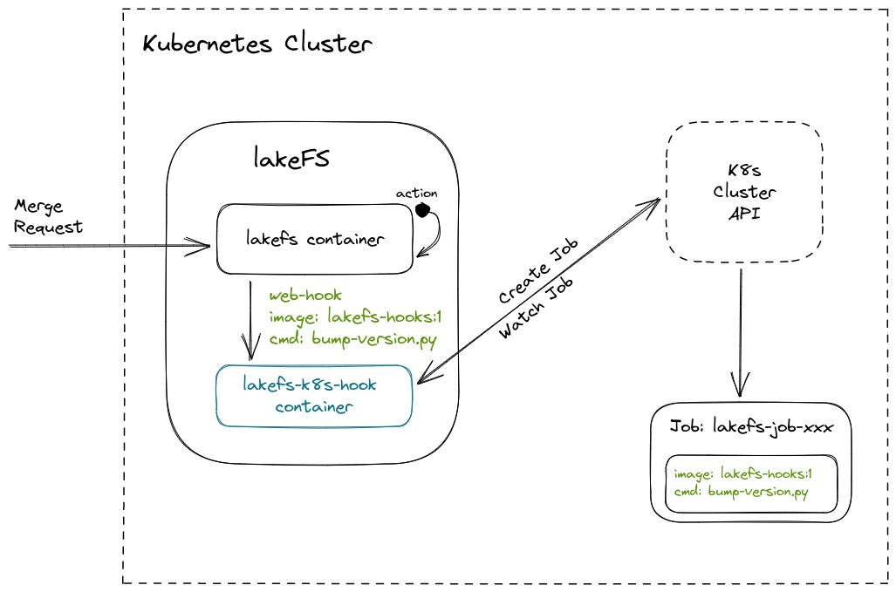

# Kubernetes Job Hook Proposal

## Goals

- Provide short term solution that enables lakeFS to trigger job execution on Kubernetes
- Enable non-blocking execution for post-commit and post-merge
- Support successful job completion as condition for the commit and merge operations

## Non Goals

- GitHub Actions - fully maintained, VM with pre-build images to execute pre/post hooks
- Manage or control any aspect of the Kubernetes Job

## Proposition

### Overview

Current hooks mechanism described [here](https://docs.lakefs.io/setup/hooks.html)

Enabling additional side-car as part of lakeFS deployment will enable the current web-hook type to trigger a new job on a Kubernetes cluster.

The user will provide a web-hook definition as part of upload action yaml, that will include query parameters with the image and command to execute. The side-car use the posted information to execute a job based on the image and command line parameters supplied in the hook.
During commit/merge, lakeFS will trigger web-hook that will post the request to the side-car, the side-car will create a job to run in the cluster.





### Kubernetes Job Sidecar

In order to encapsulate the new functionality, we will use a sidecar in the lakeFS pod that will accept the web-hook requests from lakeFS and create Kubernetes job.
A request to the side-car will include the image, arguments and if we like to wait for the job for completion.
The side-car will invoke the request to create job in the Kubernetes cluster.
In case of waiting for response, the side-car will response to the web-hook on job completion.
Without waiting for response, the side-car will response as soon as the cluster create job completes.

Using the current actions mechanism, the user will create and upload a yaml file, into the repository's `_lakefs_actions` folder.

Example of an action using the new hook definition:

```yaml
name: Branch version tagger
description: set version tag on each merge to main
on:
  post-merge:
    branches:
      - main
hooks:
  - id: update_tag
    type: webhook
    description: Create a tag based on last merge
    properties:
      url: "http://localhost:8008/job"
      query_params:
          image: "myregistry/myhook:4"
          command: ["python"]
          args: ["bump-version.py"]
      timeout: 30s
```

In this example we specified a post merge hook to trigger a job creation in cluster using our sidecar.
The job will use the image `myregistry/myhook:4` with the command `python` using the argument `bump-version.py`.
The following environment variables will be populated by the sidecar based on the event information triggered by the web hook:

```
LAKEFS_HOOK_EVENTTYPE - Type of the event that triggered the action
LAKEFS_HOOK_EVENTTIME - Time of the event that triggered the action
LAKEFS_HOOK_ACTIONNAME - Containing Hook Action's name
LAKEFS_HOOK_HOOKID - ID of the hook
LAKEFS_HOOK_REPOSITORYID - ID of the repository
LAKEFS_HOOK_BRANCHID - ID of the branch
LAKEFS_HOOK_SOURCEREF - Reference to the source that triggered the event
LAKEFS_HOOK_COMMITMESSAGE - The message for the commit
LAKEFS_HOOK_COMMITTER - Name of the committer
LAKEFS_HOOK_COMMIT_METADATA - Commit metadata (json serialized string)
```

By default job created by the sidecar, will use the following definition as the base to schedule a job:

```yaml
apiVersion: batch/v1
kind: Job
metadata:
  name: ""
  namespace: lakefs-hooks
spec:
  template:
    spec:
      restartPolicy: Never
      containers:
      - name: hook
        image: ""
        command: []
        args: []
```

Note that the _metadata.name_, _image_, _command_, _args_ nd the environment variables will be set by the sidecar.
Name will include a unique identifier specific to the job execution.

*Limit the end-user image use*

Using the a configuration file used by the sidecar, we can specify a list of allowed images that the end-user can use. The sidecar will validate and reject any request to execute a job which is not allowed in case the `allowed_images` is populated.

```yaml
allowed_images:
  - rclone/rclone:1.57
  - alpine
```

Each item in the images list, will match the image name and tag. When tag is missing it will match any given tag.

### Execution

Using the lakeFS web-hook we can trigger a job creation on our Kubernetes cluster.
The job information created will be captured and returned as success.
In case we specify `wait_for_complete: true` as additional query parameter, the sidecar will wait until the job status turns to complete or the request is timed out based on the web-hook parameters.

Note that using `wait_for_complete` will block the web hook, which blocks the commit/merge operation, which blocks writes to the branch. In the time of the call to commit/merge, usually the client request can be also timed out by the load-balancer. Job execution lengths for blocking events should be less than any network timeout along the request route.

### Authorizations

Base on the above, lakeFS deployment will require the following permissions:

- `job` get, create and watch
- `pod` get
- `pod/log` get, list, watch

The following describes possible `Role` that enables the above.
Note that we need to add the rules to the current set used by the lakeFS deployment, this document describes the requirements for this feature.

```
apiVersion: v1
kind: ServiceAccount
metadata:
  namespace: default
  name: lakefs
---
apiVersion: rbac.authorization.k8s.io/v1
kind: Role
metadata:
  name: lakefs
  namespace: lakefs-hooks
rules:
  - apiGroups: [""]
    resources: ["job"]
    verbs: ["get", "create", "watch"]
  - apiGroups: [""]
    resources: ["pod"]
    verbs: ["get"]
  - apiGroups: [""]
    resources: ["job/logs"]
    verbs: ["get", "list", "watch"]
---
apiVersion: rbac.authorization.k8s.io/v1
kind: RoleBinding
metadata:
  name: lakefs
  namespace: lakefs-hooks
subjects:
  - kind: ServiceAccount
    name: lakefs
    namespace: default
    apiGroup: ""
roleRef:
  kind: ClusterRole
  name: lakefs
  namespace: lakefs-hooks
  apiGroup: rbac.authorization.k8s.io
```

### Considerations

*Job lifetime* - Once a job is created and executed in the cluster, the lakeFS server will not take ownership of the object. A mechanism should be in place to clean up all jobs lakeFS applied and completed (successfully or not).
[Automatic Clean-up for Finished Jobs](https://kubernetes.io/docs/concepts/workloads/controllers/ttlafterfinished/) capability is currently found on Kubernetes 1.23 (which we don’t have yet on AWS for example) which can help with that.


### Decision

No changes to lakeFS itself required to enable the above, and we will keep it external. Stash the proposal under rejected.
