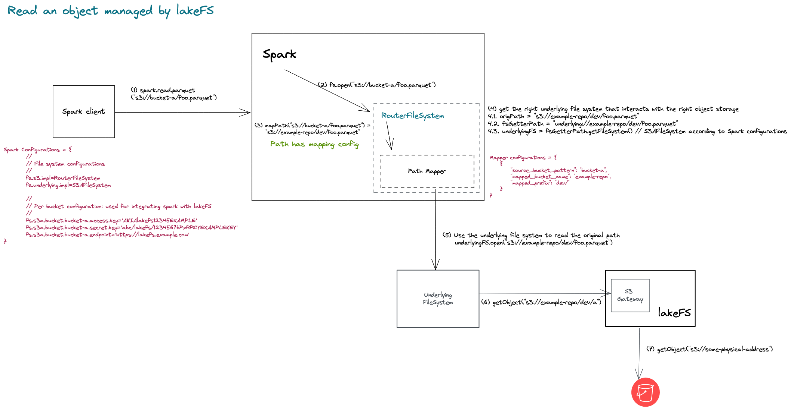
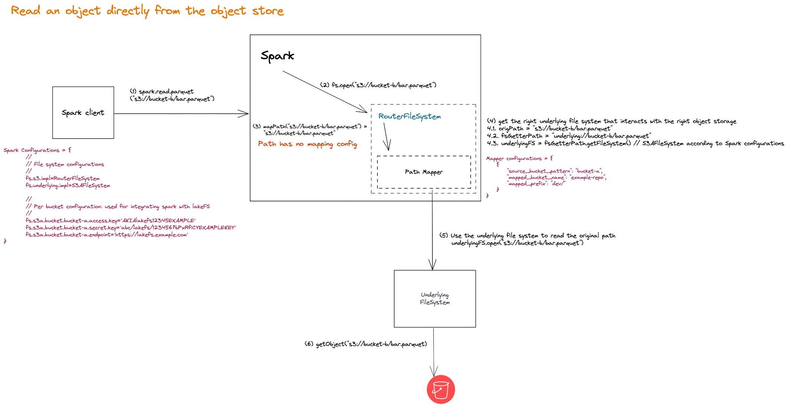

# Spark: co-existing with existing underlying object store - Design Options

This document includes a proposed solution for https://github.com/treeverse/lakeFS/issues/2625. 
Its intent is to put an idea in writing (before even testing it), and not to suggest that this is the best design option. 
To choose a solution, we need to do more research and consider alternatives that will hopefully add less amount of friction.

## Goals

### Must do

1. Provide a configurable set of overrides to translate paths at runtime from an old object store location to a new lakeFS location.
2. Support any object storage that lakeFS supports.
3. Do something that adds the least amount of friction to a Spark user as possible.

### Nice to have

Make the solution usable by non-lakeFS users by:
1. Supporting path translation from and to any type of path.
2. Make the solution a standalone component with no direct dependency on anything other than Spark itself. 

## Non-goals

1. Convert users from [accessing lakeFS from S3 gateway](../docs/integrations/spark.md#access-lakefs-using-the-s3a-gateway) to [accessing lakeFS with lakeFS-specific Hadoop filesystem](../docs/integrations/spark.md#access-lakefs-using-the-lakefs-specific-hadoop-filesystem).  

## Proposal: Introducing RouterFileSystem

We would like to implement a [HadoopFileSystem](https://github.com/apache/hadoop/blob/2960d83c255a00a549f8809882cd3b73a6266b6d/hadoop-common-project/hadoop-common/src/main/java/org/apache/hadoop/fs/FileSystem.java) 
that translates object store URIs into lakeFS URIs according to a configurable mapping, and uses a relevant Hadoop file system to 
perform any file system operation.  

### Handle any interaction with the underlying object store

To allow Spark users to integrate with lakeFS without changing their Spark code, `RouterFileSystem` is configured to be 
the file system for object store URIs with a certain scheme. For example, the following Spark configurations make 
`RouterFileSystem` the file system for URIs with `scheme=s3`:
```shell
fs.s3.impl=RouterFileSystem
```
This will force any file system operation performed on an ibject URI with `scheme=s3` to go through `RouterFileSystem`.   

### URI translation

`RouterFileSystem` has access to a configurable mapping that maps bucket names into lakeFS repositories and prefixes, e.g.
```yaml
MapperConfig = {
    {
        "source_bucket_pattern": "bucket-a",
        "mapped_bucket_name": "example-repo",
        "mapped_prefix": "dev/"
    }
}
```

With the mapping above, the URI `s3://bucket-a/foo.parquet` will be translated into `s3://example-repo/dev/foo.parquet`. 

### Invoke file system operations

After translating URIs to their final form, `RouterFileSystem` will use the translated path and its relevant file system to 
perform file system operations against the relevant object store. 

Considering the example above, the relevant object store and file system are S3 and `S3AFileSystem` compatibly. `RouterFileSystem` will use `S3AFileSystem` to perform file system operations against S3. e.g. to open `s3://example-repo/dev/foo.parquet`

#### Getting the relevant File System 

Given that `RouterFileSystem` is configured as the file system for URIs with a certain scheme (e.g. `scheme=s3`),
we need to provide a way to get the relevant file system that can perform actual file system operations against the 
relevant object store, e.g. `S3AFileSystem`. 
To do that, we would follow a two-step process: 
1. add the following Spark configuration:
```shell
# fs.underlying.impl=relevant filesystem
fs.underlying.impl=S3AFileSystem
``` 
The configuration above tells Spark that `S3AFileSystem` is the relevant file system for URIs with `scheme=underlying`. 

2. Use a URI with `scheme=underlying` to fetch the relevant file system. 
```java
String origPath = "s3://example-repo/dev/foo.parquet";
String fsGetterPath = "underlying://example-repo/dev/foo.parquet";
FileSystem underlyingFS = fsGetterPath.getFileSystem(); // S3AFileSystem according to Spark configurations
// Can later do underlyingFS.open(origPath) 
```

### Integrating with lakeFS

`RouterFileSystem` does not change the exiting [integration methods](../docs/integrations/spark.md#two-tiered-spark-support) 
lakeFS and Spark have. 
While accessing lakeFS [using the S3 gateway](../docs/integrations/spark.md#access-lakefs-using-the-s3a-gateway) we need 
to use [per-bucket configurations](../docs/integrations/spark.md#per-bucket-configuration) so that the relevant underlying 
file system can direct traffic to the lakeFS server for mapped buckets. 

#### Example: Read an object managed by lakeFS



### How RouterFileSystem works with URIs that are not mapped to lakeFS objects   

`RouterFileSystem` will check the mapping configurations, and won't change paths that are not mapped to lakeFS objects. 
e.g. given the URI `s3://bucket-b/bar.parquet` and the following mapping configurations:
```yaml
MapperConfig = {
    {
        "source_bucket_pattern": "bucket-a",
        "mapped_bucket_name": "example-repo",
        "mapped_prefix": "dev/"
    }
}
```
`RouterFileSystem` will keep `s3://bucket-b/bar.parquet` as is and continue that process outlined above. 

#### Example: Read an object directly from the object store



### How to make mapping configurable 

This is TBD. the proposal assumes an accessible configurable mapping. This could be an lakeFS API endpoint that allow 
set and get mappings.

### Pros & Cons

### Pros 

1. We already have experience developing Hadoop file systems, therefore, the ramp up should not be significant. 
2. `RouterFileSystem` suggests much simpler functionality than what lakeFSFS supports (it only needs to receive calls, translate paths, and route to the right file system), which reduces the estimated number of unknowns unknowns.
3. It does not change anything related to the existing Spark<>lakeFS integrations.
4. RouterFileSystem can probably be extended to support non-lakeFS use-cases but with an additional work. 

### Cons

1. Based on our experience with lakeFSFS, we already know that supporting a hadoop file system is difficult. There are many things that can go wrong in terms of dependency conflicts, and unexpected behaviours working with managed frameworks (i.e. Databricks, EMR)
2. The suggested method to [getting the relevant underlying filesystem](#getting-the-relevant-file-system) is kind of a hack.
3. It's complex.

## Alternatives considered 

Currently, none. we need to that because the proposed solution adds a notable amount of friction. 


