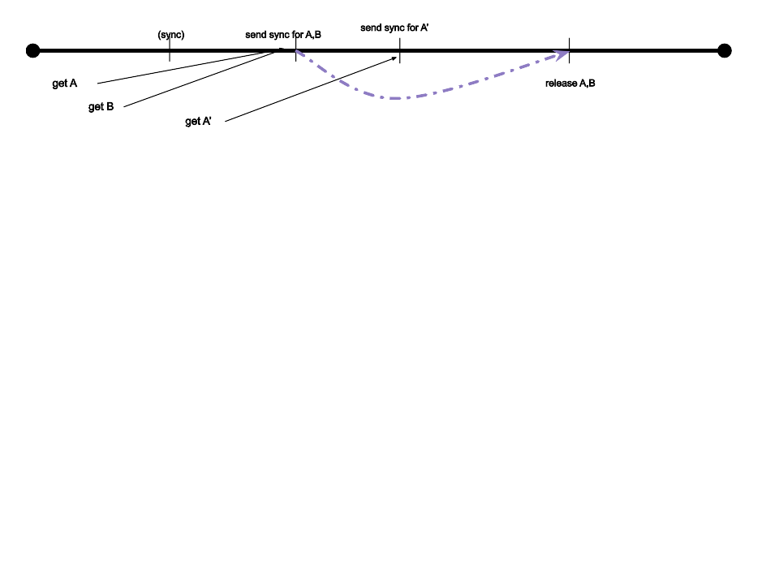

# Queue-Based Staging

Design for reliable staging based on a queue.

## Introduction

This design for staging is based on a *queue* that can broadcast to all subscribers.  Such a
queue may be supplied in-process by a Raft library, or by a _fast_ self-managed queue such as
Kafka, or by a hosted queue (if there is any such).

### Required queue properties

1. Identical broadcast ordering over all members (i.e., a real queue, not a bus).
2. Reliable at-least-once message delivery.
3. Checkpoint / playback recover semantics

### Options for queuing

This design is directly influenced by the API that Raft exposes to client programs.
Implementing on Raft is an obvious choice.  It may be possible to use a queuing solution,
possibly a hosted one -- if that has low latency _and_ is cheap enough.

1. Kafka (if latency low enough).  [Is there good hosting?]
1. Kinesis (if latency low enough; probably not, 100ms send-to-receive seems indicated).
1. AWS SNS.  This is a FIFO topic, so all members subscribe to it using a FIFO queue (on SQS).
   Use a *short* retry policy, after which deliver messages to _another_ "dead letter" FIFO queue.
   I see no easy way to get a current snapshot from SNS (or SQS),
   so to join just subscribe and push a message that causes at least one member to publish a snapshot for that message...
   and process from receipt of the snapshot.
   
   Still might have too-high latency or be too expensive.
1. Azure Service Bus??
1. GCP Pub/Sub???

## Operation

All members form a DSM (distributed state machine): a deterministic state machine that evolves
according to actions arriving from the queue.  The DSM holds all staging data (_no sharding_),
at least initially.  Simple sharding based on staging area will work, of course, but splitting
hot shards is not covered by this initial version.  Every member holds identically-evolving
state consisting of:

* For each *branch*, a _head ref_ and a queue of _staging areas_.
* For each *staging area*, a _staging token_ and a map of paths to entries for their
  corresponding uncommitted data.

In the sequel we refer to operations on a single branch.

In particular members can never assume that their state is up-to-date.  Instead they delay all
operations until the state has evolved beyond the request and is thus valid.

### Continuation tokens

To perform an operation, a member places a relevant request on the queue that includes a
unique _continuation token_ and suspends processing of the operation.  When receiving a
request from the queue, each member updates state (which is deterministic, i.e. the new state
is a pure function of existing state and the request).  The same update runs on all members.
If the continuation token is held on the member then it links to a pending request, which
receives the _result_ of the update.

Adding a _sender ID_ to the continuation token lets us detect and warn about bad tokens.  This
should happen *only* after a member restart.

### Put object

The client upload procedure satisfies the 2-phase client upload protocol.
To perform single-phase upload in the gateway, the serving goroutine may simply perform both phases itself.

#### Get staging token and upload path

The staging token may be returned immediately.
However if put performance during commits is important we can do better:
sleep on the next sync event (see how we "get object" below for details) to get a staging token that is more likely to be valid.

#### Link uploaded object to staging

To link an object a member sends a PUT record to the queue.
The record includes the path, the staging token, and the desired entry.
(We could support a stronger "put object if" (CAS) by adding an ETag and failing requests appropriately.)

State update on receipt of a PUT action from the queue: if preconditions match (staging token), update the latest staging map.
Otherwise fail.

### Get object

A get cannot be satisfied by the contents of the map on arrival.
Instead send a SYNC record to the queue.
Batch requests and put them all to sleep on the same SYNC record.
The sleep time of a batch induces an increased GET latency.

A SYNC action does not update state, so all members except the sending member merely drop it.
The sending member releases all waiting get requests, replying to each by the value set in the last staging map containing the path, or the committed value if the value is not in any staging map.
Values from maps must be served from the single LSM goroutine that handles the queue, but graveler lookups may be performed on any other goroutine, e.g. on the serving goroutine.

### List objects

A listing also requires a SYNC, and can be performed in much the same way.
The staging list results come from merging all staging maps in order... and merging with committed data.
As for get, the last merge with graveler data can be performed by any other goroutine, e.g. on the serving goroutine.

### Commit

Committing takes 3 phases:

1. Announce the commit with the next staging token.
2. Generate a metarange with the contents of the commit.
3. Perform the commit.

A great deal of variety is possible, enabling different performance characteristics for concurrent writes and commits.

#### Announce a commit

First announce the intended commit.
Recall that the head ref has a staging queue of multiple staging areas.
The commit announcement itself needs to include the parent commit ID.
To avoid a separate (fragile!) step of linking a metarange ID to its parent commit ID, include the intended parent ID right on the commit announcement.

A commit announcement includes:

* The intended parent commit ID.
* The new staging token.

State update on receiving a commit announcement is:

* Verify the parent commit ID is the current head ref, fail otherwise.  (This is an optimization).
* Verify range of staging tokens to commit is a prefix of the list of staging tokens, fail otherwise.  (This is an optimization).
* Append a staging area for the new staging token.
* If the continuation token belongs to this member, stream the list of all files in the range staging tokens out to the sleeping goroutine, triggering metarange generation.

What range of staging tokens?
A commit announcement could refer to any suffix of this queue.
Because we verify when performing the correctness, this choice affects only progress, not correctness.
However it is advisable to progress early and often.
For now include the entire staging queue in the commit announcement.
We may later revisit this situation and possibly increase performance for concurrent commit operations.
For instance:

* Add "time-based" locks (see below),
* each commit acquires a "time-based" advisory lock on the suffix of currently _unlocked_ staging tokens and tries to commit that,
* (or, alternatively, wait for all advisory locks to expire before proceeding),
* retries on performing the commit proceed as always.

All failures may immediately and transparently be retried.

#### Metarange generation

This is naturally triggered by receiving a self-generated commit announcement.
There is no further involvement with the queue, merely iteration over the received paths and entries.
If metarange generation fails, we might abort the commit operation (by sending another message to the queue),
and/or terminate the entire process on grounds of unhealthiness.

#### Perform the commit

Upon finishing the metarange, a metarange is available and a commit can be generated.
A commit file is generated and uploaded to S3.
The entire commit along with its computed ID is simply sent as the "perform" operation.

State update on receiving a "perform commit" announcement is:

* Verify the parent commit ID is the current head ref, fail otherwise.
* Verify the range of staging tokens is a prefix of the list of staging tokens, fail otherwise.
* Drop the staging tokens from the list of pending staging tokens.
* Update the head ref to point at the commit ID.

If verification fails, it is safe for the proposer immediately to restart from "State update
on receiving a commit announcement", changing the parent commit ID to the latest ref and
recomputing staging tokens.

## Comparison with the LSM-based family of solutions

There is much similarity to LSM solutions.
Indeed they may be brought even closer by choosing specific implementation features wisely.
The _queue_ in this family of solutions is analogous to the _log_ in LSM-based solutions.

LSM-based solutions allow applying different changes in different orders, as long as those changes are commutative.
For instance, 2 "put object" operations for different paths with the same staging token may be re-ordered on different members.
In practice it does not appear that we can save much time, both because we need to preserve ordering for "put object" operations on the same key, and because we need to batch to achieve acceptable performance.
Also, changing ordering of operations on different members requires being able to handle the (rare!) case of checkpointing the same sequence of operations at different times on different members.

Queuing solutions let a queue or Raft perform some of the "heavy lifting" of applying logs to snapshots -- at the cost of having to operate a queue or Raft.
This allows members to hold state in faster storage:

* "put object" operations may be accepted by a majority of members holding them in RAM, without having to store them to disk.
* disk serialization can be entirely local, without having to write to S3.
* writing to S3 is necessary only for additional durability, to allow recovery after losing the queue (e.g. losing a majority of Raft members).
