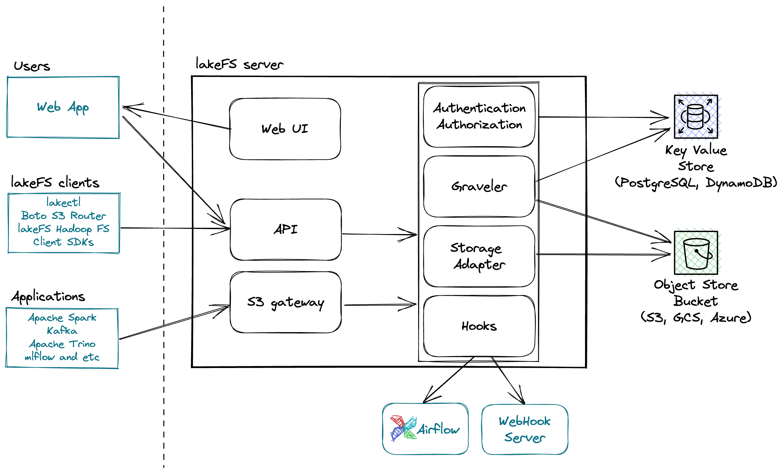

# Architecture Overview
{: .no_toc }

## Table of contents
{: .no_toc .text-delta }

1. TOC
{:toc}

## Overview

lakeFS is distributed as a single binary encapsulating several logical services:

The server itself is stateless, meaning you can easily add more instances to handle bigger load
lakeFS stores data in an underlying [S3 bucket](https://aws.amazon.com/s3/){:target="_blank"} and metadata in [PostgreSQL](https://www.postgresql.org/){:target="_blank"}.

## lakeFS Components

### S3 Gateway

The API Gateway implements lakeFS' compatibility with S3. It implements a compatible subset of the S3 API to ensure most data systems can use lakeFS as a drop-in replacement for S3.

To achieve this, the gateway exposes an HTTP listener on a dedicated host and port.

See the [S3 API Reference](../reference/s3.md) section for information on supported API operations.

### OpenAPI Server

The Swagger ([OpenAPI](https://swagger.io/docs/specification/2-0/basic-structure/){:target="_blank"}) Server exposes the full set of lakeFS operations (see [Reference](../reference/api.md)). This includes basic CRUD operations against repositories and objects, as well as versioning related operations such as branching, merging, committing and reverting changes to data.

### S3 Storage Adapter

The S3 Storage Adapter is the component in charge of communication with the underlying S3 bucket. It is logically decoupled from the S3 Gateway to allow for future compatibility with other types of underlying storage such as HDFS or S3-Compatible storage providers.

See the [roadmap](../roadmap.md) for information on future plans for storage compatibility. 

### Metadata Index

lakeFS stores its metadata in two locations:

##### Underlying Object Store

Most of lakeFS' metadata is stored in the underlying object store (e.g. S3).
When a user commits a set of changes, an immutable snapshot of the entire data lake, including the committed changes are stored to the object store. Of course, this metadata doesn't include the data itself, but only pointers to the objects contained in that version. To make commits scalable and performant, these snapshots are constructued of range files that are reused across different versions, and make up a shallow B+-Tree whose leaves are content-addressable, much like Git's internal Merkle Trees. 

To learn more about the data model, see the [data model section](data-model.md).

##### PostgreSQL

The other form of state that lakeFS manages is commit and branch pointers. Each branch in lakeFS corresponds to a single row in PostgreSQL, that in turn points to a commit row. A commit points to a tree that exists in the object store (see [Underlying Object Store](#underlying-object-store) above). 

For each branch, PostgreSQL is being used to also keep its set of currently uncommitted changes.  

This form of metadata is relatively small in scale, but is stored in postgers since it requires storng consistency guarantees (to support lakeFS' atomicity). When committing a set of changes, a PostgreSQL transaction is used to updated the branch: point at a new commit, and stop referencing the previously uncommitted changes, atomically.

### Authentication & Authorization Service

The Auth service handles creation, management and validation of user credentials and [RBAC policies](https://en.wikipedia.org/wiki/Role-based_access_control){:target="_blank"}.

The credential scheme, along with the request signing logic are compatible with AWS IAM (both [SIGv2](https://docs.aws.amazon.com/general/latest/gr/signature-version-2.html) and [SIGv4](https://docs.aws.amazon.com/general/latest/gr/signature-version-4.html)).

Currently, the auth service manages its own database of users and credentials and does not use IAM in any way. 

### Frontend UI

The UI layer is a simple browser-based client that uses the OpenAPI server. It allows management, exploration and data access to repositories, branches, commits and objects in the system.
