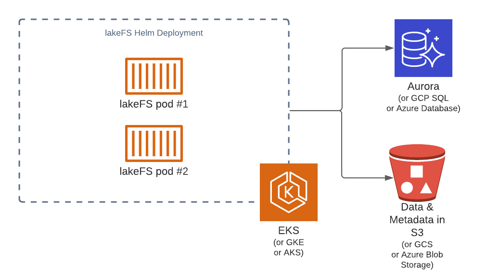

# Sizing guide
{: .no_toc }


## Table of contents
{: .no_toc .text-delta }

1. TOC
{:toc}

## System Requirements

### Operating Systems and ISA
lakeFS can run on MacOS and Linux (Windows binaries are available but not rigorously tested - 
we don't recommend deploying lakeFS to production on Windows).
x86_64 and arm64 architectures are supported for both MacOS and Linux.

### Memory and CPU requirements
lakeFS servers require a minimum of 512mb of RAM and 1 CPU core. 
For high throughput, additional CPUs help scale requests across different cores. 
"Expensive" operations such as large diff or commit operations can take advantage of multiple cores. 

### Network
If using the data APIs such as the [S3 Gateway](overview.md#s3-gateway), 
lakeFS will require enough network bandwidth to support the planned concurrent network upload/download operations.

If using only the metadata APIs (for example, only using the Hadoop/Spark clients), network bandwidth is minimal, 
at roughly 1Kb per request.

### Disk
lakeFS greatly benefits from fast local disks. 
A lakeFS instance doesn't require any strong durability guarantees from the underlying storage, 
as the disk is only ever used as a local caching layer for lakeFS metadata, and not for long-term storage.
lakeFS is designed to work with [ephemeral disks](https://docs.aws.amazon.com/AWSEC2/latest/UserGuide/ssd-instance-store.html){: target="_blank" } - 
these are usually based on NVMe and are tied to the machine's lifecycle. 
Using ephemeral disks lakeFS can provide a very high throughput/cost ratio, 
probably the best that could be achieved on a public cloud, so we recommend those.

a local cache of at least 512 MiB should be provided. 
For large installations (managing >100 concurrently active branches, with >100M objects per commit),
we recommend allocating at least 25 GiB - since it's a caching layer over a relatively slow storage (the object store), 
the more the better - see [Important metrics](#important-metrics) below to understand how to do proper sizing.

### PostgreSQL database

lakeFS uses a PostgreSQL instance to manage branch references, authentication and authorization information 
and to keep track of currently uncommitted data across branches.

#### Storage
The dataset stored in PostgreSQL is relatively modest, 
as most metadata is pushed down into the object store. 
Required storage is mostly a factor of the amount of uncommitted writes across all branches at any given point in time: 
in the range of 150 MiB per every 100,000 uncommitted writes. 

We recommend starting at 10 GiB for a production deployment, as it will likely be more than enough.

#### RAM and `shared_buffers`
Since the data size is small, it is recommended to provide enough memory to hold the vast majority of that data in RAM:
Ideally configure [shared_buffers](https://www.postgresql.org/docs/current/runtime-config-resource.html#GUC-SHARED-BUFFERS){: target="_blank" } 
of your PostgreSQL instances to be large enough to contain the currently active dataset. 
Pick a database instance with enough RAM to accommodate this buffer size, at roughly x4 the size given for `shared_buffers` 
(so for example, if an installation has ~500,000 uncommitted writes at any given time, it would require about 750 MiB of `shared_buffers`, 
that would require about 3 GiB of RAM. 

On AWS RDS, the default PostgreSQL parameter groups configure `shared_buffers` to be 25% of the chosen instance's available RAM, 
so RDS users do not need to manually configure this.

#### CPU

PostgreSQL CPU cores help scale concurrent requests. Ideally 1 CPU core for every 5,000 requests/second is ideal.


## Scaling factors

Scaling lakeFS, like most data systems, moves across 2 axis: 
concurrency (throughput of requests at a given timeframe), and latency (time to complete a single request).

### Understanding latency and throughput considerations

Most lakeFS operations are designed to be very low in latency. 
Assuming a well tuned local disk cache (see [Storage](#storage) above), 
most critical path operations 
(writing objects, requesting objects, deleting objects) are designed to complete in **<25ms at p90**. 
Listing objects obviously requires accessing more data, but should always be on-par with what the underlying object store can provide, 
and in most cases, it is actually faster. 
At the worst case for directory listing with 1,000 common prefixes returned, expect a latency of **75ms at p90**.

Managing branches (creating them, listing them and deleting them) are all constant-time operations, generally taking **<30ms at p90**.

Committing and merging can take longer, as they are proportional to the amount of **changes** introduced. 
This is what makes lakeFS optimal for large Data Lakes - 
the amount of changes introduced per commit usually stays relatively stable, 
while the entire data set usually grows over time. 
This means lakeFS will provide predictable performance: 
committing 100 changes will take roughly the same amount of time whether the resulting commit contains 500 or 500 million objects.

See [Data Model](data-model.md) for more information.

Scaling throughput depends very much on the amount of CPU cores available to lakeFS. 
In many cases it is easier to scale lakeFS across a fleet of smaller cloud instances (or containers) 
than it is to scale up with machines that have many cores, and in fact, lakeFS works well in both cases. 
Most critical path operations scale very well across machines. 

## Benchmarks

All benchmarks below were measured using 2 x [c5ad.4xlarge](https://aws.amazon.com/ec2/instance-types/c5/){: target="_blank" } instances 
on [AWS us-east-1](https://docs.aws.amazon.com/AWSEC2/latest/UserGuide/using-regions-availability-zones.html#concepts-available-regions).

The PostgreSQL instance that was used is a [db.m6g.2xlarge](https://docs.aws.amazon.com/AmazonRDS/latest/UserGuide/Concepts.DBInstanceClass.html){: target="_blank" }

The example repository we tested against contains the metadata of a large lakeFS installation, 
where each commit contains **~180,000,000** objects (representing ~7.5 Petabytes of data).

All tests are reproducible using the [lakectl abuse command](../reference/commands.md#lakectl-abuse), 
so do use it to properly size and tune your setup. All tests are accompanied by the relevant `lakectl abuse` command that generated them.

### Random reads

This test generates random read requests to lakeFS, 
in a given commit. Paths are requested randomly from a file containing a set of preconfigured (and existing) paths.


**command executed:** 

```shell
lakectl abuse random-read \
    --from-file randomly_selected_paths.txt \
    --amount 500000 \
    --parallelism 128 \
    lakefs://example-repo@<commit hash>
```

**Result Histogram (raw):**

```
Historgram (ms):
1	0
2	0
5	37945
7	179727
10	296964
15	399682
25	477502
50	499625
75	499998
100	499998
250	500000
350	500000
500	500000
750	500000
1000	500000
5000	500000
min	3
max	222
total	500000
```

So 50% of all requests took <10ms, while 99.9% of them took <50ms

**throughput:**

Average throughput during the experiment was **10851.69 requests/second**

### Random Writes

This test generates random write requests to a given lakeFS branch. 
All paths are pre-generated and do not overwrite each other (as overwrites are relatively rare in a Data Lake setup).

**command executed:** 

```shell
lakectl abuse random-write \
    --amount 500000 \
    --parallelism 64 \
    lakefs://example-repo@main
```

**Result Histogram (raw):**

```
Historgram (ms):
1	0
2	0
5	30715
7	219647
10	455807
15	498144
25	499535
50	499742
75	499784
100	499802
250	500000
350	500000
500	500000
750	500000
1000	500000
5000	500000
min	3
max	233
total	500000
```

So 50% of all requests took <10ms, while 99.9% of them took <25ms

**throughput:**

Average throughput during the experiment was **7595.46 requests/second**

### Branch creation

This test creates branches from a given reference 

**command executed:** 

```shell
lakectl abuse create-branches \
    --amount 500000 \
    --branch-prefix "benchmark-" \
    --parallelism 256 \
    lakefs://example-repo@<commit hash>
```

**Result Histogram (raw):**

```
Historgram (ms):
1	0
2	1
5	5901
7	39835
10	135863
15	270201
25	399895
50	484932
75	497180
100	499303
250	499996
350	500000
500	500000
750	500000
1000	500000
5000	500000
min	2
max	304
total	500000
```

So 50% of all requests took <15ms, while 99.9% of them took <100ms

**throughput:**

Average throughput during the experiment was **7069.03 requests/second**


## Important metrics

lakeFS exposes metrics using the [Prometheus protocol](https://prometheus.io/docs/introduction/overview/){: target="_blank" }. 
Every lakeFS instance exposes a `/metrics` endpoint that could be used to extract them. 

Here are a few notable metrics to keep track of when sizing lakeFS:

`api_requests_total` - Tracks throughput of API requests over time

`api_request_duration_seconds` - Histogram of latency per operation type

`gateway_request_duration_seconds` - Histogram of latency per [S3 Gateway](overview.md#s3-gateway) operation

`go_sql_stats_*` - Important client-side metrics collected from the PostgreSQL driver. 
See [The full reference here](https://github.com/dlmiddlecote/sqlstats#exposed-metrics){: target="_blank" }.

## Reference architectures

Below are a few example architectures for lakeFS deployment 

### Reference Architecture: Data Science/Research environment

**Use case:** Manage Machine learning or algorithms development. 
Use lakeFS branches to achieve both isolation and reproducibility of experiments. 
Data being managed by lakeFS is both structured, tabular data; 
as well as unstructured sensor and image data used for training. 
Assuming a team of 20-50 researchers, with a dataset size of 500 TiB across 20M objects.

**Environment:** lakeFS will be deployed on [Kubernetes](../deploying-aws/install.md#kubernetes-with-helm) 
managed by [AWS EKS](https://aws.amazon.com/eks/){: target="_blank" } 
with PostgreSQL on [AWS RDS Aurora](https://aws.amazon.com/rds/aurora/postgresql-features/){: target="_blank" }

**Sizing:** Since most of the work is done by humans (vs automated pipelines), most experiments tend to be small in scale, 
reading and writing 10s to 1000s of objects. 
The expected amount of branches active in parallel is relatively low, around 1-2 per user, 
each representing a small amount of uncommitted changes at any given point in time. 
Let's assume 5,000 uncommitted writes per branch = ~500k. 

To support the expected throughput, a single moderate lakeFS instance should be more than enough, 
since requests per second would be on the order of 10s to 100s. 
For high availability, we'll deploy 2 pods with 1 CPU core and 1 GiB of RAM each..

Since the PostgreSQL instance is expected to hold a very small dataset 
(at 500k, expected dataset size is `150MiB (for 100k records) * 5 = 750MiB`). 
To ensure we have enough RAM to hold this, we'll need 3 GiB of RAM, so a very moderate Aurora instance `db.t3.large` is chosen.





### Reference Architecture: Automated Production Pipelines

**Use case:** Manage multiple concurrent data pipelines using Apache Spark and Airflow. 
Airflow DAGs start by creating a branch for isolation and for CI/CD. 
Data being managed by lakeFS is structured, tabular data. Total dataset size is 10 PiB,  spanning across 500M objects. 
Expected throughput is 10k reads/second + 2k writes per second across 100 concurrent branches.

**Environment:** lakeFS will be deployed on [Kubernetes](../deploying-aws/install.md#kubernetes-with-helm) 
managed by [AWS EKS](https://aws.amazon.com/eks/){: target="_blank" } 
with PostgreSQL on [AWS RDS](https://aws.amazon.com/rds/aurora/postgresql-features/){: target="_blank" }

**Sizing:** Data pipelines tend to be bursty in nature: 
reading in a lot of objects concurrently, doing some calculation or aggregation and then writing many objects concurrently. 
The expected amount of branches active in parallel is high, 
with many Airflow DAGs running per day, each representing a moderate amount of uncommitted changes at any given point in time. 
Let's assume 1,000 uncommitted writes/branch * 2500 branches = ~2.5M records. 

To support the expected throughput, looking the benchmarking numbers above, 
we're doing roughly 625 requests/core, so 24 cores should cover our peak traffic. We can deploy `6 * 4 CPU core pods`.

The PostgreSQL instance 
(at 500k, expected dataset size is `150MiB (for 100k records) * 25 = 3750 MiB`). 
To ensure we have enough RAM to hold this, we'll need at least 15 GiB of RAM, so we'll go with a `db.r5.xlarge` Aurora instance.


