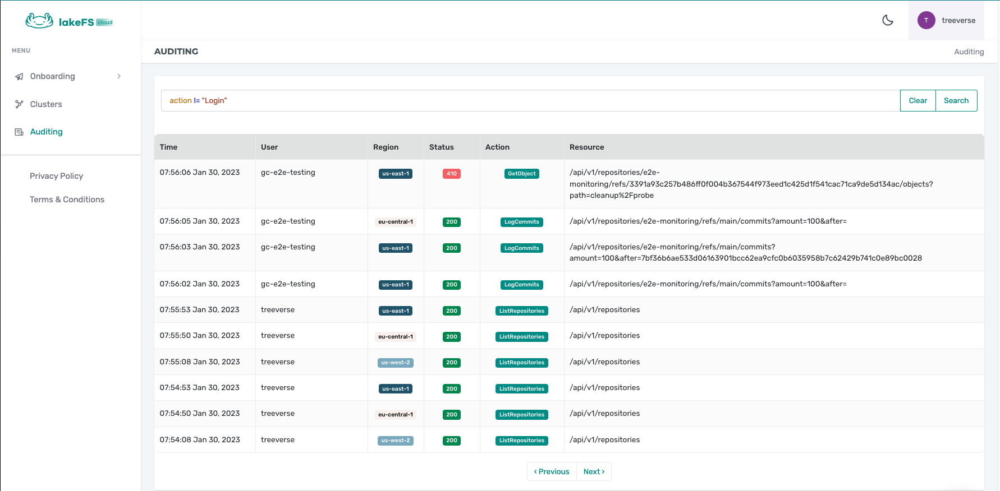

Audit logs is a premium feature provided only in [lakeFS cloud](https://lakefs.cloud/).
{: .note .note-info }

# Audit log

The lakeFS audit log allows you to view all relevant user action information in a clear and organized table

## Audit Fields
The audit log includes the following fields 
- Time - time of action
- User - the name of the user who performed the action
- Region - the region of the lakeFS installation where the action was performed
- Status - The status code returned for the action
- Action - the specific lakeFS action (such as Login, Commit, ListRepositories, CreateUser, etc...)
- Resource - the full URL of the command (e.g for a commit on branch main we would see the Action `commit` and the resource `/api/v1/repositories/e2e-monitoring/branches/main/commits`)

## Filtering
Filtering is available using the filter bar. the filter bar works with a simple query language.
The table fields could be filter by the following operators
- Time - `<`,`>`,`<=`,`>=`,`=`,`!=`
- User  - `=`,`!=`, compare by string or regex
- Region - `=`,`!=`, compare by string or regex
- Status - `<`,`>`,`<=`,`>=`,`=`,`!=`
- Action - `=`,`!=`, compare by string or regex
- Resource - `=`,`!=`, compare by string or regex
