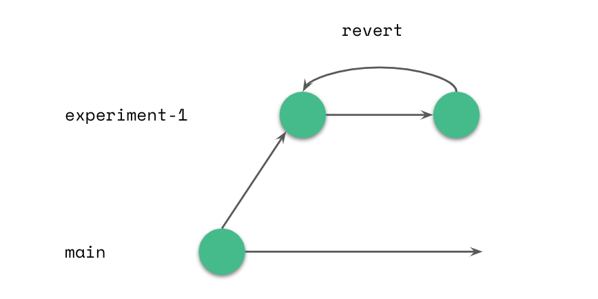
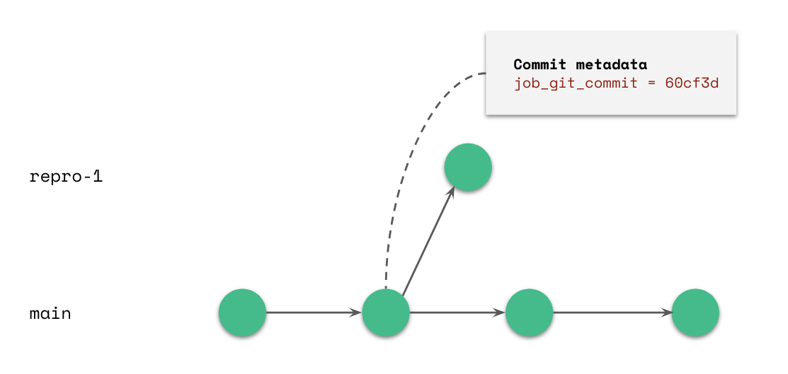
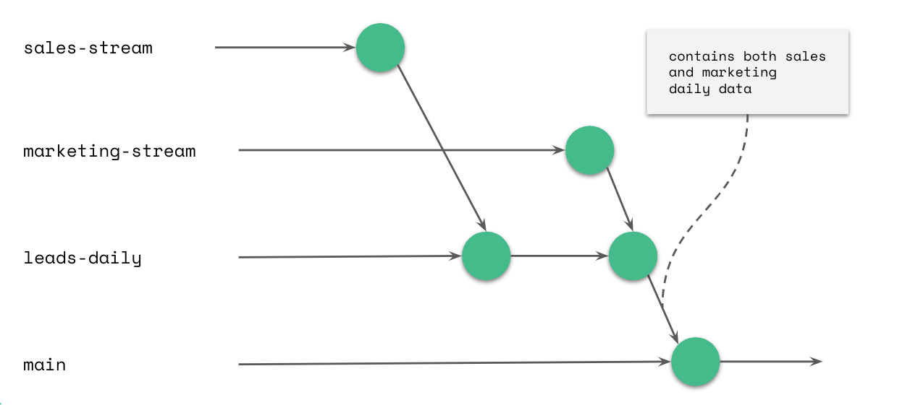

## Development Environment

As part of our routine work with data we develop new code, improve and upgrade old code, upgrade infrastructures, and test new technologies. lakeFS enables a safe development environment on your data lake without the need to copy or mock data, work on the pipelines or involve DevOps.

Creating a branch provides you an isolated environment with a snapshot of your repository (any part of your data lake you chose to manage on lakeFS). While working on your own branch in isolation, all other data users will be looking at the repository’s master branch. They can't see your changes, and you don’t see changes to master done after you created the branch. 
No worries, no data duplication is done, it’s all metadata management behind the scenes.
Let’s look at 3 examples of a development environment and their branching models.

### Example 1: Upgrading Spark and using Revert action

You installed the latest version of Apache Spark. As a first step you’ll test your spark jobs to see that the upgrade doesn't have any undesired side effects.

You simply create a branch (testing-spark-3.0) to test the Spark upgrade. Jobs may run smoothly (the theoretical possibility exists!), or they may fail halfway through, leaving you with some intermediate partitions, data and metadata. In this case, you can simply revert the branch to its original state, without worrying about the intermediate results of your last experiment, and perform another (hopefully successful) test in an isolated branch. Revert actions are atomic and immediate, so no manual cleanup is required.

Once testing is completed and you have achieved the desired result, you can delete this experimental branch, and all data not used on any other branch will be deleted with it.

### Example 2: Compare - Which option is better?

Easily compare by testing which one performs better on your data set. 
Examples may be:
* Different computation tools, e.g Spark vs. Presto
* Different compression algorithms
* Different Spark configurations
* Different code versions of an ETL

Run each experiment on its own independent branch, while the master remains untouched. Once both experiments are done, create a comparison query (using hive or presto or any other tool of your choice) to compare data characteristics, performance or any other metric you see fit.

With lakeFS you don't need to worry about creating data paths for the experiments, copying data, and remembering to delete it. It’s substantially easier to avoid errors and maintain a clean lake after.

### Example 3: Reproduce - A bug in production

You upgraded spark and deployed changes in production. A few days or weeks later, you identify a data quality issue, a performance degradation, or an increase to your infra costs. Something that requires investigation and fixing (aka, a bug).

lakeFS allows you to open a branch of your lake from the specific merge/commit that introduced the changes to production. Using the metadata saved on the merge/commit  you can reproduce all aspects of the environment, then reproduce the issue on the branch and debug it. Meanwhile,  you can revert the master to a previous point in time, or keep it as is, depending on the use case

## Continuous Integration
Everyday data lake  management includes ingestion of new data collections, and a growing number of consumers reading and writing analysis results to the lake. In order to ensure our lake is reliable  we need to validate new data sources, enforce good practices to maintain  a clean lake (avoid the swamp) and validate metadata. lakeFS simplifies continuous integration of data to the lake by supporting ingestion on a designated branch. Merging data to master is enabled only if conditions apply. To make this tenable, let’s look at a few examples:

### Example 1: Pre-merge hooks - enforce best practices

Examples of good practices enforced in organizations:  

 - No user_* columns except under /private/...
 - Only `(*.parquet | *.orc | _delta_log/*.json)` files allowed
 - Under /production, only backward-compatible schema changes are allowed
 - New tables on master must be registered in our metadata repository first, with owner and SLA

lakeFS will assist in enforcing best practices by giving you a designated branch to ingest new data (“new-data-1” in the drawing). . You may run automated tests to validate predefined best practices as pre-merge hooks. If the validation passes, the new data will be automatically and atomically merged to the master branch. However, if the validation fails, you will be alerted, and the new data will not be exposed to consumers.

By using this branching model and implementing best practices as pre merge hooks, you ensure the master lake is never compromised.

## Continuous Deployment
Not every day we introduce new data to the lake, or add/change ETLs, but we do have recurring jobs that are running, and updates to our existing data collections. Even if  the code and infra didn't change, the data might, and those changes introduce quality issues. This is one of the complexities of a data product, the data we consume changes over the course of a month, a week, or even a single day. 

**Examples of changes to data that may occur:**
 - A client-side bug in the data collection of website events
 - A new Android version that interferes with the collecting events from your App
 - COVID-19 abrupt impact on consumers' behavior, and its effect on the accuracy of ML models.
 - During a change to Salesforce interface, the validation requirement from a certain field had been lost

lakeFS helps you validate your expectations and assumptions from the data itself.

### Example 1: Pre merge hook - a data quality issue

Continuous deployment of existing data we expect to consume, flowing from our ingest-pipelines into the lake. Similar to the Continuous Integration use-case   - we create an ingest branch (“events-data”), which allows us to create tests using data analysis tools or data quality services (e.g. [Great Expectations](https://greatexpectations.io/){: target="_blank" }, [Monte Carlo](https://www.montecarlodata.com/){: target="_blank" }) to ensure reliability of the data we merge to the master branch. Since merge is atomic, no performance issue will be introduced by using lakeFS, but your master branch will only include quality data. 

### Example 2: RollBack! - Data ingested from a Kafka stream

If you introduce a new code version to production and discover  it has a critical bug, you can simply roll back to the previous version. But you also need to roll back the results of running it.  lakeFS gives you the power to rollback your data if you introduced low quality data. The rollback is an atomic action that prevents the data consumers from receiving low quality data until the issue is resolved.

As previously mentioned, with lakeFS the recommended branching schema is to ingest data to a dedicated branch. When streaming data, we can decide to merge the incoming data to master at a given time interval or checkpoint, depending on how we chose to write it from Kafka. 

You can run quality tests for each merge (as presented in Example 1). Alas, tests are not perfect and we might still introduce low quality data at some point. In such a case, we can rollback master to the last known high quality commit, since our commits for streaming will include the metadata of the kafka offset. 

### Example 3: Cross collection consistency

We often need consistency between different data collections. A few examples may be:
 - To join different collections in order to create a unified view of an account, a user or another entity we measure.
 - To introduce the same data in different formats
 - To introduce the same data with a different leading index or sorting due to performance considerations

lakeFS will help ensure you introduce only consistent data to your consumers by exposing the new collections and their join in one atomic action to master. Once you consumed the collections on a different branch, and only when both are synchronized, we calculated the join and merged to master. 

In this example you can see two data sets (Sales data and Marketing data) consumed each to its own independent branch, and after the write of both data sets is completed, they are merged to a different branch (leads branch) where the join ETL runs and creates a joined collection by account. The joined table is then merged to master.
The same logic can apply if the data is ingested in streaming, using standard formats, or formats that allow upsert/delete such as Apache Hudi, Delta Lake or Iceberg.

