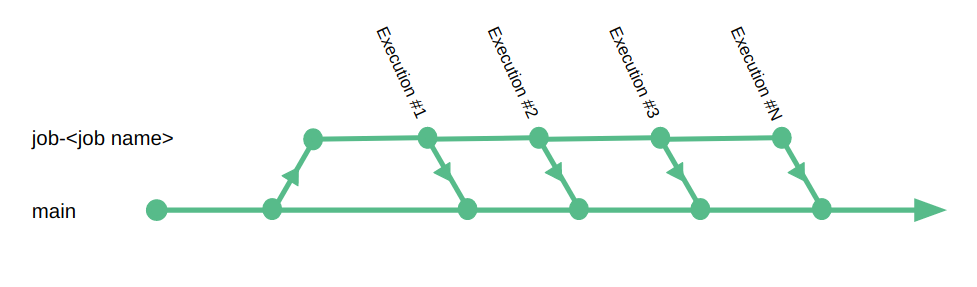
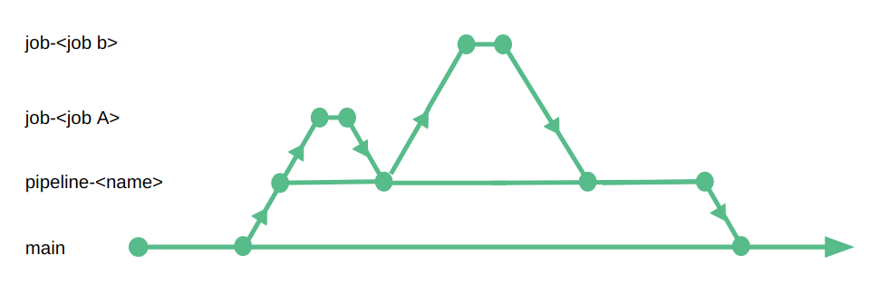
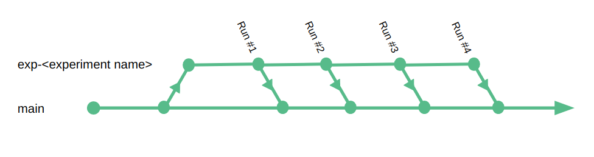
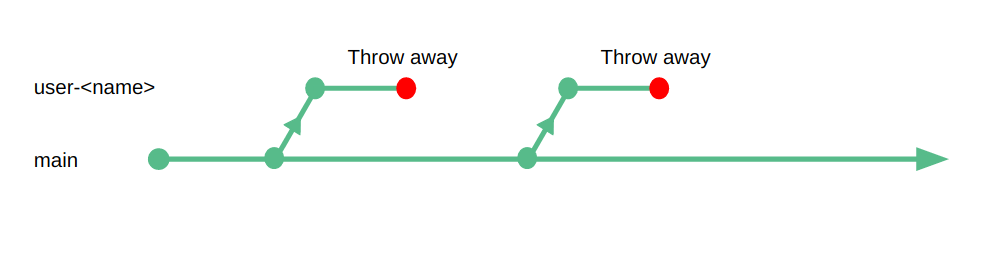

# Recommended Branching Models
{: .no_toc }

## Table of contents
{: .no_toc .text-delta }

1. TOC
{:toc}

## Use case #1 - Recurring batch jobs in production

Batch jobs in production require the following guarantees:

1. **Isolation** - other readers can't see the job's output before we've done proper validation.
1. **Reproducibility** - We want to run the same code on the same input data with predictable results.
1. **Atomicity** - We want to make our changes available as one atomic unit.
1. **Production safety** - We want to be able to "rewind" to our initial state if something went wrong.
1. **Data Validation** - The ability to test and validate a job's output before it is made available to its consumers

**Recommended model:** Branch per job, commit per execution, merge to main after validation
{: .note .note-info }



1. assuming we have a `main` branch, let's create a "job" branch for our pipeline. For this example let's assume we have a Spark job that reads raw input data, aggregates it by user and creates a new partition for the give date
1. We'll start by creating a branch for this pipeline:
   
   ```shell
   lakectl branch create \
      lakefs://example-repo@job-raw-data-grouping \
      --source lakefs://example-repo@main
   # output:
   # created branch 'job-raw-data-grouping', pointing to commit ID: '~79RU9aUsQ9GLnU'
   ```
1. Now, let's change our code to use this branch. Assuming this code reads and writes from S3, this is simple:
   
   ```diff
   < spark.write.partitionBy("date").parquet("s3a://example-repo/collections/events/by-date")
   > spark.write.partitionBy("date").parquet("s3a://example-repo/job-raw-data-grouping/collections/events/by-date")
   ```
1. In case of a failure, let's remove whatever intermediate state Spark might have left behind. We do this by simply reverting all uncommitted data:
   
   ```shell
   lakectl branch revert lakefs://example-repo@job-raw-data-grouping
   # are you sure you want to revert all uncommitted changes?: y█
   ```
1. Otherwise, if our job ended successfully, let's make our new data available to readers by committing and merging to main:
For our commit, let's also add the Git commit hash for the job's source code and other metadata for reference:
   
   ```shell
   lakectl commit lakefs://example-repo@job-raw-data-grouping \
      -m 'raw data grouping for 01/01/2020' \
      --meta job_commit_hash=501e31a67 \
      --meta airflow_run_url=http://... \
      --meta spark_version=2.4.6
   # output: 
   # Commit for branch "job-raw-data-grouping" done.
   #
   # ID: ~79RU9aUsQ9GLnU
   # Timestamp: 2020-01-01 12:00:00 +0000 UTC
   # Parents: ~43aP3nUrR17LcX
   ```
1. Once committed, we can now atomically merge this commit to main:
   
   ```shell
   lakectl merge lakefs://example-repo@job-raw-data-grouping lakefs://example-repo@main   
   # output:
   # new: 65 modified: 0 removed: 0 
   ```

1. That's it. All output created by our job is now merged into our main branch and available to readers

## Use case #2 - Production pipeline with multiple jobs

This is similar to the previous case, except we now have several jobs that produce related data. We want to be able to release all related data as one atomic unit, or revert them all together (or partially) if something goes wrong.

A common use case for this are "materialized views" - e.g. the same data but partitioned by different columns or sorted differently to optimize for different readers.

In production data pipelines, we require the following guarantees:

1. **Isolation** - Isolation of each job in the pipeline, but also, isolating the entire pipeline until it has completed.
1. **Reproducibility** - Every job should be reproducible, but also the pipeline as a whole.
1. **Atomicity** - We want to make our changes available as one atomic unit, at both job and pipeline level.
1. **Production safety** - We want to be able to "rewind" to our initial state if something went wrong.
1. **Data Validation** - The ability to test and validate the entire pipeline's output before it is made available to its consumers

**Recommended model:** Branch per job, merged into pipeline branch, merged into main after all jobs complete
{: .note .note-info }



1. Let's take the previous example and expand it a little. Instead of `job` branches that are derived from `main`, let's add an intermediate `pipeline` branch.
   
   ```shell
   lakectl branch create \
      lakefs://example-repo@pipeline-raw-data-grouping \
      --source lakefs://example-repo@main
   # output:
   # created branch 'pipeline-raw-data-grouping', pointing to commit ID: '~43aP3nUrR17LcX'
   ```
1. Now, for each job that takes part in the pipeline, we'll create a `job` branch that is **derived from the `pipline` branch**:
   
   ```shell
   lakectl branch create \
      lakefs://example-repo@job-raw-data-grouping-by-user \
      --source lakefs://example-repo@pipeline-raw-data-grouping
   # output:
   # created branch 'pipeline-raw-data-grouping', pointing to commit ID: '~43aP3nUrR17LcX'
   ```
1. Once we have a job branch, we can run our jobs, validate and commit our output as we did in the previous section.
1. Only when all jobs have completed - and all their output has been merged to the `pipeline` branch, we can merge it into `main`:
   ```shell
   lakectl merge lakefs://example-repo@pipeline-raw-data-grouping lakefs://example-repo@main   
   # output:
   # new: 542 modified: 0 removed: 0 
   ```

## Use case #3 - Safe data stream ingestion

For this use case let's look at streaming systems, or real time ingest pipelines that use the data lake as a Sink.

A common scenario would be data arriving to a message broker such as [Apache Kafka](https://kafka.apache.org/){: target="_blank" } or [AWS Kinesis](https://aws.amazon.com/kinesis/){: target="_blank" }, with a consumer that reads small batches from the stream and writes Parquet files to S3.

These messaging systems generally have an [offset mechanism](https://kafka.apache.org/documentation/#intro_topics){: target="_blank" } that allows a consumer to "rewind" and re-read messages.
This is great for production safety - but re-reading will also mean duplication of data in our data lake unless:

1. When rewinding an offset we also know exactly which objects to delete from previous runs
1. Alternatively, we were very careful when designing our consumer to ensure it is absolutely idempotent, even in the face of failure.

When streaming data into a data lake, we require the following guarantees:

1. **Production safety** - We want to be able to "rewind" to a previous state in case anything goes wrong.
1. **Atomicity** - We want to make our changes available as one atomic unit, usually defined by a time interval (i.e. this is all the data for the current minute/hour/day)

**Recommended model:** Branch per consumer type, periodic commits with stream offset, merge when ready for consumption
{: .note .note-info }


1. Let's create a branch for our consumer:
   
   ```shell
   lakectl branch create \
      lakefs://example-repo@consumer-raw-data \
      --source lakefs://example-repo@main
   # output:
   # created branch 'consumer-raw-data', pointing to commit ID: '~79RU9aUsQ9GLnU'
   ```
1. Let's change our consumer to write to the new branch:
   
   ```diff
   < topics.dir = "topics"
   > topics.dir = "consumer-raw-data/topics"
   ```
1. Now that parquet files are written to our new branch, we want to commit periodically. This will allow us to rewind safely:
   
   ```shell
   lakectl commit lakefs://example-repo@consumer-raw-data \
      -m 'raw data consumer checkpoint' \
      --meta kafka_committed_offset=<KAFKA_TOPIC_OFFSET> \
      --meta confluent_platform_version=5.5
   # output:
   # Commit for branch "consumer-raw-data" done.
   # 
   # ID: ~79RU9aUsQ9GLnU
   # Timestamp: 2020-01-01 12:00:00 +0000 UTC
   # Parents: ~43aP3nUrR17LcX
   ```
   
   Take note that `<KAFKA_TOPIC_OFFSET>` represents the latest committed offset, which also represents the latest offset that exists in our branch.
1. If something went wrong - we want to rewind to an earlier state and reprocess messages.
   
   This requires 3 steps:
   
   1. Look at the commit history and pick the latest known commit that was valid
   
      ```shell
      lakectl log lakefs://example-repo@
      # output:
      # commit ~43aP3nUrR17LcX
      # Author: rawDataConsumer
      # Date: 2020-07-20 12:00:00 +0000 UTC
      # 
      #     raw data consumer checkpoint
      # 
      #     kafka_committed_offset = ...
      #     confluent_platform_version = 5.5
      # 	
      # commit ~79RU9aUsQ9GLnU
      # Author: rawDataConsumer
      # Date: 2020-07-20 11:00:00 +0000 UTC
      ...
      ```
   1. Reset our branch to that commit:
   
      ```shell
      lakectl branch revert lakefs://example-repo@consumer-raw-data --commit ~79RU9aUsQ9GLnU
      ```
   1. Take the `kafka_committed_offset` metadata from the commit, and reset our Kafka Consumer Group offset to that value
1. In case we're happy with the changes, we can decide how we want to expose new data to readers:
   * Readers that need the absolute latest data and don't require no isolation - can read directly from the consumer's branch
      
      ```
      s3://example-repo/consumer-raw-data/topics/events/...
      ```  
   * Readers that want to see only validated, committed data, can read from the main branch:
      
     ```
      s3://example-repo/main/topics/events/...
     ```
     
     ### Time Availability
     {: .no_toc }
     
     We can decide if we want to merge back to main every time we commit, do it once a day, taking multiple commits each time, or any other logic that makes business sense.
     
     In many cases streams are ingested immediately, but the data is only processed after a fixed duration of time - for example, analytics events arrive all the time, but a process that aggregates them by creating a daily sum runs only after all data for a given day has arrived.
     
     We can use the merging mechanism to signal that - if a reader sees a new date partition in the main branch - they can assume that partition contains all the daily data.
    
     We can even create a branching scheme that reflects update times:
        - merge to an "hourly" branch every time we finish ingesting an hour of data 
        - merge from the "hourly" branch to a "daily" branch once we finish processing a day, and so on. 
        

## Use case #4 - Research and Data Science

Data science requires experimentation - We want to adjust an algorithm or test different parameters and see how they influence results.

If the input data changes between different runs, it's impossible to determine if our results changed because we changed the code or because the input changed.

Additionally, we want some form of quality assurance - being able to run the algorithm as it existed at a given point in time, with the same exact input data that existed when it initially ran.

Data science requires experimentation - We want to adjust a model or refine hyper-parameters and see how the changes we made influence the accuracy of our model, hence we need:

1. **Reproducibility** - The data set used to build the model should be available for reproducibility and quality validation of different versions of the model
1. **Data CI/CD** - when we update the model in production we want to monitor the accuracy of the model, and the assumption we had on the properties of the data

**Recommended model:** Branch per experiment type, commit per run with algorithm parameters as metadata*
{: .note .note-info }



1. Create `experiment` branches derived from the main branch:

   ```shell
   lakectl branch create \
      lakefs://example-repo@exp-cnn-tests \
      --source lakefs://example-repo@main
   # output:
   # created branch 'exp-cnn-tests', pointing to commit ID: '~43aP3nUrR17LcX'
   ```
1. Run the desired algorithm, committing the results along with the parameters used:

   ```shell
   lakectl commit lakefs://example-repo@exp-cnn-tests \
      -m 'trying tensorflow cnn' \
      --meta tf_cnn_param_a=1 \
      --meta tf_cnn_param_b=2 \
      --meta tf_version=2.3.0 \
      --meta algo_git_hash=4d55f2e372
   # output:
   # Commit for branch "exp-cnn-tests" done.
   # 
   # ID: ~79RU9aUsQ9GLnU
   # Timestamp: 2020-01-01 12:00:00 +0000 UTC
   # Parents: ~43aP3nUrR17LcX
   ```
1. By being able to address different commits directly, we can compare results and experiment with the generated models easily. To read from a specific commit we can pass its ID instead of the branch name when calling S3:
   
   ```
   s3://example-repo/~79RU9aUsQ9GLnU/models/user-recommendations/
   ```
1. Since we store the parameters as metadata for each commit, we can use multiple models simultaneously - comparing them and monitoring their results.

### Keeping experiment branches up to date
{: .no_toc }

While snapshot isolation is a desired attribute, and ensures data doesn't change under our feet, we sometime want to explicitly ask to see more up to date data in our branch.

In lakeFS this is done by merging in the opposite direction - from the main branch into our experiment branch:

```shell
lakectl merge lakefs://example-repo@main lakefs://example-repo@exp-cnn-tests   
# output:
# new: 2592 modified: 12 removed: 1439 
```

## Use case #5 - Ad-hoc exploration and experimentation

Sometimes we don't have a structured experiment or workflow, we simply want to play with the data - test out completely new algorithms, introduce new technologies or simply try out something we're not sure of its results.

For this, the following guarantees are required:

1. **Isolation** - We want our experiments to have no effect on production unless we explicitly decide otherwise.
1. **Production safety** - We want to be able to "rewind" to a previous state in case anything goes wrong.

**Recommended model:** Branch(es) per user, keeps up-to-date from a main branch, never merged back
{: .note .note-info }



1. Start by creating a branch for the given user
   
   ```shell
   lakectl branch create \
      lakefs://example-repo@user-janedoe \
      --source lakefs://example-repo@main
   # output:
   # created branch 'user-janedoe', pointing to commit ID: '~79RU9aUsQ9GLnU'
   ```
1. Run whatever we want in our isolated branch by reading and writing from `s3://example-repo/user-janedoe/collections/...`
1. When we're done, we can throw away this branch

   ```shell
   lakectl branch revert lakefs://example-repo@user-janedoe
   # Are you sure you want to revert all uncommitted changes?: y
   lakectl branch delete lakefs://example-repo@user-janedoe
   # Are you sure you want to delete branch?: y
   ```
1. Alternatively, if we do want to keep our branch around, but want to see up to date data, we can merge main into our user branch

   ```shell
   lakectl merge lakefs://example-repo@main lakefs://example-repo@user-janedoe   
   # output:
   # new: 1927 modified: 3 removed: 782 
   ```
