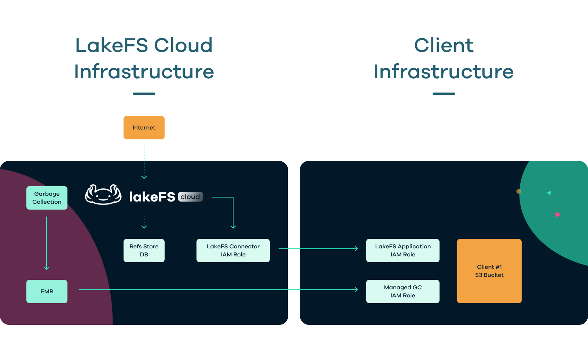

# lakeFS Cloud

[lakeFS Cloud](https://lakefs.cloud) is a managed cloud-based data lake versioning platform that helps organizations manage and analyze large amounts of data. It is designed to enable data engineers and data scientists to store, process, and analyze data in a single, scalable platform.

***What are the differences between lakeFS OSS and lakeFS Cloud?***

lakeFS Cloud is a fully-managed lakeFS solution, implemented using our best practices, providing high availability, auto-scaling, support and enterprise ready features, such as:
* [Role-Based Access Control](./reference/rbac.md)
* [Auditing](./reference/auditing.md)
* [Single-Sign-On](./reference/sso.md)
    * SAML
    * OIDC
    * AD FS
    * Okta
    * Azure AD
* [Managed Garbage Collection](./reference/managed-gc.md)
* [Private-Link](./reference/private-link.md)
* SOC 2 Type II Compliance

Read more on the differences on our [pricing page](https://lakefs.io/pricing/).

## Onboarding

### AWS

Onboarding to AWS cloud is fully automated through [lakefs.cloud](https://lakefs.cloud) self-service onboarding setup wizard.

### Azure

lakeFS saves all the data and the metadata on your storage account In this manual you will create a dedicated storage account for lakeFS and provide lakefs-cloud access to your storage account

#### Setting up a Storage container and App registration:
1. Open your Azure Portal.
2. Select Azure Active Directory > App registrations from the left-menu.
3. If you have an existing App registration you can use, select it. Otherwise create a new one.
    1. Click + New registration to create an App registration. Name it, leave the default settings and click Register.

Record the values **Application (client) ID** and **Directory (tenant) ID** for later.

4. On the same App registration page, select **Certificates & secrets** from the left-menu.
5. Click + New client secret to create a new one. Select a time frame for its expiration, add a description, and click **Add**.

Record the **application secret** for later. (Note that the password value will not be available once you leave the page.)

#### Create a Storage account
1. Click the main menu in the top-left corner, and select Storage account.
2. If you have an existing Storage account you can use, select it. Otherwise create a new one.
    1. Click + Create to create a new account.

Record the **storage account name** for later.

#### Create a Storage container
In the Storage account, create a storage container (or select an existing one).

#### Assign App & role to your Storage container
Still on the Storage container page
1. Select **Access Control (IAM)** from the left-menu.
2. Select **Add role assignments**
3. Fill in the form:
    * Role: Select **Storage Blob Data Contributor**.
    * Assign access to: Leave the defaults unchanged (should be User, group, or service principal).
    * Start typing in the name of the app and select it from the dropdown list. 
4. Click **save**.

#### Limiting access to trusted networks
To make sure that your Azure Blob storage cannot be accessed by malicious actors who get hold of the access credentials, you can configure the Azure Blob account to only allow logins from trusted networks.
Every storage account in Azure has Security rules, which define the access permissions.
By default, the storage account is accessible by any network as long as the user has the access credentials.

Before you begin, you’ll need: **Azure CLI** installed, and replace the following values:
* Resource Group Name (Provided by Treeverse)
* Virtual Network Name (Provided by Treeverse)
* Subnet Name (Provided by Treeverse)
* Customer Storage Account Name

```sh
az storage account network-rule add --subnet /subscriptions/947382ea-681a-4541-99ab-b718960c6289/resourceGroups/<Resource Group Name>/providers/Microsoft.Network/virtualNetworks/<Virtual Network Name>/subnets/<Subnet Name> --account-name <Customer Storage Account Name>
```

#### Recorded Values
In order to Treeverse to finish onboarding your environment to Azure, we'll need the following values recorded in the steps above:
* Storage Account Name
* Client (Application) ID
* Client Secret Password
* Directory (Tenant) ID


## How lakeFS Cloud interacts with your infrastructure
