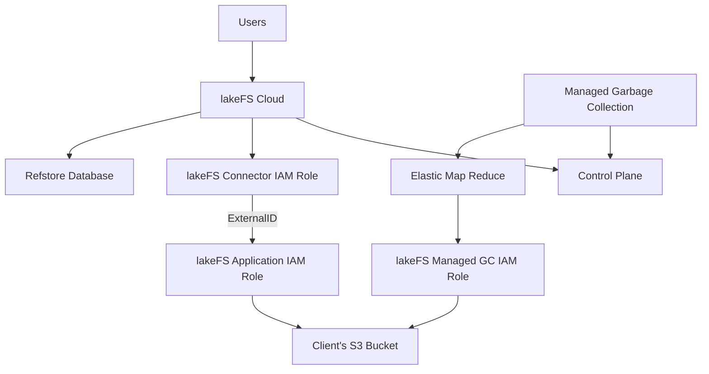

# lakeFS Cloud

{: .no_toc }

[lakeFS Cloud](https://lakefs.cloud) is a managed cloud-based data lake versioning platform that helps organizations manage and analyze large amounts of data. It is designed to enable data engineers and data scientists to store, process, and analyze data in a single, scalable platform.

lakeFS Cloud is a fully-managed lakeFS solution, implemented using our best practices, providing high availability, auto-scaling, support and enterprise-ready features.
	
## Features only available in lakeFS Cloud
* [Role-Based Access Control](../reference/rbac.md)
* [Auditing](./auditing.md)
* [Single-Sign-On](./sso.md)
    * SAML
    * OIDC
    * AD FS
    * Okta
    * Azure AD
* [Managed Garbage Collection](./managed-gc.md)
* [Private-Link](./private-link.md)
* SOC 2 Type II Compliance

## How lakeFS Cloud interacts with your infrastructure

## Setting up lakeFS Cloud

### AWS

Onboarding to lakeFS on AWS is fully automated through a self-service onboarding setup wizard.

### GCP

Coming soon! [Click here](mailto:support@treeverse.io) to register your interest.

### Azure

Onboarding to lakeFS Cloud on Azure is currently a manual process which will be automated in the future. For now, please follow [these instructions](./reference/cloud-setup-azure.md).

{: .no_toc }