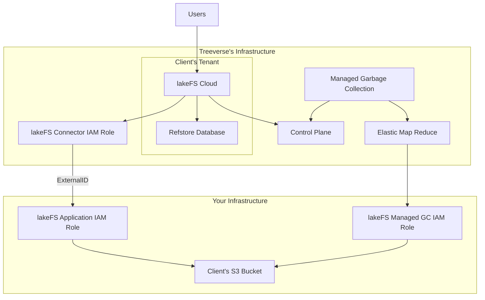

# lakeFS Cloud
[lakeFS Cloud](https://lakefs.cloud) is a fully-managed lakeFS solution, implemented using our best practices, providing high availability, auto-scaling, support and enterprise-ready features.
	
## lakeFS Cloud Features
* [Role-Based Access Control](../reference/rbac.md)
* [Auditing](./auditing.md)
* [Single-Sign-On](./sso.md) (including support for SAML, OIDC, AD FS, Okta, and Azure AD)
* [Managed Garbage Collection](./managed-gc.md)
* [Private-Link](./private-link.md)
* SOC 2 Type II Compliance

## How lakeFS Cloud interacts with your infrastructure

## Setting up lakeFS Cloud

### AWS
Setting up lakeFS on AWS is fully automated through a self-service onboarding setup wizard.

### Azure
Settuping uplakeFS Cloud on Azure is currently a manual process which will be automated in the future. For now, please follow [these instructions](./reference/cloud-setup-azure.md).

### GCP
Coming soon! [Click here](mailto:support@treeverse.io) to register your interest.