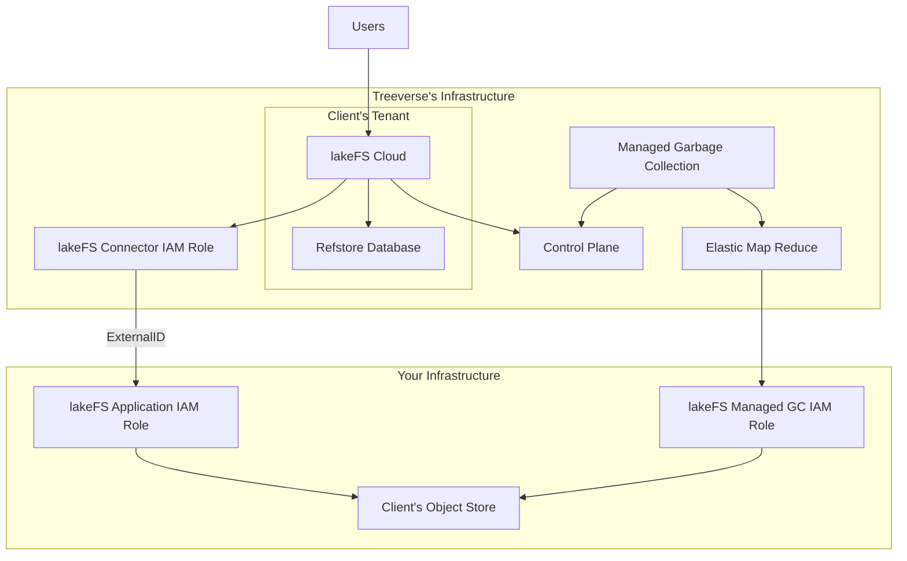

# lakeFS Cloud

## What is lakeFS cloud?

[lakeFS Cloud](https://lakefs.cloud) is a single tenant, fully-managed lakeFS solution, providing high availability, auto-scaling, support and production-grade features.

## Why did we build lakeFS cloud?

We built lakeFS cloud for three main reasons:
1. We wanted to provide organizations with the benefits of lakeFS without the need to manage it, saving them the investment in infrastructure and work related to installation, upgrades, uptime and scale .
1. We wanted to provide lakeFS cloud users with security that meets their needs, with SSO, SCIM, and RBAC.
1. We wanted to provide additional functionality that reduces friction and allows fast implementation of version controlled data/ML/AI pipelines throughout their data lifecycle.

## What is the value of using lakeFS Cloud as a managed service?

The main advantages of using lakeFS Cloud, the lakeFS managed service are:
1. No installation required, no cloud costs and devops efforts on installing and maintaining a lakeFS installation.
1. All lakeFS services are managed and run by us, including [Managed Garbage Collection]().
1. lakeFS cloud is highly available and includes a commitment to an uptime SLA.
1. lakeFS cloud auto scales according to your needs. See [lakeFS cloud scalability model](#lakefs-cloud-scalability-model) for more details.
1. Upgrades are done transparently on your lakeFS cloud environment
1. The lakeFS team is committed to supporting you with an SLA for both issues and product enhancements.

## Which security features does lakeFS Cloud provide?

1. lakeFS Cloud is [SOC2 Type II](https://www.itgovernance.co.uk/soc-reporting) compliant. [Contact us](https://lakefs.io/contact-sales/) to get the certification.
1. lakeFS Cloud version controls your data, **without accessing it**, using pre-signed URLs! Read more [here]().
1. When using lakeFS Cloud, you are provided with a rich [Role-Based Access Control]() functionality that allows for fine-grained control by associating permissions with users and groups, granting them specific actions on specific resources. This ensures data security and compliance within an organization.
1. To easily manage users and groups, lakeFS Cloud provides [SSO]() integration (including support for SAML, OIDC, AD FS, Okta, and Azure AD), supporting existing credentials from a trusted provider, eliminating separate logins.
1. lakeFS Cloud supports [SCIM]() for automatically provisioning and deprovisioning users and group memberships to allow organizations to maintain a single source of truth for their user database.
1. [STS Auth]() offers temporary, secure logins using an Identity Provider, simplifying user access and enhancing security.
1. [Authentication with AWS IAM Roles]() allows authentication using AWS IAM roles instead of lakeFS credentials, removing the need to maintain static credentials for lakeFS Enterprise users running on AWS.
1. [Auditing]() provides a detailed action log of events happening within lakeFS, including who performed which action, on which resource - and when.
1. [Private-Link]() support to ensure network security by only allowing access to your lakeFS Cloud installation from your cloud accounts

## What additional functionality does lakeFS Cloud provide?

Using lakeFS cloud is not just a secure and managed way of using lakeFS OSS; it is much more than that. With lakeFS Cloud you enjoy:
1. [lakeFS Mount]() allows users to virtually mount a remote lakeFS repository onto a local directory. Once mounted, users can access the data as if it resides on their local filesystem, using any tool, library, or framework that reads from a local filesystem.
1. [lakeFS Metadata Search](https://info.lakefs.io/metadata-search) - Allows a granular search API to filter and query versioned objects based on attached metadata. This is especially useful for machine learning environments to filter by labels and file attributes
1. [lakeFS for Databricks](https://lakefs.io/lakefs-for-databricks) - Provides a turnkey solution for Databricks customers for analytics, machine learning and business intelligence use cases including full support for Delta Lake tables, Unity Catalog, MLFlow and the rest of the Databricks product suite.
1. [lakeFS for Snowflake](https://info.lakefs.io/lakefs-for-snowflake) - Provides full integration into the Snowflake ecosystem, including full support for Iceberg managed tables.
1. [lakeFS Cross Cloud](https://info.lakefs.io/cross-cloud) - Allows central management of repositories that span across multiple cloud providers including Azure, AWS, GCP and on-prem environments.
1. [Transactional Mirroring]() - allows replicating lakeFS repositories into consistent read-only copies in remote locations.

| Feature                                   | OSS       | Cloud     |
|------------------------------------------------|-----------|-----------|
| **Format-agnostic data version control**       | ✅         | ✅         |
| **Cloud-agnostic**                             | ✅         | ✅         |
| **Zero Clone copy for isolated environment**   | ✅         | ✅         |
| **Atomic Data Promotion (via merges)**         | ✅         | ✅         |
| **Data stays in one place**                    | ✅         | ✅         |
| **Configurable Garbage Collection**            | ✅         | ✅         |
| **Data CI/CD using lakeFS hooks**              | ✅         | ✅         |
| **Integrates with your data stack**            | ✅         | ✅         |
| **[Role Based Access Control (RBAC)](https://docs.lakefs.io/security/rbac.html)** |            | ✅         |
| **[Single Sign On (SSO)](https://docs.lakefs.io/security/sso.html)**                       |            | ✅         |
| **[SCIM Support](https://docs.lakefs.io/howto/scim.html)**                               |            | ✅         |
| **[IAM Roles](https://docs.lakefs.io/security/external-principals-aws.html)**                                  |            | ✅         |
| **[Mount Capability](https://docs.lakefs.io/reference/mount.html)**                           |            | ✅         |
| **[Audit Logs](https://docs.lakefs.io/reference/auditing.html)**                                 |            | ✅         |
| **[Transactional Mirroring (cross-region)](https://docs.lakefs.io/howto/mirroring.html)**     |            | ✅         |
| **Managed Service (auto updates, scaling)**    |            | ✅         |
| **[Managed Garbage Collection](https://docs.lakefs.io/howto/garbage-collection/managed-gc.html)**                 |            | ✅         |
| **[SOC2 Compliant](https://docs.lakefs.io/security/)**                             |            | ✅         |
| **Support SLA**                                |            | ✅         |

## How lakeFS Cloud interacts with your infrastructure

Treeverse hosts and manages a dedicated lakeFS instance that interfaces with data held in your object store, such as S3.

## Setting up lakeFS Cloud

### AWS / Azure

Please follow the self-service setup wizard on [lakeFS Cloud](https://lakefs.cloud).

### GCP

Please [contact us](mailto:support@treeverse.io) for onboarding instructions.

## lakeFS Cloud Scalability Model

By default, a lakeFS Cloud installation supports:
- 1,500 read operations/second across all branches on all repositories within a region
- 1,500 write operations per second across all branches on all repositories within a region

This limit can be increased by contacting [support](mailto:support@treeverse.io?subject=quota+increase). 

Each lakeFS branch can sustain up to a maximum of 1,000 write operations/second and 3,000 read operations per second. 
This scales horizontally, so for example, with 10 concurrent branches, a repository could sustain 10k writes/second and 30k reads/second, assuming load is distributed evenly between them.

Reading committed data (e.g. from a commit ID or tag) could be scaled up horizontally to any desired capacity, and defaults to ~5,000 reads/second.

