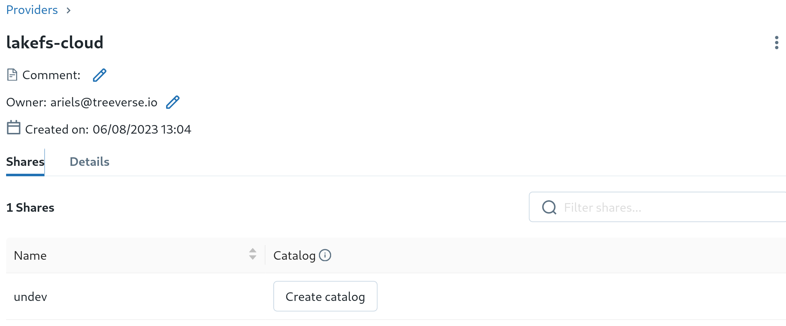

# Unity Delta Sharing [private preview]: User Manual

## Introduction

lakeFS Unity Delta Sharing provides a read-only experience from Unity
Catalog for lakeFS customers.  Currently this is available as a private
preview.  It provides _full read-only functionality_ for Unity Catalog.  It
does _not_ provide a "self-service" experience to set up the service.

## Setup

This guide explains how to set up and use lakeFS Delta Sharing.  Currently
you will have to configure lakeFS Delta Sharing in collaboration with
Treeverse Customer Success.  Once set up is complete, you will of course be
able to use lakeFS Delta Sharing on existing and on new tables without
further assistance.

### 1. Collect data and initial setup

* Select a "Delta Sharing configuration URL".  This is a single location on lakeFS
  to hold the top-level configuration of lakeFS Delta Sharing across all
  repositories of your organization.  Typically it will have the form
  `lakefs://REPO/main/lakefs_delta_sharing.yaml` for one of your
  repositories.  A longer path may be obviously be supplied.  However we do
  recommend keeping it on the `main` branch, as this object represents state
  for the entire installation.

* Create a user `lakefs-delta-sharing-service` for lakeFS Delta Sharing, and
  an access key for that user.  It should have at least read permissions for
  the configuration URL and for all repositories and all data accesses by
  Unity.  lakeFS Delta Sharing will these credentials to communicate with
  lakeFS.

**Communicate these items to Customer Success**:

* Configuration URL
* Access key ID and secret access key for user `lakefs-delta-sharing-service`.

### 2. Initial configuration

Select a secret authorization token to share Unity catalog.  Unity catalog
will use to authenticate to the lakeFS Delta Sharing server.  You might use
this command on Linux:

```sh
head -c 50 /dev/random | base64
```

Create a file `lakefs_delta_sharing.yaml` and place it at the config URL
selected above.  It should look like this:

```yaml
authorization_token: "GENERATED TOKEN"
# Map lakeFS repositories to Unity shares
repositories:
    - id: sample-repo
      share_name: undev
      # List branches and prefixes to export.  Each of these branches (and only
      # these branches) will be available as a schema on Unity.
      branches:
          - main
          - staging
          - dev_*
    - id: repo2
      share_name: share_two
      branches:
      - *
```

Upload it to your config URL.  For instance if the config URL is
`lakefs://repo/main/lakefs_delta_sharing.yaml`, you might use:

```sh
lakectl fs upload -s ./lakefs_delta_sharing.yaml lakefs://repo/main/lakefs_delta_sharing.yaml
```

### 3. Connect Unity to lakeFS Delta Sharing!

You now need to configure Unity to use the lakeFS Delta Sharing server.
Create a share provider file `config.share.json`; see the [Delta Sharing
manual][databricks-delta-sharing]:

   ```json
   {
     "shareCredentialsVersion": 1,
     "endpoint": "https://ORG_ID.REGION.lakefscloud.io/service/delta-sharing/v1",
     "bearerToken": "GENERATED TOKEN",
     "expirationTime": "2030-01-01T00:00:00.0Z"
   }
   ```

"GENERATED TOKEN" is the secret authorization token use above.

Install the [databricks cli][databricks-cli].  We will use it to create
Delta Share on Unity.  Follow the
[instructions](https://docs.databricks.com/dev-tools/cli/index.html#set-up-authentication-using-a-databricks-personal-access-token)
to configure it.

Run the provider creation command:
   ```shell
   databricks unity-catalog providers create \
       --name lakefs-cloud \
       --recipient-profile-json-file config.share.json
   ```

Go to "Data >> Delta Sharing" on the DataBricks environment.  Once Treeverse
have configured lakeFS Delta Sharing on your account with your config URL,
the "lakefs-cloud" provider should appear under "Shared with me".


Click the provider to see its shares.



You can now create a catalog from these shares.


And you can see schemas for each of the branches that you configured in the
share.  Here branch name `dev_experiment1` matches the pattern `dev_*` that
we defined in the configuration object `lakefs-delta-sharing.yaml`, so it
appears as a schema.  

At this point you have configured Delta Sharing on lakeFS, and DataBricks to
communicate with lakeFS delta sharing.  No further Treeverse involvement is
required.  Updates to `lakefs_delta_sharing.yaml` will update within a
minute of uploading a new version.

### 4. Configure tables

Everything is ready: lakeFS repositories are configured as shares, and
branches are configured as schemas.  Now you can define tables!  Once a
repository is shared, its tables are configured as a table descriptor object
on the repository on the path `_lakefs_tables/TABLE.yaml`.

#### Delta Lake tables

Delta Lake format includes full metadata, so you only need to configure the prefix:

```yaml
name: users
type: delta
path: path/to/users/
```

When placed inside `_lakefs_tables/users.yaml` this defines a table `users`
on the prefix `path/to/users/` (so `path/to/users/` holds the prefix
`_delta_log`).

#### Hive tables

Hive metadata server tables are essentially just a set of objects that share
a prefix, with no table metadata stored on the object store.  You need to
configure prefix, partitions, and schema.

```yaml
name: clicks
type: hive
path: path/to/clicks/
partition_columns: ['year']
schema:
  type: struct
  fields:
    - name: year
      type: integer
      nullable: false
      metadata: {}
    - name: page
      type: string
      nullable: false
      metadata: {}
    - name: site
      type: string
      nullable: true
      metadata:
        comment: a comment about this column
```

Useful types recognized by DataBricks Photon include `integer`, `long`,
`short`, `string`, `double`, `float`, `date`, and `timestamp`.  For exact
type mappings, and whether to specify a field as `nullable: false`, refer to
[DataBricks Photon documentation][databricks-photon-types].


[databricks-delta-sharing]:  https://docs.databricks.com/data-sharing/manage-provider.html#instructions
[databricks-cli]:  https://docs.databricks.com/dev-tools/cli/index.html
[databricks-photon-types]:  https://docs.databricks.com/runtime/photon.html#photon-coverage
