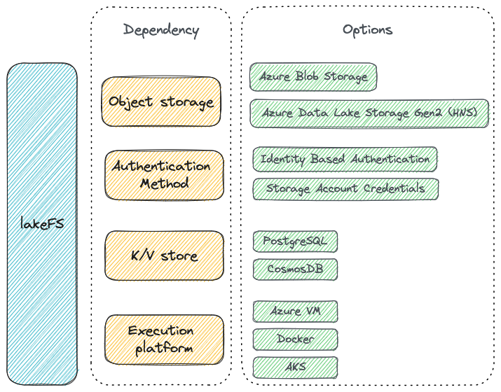

# Deploy lakeFS on Azure
{: .no_toc }

⏰ Expected deployment time: 25 min
{: .note }

lakeFS has several dependencies for which you need to select and configure a technology or interface: 



This guide walks you through the options available and how to configure them, finishing with configuring and running lakeFS itself and creating your first repository. 






## 1. Object Storage

lakeFS supports the following [Azure Storage](https://learn.microsoft.com/en-us/azure/storage/common/storage-introduction) types:

1. [Azure Blob Storage](https://azure.microsoft.com/en-gb/products/storage/blobs)
2. [Azure Data Lake Storage Gen2](https://learn.microsoft.com/en-us/azure/storage/blobs/data-lake-storage-introduction) ([HNS](https://learn.microsoft.com/en-us/azure/storage/blobs/data-lake-storage-namespace))

Data Lake Storage Gen1 is not supported.

## 2. Authentication Method

lakeFS supports two ways to authenticate with Azure.

<div class="tabs">
  <ul>
    <li><a href="#iba">Identity Based Authentication (recommended)</a></li>
    <li><a href="#sac">Storage Account Credentials</a></li>
  </ul>

<div markdown="1" id="iba">

lakeFS uses environment variables to determine credentials to use for authentication. The following authentication methods are supported:

1. Managed Service Identity (MSI)
1. Service Principal RBAC
1. Azure CLI

For deployments inside the Azure ecosystem it is recommended to use a managed identity.  

More information on authentication methods and environment variables can be found [here](https://learn.microsoft.com/en-us/azure/developer/go/azure-sdk-authentication)

#### How to Create Service Principal for Resource Group

It is recommended to create a resource group that consists of all the resources lakeFS should have access to.

Using a resource group will allow dynamic removal/addition of services from the group, effectively providing/preventing access for lakeFS to these resources without requiring any changes in configuration in lakeFS or providing lakeFS with any additional credentials.

The minimal role required for the service principal is "Storage Blob Data Contributor"

The following Azure CLI command creates a service principal for a resource group called "lakeFS" with permission to access (read/write/delete)
Blob Storage resources in the resource group and with an expiry of 5 years

``` shell
az ad sp create-for-rbac \
  --role "Storage Blob Data Contributor" \
  --scopes /subscriptions/XXXXXXXX-XXXX-XXXX-XXXX-XXXXXXXXXXXX/resourceGroups/lakeFS --years 5
    
Creating 'Storage Blob Data Contributor' role assignment under scope '/subscriptions/947382ea-681a-4541-99ab-b718960c6289/resourceGroups/lakeFS'
The output includes credentials that you must protect. Be sure that you do not include these credentials in your code or check the credentials into your source control. For more information, see https://aka.ms/azadsp-cli
{
  "appId": "XXXXXXXX-XXXX-XXXX-XXXX-XXXXXXXXXXXX",
  "displayName": "azure-cli-2023-01-30-06-18-30",
  "password": "XXXXXXXX-XXXX-XXXX-XXXX-XXXXXXXXXXXX",
  "tenant": "XXXXXXXX-XXXX-XXXX-XXXX-XXXXXXXXXXXX"
}
```

The command output should be used to populate the following environment variables:

```
AZURE_CLIENT_ID      =  $appId
AZURE_TENANT_ID      =  $tenant
AZURE_CLIENT_SECRET  =  $password
```

**Note:** Service Principal credentials have an expiry date and lakeFS will lose access to resources unless credentials are renewed on time.
{: .note }

**Note:** It is possible to provide both account based credentials and environment variables to lakeFS. In that case - lakeFS will use
the account credentials for any access to data located in the given account, and will try to use the identity credentials for any data located outside the given account.
{: .note }

</div>

<div markdown="2" id="sac">

Storage account credentials can be set directly in the lakeFS configuration using the following parameters:

* `blockstore.azure.storage_account`
* `blockstore.azure.storage_access_key`  

#### Limitations

Please note that using this authentication method limits lakeFS to the scope of the given storage account. 

Specifically, **the following operations will not work**:

1. Import of data from different storage accounts
1. Copy/Read/Write of data that was imported from a different storage account
1. Create pre-signed URL for data that was imported from a different storage account


</div>
</div>


## 3. K/V Store

lakeFS stores metadata in a database for its versioning engine. This is done via a Key-Value interface that can be implemented on any DB engine and lakeFS comes with several built-in driver implementations (You can read more about it [here](https://docs.lakefs.io/understand/how/kv.html)). The database used doesn't _have_ to be a dedicated K/V database.

<div class="tabs">
  <ul>
    <li><a href="#cosmosdb">CosmosDB (Beta)</a></li>
    <li><a href="#postgres">PostgreSQL</a></li>
  </ul>
  <div markdown="1" id="cosmosdb">

[CosmosDB](https://azure.microsoft.com/en-us/products/cosmos-db/) is a managed database service provided by Azure. lakeFS supports [CosmosDB For NoSQL](https://learn.microsoft.com/en-GB/azure/cosmos-db/nosql/) as a database backend. 

1. Follow the official [Azure documentation](https://learn.microsoft.com/en-us/azure/cosmos-db/nosql/how-to-create-account?tabs=azure-cli) 
   on how to create a CosmosDB account for NoSQL and connect to it.
1. Once your CosmosDB account is set up, you can create a Database for 
   lakeFS. For lakeFS ACID guarantees, make sure to select the [Bounded 
   staleness consistency](https://learn.microsoft.com/en-us/azure/cosmos-db/consistency-levels#bounded-staleness-consistency),
   for single region deployments.
1. Create a new container in the database and select type 
   `partitionKey` as the Partition key (case sensitive). 
1. Pass the endpoint, database name and container name to lakeFS as 
   described in the [configuration guide](../reference/configuration.md#example--azure-blob-storage).
   You can either pass the CosmosDB's account read-write key to lakeFS, or 
   use a managed identity to authenticate to CosmosDB, as described 
   [earlier](#identity-based-credentials).

A note on CosmosDB capacity modes: lakeFS usage of CosmosDB is still in its 
early days and has not been battle tested. Both capacity modes, Provisioned 
and Serverless, has been tested for some workloads and passed with flying 
colors. The Provisioned mode was configured with 400-4000 RU/s.
{: .note }

</div>
  <div markdown="2" id="postgres">

Below we show you how to create a database on Azure Database, but you can use any PostgreSQL database as long as it's accessible by your lakeFS installation.

If you already have a database, take note of the connection string and skip to the [next step](#run-the-lakefs-server)

1. Follow the official [Azure documentation](https://docs.microsoft.com/en-us/azure/postgresql/quickstart-create-server-database-portal){: target="_blank" } on how to create a PostgreSQL instance and connect to it.
   Make sure that you're using PostgreSQL version >= 11.
1. Once your Azure Database for PostgreSQL server is set up and the server is in the _Available_ state, take note of the endpoint and username.
   
1. Make sure your Access control roles allow you to connect to the database instance.

</div>
</div>

## 4. Run the lakeFS server

Now that you've chosen and configured object storage, a K/V store, and authentication—you're ready to configure and run lakeFS. There are three different ways you can run lakeFS:

<div class="tabs">
  <ul>
    <li><a href="#vm">Azure VM</a></li>
    <li><a href="#docker">Docker</a></li>
    <li><a href="#aks">Azure Kubernetes Service (AKS)</a></li>
  </ul>
  <div markdown="1" id="vm">

Connect to your VM instance using SSH:

1. Create a `config.yaml` on your VM, with the following parameters:
  
   ```yaml
   ---
   database:
     type: "postgres"
     postgres:
       connection_string: "[DATABASE_CONNECTION_STRING]"
  
   auth:
     encrypt:
       # replace this with a randomly-generated string. Make sure to keep it safe!
       secret_key: "[ENCRYPTION_SECRET_KEY]"
   
   blockstore:
     type: azure
     azure:
   ```
1. [Download the binary](../index.md#downloads) to the VM.
1. Run the `lakefs` binary:
  
   ```sh
   lakefs --config config.yaml run
   ```

**Note:** It's preferable to run the binary as a service using systemd or your operating system's facilities.
{: .note }

</div>
<div markdown="2" id="docker">

To support container-based environments, you can configure lakeFS using environment variables. Here is a `docker run`
command to demonstrate starting lakeFS using Docker:

```sh
docker run \
  --name lakefs \
  -p 8000:8000 \
  -e LAKEFS_DATABASE_TYPE="postgres" \
  -e LAKEFS_DATABASE_POSTGRES_CONNECTION_STRING="[DATABASE_CONNECTION_STRING]" \
  -e LAKEFS_AUTH_ENCRYPT_SECRET_KEY="[ENCRYPTION_SECRET_KEY]" \
  -e LAKEFS_BLOCKSTORE_TYPE="azure" \
  -e LAKEFS_BLOCKSTORE_AZURE_STORAGE_ACCOUNT="[YOUR_STORAGE_ACCOUNT]" \
  -e LAKEFS_BLOCKSTORE_AZURE_STORAGE_ACCESS_KEY="[YOUR_ACCESS_KEY]" \
  treeverse/lakefs:latest run
```

See the [reference](../reference/configuration.md#using-environment-variables) for a complete list of environment variables.


</div>
<div markdown="2" id="aks">

You can install lakeFS on Kubernetes using a [Helm chart](https://github.com/treeverse/charts/tree/master/charts/lakefs).

To install lakeFS with Helm:

1. Copy the Helm values file relevant for Azure Blob:
   
   ```yaml
   secrets:
       # replace this with the connection string of the database you created in a previous step:
       databaseConnectionString: [DATABASE_CONNECTION_STRING]
       # replace this with a randomly-generated string
       authEncryptSecretKey: [ENCRYPTION_SECRET_KEY]
   lakefsConfig: |
       blockstore:
         type: azure
         azure:
       #  If you chose to authenticate via access key, unmark the following rows and insert the values from the previous step 
       #  storage_account: [your storage account]
       #  storage_access_key: [your access key]
   ```
1. Fill in the missing values and save the file as `conf-values.yaml`. For more configuration options, see our Helm chart [README](https://github.com/treeverse/charts/blob/master/charts/lakefs/README.md#custom-configuration){:target="_blank"}.

   The `lakefsConfig` parameter is the lakeFS configuration documented [here](https://docs.lakefs.io/reference/configuration.html) but without sensitive information.
   Sensitive information like `databaseConnectionString` is given through separate parameters, and the chart will inject it into Kubernetes secrets.
   {: .note }

1. In the directory where you created `conf-values.yaml`, run the following commands:

   ```bash
   # Add the lakeFS repository
   helm repo add lakefs https://charts.lakefs.io
   # Deploy lakeFS
   helm install my-lakefs lakefs/lakefs -f conf-values.yaml
   ```

   *my-lakefs* is the [Helm Release](https://helm.sh/docs/intro/using_helm/#three-big-concepts) name.


### Load balancing
{: .no_toc }

To configure a load balancer to direct requests to the lakeFS servers you can use the `LoadBalancer` Service type or a Kubernetes Ingress.
By default, lakeFS operates on port 8000 and exposes a `/_health` endpoint that you can use for health checks.

💡 The NGINX Ingress Controller by default limits the client body size to 1 MiB.
Some clients use bigger chunks to upload objects - for example, multipart upload to lakeFS using the [S3-compatible Gateway](../understand/architecture.md#s3-gateway) or 
a simple PUT request using the [OpenAPI Server](../understand/architecture.md#openapi-server).
Checkout Nginx [documentation](https://kubernetes.github.io/ingress-nginx/user-guide/nginx-configuration/annotations/#custom-max-body-size) for increasing the limit, or an example of Nginx configuration with [MinIO](https://docs.min.io/docs/setup-nginx-proxy-with-minio.html).
{: .note }

</div>
</div>


