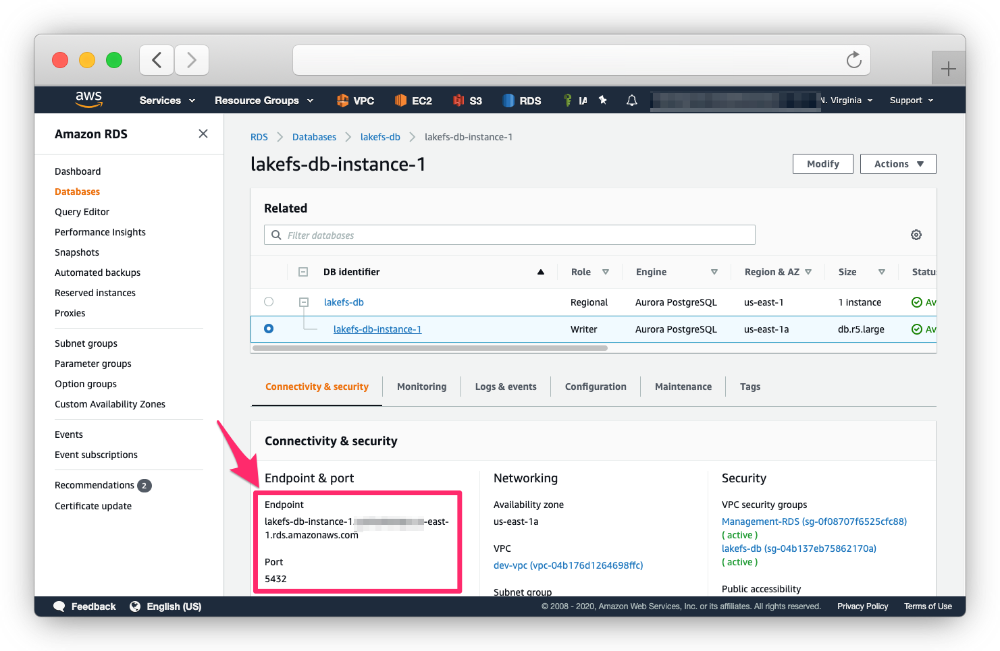

# Creating the database
{: .no_toc }

lakeFS requires a PostgreSQL database to synchronize actions on your repositories.
We will show you how to create a database on your cloud platform.
You can use any PostgreSQL database as long as it's accessible by your lakeFS installation.

If you already have a database, take note of the connection string and proceed to [Configuring the Storage](bucket.md).

## Table of contents
{: .no_toc .text-delta }

1. TOC
{:toc}
   
## On AWS RDS

1. Follow the official [AWS documentation](https://docs.aws.amazon.com/AmazonRDS/latest/UserGuide/CHAP_GettingStarted.CreatingConnecting.PostgreSQL.html){: target="_blank" } on how to create a PostgreSQL instance and connect to it.  
You may use the default PostgreSQL engine, or [Aurora PostgreSQL](https://docs.aws.amazon.com/AmazonRDS/latest/AuroraUserGuide/Aurora.AuroraPostgreSQL.html){: target="_blank" }. Make sure you're using PostgreSQL version >= 11.
2. Once your RDS is set up and the server is in `Available` state, take note of the endpoint and port.

   

3. Make sure your security group rules allow you to connect to the database instance. 
 
You can now proceed to [Configuring the Storage](bucket.md).

## On Microsoft Azure Database

1. Follow the official [Azure documentation](https://docs.microsoft.com/en-us/azure/postgresql/quickstart-create-server-database-portal){: target="_blank" } on how to create a PostgreSQL instance and connect to it.
   Make sure you're using PostgreSQL version >= 11.
1. Once your Azure Database for PostgreSQL server is set up and the server is in `Available` state, take note of the endpoint and username.
   
1. Make sure your Access control roles allow you to connect to the database instance. 

You can now proceed to [Configuring the Storage](bucket.md).

## On Google Cloud SQL

1. Follow the official [Google documentation](https://cloud.google.com/sql/docs/postgres/quickstart#create-instance) on how to create a PostgreSQL instance.
   Make sure you're using PostgreSQL version >= 11.
1. On the *Users* tab in the console, create a user to be used by the lakeFS installation.
1. Choose the method by which lakeFS [will connect to your database](https://cloud.google.com/sql/docs/postgres/connect-overview). Google recommends using 
   the [SQL Auth Proxy](https://cloud.google.com/sql/docs/postgres/sql-proxy).
   
Depending on the chosen lakeFS installation method, you will need to make sure lakeFS can access your database.
For example, if you install lakeFS on GKE, you need to deploy the SQL Auth Proxy from [this Helm chart](https://github.com/rimusz/charts/blob/master/stable/gcloud-sqlproxy/README.md), or as [a sidecar container in your lakeFS pod](https://cloud.google.com/sql/docs/mysql/connect-kubernetes-engine).

You can now proceed to [Configuring the Storage](bucket.md).
