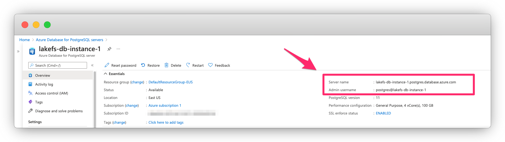

# Creating the database

Before installing lakeFS, you need to have a PostgreSQL database. 
In this guide we show you how to set it up on Azure, but you can use a different database as long as it's accessible by your lakeFS installation.

## On Azure Database for PostgreSQL servers

1. Follow the official [Azure documentation](https://docs.microsoft.com/en-us/azure/postgresql/quickstart-create-server-database-portal){: target="_blank" } on how to create a PostgreSQL instance and connect to it.
   Make sure you're using PostgreSQL version >= 11.
2. Once your Azure Database for PostgreSQL server is set up and the server is in `Available` state, take note of the endpoint and username.

   

3. Make sure your Access control roles allow you to connect to the database instance. 
 
