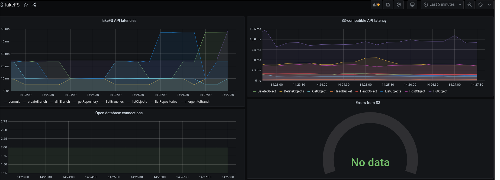

# Monitoring using Prometheus
{: .no_toc }

{: .pb-3 }

## Table of contents
{: .no_toc .text-delta }

1. TOC
{:toc}

## Example prometheus.yml
lakeFS exposes metrics through the same port used by the lakeFS service, using the standard `/metrics` path.
An example `prometheus.yml` could look like this:
```yaml
scrape_configs:
- job_name: lakeFS
  scrape_interval: 10s
  metrics_path: /metrics
  static_configs:
  - targets:
    - lakefs.example.com:8000
```

## Metrics exposed by lakeFS
By default, Prometheus exports metrics with OS process information like memory and CPU.
It also includes Go-specific metrics like details about GC and number of goroutines.
You can learn about these default metrics in this [post](https://povilasv.me/prometheus-go-metrics/){: target="_blank" }.

In addition, lakeFS exposes the following metrics to help monitor your deployment: 

| Name in Prometheus               | Description     | Labels                                                                                           
| api_requests_total               | [lakeFS API](../reference/api.md) requests (counter)| **code**: http status<br/>**method**: http method                                         
| api_request_duration_seconds     | Durations of lakeFS API requests (histogram)| <br/>**operation**: name of API operation<br/>**code**: http status                          
| gateway_request_duration_seconds | lakeFS [S3-compatible endpoint](../reference/s3.md) request (histogram)| <br/>**operation**: name of gateway operation<br/>**code**: http status                      
| azure_operation_duration_seconds    | Outgoing azure operations (histogram)| <br/>**operation**: name of Azure operation<br/>**error**: "true" if error, "false" otherwise 
| go_sql_stats_*                   | [Go DB stats](https://golang.org/pkg/database/sql/#DB.Stats){: target="_blank" } metrics have this prefix.<br/>[dlmiddlecote/sqlstats](https://github.com/dlmiddlecote/sqlstats){: target="_blank" } is used to expose them.| 


## Example queries
**Note:** when using Prometheus functions like [rate](https://prometheus.io/docs/prometheus/latest/querying/functions/#rate){: target="_blank"}
or [increase](https://prometheus.io/docs/prometheus/latest/querying/functions/#increase){: target="_blank"}, results are extrapolated and may not be exact.
{: .note}


### 99th percentile of API request latencies
```
sum by (operation)(histogram_quantile(0.99, rate(api_request_duration_seconds_bucket[1m])))
```

### 50th percentile of S3-compatible API latencies
```
sum by (operation)(histogram_quantile(0.5, rate(gateway_request_duration_seconds_bucket[1m])))
```

### Number of errors in outgoing Azure requests
```
sum by (operation) (increase(azure_operation_duration_seconds_count{error="true"}[1m]))
```

### Number of open connections to the database
```
go_sql_stats_connections_open
```

### Example Grafana dashboard

[](../assets/img/grafana.png){: target="_blank" }