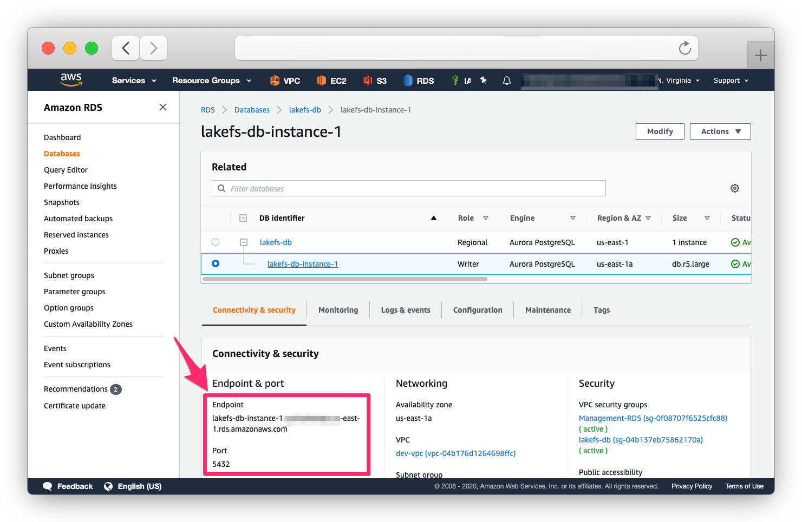
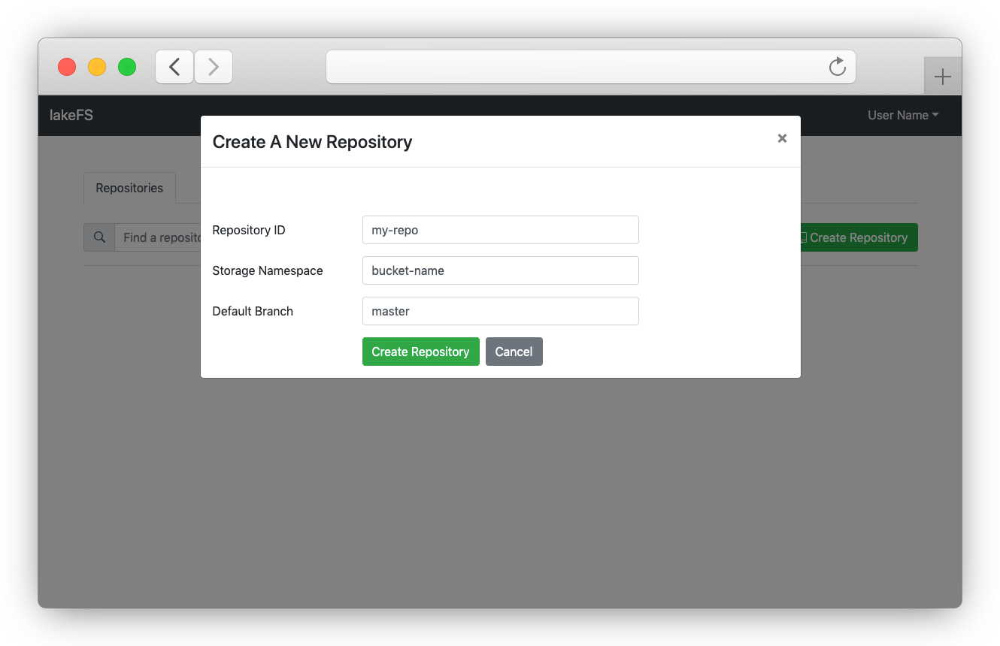

# Deploying on AWS
{: .no_toc }

**Warning:** lakeFS is currently in POC - this is a pre-alpha version that *should not be used in production*. The API and data model are likely to change.
{: .note .pb-3 }

## Table of contents
{: .no_toc .text-delta }

1. TOC
{:toc}


### Running PostgreSQL
##### On RDS

1. Follow the official AWS documentation on [Creating a PostgreSQL DB Instance and Connecting to a Database on a PostgreSQL DB Instance](https://docs.aws.amazon.com/AmazonRDS/latest/UserGuide/CHAP_GettingStarted.CreatingConnecting.PostgreSQL.html){: target="_blank" }.  
You may use the default PostgreSQL engine, or [Aurora PostgreSQL](https://docs.aws.amazon.com/AmazonRDS/latest/AuroraUserGuide/Aurora.AuroraPostgreSQL.html){: target="_blank" }. Make sure you're using PostgreSQL version >= 11.
2. Once your RDS is set up and the server is in `Available` state, and take note of the endpoint and port.

   

3. Make sure your security group rules allow you to connect to the database instance. 


### Setting up an S3 bucket for data storage

1. From the S3 Administration console, choose `Create Bucket` (you can use an existing bucket with a path prefix, but creating a dedicated bucket is recommended).
2. Make sure you:
    1. Block public access
    2. Disable Object Locking
3. Once created, go to the `Permissions` tab, and create a Bucket Policy. Use the following structure:

   ```json
    {
     "Id": "Policy1590051531320",
     "Version": "2012-10-17",
     "Statement": [
       {
         "Sid": "Stmt1590051522178",
         "Action": [
           "s3:GetObject",
           "s3:GetObjectVersion",
           "s3:PutObject",
           "s3:DeleteObject",
           "s3:DeleteObjectVersion",
           "s3:AbortMultipartUpload",
           "s3:ListMultipartUploadParts"
         ],
         "Effect": "Allow",
         "Resource": [
           "arn:aws:s3:::<BUCKET_NAME>/*"
         ],
         "Principal": {
           "AWS": [
             "arn:aws:iam::<ACCOUNT_ID>:role/<IAM_ROLE>"
           ]
         }
       }, {
         "Sid": "Stmt1590051522178",
         "Action": [
           "s3:GetBucketVersioning",
           "s3:ListBucket",
           "s3:GetBucketLocation",
           "s3:ListBucketMultipartUploads",
           "s3:ListBucketVersions"
         ],
         "Effect": "Allow",
         "Resource": [
           "arn:aws:s3:::<BUCKET_NAME>"
         ],
         "Principal": {
           "AWS": [
             "arn:aws:iam::<ACCOUNT_ID>:role/<IAM_ROLE>"
           ]
         }
       }
     ]
   }
   ```
   
   Replace `<ACCOUNT_ID>`, `<IAM_ROLE>` and `<BUCKET_NAME>` with values relevant to your environment.

### Creating a configuration file

See the full [configuration reference](../reference/configuration.md){: target="_blank" } for all configurable settings.
{: .note .note-info }

A minimal example of a configuration file for the setup we've created above would look like this:

```yaml
---
database:
  connection_string: "postgres://user:pass@<RDS_ENDPOINT>:5432/postgres"

auth:
  encrypt:
    secret_key: "<RANDOM_GENERATED_STRING>"

blockstore:
  type: s3

gateways:
  s3:
    domain_name: s3.lakefs.example.com
```

Make sure to:

1. Change `<RDS_ENDPOINT>` to the endpoint we've created in the [Creating an initial Database](#creating-an-initial-database) step above.
2. Change `<RANDOM_GENERATED_STRING>` to a cryptographically safe, randomly generated string. Example how:
    
   ```bash
   # On *NIX systems
   $ LC_ALL=C tr -dc '[:alnum:]' < /dev/urandom | head -c128
   ```

   **Note:** It is best to keep this somewhere safe such as KMS or Hashicorp Vault, and provide it to the system at run time
   {: .note } 
   
3. Change `s3.lakefs.example.com` to a domain we'll configure for lakeFS' [S3 Gateway](../architecture.md#s3-gateway).  
See below on how to configure a load balancer to forward requests to our lakeFS instance on the port listed under `listen_port`. 

### Running lakeFS
##### Option #1: Using Docker

Depending on your runtime environment, running lakeFS using docker would look like this:

```sh
$ docker run \
    --name lakefs \
    -p 8000:8000 \
    -v <PATH_TO_CONFIG_FILE>:/home/lakefs/.lakefs.yaml \
    treeverse/lakefs:latest run
```


##### Option #2: Fargate and other environments that make it harder to mount a configuration file:

See [Using Environment Variables](../reference/configuration.md#using-environment-variables) to pass all configuration options as environment variables.
Here's an example:

```sh
$ docker run \
    --name lakefs \
    -p 8000:8000 \
    -e LAKEFS_DATABASE_CONNECTION_STRING="postgres://user:pass@<RDS ENDPOINT>..." \
    -e LAKEFS_AUTH_ENCRYPT_SECRET_KEY="<RANDOM_GENERATED_STRING>" \
    -e LAKEFS_BLOCKSTORE_TYPE="s3" \
    -e LAKEFS_GATEWAYS_S3_DOMAIN_NAME="s3.lakefs.example.com" \
    treeverse/lakefs:latest run
```

##### Option #3: On a Linux EC2 server

Alternatively, you can run lakeFS directly on an EC2 machine:

1. [Download the binary for your operating system](../downloads.md)
2. `lakefs` is a single binary, you can run it directly, but preferably run it as a service using systemd or your operating system's facilities.

   ```bash
   $ lakefs --config <PATH_TO_CONFIG_FILE> run
   ``` 

##### Option #4: On Kubernetes

[Helm chart](https://helm.sh/docs/topics/charts/){: target="_blank" } and documentation coming soon.


### Load balancing with Amazon Application Load Balancer

1. Make sure you configure your security group to allow the load balancer to talk to both the [S3 Gateway](../architecture.md#s3-gateway) and the [OpenAPI Server](../architecture.md#openapi-server)
1. Create a new load balancer using the AWS console.
1. Create a target group with a listener for port 8000
1. Setup TLS termination using the domain names you wish to use for both endpoints (i.e. `s3.lakefs.example.com`, `*.s3.lakefs.example.com`, `lakefs.example.com`).
1. Configure the health-check to use the exposed `/_health` URL

### Setting up DNS names for the OpenAPI Server and the S3 Gateway

1. Copy the load balancer's endpoint URL
1. Configure this address in Route53 as an ALIAS record the load balancer endpoint
1. If you're using a DNS provider other than Route53, refer to its documentation on how to add CNAME records. In this case, it's recommended to use a short TTL value.

### Automatically setup an environment using Terraform

*Terraform module coming soon*

### Setting up our environment

Once we have lakeFS configured and running, open `https://<OPENAPI_SERVER_ENDPOINT>/setup` (e.g. [https://lakefs.example.com](https://lakefs.example.com){: target="_blank" }).

1. Follow the steps to create an initial administrator user. Save the credentials you've received somewhere safe, you won't be able to see them again!

   

2. Follow the link and go to the login screen

   

3. Use the credentials from step #1 to login as an administrator
4. Click `Create Repository`
    
   

   Under `Storage Namespace`, be sure to use the name of the bucket you've created in [Setting up an S3 bucket for data storage](#setting-up-an-s3-bucket-for-data-storage) above.
   
### Next steps

Check out the usage guides under [using lakeFS with...](../using) to start using lakeFS with your existing systems!
