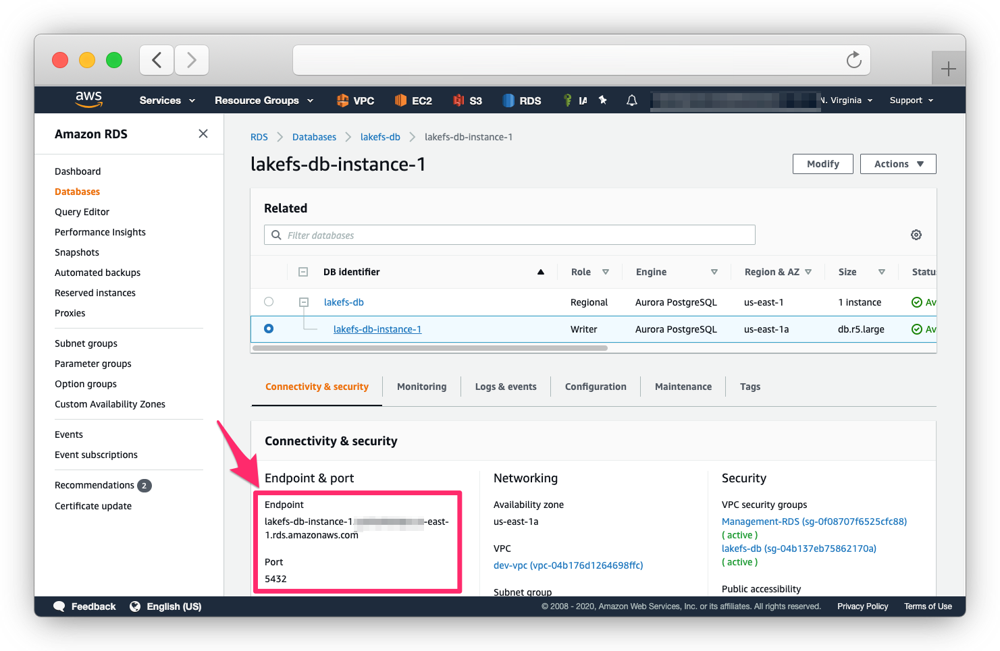

# Creating the database

Before installing lakeFS, you need to have a PostgreSQL database. 
In this guide we show you how to set it up on AWS RDS, but you can use a different database as long as its accessible by your lakeFS installation.

## On RDS

1. Follow the official [AWS documentation](https://docs.aws.amazon.com/AmazonRDS/latest/UserGuide/CHAP_GettingStarted.CreatingConnecting.PostgreSQL.html){: target="_blank" } on how to create a PostgreSQL instance and connect to it.  
You may use the default PostgreSQL engine, or [Aurora PostgreSQL](https://docs.aws.amazon.com/AmazonRDS/latest/AuroraUserGuide/Aurora.AuroraPostgreSQL.html){: target="_blank" }. Make sure you're using PostgreSQL version >= 11.
2. Once your RDS is set up and the server is in `Available` state, take note of the endpoint and port.

   

3. Make sure your security group rules allow you to connect to the database instance. 
 
