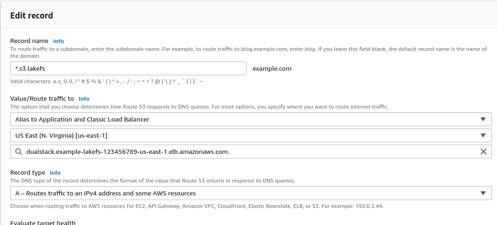

## Load balancing
Depending on how you chose to install lakeFS, you should have a load balancer direct requests to the lakeFS server.  
By default, lakeFS operates on port 8000, and exposes a `/_health` endpoint which you can use for health checks.

### Notes for using an AWS Application Load Balancer

1. Your security groups should allow the load balancer to access the lakeFS server.
1. Create a target group with a listener for port 8000.
1. Setup TLS termination using the domain names you wish to use for both endpoints (i.e. `s3.lakefs.example.com`, `*.s3.lakefs.example.com`, `lakefs.example.com`).
1. Configure the health-check to use the exposed `/_health` URL

## DNS

You should create 3 DNS records for lakeFS:
1. One record for the lakeFS API: `lakefs.example.com`
1. Two records for the S3-compatible API: `s3.lakefs.example.com` and `*.s3.lakefs.example.com`.

All records should point to your Load Balancer.
For an AWS load balancer with Route53 DNS, create a simple record, and choose *Alias to Application and Classic Load Balancer* with an `A` record type.

For other DNS providers, refer to the documentation on how to add CNAME records.

In this case, it's recommended to use a short TTL value.

 
