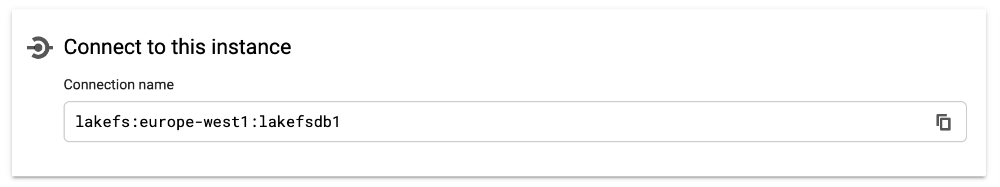

# Creating the database
{: .no_toc }

Before installing lakeFS, you need to have a PostgreSQL database. 
In this guide we show you how to set it up on AWS RDS, Google Cloud SQL, but you can use a different database as long as it's accessible by your lakeFS installation.

## Table of contents
{: .no_toc .text-delta }
{:toc}

## AWS RDS

1. Follow the official [AWS documentation](https://docs.aws.amazon.com/AmazonRDS/latest/UserGuide/CHAP_GettingStarted.CreatingConnecting.PostgreSQL.html){: target="_blank" } on how to create a PostgreSQL instance and connect to it.  
You may use the default PostgreSQL engine, or [Aurora PostgreSQL](https://docs.aws.amazon.com/AmazonRDS/latest/AuroraUserGuide/Aurora.AuroraPostgreSQL.html){: target="_blank" }. Make sure you're using PostgreSQL version >= 11.
2. Once your RDS is set up and the server is in `Available` state, take note of the endpoint and port.

   

3. Make sure your security group rules allow you to connect to the database instance. 
 

## Google Cloud SQL

1. Follow the official [Google documentation](https://cloud.google.com/sql/docs/postgres/create-instance){: target="_blank" } on Creating a PostgreSQL instance.
Make sure you're using PostgreSQL version >= 11.
2. Take a note of the 'Connection name'
	
3. Depends on how you manage your Identity and Access Management [IAM](https://cloud.google.com/sql/docs/postgres/project-access-control) lakeFS service account will require 'Cloud SQL Editor' permissions to the instance.
4. More information on [How to connect to our Cloud SQL instance](https://cloud.google.com/sql/docs/postgres/connect-overview)