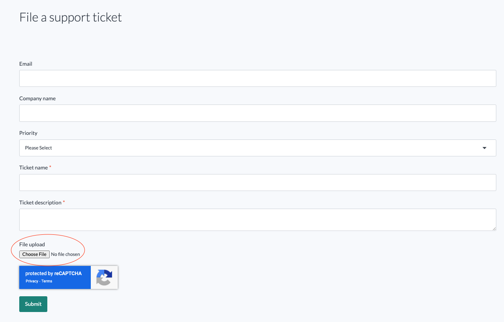
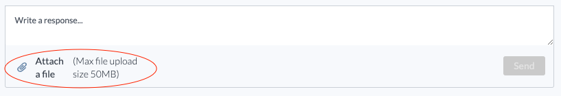

# Troubleshooting lakeFS Enterprise



A lakeFS Enterprise deployment has multiple moving parts that must all be deployed and configured correctly. This is especially true during initial setup. To help troubleshoot issues, both lakeFS and fluffy include the `flare` command.

## The `flare` command

#### Synopsis

Both `lakefs` and `fluffy` include the flare command

```
lakefs flare [flags]
fluffy flare [flags]
```

#### Flags
{:.no_toc}

```
        --env-var-filename      the name of the file environment variables will be written to (default: lakefs-env.txt)
        --include-env-vars      should environment variables be collected by flare (default: true)
    -o, --output                Output path relative to the current path
    -p, --package               Package generated artifacts into a .zip file (default: false)
        --stdout                Output to stdout instead of files (default: false)
        --zip-filename          The name of the zip file created when the -p option is used (default: lakefs-flare.zip)
```

#### Example Usage
{:.no_toc}

```shell
# This will run flare with output set to stdout, which is redirected into a file
$ ./lakefs flare --stdout > lakefs.flare
# The same works for fluffy
$ ./fluffy flare --stdout > fluffy.flare
```

## What Information Does the `flare` Command Collect?

### Configuration

Both lakeFS and fluffy allow configuration to be supplied in multiple ways: configuration file, environment variables, `.env` files, and command flags. The `flare` command collects the fully resolved final configuration used by the lakeFS/fluffy process.

### Environment Variables

When troubleshooting, it's important to get a view of the environment in which lakeFS/fluffy are running. This is especially true for container-based deployment environments, like Kubernetes, where env vars are used extensively. The `flare` command collects environment variables with the following prefixes:

- `LAKEFS_`
- `FLUFFY_`
- `HTTP_`
- `HOSTNAME`

### Sanitization and Secret Redaction

Both configuration and env var include sensitive secrets. The `flare` command has a multi-step process for redacting secrets from what it collects. The `flare` command is able to detect the following types of secrets:

- AWS static credentials
- Azure storage keys
- Basic HTTP auth username/password
- JWTs
- Bearer auth headers
- GitHub tokens
- Certificate private keys

Aside from the specific secret type listed above, `flare` also has the ability to detect and redact generic high-entropy strings, which are likely to be secrets.

Redacted secrets are replaced by a `SHA512` hash of the value. This allows comparing them (e.g., between lakeFS and fluffy) without exposing the actual values.


## Usage - Collect and Send Flare

The following script is intended to be run locally and assumes that lakeFS and fluffy are deployed to a Kubernetes cluster, since this is the recommended setup.  
Running this script requires that `kubectl` be installed on the machine it is being run from and that `kubectl` is configured with the correct context and credentials to access the cluster. Aside from running the `flare` command on both lakeFS and fluffy, this script also fetches the logs from all running pods of lakeFS and fluffy.

### Step 1 - Set Script Variables

At the top of the script you'll find the `Variables` block. It is important to change these values according to how lakeFS is deployed in your cluster.  

`NAMESPACE` - The K8s namespace where lakeFS and fluffy are deployed  
`LAKEFS_DEPLOYMENT` - The name of the lakeFS K8s deployment  
`FLUFFY_DEPLOYMENT` - The name of the fluffy K8s deployment  
`LAKEFS_LOGS_OUTPUT_FILE` - The name of the local file where lakeFS logs will be saved  
`FLUFFY_LOGS_OUTPUT_FILE` - The name of the local file where fluffy logs will be saved  
`LAKEFS_FLARE_FILE` - The name of the local file where the lakeFS `flare` result will be saved  
`FLUFFY_FLARE_FILE` - The name of the local file where the fluffy `flare` result will be saved  

### Step 2 - Execute the Script

```shell
#!/bin/bash

RED='\033[0;31m'
NC='\033[0m'

# Variables
NAMESPACE=lakefs-prod
LAKEFS_DEPLOYMENT=lakefs-server
FLUFFY_DEPLOYMENT=lakefs-fluffy
LAKEFS_LOGS_OUTPUT_FILE=lakefs.log
FLUFFY_LOGS_OUTPUT_FILE=fluffy.log
LAKEFS_FLARE_FILE=lakefs.flare
FLUFFY_FLARE_FILE=fluffy.flare

# Find kubectl
KUBECTLCMD=$(which kubectl)
if [ -z "$KUBECTLCMD" ]
then
    echo -e "${RED}Couldn't find kubectl in path${NC}"
    exit 1
fi

$KUBECTLCMD get pods -o name -n $NAMESPACE | grep pod/$LAKEFS_DEPLOYMENT | xargs -I {} $KUBECTLCMD logs -n $NAMESPACE --all-containers=true --prefix --ignore-errors --timestamps {} > $LAKEFS_LOGS_OUTPUT_FILE
$KUBECTLCMD get pods -o name -n $NAMESPACE | grep pod/$FLUFFY_DEPLOYMENT | xargs -I {} $KUBECTLCMD logs -n $NAMESPACE --all-containers=true --prefix --ignore-errors --timestamps {} > $FLUFFY_LOGS_OUTPUT_FILE

$KUBECTLCMD exec deployment/$LAKEFS_DEPLOYMENT -- ./lakefs flare --stdout > $LAKEFS_FLARE_FILE
$KUBECTLCMD exec deployment/$FLUFFY_DEPLOYMENT -- ./lakefs flare --stdout > $FLUFFY_FLARE_FILE
```

### Step 3 - Inspect the Output Files

After executing the script you should have four files: lakeFS/fluffy logs and lakeFS/fluffy flare output. Before sharing these files, please review them to make sure all secrets were correctly redacted and that all the collected information is shareable.

### Step 4 - Zip Output Files and Attach to HubSpot Ticket

Once you're done inspecting the files, you can zip them into a single file and attach it to a HubSpot issue.

#### New Ticket

When filing a new ticket, you can attach the zip file using the file upload input at the bottom of the new ticket form.



#### Existing Ticket

To add a file to an existing ticket, click the ticket subject in the support portal. On the ticket details attach a file as a new response. You can also add text to the response, if you'd like to add further details.


