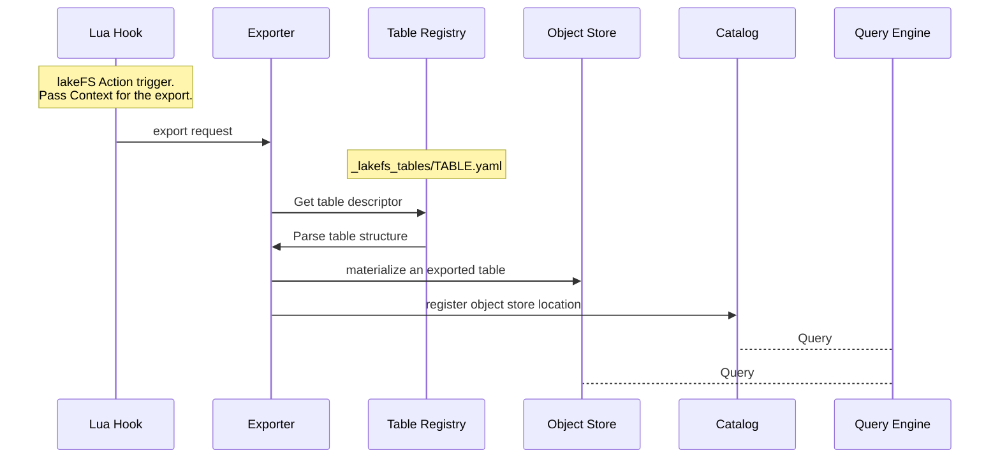

# Data Catalogs Export



## About Data Catalogs Export

Data Catalog Export is all about integrating query engines (like Spark, AWS Athena, Presto, etc.) with lakeFS.

Data Catalogs (such as Hive Metastore or AWS Glue) store metadata for services (such as Spark, Trino and Athena). They contain metadata such as the location of the table, information about columns, partitions and much more.

With Data Catalog Exports, one can leverage the versioning capabilities of lakeFS in external data warehouses and query engines to access tables with branches and commits. 

At the end of this guide, you will be able to query lakeFS data from Athena, Trino and other catalog-dependent tools:

```sql
USE main;
USE my_branch; -- any branch
USE v101; -- or tag

SELECT * FROM users 
INNER JOIN events 
ON users.id = events.user_id; -- SQL stays the same, branch or tag exist as schema
```

## How it works 

Several well known formats exist today let you export existing tables in lakeFS into a "native" object store representation
which does not require copying the data outside of lakeFS.

These are metadata representations and can be applied automatically through hooks.

### Table Decleration 

After creating a lakeFS repository, configure tables as table descriptor objects on the repository on the path `_lakefs_tables/TABLE.yaml`.
Note: the Glue exporter can currently only export tables of `type: hive`.  We expect to add more.

#### Hive tables

Hive metadata server tables are essentially just a set of objects that share a prefix, with no table metadata stored on the object store.  You need to configure prefix, partitions, and schema.

```yaml
name: animals
type: hive
path: path/to/animals/
partition_columns: ['year']
schema:
  type: struct
  fields:
    - name: year
      type: integer
      nullable: false
      metadata: {}
    - name: page
      type: string
      nullable: false
      metadata: {}
    - name: site
      type: string
      nullable: true
      metadata:
        comment: a comment about this column
```

Useful types recognized by Hive include `integer`, `long`, `short`, `string`, `double`, `float`, `date`, and `timestamp`.
{: .note }

### Catalog Exporters 

Exporters are code packages accessible through [Lua integration](#lua-library-reference). Each exporter is exposed as a Lua function under the package namespace `lakefs/catalogexport`.  Call them from hooks to connect lakeFS tables to various catalogs.

#### Currently supported exporters

| Exporter                                 | Description                                                                                                                                                                                                                                                                                                                                                                               | Notes                                                                                                                                                                |
|:-----------------------------------------|:------------------------------------------------------------------------------------------------------------------------------------------------------------------------------------------------------------------------------------------------------------------------------------------------------------------------------------------------------------------------------------------|:---------------------------------------------------------------------------------------------------------------------------------------------------------------------|
| **Symlink exporter**                     | Writes metadata for the table using Hive's [SymlinkTextInputFormat](https://svn.apache.org/repos/infra/websites/production/hive/content/javadocs/r2.1.1/api/org/apache/hadoop/hive/ql/io/SymlinkTextInputFormat.html)                                                                                                                                                                     |                                                                                                                                                                      |
| **AWS Glue Catalog (+ Athena) exporter** | Creates a table in Glue using Hive's format and updates the location to symlink files (reuses Symlink Exporter).                                                                                                                                                                                                                                                                          | See a step-by-step guide on how to integrate with [Glue Exporter]()                                                         |
| **Delta Lake table exporter**            | Export Delta Lake tables from lakeFS to an external storage                                                                                                                                                                                                                                                                                                                               |                                                                                                                                                                      |
| **Unity Catalog exporter**               | The Unity Catalog exporter serves the purpose of registering a Delta Lake table in Unity Catalog. It operates in conjunction with the Delta Lake exporter. In this workflow, the Delta Lake exporter is utilized to export a Delta Lake table from lakeFS. Subsequently, the obtained result is passed to the Unity Catalog exporter to facilitate its registration within Unity Catalog. | See a step-by-step guide on how to integrate with [Unity Catalog Exporter]()</br>Currently, only AWS S3 storage is supported |

#### Running an Exporter  

Exporters are meant to run as [Lua hooks]().
                                                                                         
Configure the actions trigger by using [events and branches](#action-file-schema).  Of course, you can add additional custom filtering logic to the Lua script if needed.
The default table name when exported is `${repository_id}_${_lakefs_tables/TABLE.md(name field)}_${ref_name}_${short_commit}`.

Example of an action that will be triggered when a `post-commit` event happens in the `export_table` branch.

```yaml
name: Glue Table Exporter
description: export my table to glue  
on:
  post-commit:
    branches: ["export_table"]
hooks:
  - id: my_exporter
    type: lua
    properties:
      # exporter script location
      script_path: "scripts/my_export_script.lua"
      args:
        # table descriptor
        table_source: '_lakefs_tables/my_table.yaml'
```

Tip: Actions can be extended to customize any desired behavior, for example validating branch names since they are part of the table name: 

```yaml
# _lakefs_actions/validate_branch_name.yaml
name: validate-lower-case-branches 
on:
  pre-create-branch:
hooks:
  - id: check_branch_id
    type: lua
    properties:
      script: |
        regexp = require("regexp")
        if not regexp.match("^[a-z0-9\\_\\-]+$", action.branch_id) then
          error("branches must be lower case, invalid branch ID: " .. action.branch_id)
        end
```

### Flow

The following diagram demonstrates what happens when a lakeFS Action triggers runs a lua hook that calls an exporter.


