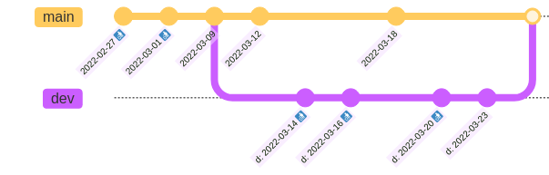

# Garbage Collection
{: .no_toc }

Note: For managed garbage collection on top of a hosted lakeFS service with guaranteed SLAs, try [lakeFS cloud](https://lakefs.cloud)
{: .note }

By default, lakeFS keeps all your objects forever. This allows you to travel back in time to previous versions of your data.
However, sometimes you may want to hard-delete your objects - namely, delete them from the underlying storage. 
Reasons for this include cost-reduction and privacy policies.

Garbage collection rules in lakeFS define for how long to retain objects after they have been deleted (see more information [below](#considerations)).
lakeFS provides a Spark program to hard-delete objects that have been deleted and whose retention period has ended according to the GC rules.
The GC job does not remove any commits: you will still be able to use commits containing hard-deleted objects,
but trying to read these objects from lakeFS will result in a `410 Gone` HTTP status.

**Note**
At this point, lakeFS supports Garbage Collection only on S3 and Azure.  We have [concrete plans](https://github.com/treeverse/lakeFS/issues/3626) to extend the support to GCP.     
{: .note}

1. TOC
{:toc .pb-5 }

## Understanding Garbage Collection

For every branch, the GC job retains deletes objects for the number of days defined for the branch.
In the absence of a branch-specific rule, the default rule for the repository is used.
If an object is present in more than one branch ancestry, it's retained according to the rule with the largest number of days between those branches.
That is, it's hard-deleted only after the retention period has ended for all relevant branches.

Example GC rules for a repository:
```json
{
  "default_retention_days": 14,
  "branches": [
    {"branch_id": "main", "retention_days": 21},
    {"branch_id": "dev", "retention_days": 7}
  ]
}
```

In the above example, objects are retained for 14 days after deletion by default. However, if they are present in the branch `main`, they are retained for 21 days.
Objects present in the `dev` branch (but not in any other branch) are retained for 7 days after they are deleted.

### What gets collected

Because each object in lakeFS may be accessible from multiple branches, it
might not be obvious which objects will be considered garbage and collected.

Garbage collection is configured by specifying the number of days to retain
objects on each branch. If a branch is configured to retain objects for a
given number of days, any object that was accessible from the HEAD of a
branch in that past number of days will be retained.

The garbage collection process proceeds in three main phases:

* **Discover which commits will retain their objects.**  For every branch,
  the garbage collection job looks at the HEAD of the branch that many days
  ago; every commit at or since that HEAD must be retained.

  
  
  Continuing the example, branch `main` retains for 21 days and branch `dev`
  for 7. When running GC on 2022-03-31:

  - 7 days ago, on 2022-03-24 the head of branch `dev` was `d:
    2022-03-23`. So, that commit is retained (along with all more recent
    commits on `dev`) but all older commits `d: *` will be collected.
  - 21 days ago, on 2022-03-10, the head of branch `main` was
    `2022-03-09`. So that commit is retained (along with all more recent
    commits on `main`) but commits `2022-02-27` and `2022-03-01` will be
    collected.

* **Discover which objects need to be garbage collected.** Hold (_only_)
  objects accessible on some retained commits.

  In the example, all objects of commit `2022-03-12`, for instance, are
  retained. This _includes_ objects added in previous commits. However,
  objects added in commit `d: 2022-03-14` which were overwritten or
  deleted in commit `d: 2022-03-20` are not visible in any retained commit
  and will be garbage collected.
  
* **Garbage collect those objects by deleting them.** The data of any
  deleted object will no longer be accessible. lakeFS retains all metadata
  about the object, but attempting to read it via the lakeFS API or the S3
  gateway will return HTTP status 410 ("Gone").

### What does _not_ get collected

Some objects will _not_ be collected regardless of configured GC rules:
* Any object that is accessible from any branch's HEAD.
* Objects stored outside the repository's [storage namespace](../understand/glossary.md#storage-namespace).
  For example, objects imported using the lakeFS import UI are not collected.
* Uncommitted objects, see [below](#Beta:-Deleting-uncommitted-objects),

## Configuring GC rules

### Using lakectl
{: .no_toc }

Use the `lakectl` CLI to define the GC rules: 

```bash
cat <<EOT >> example_repo_gc_rules.json
{
  "default_retention_days": 14,
  "branches": [
    {"branch_id": "main", "retention_days": 21},
    {"branch_id": "dev", "retention_days": 7}
  ]
}
EOT

lakectl gc set-config lakefs://example-repo -f example_repo_gc_rules.json 
```

### From the lakeFS UI
{: .no_toc }

1. Navigate to the main page of your repository.
2. Go to _Settings_ -> _Retention_.
3. Click _Edit policy_ and paste your GC rule into the text box as a JSON.
4. Save your changes.


## Running the GC job

The GC job is a Spark program that can be run using `spark-submit` (or using your preferred method of running Spark programs).
The job will hard-delete objects that were deleted and whose retention period has ended according to the GC rules.

First, you'll have to download the lakeFS Spark client Uber-jar. The Uber-jar can be found on a public S3 location:

For Spark 2.4.7: \
http://treeverse-clients-us-east.s3-website-us-east-1.amazonaws.com/lakefs-spark-client-247/${CLIENT_VERSION}/lakefs-spark-client-247-assembly-${CLIENT_VERSION}.jar

For Spark 3.0.1: \
http://treeverse-clients-us-east.s3-website-us-east-1.amazonaws.com/lakefs-spark-client-301/${CLIENT_VERSION}/lakefs-spark-client-301-assembly-${CLIENT_VERSION}.jar

`CLIENT_VERSION`s for Spark 2.4.7 can be found [here](https://mvnrepository.com/artifact/io.lakefs/lakefs-spark-client-247), and for Spark 3.0.1 they can be found [here](https://mvnrepository.com/artifact/io.lakefs/lakefs-spark-client-301).

Running instructions:

<div class="tabs">
  <ul>
    <li><a href="#aws-option">On AWS</a></li>
	<li><a href="#azure-option">On Azure</a></li>
  </ul>
  <div markdown="1" id="aws-option">
You should specify the Uber-jar path instead of `<APPLICATION-JAR-PATH>` and run the following command to make the garbage collector start running:

  ```bash
spark-submit --class io.treeverse.clients.GarbageCollector \
  --packages org.apache.hadoop:hadoop-aws:2.7.7 \
  -c spark.hadoop.lakefs.api.url=https://lakefs.example.com:8000/api/v1  \
  -c spark.hadoop.lakefs.api.access_key=<LAKEFS_ACCESS_KEY> \
  -c spark.hadoop.lakefs.api.secret_key=<LAKEFS_SECRET_KEY> \
  -c spark.hadoop.fs.s3a.access.key=<S3_ACCESS_KEY> \
  -c spark.hadoop.fs.s3a.secret.key=<S3_SECRET_KEY> \
  <APPLICATION-JAR-PATH> \
  example-repo us-east-1
  ```
  </div>

  <div markdown="1" id="azure-option">
You should run the following command to make the garbage collector start running:

  ```bash
spark-submit --class io.treeverse.clients.GarbageCollector \
  --packages org.apache.hadoop:hadoop-aws:3.2.1 \
  -c spark.hadoop.lakefs.api.url=https://lakefs.example.com:8000/api/v1  \
  -c spark.hadoop.lakefs.api.access_key=<LAKEFS_ACCESS_KEY> \
  -c spark.hadoop.lakefs.api.secret_key=<LAKEFS_SECRET_KEY> \
  -c spark.hadoop.fs.azure.account.key.<AZURE_STORAGE_ACCOUNT>.dfs.core.windows.net=<AZURE_STORAGE_ACCESS_KEY> \
  s3://treeverse-clients-us-east/lakefs-spark-client-312-hadoop3/0.6.1/lakefs-spark-client-312-hadoop3-assembly-0.6.1.jar \
  example-repo
  ```

**Notes:**
* To run GC on Azure, use `lakefs-spark-client-312-hadoop3` only. This client is compiled for Spark 3.1.2 with Hadoop 3.2.1, but may work with other Spark versions and higher Hadoop versions. Specifically, this client was tested on Databricks runtime DBR 11.0 (Spark 3.3.0, 3.3.2).
* GC on Azure is supported from Spark client version >= v0.2.0.
* In case you don't have `hadoop-azure` package as part of your environment, you should add the package to your spark-submit with `--packages org.apache.hadoop:hadoop-azure:3.2.1`
* For GC to work on Azure blob, [soft delete](https://docs.microsoft.com/en-us/azure/storage/blobs/soft-delete-blob-overview) should be disabled.
  
</div>

The list of expired objects is written in Parquet format in the storage
namespace of the bucket under `_lakefs/retention/gc/addresses/mark_id=MARK_ID`, where MARK_ID identifies the run.

**Note:** if you are running lakeFS Spark client of version < v0.4.0, this file is located under `_lakefs/retention/gc/addresses/run_id=RUN_ID`,
where RUN_ID identifies the run. 

### GC job options

By default, GC first creates a list of expired objects according to your retention rules and then hard-deletes those objects. 
However, you can use GC options to break the GC job down into two stages: 
1. Mark stage: GC will mark the expired objects to hard-delete, **without** deleting them. 
2. Sweep stage: GC will hard-delete objects marked by a previous mark-only GC run. 

By breaking GC into these stages, you can pause and create a backup of the objects that GC is about to sweep and later 
restore them. You can use the [GC backup and restore](#gc-backup-and-restore) utility to do that.   

#### Mark only mode 

To make GC run the mark stage only, add the following properties to your spark-submit command:
```properties
spark.hadoop.lakefs.gc.do_sweep=false
spark.hadoop.lakefs.gc.mark_id=<MARK_ID> # Replace <MARK_ID> with your own identification string. This MARK_ID will enable you to start a sweep (actual deletion) run later
```
Running in mark only mode, GC will write the addresses of the expired objects to delete to the following location: `STORAGE_NAMESPACE/_lakefs/retention/gc/addresses/mark_id=<MARK_ID>/` as a parquet.

**Notes:** 
* Mark only mode is only available from v0.4.0 of lakeFS Spark client.
* The `spark.hadoop.lakefs.debug.gc.no_delete` property has been deprecated with v0.4.0.

#### Sweep only mode

To make GC run the sweep stage only, add the following properties to your spark-submit command:
```properties
spark.hadoop.lakefs.gc.do_mark=false
spark.hadoop.lakefs.gc.mark_id=<MARK_ID> # Replace <MARK_ID> with the identifier you used on a previous mark-only run
```
Running in sweep only mode, GC will hard-delete the expired objects marked by a mark-only run and listed in: `STORAGE_NAMESPACE/_lakefs/retention/gc/addresses/mark_id=<MARK_ID>/`.

**Note:** Mark only mode is only available from v0.4.0 of lakeFS Spark client.

#### Performance

Garbage collection reads many commits.  It uses Spark to spread the load of
reading the contents of all of these commits.  For very large jobs running
on very large clusters, you may want to tweak this load.  To do this:

* Add `-c spark.hadoop.lakefs.gc.range.num_partitions=RANGE_PARTITIONS`
  (default 50) to spread the initial load of reading commits across more
  Spark executors.
* Add `-c spark.hadoop.lakefs.gc.address.num_partitions=RANGE_PARTITIONS`
  (default 200) to spread the load of reading all objects included in a
  commit across more Spark executors.

Normally this should not be needed.

#### Networking

Garbage collection communicates with the lakeFS server.  Very large
repositories may require increasing a read timeout.  If you run into timeout errors during communication from the Spark job to lakefs consider increasing these timeouts:

* Add `-c spark.hadoop.lakefs.api.read.timeout_seconds=TIMEOUT_IN_SECONDS`
  (default 10) to allow lakeFS more time to respond to requests.
* Add `-c
  spark.hadoop.lakefs.api.connection.timeout_seconds=TIMEOUT_IN_SECONDS`
  (default 10) to wait longer for lakeFS to accept connections.

## Considerations

1. In order for an object to be hard-deleted, it must be deleted from all branches.
   You should remove stale branches to prevent them from retaining old objects.
   For example, consider a branch that has been merged to `main` and has become stale.
   An object which is later deleted from `main` will always be present in the stale branch, preventing it from being hard-deleted.

1. lakeFS will never delete objects outside your repository's storage namespace.
   In particular, objects that were imported using `lakectl ingest` or `UI Import Wizard` will not be affected by GC jobs.

1. In cases where deleted objects are brought back to life while a GC job is running, said objects may or may not be
   deleted. Such actions include:
   1. Reverting a commit in which a file was deleted.
   1. Branching out from an old commit.
   1. Expanding the retention period of a branch.
   1. Creating a branch from an existing branch, where the new branch has a longer retention period.

## GC backup and restore 

GC was created to hard-delete objects from your underlying objects store according to your retention rules. However, when you start
using the feature you may want to first gain confidence in the decisions GC makes. The GC backup and restore utility helps you do that. 

**Use-cases:**
* Backup: copy expired objects from your repository's storage namespace to an external location before running GC in [sweep only mode](#sweep-only-mode).  
* Restore: copy objects that were hard-deleted by GC from an external location you used for saving your backup into your repository's storage namespace.

### Using rclone

Follow [rclone documentation](https://rclone.org/docs/) to configure remote access to the underlying storage used by lakeFS.
Replace `LAKEFS_STORAGE_NAMESPACE` with remote:bucket/path which points to the lakeFS repository storage namespace.
The `BACKUP_STORAGE_LOCATION` attribute points to a storage location outside your lakeFS storage namespace into which you want to save the backup.

#### Backup command

```shell
rclone --include "*.txt" cat "<LAKEFS_STORAGE_NAMESPACE>/_lakefs/retention/gc/addresses.text/mark_id=<MARK_ID>/" | \
  rclone -P --no-traverse --files-from - copy <LAKEFS_STORAGE_NAMESPACE> <BACKUP_STORAGE_LOCATION>
```

#### Restore command

```shell
rclone --include "*.txt" cat "<LAKEFS_STORAGE_NAMESPACE>/_lakefs/retention/gc/addresses.text/mark_id=<MARK_ID>/" | \
  rclone -P --no-traverse --files-from - copy <BACKUP_STORAGE_LOCATION> <LAKEFS_STORAGE_NAMESPACE>
```

#### Example

The following of commands used to backup/resource a configured remote 'azure' (Azure blob storage) to access example repository storange namespace `https://lakefs.blob.core.windows.net/repo/example/`:

```shell
# Backup
rclone --include "*.txt" cat "azure://repo/example/_lakefs/retention/gc/addresses.text/mark_id=a64d1885-6202-431f-a0a3-8832e4a5865a/" | \
  rclone -P --no-traverse --files-from - copy azure://repo/example/ azure://backup/repo-example/

# Restore
rclone --include "*.txt" cat "azure://tal/azure-br/_lakefs/retention/gc/addresses.text/mark_id=a64d1885-6202-431f-a0a3-8832e4a5865a/" | \
  rclone -P --no-traverse --files-from - copy azure://backup/repo-example/ azure://repo/example/
```


### Using DistCp

This utility is a Spark application that uses [DistCp](https://hadoop.apache.org/docs/current/hadoop-distcp/DistCp.html) under the hood to copy objects marked by GC as expired from one location to another. 

**Notes**
* GC Backup & Restore job using DistCp is [broken](https://github.com/treeverse/lakeFS/issues/4775) due to changes in the storage namespace structure relevant to lakeFS >= v0.84.0.  We're working to fix it. 
* There has been a change in the storage namespace structure relevant to lakeFS >= v0.84.0, which causes the [GC Backup & Restore job to break](https://github.com/treeverse/lakeFS/issues/4775).  Currently, we are working on a fix. 
* GC Backup & Restore is available from version 0.5.2 of lakeFS Spark client.
* It is compatible with Hadoop API versions 3.1.3 and higher.
* Note that the utility is not fast due to DistCp performance limitations. You may prefer to backup your whole storage namespace with [AzCopy](https://learn.microsoft.com/en-us/azure/storage/common/storage-use-azcopy-v10) / [aws cp](https://docs.aws.amazon.com/cli/latest/reference/s3/cp.html) / [rclone](https://docs.lakefs.io/howto/copying.html#using-rclone).

#### Job options
{: .no_toc }

**Enabled by default**

 - `-v`, to log additional info (path, size) in the SKIP/COPY log
 - `-direct` to write directly to destination paths, recommended when the destination is an object store
 - `-strategy=dynamic` to accelerate DistCp performance

**Additional options**

 - `-log`, to configure the log path
 - `-m`, to set the max number of maps
 - `-bandwidth`, to specify bandwidth per map, in MB/second
 - `-numListstatusThreads`, number of threads to use for building file listing, max 40

To configure the properties, set the following Hadoop properties:

```text
spark.hadoop.distcp.log.path
spark.hadoop.distcp.max.maps
spark.hadoop.distcp.map.bandwidth.mb
spark.hadoop.distcp.liststatus.threads 
```

#### Running GC backup and restore
{: .no_toc }

You can run GC backup and restore using `spark-submit` or using your preferred method of running Spark programs. 
Currently, GC backup and restore is available for Spark 3.1.2 and 3.2.1, but it may work for other versions.

First, download the lakeFS Spark client Uber-jar. The Uber-jar can be found on a public S3 location:
`http://treeverse-clients-us-east.s3-website-us-east-1.amazonaws.com/lakefs-spark-client-312-hadoop3/${CLIENT_VERSION}/lakefs-spark-client-312-hadoop3-assembly-${CLIENT_VERSION}.jar`
**Note** GC backup and restore is available from version 0.5.2 of lakeFS Spark client.

Running instructions:

##### Backup job
{: .no_toc }

<div class="tabs">
  <ul>
    <li><a href="#aws-option">On AWS</a></li>
	<li><a href="#azure-option">On Azure</a></li>
  </ul>
  <div markdown="1" id="aws-option">

You should specify the Uber-jar path instead of `<APPLICATION-JAR-PATH>`
Program arguments:
* _location of expired objects list_: the path of an expired objects parquet created by a [mark-only](#mark-only-mode) GC run. given a `MARK_ID` used for a mark-only run this file is located under `STORAGE_NAMESPACE/_lakefs/retention/gc/addresses/mark_id=<MARK_ID>/`.
* _storage namespace_: The storage namespace of the lakeFS repository you are running GC for. The storage namespace includes the data you are backing up.
* _external location for backup_: A storage location outside your lakeFS storage namespace into which you want to save the backup.
* _storage type_: s3

To start the backup process, run:

```bash
spark-submit --class io.treeverse.clients.GCBackupAndRestore \
  --packages org.apache.hadoop:hadoop-aws:3.2.0 \
  -c spark.hadoop.fs.s3a.access.key=<AWS_ACCESS_KEY> \
  -c spark.hadoop.fs.s3a.secret.key=<AWS_SECRET_KEY> \
  <APPLICATION-JAR-PATH> \
  expired-objects-list-location storage-namespace backup-external-location s3 
```
</div>

<div markdown="1" id="azure-option">

You should specify the Uber-jar path instead of `<APPLICATION-JAR-PATH>`
Program arguments:
* _location of expired objects list_: the path of an expired objects parquet created by a [mark-only](#mark-only-mode) GC run. given a `MARK_ID` used for a mark-only run this file is located under `STORAGE_NAMESPACE/_lakefs/retention/gc/addresses/mark_id=<MARK_ID>/`.
* _storage namespace_: The storage namespace of the lakeFS repository you are running GC for. The storage namespace includes the data you are backing up.
* _external location for backup_: A storage location outside your lakeFS storage namespace into which you want to save the backup.
* _storage type_: s3

To start the backup process, run:
```bash
spark-submit --class io.treeverse.clients.GCBackupAndRestore \
  -c spark.hadoop.fs.azure.account.key.<AZURE_STORAGE_ACCOUNT>.dfs.core.windows.net=<AZURE_STORAGE_ACCESS_KEY> \
  <APPLICATION-JAR-PATH> \
  expired-objects-list-location storage-namespace backup-external-location azure
```
</div>


##### Restore job
{: .no_toc }

<div class="tabs">
  <ul>
    <li><a href="#aws-option">On AWS</a></li>
	<li><a href="#azure-option">On Azure</a></li>
  </ul>
  <div markdown="1" id="aws-option">

You should specify the Uber-jar path instead of `<APPLICATION-JAR-PATH>`
Program arguments:
* _location of objects to restore list_: the path for a list of object that were hard-deleted by a [sweep-only](#sweep-only-mode) GC run. given a `MARK_ID` used for a sweep only run the file is located under `STORAGE_NAMESPACE/_lakefs/retention/gc/addresses/mark_id=<MARK_ID>/`.
* _external location to restore from_: A storage location outside your lakeFS storage namespace you used for backup.
* _storage namespace_: The storage namespace of the lakeFS repository you previously ran GC for.
* _storage type_: s3

To start the restore process, run:

```bash
spark-submit --class io.treeverse.clients.GCBackupAndRestore \
 --packages org.apache.hadoop:hadoop-aws:3.2.0 \
  -c spark.hadoop.fs.s3a.access.key=<AWS_ACCESS_KEY> \
  -c spark.hadoop.fs.s3a.secret.key=<AWS_SECRET_KEY> \
  <APPLICATION-JAR-PATH> \
  objects-to-restore-list-location backup-external-location storage-namespace s3 
```
</div>

<div markdown="1" id="azure-option">
You should specify the Uber-jar path instead of `<APPLICATION-JAR-PATH>`
Program arguments:
* _location of objects to restore list_: the path for a list of object that were hard-deleted by a [sweep-only](#sweep-only-mode) GC run. given a `MARK_ID` used for a sweep only run the file is located under `STORAGE_NAMESPACE/_lakefs/retention/gc/addresses/mark_id=<MARK_ID>/`.
* _external location to restore from_: A storage location outside your lakeFS storage namespace you used for backup.
* _storage namespace_: The storage namespace of the lakeFS repository you previously ran GC for.
* _storage type_: azure

To start the restore process, run:

```bash
spark-submit --class io.treeverse.clients.GCBackupAndRestore \
  -c spark.hadoop.fs.azure.account.key.<AZURE_STORAGE_ACCOUNT>.dfs.core.windows.net=<AZURE_STORAGE_ACCESS_KEY> \
  <APPLICATION-JAR-PATH> \
  objects-to-restore-list-location backup-external-location storage-namespace azure
```
</div>

## Beta: Deleting uncommitted objects

Note: Uncommitted GC is in Beta mode. Users should read this manual carefully and 
take precautions before applying the actual delete ("sweep"), like copying the marked objects.
{: .note }

Deletion of objects that were never committed was always a difficulty for lakeFS, see
[#1933](https://github.com/treeverse/lakeFS/issues/1933) for more details. Examples for 
objects that will be collected as part of the uncommitted GC job:
1. Objects that were uploaded to lakeFS and deleted.
2. Objects that were uploaded to lakeFS and were overridden.

While we tried to make the uncommitted GC a server-only solution, we couldn't find a sustainable way to achieve that.
See discussion on the original [design PR](https://github.com/treeverse/lakeFS/pull/4015). 
{: .note}

The uncommitted GC will not clean:
1. Committed objects. For committed objects cleanup see [above](#what-gets-collected)
2. Everything mentioned in [what does not get collected](#what-does-_not_-get-collected)

### Prerequisites
{: .no_toc }

1. lakeFS server version must be at least [v0.87.0](https://github.com/treeverse/lakeFS/releases/tag/v0.87.0). 
If your version is lower, you should first upgrade.
2. Read the [limitations](#limitations) section.
3. Setup [rclone](https://rclone.org/) to access underlying bucket for backup and restore.


### Running the uncommitted GC 

1. Mark the files to delete - summary and report will be generated under `<REPOSITORY_STORAGE_NAMESPACE>/_lakefs/retention/gc/uncommitted/<MARK_ID>/`.
   By listing the bucket under 'uncommitted' the last entry represents the last mark ID of the uncommitted GC.
   The GC job prints out "Report for mark_id=..." which includes the mark ID with the run summary.

   ```bash
   spark-submit \
       --conf spark.hadoop.lakefs.gc.do_sweep=false \
       --conf spark.hadoop.lakefs.api.url=<LAKEFS_ENDPOINT> \
       --conf spark.hadoop.fs.s3a.access.key=<AWS_ACCESS_KEY_ID> \
       --conf spark.hadoop.fs.s3a.secret.key=<AWS_SECRET_ACCESS_KEY> \
       --conf spark.hadoop.lakefs.api.access_key=<LAKEFS_ACCESS_KEY_ID> \
       --conf spark.hadoop.lakefs.api.secret_key=<LAKEFS_SECRET_ACCESS_KEY> \
       --class io.treeverse.gc.UncommittedGarbageCollector \
       --packages org.apache.hadoop:hadoop-aws:2.7.7 \
       <APPLICATION-JAR-PATH> <REPOSITORY_NAME> <REGION>
   ```

2. Backup (optional but recommended) - when you start using the feature you may want to first gain confidence in the decisions uncommitted GC makes. Backup will copy the objects marked to be deleted for run ID to a specified location.
   Follow [rclone documentation](https://rclone.org/docs/) to configure remote access to lakeFS storage.
   Note that the lakeFS and backup locations are specified as `remote:path` based on how rclone was configured.

   ```shell
   rclone --include "*.txt" cat "<LAKEFS_STORAGE_NAMESPACE>/_lakefs/retention/gc/uncommitted/<MARK_ID>/deleted.text/" | \
     rclone -P --no-traverse --files-from - copy <LAKEFS_STORAGE_NAMESPACE> <BACKUP_STORAGE_LOCATION>
   ```

4. Sweep - delete reported objects to delete based on mark ID

   ```bash
   spark-submit \
       --conf spark.hadoop.lakefs.gc.mark_id=<MARK_ID> \
       --conf spark.hadoop.lakefs.gc.do_mark=false \
       --conf spark.hadoop.lakefs.api.url=<LAKEFS_ENDPOINT> \
       --conf spark.hadoop.fs.s3a.access.key=<AWS_ACCESS_KEY_ID> \
       --conf spark.hadoop.fs.s3a.secret.key=<AWS_SECRET_ACCESS_KEY> \
       --conf spark.hadoop.lakefs.api.access_key=<LAKEFS_ACCESS_KEY_ID> \
       --conf spark.hadoop.lakefs.api.secret_key=<LAKEFS_SECRET_ACCESS_KEY> \
       --class io.treeverse.gc.UncommittedGarbageCollector \
       --packages org.apache.hadoop:hadoop-aws:2.7.7 \
       <APPLICATION-JAR-PATH> <REPOSITORY_NAME> <REGION>
   ```

5. Restore - in any case we would like to undo and restore the data from from our backup. The following command will copy the objects back from the backup location using the information stored under the specific mark ID.
   Note that the lakeFS and backup locations are specified as `remote:path` based on how rclone was configured.

   ```shell
   rclone --include "*.txt" cat "remote:<LAKEFS_STORAGE_NAMESPACE>/_lakefs/retention/gc/uncommitted/<MARK_ID>/deleted.text/" | \
     rclone -P --no-traverse --files-from - copy <BACKUP_STORAGE_LOCATION> <LAKEFS_STORAGE_NAMESPACE>
   ```


#### Uncommitted GC job options
{: .no_toc }

Similar to the described [above](#gc-job-options).

#### Limitations
{: .no_toc }

The uncommitted GC job has several limitations in its Beta version: 
1. No writes to lakeFS during the execution of the job. Objects written to lakeFS
during the job run may or may not be detected by the job. It can lead to unexpected behaviour 
including the deletion of newly written data. Avoid any write operation while the job is 
running, like `UploadObject`, `CopyObject`, `StageObject`, `LinkPhysicalAddress` or 
any other non-read operation.
2. Support is limited to S3 repositories, it was not tested on ABS, GS or MinIO.
3. Scale may be limited, see performance results below.

#### Next steps
{: .no_toc }

The uncommitted GC is under development, next releases will include:

1. Incorporation of committed & uncommitted GC into a single job. We understand the friction
of having 2 garbage collection jobs for a lakeFS installation and working to creating a
single job for it.
2. Removing the limitation of a read-only lakeFS during the job run.
3. Performance improvements: 
   1. Better parallelization of the storage namespace traversal.
   2. Optimized Run: GC will only iterate over objects that were written to the
repository since the last GC run. For more information see the [proposal](https://github.com/treeverse/lakeFS/blob/master/design/accepted/gc_plus/uncommitted-gc.md#flow-2-optimized-run).
4. Backup & Restore, similar to [committed data](#gc-backup-and-restore).
5. Support for non-S3 repositories.

#### Performance
{: .no_toc }

The uncommitted GC job was tested on a repository with 1K branches, 
25K uncommitted objects and 2K commits.
The storage namespace number of objects prior to the cleanup was 103K objects.
The job ran on a Spark cluster with a single master and 2 workers of type [i3.2xlarge](https://aws.amazon.com/ec2/instance-types/i3/) 
The job finished after 5 minutes deleting 15K objects.

