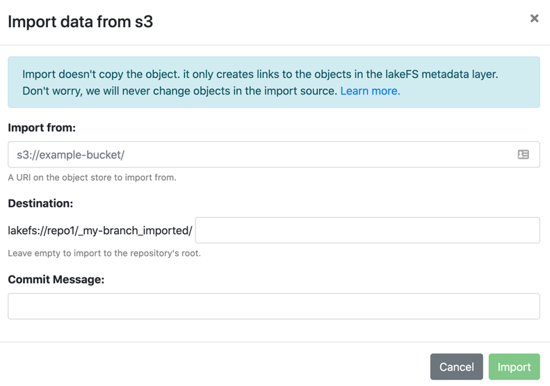

# Import data into lakeFS
{: .no_toc }


The simplest way to bring data into lakeFS is by [copying it](#copying-data-into-a-lakefs-repository), but this approach may not be suitable when a lot of data is involved.
To avoid copying the data, lakeFS offers [Zero-copy import](#zero-copy-import). With this approach, lakeFS only creates pointers to your existing objects in your new repository.



## Zero-copy import

### Prerequisites

#### User Permissions

To run import you need the following permissions:
`fs:WriteObject`, `fs:CreateMetaRange`, `fs:CreateCommit`, `fs:ImportFromStorage` and `fs:ImportCancel`. 
The first 3 permissions are available by default to users in the default Developers group ([RBAC](../reference/rbac.md)) or the 
Writers group ([ACL](../reference/access-control-lists.md)). The `Import*` permissions enable the user to import data from any location of the storage 
provider that lakeFS has access to and cancel the operation if needed. 
Thus, it's only available to users in group Supers ([ACL](../reference/access-control-lists.md)) or SuperUsers([RBAC](../reference/rbac.md)).
RBAC installations can modify policies to add that permission to any group, such as Developers.


#### lakeFS Permissions

lakeFS must have permissions to list the objects in the source object store,
and the source bucket must be in the same region of your destination bucket.  
In addition, see the following storage provider specific instructions:

<div class="tabs">
<ul>
  <li><a href="#aws-s3">AWS S3</a></li>
  <li><a href="#azure-storage">Azure Storage</a></li>
  <li><a href="#gcs">Google Cloud Storage</a></li>
</ul>
<div markdown="1" id="aws-s3">


#### AWS S3: Importing from public buckets
{: .no_toc }

lakeFS needs access to the imported location to first list the files to import and later read the files upon users request.

There are some use cases where the user would like to import from a destination which isn't owned by the account running lakeFS.
For example, importing public datasets to experiment with lakeFS and Spark.

lakeFS will require additional permissions to read from public buckets. For example, for S3 public buckets,
the following policy needs to be attached to the lakeFS S3 service-account to allow access to public buckets, while blocking access to other owned buckets:

  ```json
   {
     "Version": "2012-10-17",
     "Statement": [
       {
         "Sid": "PubliclyAccessibleBuckets",
         "Effect": "Allow",
         "Action": [
            "s3:GetBucketVersioning",
            "s3:ListBucket",
            "s3:GetBucketLocation",
            "s3:ListBucketMultipartUploads",
            "s3:ListBucketVersions",
            "s3:GetObject",
            "s3:GetObjectVersion",
            "s3:AbortMultipartUpload",
            "s3:ListMultipartUploadParts"
         ],
         "Resource": ["*"],
         "Condition": {
           "StringNotEquals": {
             "s3:ResourceAccount": "<YourAccountID>"
           }
         }
       }
     ]
   }
   ```

</div>
<div markdown="1" id="azure-storage">
See [Azure deployment](../deploy/azure.md#storage-account-credentials) on limitations when using account credentials.

#### Azure Data Lake Gen2
{: .no_toc }

lakeFS requires a hint in the import source URL to understand that the provided storage account is ADLS Gen2

```
   For source account URL:
      https://<my-account>.core.windows.net/path/to/import/

   Please add the *adls* subdomain to the URL as follows:
      https://<my-account>.adls.core.windows.net/path/to/import/
```

</div>
<div markdown="1" id="gcs">
No specific prerequisites
</div>
</div>

---

### Using the lakeFS UI

To import using the UI, lakeFS must have permissions to list the objects in the source object store.
{: .note }

1. In your repository's main page, click the _Import_ button to open the import dialog:

   

2. Under _Import from_, fill in the location on your object store you would like to import from.
3. Fill in the import destination in lakeFS 
4. Add a commit message, and optionally metadata.

Once the import is complete, the changes are merged into the source branch.

#### Notes
{: .no_toc }

* Import uses the `src-wins` merge strategy. Therefore - import of existing objects nad prefixes in destination will override them.
* The import duration depends on the amount of imported objects, but will roughly be a few thousand objects per second.

### _lakectl import_

Prerequisite: have [lakectl](/reference/cli.html) installed.

The _lakectl import_ command acts the same as the UI import wizard. It commits the changes to a dedicated branch, with an optional
flag to merge the changes to `<branch_name>`.

<div class="tabs">
<ul>
  <li><a href="#import-tabs-1">AWS S3 or S3 API Compatible storage</a></li>
  <li><a href="#import-tabs-2">Azure Blob</a></li>
  <li><a href="#import-tabs-3">Google Cloud Storage</a></li>
</ul>
<div markdown="1" id="import-tabs-1">
```shell
lakectl import \
  --from s3://bucket/optional/prefix/ \
  --to lakefs://my-repo/my-branch/optional/path/
```
</div>
<div markdown="1" id="import-tabs-2">
```shell
lakectl import \
   --from https://storageAccountName.blob.core.windows.net/container/optional/prefix/ \
   --to lakefs://my-repo/my-branch/optional/path/
```
</div>
<div markdown="1" id="import-tabs-3">
```shell
lakectl import \
   --from gs://bucket/optional/prefix/ \
   --to lakefs://my-repo/my-branch/optional/path/
```
</div>
</div>

### Limitations

1. Importing is only possible from the object storage service in which your installation stores its data. For example, if lakeFS is configured to use S3, you cannot import data from Azure.
2. Import is available for S3, GCP and Azure.
3. For security reasons, if you are lakeFS on top of your local disk, you need to enable the import feature explicitly. 
   To do so, set the `blockstore.local.import_enabled` to `true` and specify the allowed import paths in `blockstore.local.allowed_external_prefixes` (see [configuration reference](../reference/configuration.md)).
   Since there are some differences between object-stores and file-systems in the way directories/prefixes are treated, local import is allowed only for directories.

### Working with imported data

Note that lakeFS cannot manage your metadata if you make changes to data in the original bucket.
The following table describes the results of making changes in the original bucket, without importing it to lakeFS:

| Object action in the original bucket | ListObjects result in lakeFS                 | GetObject result in lakeFS |
|--------------------------------------|----------------------------------------------|----------------------------|
| Create                               | Object not visible                           | Object not accessible      |
| Overwrite                            | Object visible with outdated metadata        | Updated object accessible  |
| Delete                               | Object visible                               | Object not accessible      |

## Copying data into a lakeFS repository

Another way of getting existing data into a lakeFS repository is by copying it. This has the advantage of having the objects along with their metadata managed by the lakeFS installation, along with lifecycle rules, immutability guarantees and consistent listing. However, do make sure to account for storage cost and time.

To copy data into lakeFS you can use the following tools:

1. The `lakectl` command line tool - see the [reference](../reference/cli.html#lakectl-fs-upload) to learn more about using it to copy local data into lakeFS. Using `lakectl fs upload --recursive` you can upload multiple objects together from a given directory.
1. Using [rclone](../howto/copying.md#using-rclone)
1. Using Hadoop's [DistCp](../howto/copying.md#using-distcp)
