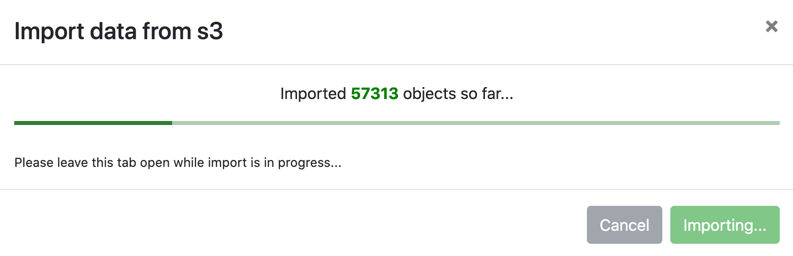
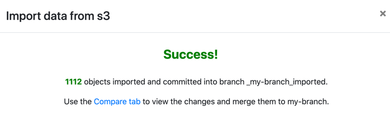

# Import data into lakeFS
{: .no_toc }



## Zero-copy import

### Using the lakeFS UI

To import using the UI, lakeFS must have permissions to list the objects in the source object store.
{: .note }

In your repository's main page, click the _Import_ button to open the import dialog:


On the first import to a branch, a dedicated branch named `_<branch_name>_imported` will be created.
lakeFS will import all objects from _Source URI_ to the import branch under the given prefix.

How long the import takes depends on the amount of imported objects, but will roughly be a few thousand objects per second.



Once the import is completed, you can merge the changes from the import branch to the source branch.



### _lakectl import_

The _import_ command acts the same as the UI import wizard. It commits the changes to a dedicated branch, with an optional
flag to merge the changes to `<branch_name>`.

<div class="tabs">
<ul>
  <li><a href="#import-tabs-1">AWS S3 or S3 API Compatible storage</a></li>
  <li><a href="#import-tabs-2">Azure Blob</a></li>
  <li><a href="#import-tabs-3">Google Cloud Storage</a></li>
</ul>
<div markdown="1" id="import-tabs-1">
```shell
lakectl import \
  --from s3://bucket/optional/prefix/ \
  --to lakefs://my-repo/my-branch/optional/path/
```
</div>
<div markdown="1" id="import-tabs-2">
```shell
lakectl import \
   --from https://storageAccountName.blob.core.windows.net/container/optional/prefix/ \
   --to lakefs://my-repo/my-branch/optional/path/
```
</div>
<div markdown="1" id="import-tabs-3">
```shell
lakectl import \
   --from gs://bucket/optional/prefix/ \
   --to lakefs://my-repo/my-branch/optional/path/
```
</div>
</div>

The imported objects will be committed to the `_my-branch_imported`, creating it if it doesn't exists.
Using the `--merge` flag will merge `_my-branch_imported` to `my-branch` after a successful import.

### _lakectl ingest_

The _ingest_ command adds the objects to lakeFS by listing them on the client side.
The added objects will appear as uncommitted changes.

The user calling `lakectl ingest` needs to have permissions to list the objects in the source object store.
{: .note }

<div class="tabs">
<ul>
  <li><a href="#ingest-tabs-1">AWS S3 or S3 API Compatible storage</a></li>
  <li><a href="#ingest-tabs-2">Azure Blob</a></li>
  <li><a href="#ingest-tabs-3">Google Cloud Storage</a></li>
</ul>
<div markdown="1" id="ingest-tabs-1">
```shell
lakectl ingest \
  --from s3://bucket/optional/prefix/ \
  --to lakefs://my-repo/ingest-branch/optional/path/
```

The `lakectl ingest` command will attempt to use the current user's existing credentials and respect instance profiles,
environment variables, and credential files ([similarly to AWS CLI](https://docs.aws.amazon.com/cli/latest/userguide/cli-configure-quickstart.html){: target="_blank" })
Specify an endpoint to ingest from other S3 compatible storage solutions, e.g., add `--s3-endpoint-url https://play.min.io`.
</div>
<div markdown="1" id="ingest-tabs-2">
```shell
export AZURE_STORAGE_ACCOUNT="storageAccountName"
export AZURE_STORAGE_ACCESS_KEY="EXAMPLEroozoo2gaec9fooTieWah6Oshai5Sheofievohthapob0aidee5Shaekahw7loo1aishoonuuquahr3=="
lakectl ingest \
   --from https://storageAccountName.blob.core.windows.net/container/optional/prefix/ \
   --to lakefs://my-repo/ingest-branch/optional/path/
```

The `lakectl ingest` command currently supports storage accounts configured through environment variables as shown above.

**Note:** Currently, `lakectl import` supports the `http://` and `https://` schemes for Azure storage URIs. `wasb`, `abfs` or `adls` are currently not supported.
{: .note }
</div>
<div markdown="1" id="ingest-tabs-3">
```shell
export GOOGLE_APPLICATION_CREDENTIALS="$HOME/.gcs_credentials.json"  # Optional, will fallback to the default configured credentials
lakectl ingest \
   --from gs://bucket/optional/prefix/ \
   --to lakefs://my-repo/ingest-branch/optional/path/
```

The `lakectl ingest` command currently supports the standard `GOOGLE_APPLICATION_CREDENTIALS` environment variable [as described in Google Cloud's documentation](https://cloud.google.com/docs/authentication/getting-started).
</div>
</div>


### Limitations

1. Importing is only possible from the object storage service in which your installation stores its data. For example, if lakeFS is configured to use S3, you cannot import data from Azure.
2. Import is available for S3, GCP and Azure.
3. For security reasons, if you are lakeFS on top of your local disk, you need to enable the import feature explicitly. 
   To do so, set the `blockstore.local.import_enabled` to `true` and specify the allowed import paths in `blockstore.local.allowed_external_prefixes` (see [configuration reference](../reference/configuration.md)).
   Since there are some differences between object-stores and file-systems in the way directories/prefixes are treated, local import is allowed only for directories.

### Working with imported data

Note that lakeFS cannot manage your metadata if you make changes to data in the original bucket.
The following table describes the results of making changes in the original bucket, without importing it to lakeFS:

| Object action in the original bucket | ListObjects result in lakeFS                 | GetObject result in lakeFS |
|--------------------------------------|----------------------------------------------|----------------------------|
| Create                               | Object not visible                           | Object not accessible      |
| Overwrite                            | Object visible with outdated metadata        | Updated object accessible  |
| Delete                               | Object visible                               | Object not accessible      |


### AWS S3: Importing from public buckets

lakeFS needs access to the imported location to first list the files to import and later read the files upon users request. 

There are some use cases where the user would like to import from a destination which isn't owned by the account running lakeFS.
For example, importing public datasets to experiment with lakeFS and Spark.

lakeFS will require additional permissions to read from public buckets. For example, for S3 public buckets,
the following policy needs to be attached to the lakeFS S3 service-account to allow access to public buckets, while blocking access to other owned buckets:

  ```json
   {
     "Version": "2012-10-17",
     "Statement": [
       {
         "Sid": "PubliclyAccessibleBuckets",
         "Effect": "Allow",
         "Action": [
            "s3:GetBucketVersioning",
            "s3:ListBucket",
            "s3:GetBucketLocation",
            "s3:ListBucketMultipartUploads",
            "s3:ListBucketVersions",
            "s3:GetObject",
            "s3:GetObjectVersion",
            "s3:AbortMultipartUpload",
            "s3:ListMultipartUploadParts"
         ],
         "Resource": ["*"],
         "Condition": {
           "StringNotEquals": {
             "s3:ResourceAccount": "<YourAccountID>"
           }
         }
       }
     ]
   }
   ```

## Copying data into a lakeFS repository

Another way of getting existing data into a lakeFS repository is by copying it. This has the advantage of having the objects along with their metadata managed by the lakeFS installation, along with lifecycle rules, immutability guarantees and consistent listing. However, do make sure to account for storage cost and time.

To copy data into lakeFS you can use the following tools:

1. The `lakectl` command line tool - see the [reference](../reference/cli#lakectl-fs-upload) to learn more about using it to copy local data into lakeFS. Using `lakectl fs upload --recursive` you can upload multiple objects together from a given directory.
1. Using [rclone](../howto/copying.md#using-rclone)
1. Using Hadoop's [DistCp](../howto/copying.md#using-distcp)
