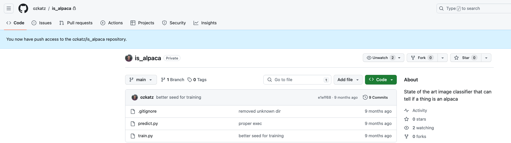
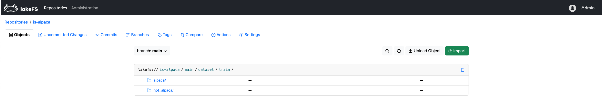
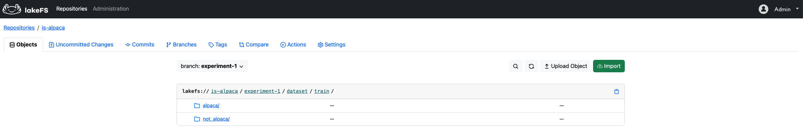
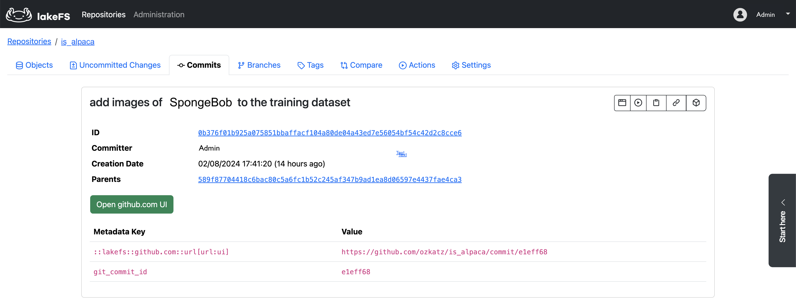
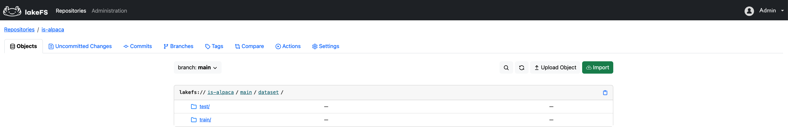

# Working with lakeFS Data Locally

lakeFS is a scalable data version control system designed to scale to billions of objects. The larger the data, the less
feasible it becomes to consume it from a single machine. lakeFS addresses this challenge by enabling efficient management
of large-scale data stored remotely. 

In addition to its capability to manage large datasets, lakeFS offers the flexibility
to work with versioned data by exposing it as a local filesystem directory.  

This page explains [lakeFS Mount](../reference/mount.html) and `lakectl local`: two common ways of exposing lakeFS data locally, with different performance characteristics.  

 

## Use cases 

### Local development of ML models

The development of machine learning models is a dynamic and iterative process, including experimentation with various data versions, 
transformations, algorithms, and hyperparameters. To optimize this iterative workflow, experiments must be conducted with speed, 
ease of tracking, and reproducibility in mind. Localizing the model data during development enhances the development process. 
It **accelerates the development process** by enabling interactive and offline development and reducing data access latency. 


The local availability of data is required to **seamlessly integrate data version control systems and source control systems**
like Git. This integration is vital for achieving model reproducibility, allowing for a more efficient and collaborative 
model development environment.

### Data Locality for Optimized GPU Utilization

Training Deep Learning models requires expensive GPUs. In the context of running such programs, the goal is to optimize
GPU usage and prevent them from sitting idle. Many deep learning tasks involve accessing images, and in some cases, the
same images are accessed multiple times. Localizing the data can eliminate redundant round trip times to access remote 
storage, resulting in cost savings.

<iframe width="420" height="315" src="https://www.youtube.com/embed/afgQnmesLZM"></iframe>

## **lakeFS Mount**: Efficiently expose lakeFS Data as a local directory

⚠️ lakeFS Mount is currently in preview. There is no installation required, please [contact us](https://info.lakefs.io/thanks-lakefs-mounts) to get access.
{: .note }

#### Prerequisites:

- A working lakeFS Server running either [lakeFS Enterprise](../enterprise) or [lakeFS Cloud](../cloud)
- You’ve installed the [`lakectl`](../reference/cli.html) command line utility: this is the official lakeFS command line interface, on top of which lakeFS Mount is built.
- lakectl is configured properly to access your lakeFS server as detailed in the configuration instructions

### Mounting a lakeFS reference as a local directory

lakeFS Mount works by exposing a virtual mountpoint on the host computer. 

This "acts" as a local directory, allowing applications to read write and interact with data as it is all local to the machine, while lakeFS Mount optimizes this behind the scenes by lazily fetching data as requested, caching accessed objects and efficiently managing metadata to ensure best in class performance. [Read more about how lakeFS Mount optimizes performance](../reference/mount.html)

Mounting a reference is a single command:

```bash
everest mount lakefs://example-repo/example-branch/path/to/data/ ./my_local_dir
```

Once executed, the `my_local_dir` directory should appear to have the contents of the remote path we provided. We can verify this:

```bash
ls -l ./my_local_dir/
```

Which should return the listing of the mounted path.

lakeFS Mount allows quite a bit of tuning to ensure optimal performance. [Read more](../reference/mount.html) about how lakeFS Mount works and how to configure it.
{: .note }

### Reading from a mount

Reading from a lakeFS Mount requires no special tools, integrations or SDKs! Simply point your code to the directory and read from it as if it was in fact local:


```python
#!/usr/bin/env python
import glob

for image_path in glob.glob('./my_local_dir/*.png'):
    with open(image_path, 'rb') as f:
        process(f)

```

### Unmounting

When done, simply run:

```bash
everest umount ./my_local_dir
```

This will unmount the lakeFS Mount, cleaning up background tasks


## **lakectl local**: Sync lakeFS data with a local directory   

The _local_ command of lakeFS' CLI _lakectl_ enables working with lakeFS data locally by copying the data onto the host machine.
It allows syncing local directories with remote lakeFS locations, 
and to [seamlessly integrate lakeFS with Git](#example-using-lakectl-local-in-tandem-with-git).

Here are the available _lakectl local_ commands: 

| Command                                  | What it does                                                                                                                                        | Notes                                                                                                                                                                                                                     |
|:-----------------------------------------|:----------------------------------------------------------------------------------------------------------------------------------------------------|:--------------------------------------------------------------------------------------------------------------------------------------------------------------------------------------------------------------------------|
| **[init](../reference/cli.md#lakectl-local-init)**                                 | Connects between a local directory and a lakeFS remote URI to enable data sync                                                                      | To undo a directory init, delete the .lakefs_ref.yaml file created in the initialized directory                                                                                                                           |
| **[clone](../reference/cli.md#lakectl-local-clone)**                                | Clones lakeFS data from a path into an empty local directory and initializes the directory                                                          | A directory can only track a single lakeFS remote location. i.e., you cannot clone data into an already initialized directory                                                                                             |
| **[list](../reference/cli.md#lakectl-local-list)**                                 | Lists directories that are synced with lakeFS | It is recommended to follow any _init_ or _clone_ command with a list command to verify its success |                                                                                                                                                                                                                           | 
| **[status](../reference/cli.md#lakectl-local-status)**                               | Shows remote and local changes to the directory and the remote location it tracks                                                                   |                                                                                                                                                                                                                           | 
| **[commit](../reference/cli.md#lakectl-local-commit)**                               | Commits changes from local directory to the lakeFS branch it tracks                                                                                 | Uncommitted changes to directories connected to lakeFS remote locations will not reflect in lakeFS until after doing lakectl local _commit_.                                                                              | 
| **[pull](../reference/cli.md#lakectl-local-pull)**                                 | Fetches latest changes from a lakeFS remote location into a connected local directory                                                               |                                                                                                                                                                                                                           |
| **[checkout](../reference/cli.md#lakectl-local-checkout)**                             | Syncs a local directory with the state of a lakeFS ref                                                                                              |                                                                                                                                                                                                                           |


**Note:** The data size you work with locally should be reasonable for smooth operation on a local machine which is typically no larger than 15 GB.  
{: .note }

## Example: Using _lakectl local_ in tandem with Git 

We are going to develop an ML model that predicts whether an image is an Alpaca or not. Our goal is to improve the input 
for the model. The code for the model is versioned by Git while the model dataset is versioned by lakeFS. We will
be using lakectl local to tie code versions to data versions to achieve model reproducibility.  

### Setup
{: .no_toc}

To get start with, we have initialized a Git repo called `is_alpaca` that includes the model code:


We also created a lakeFS repository and uploaded the _is_alpaca_ train [dataset](https://www.kaggle.com/datasets/sayedmahmoud/alpaca-dataset) 
by Kaggel into it:


### Create an Isolated Environment for Experiments
{: .no_toc}

Our goal is to improve the model predictions. To meet our goal, we will experiment with editing the training dataset. 
We will run our experiments in isolation to not change anything until after we are certain the data is improved and ready.    

Let's create a new lakeFS branch called `experiment-1`. Our _is_alpaca_ dataset is accessible on that branch, 
and we will interact with the data from that branch only.



On the code side, we will create a Git branch also called `experiment-1` to not pollute our main branch with a dataset
which is under tuning.

### Clone lakeFS Data into a Local Git Repository  
{: .no_toc}

Inspecting the `train.py` script, we can see that it expects an input on the `input` directory.
```python
#!/usr/bin/env python
import tensorflow as tf

input_location = './input'
model_location = './models/is_alpaca.h5'

def get_ds(subset):
    return tf.keras.utils.image_dataset_from_directory(
        input_location, validation_split=0.2, subset=subset,
        seed=123, image_size=(244, 244), batch_size=32)

train_ds = get_ds("training")
val_ds = get_ds("validation")

model = tf.keras.Sequential([
    tf.keras.layers.Rescaling(1./255),
    tf.keras.layers.Conv2D(32, 3, activation='relu'),
    tf.keras.layers.MaxPooling2D(),
    tf.keras.layers.Conv2D(32, 3, activation='relu'),
    tf.keras.layers.MaxPooling2D(),
    tf.keras.layers.Conv2D(32, 3, activation='relu'),
    tf.keras.layers.MaxPooling2D(),
    tf.keras.layers.Flatten(),
    tf.keras.layers.Dense(128, activation='relu'),
    tf.keras.layers.Dense(2)])

# Fit and save
loss_fn = tf.keras.losses.SparseCategoricalCrossentropy(from_logits=True)
model.compile(optimizer='adam', loss=loss_fn, metrics=['accuracy'])
model.fit(train_ds, validation_data=val_ds, epochs=3)
model.save(model_location)
```

This means that to be able to locally develop our model and experiment with it we need to have the _is_alpaca_ dataset managed
by lakeFS available locally on that path. To do that, we will use the [`lakectl local clone`](../reference/cli.md#lakectl-local-clone) 
command from our local Git repository root:
```shell
lakectl local clone lakefs://is-alpaca/experiment-1/dataset/train/ input
```
This command will do a diff between out local input directory (that did not exist until now) and the provided lakeFS path 
and identify that there are files to be downloaded from lakeFS.
```shell
Successfully cloned lakefs://is-alpaca/experiment-1/dataset/train/ to ~/ml_models/is_alpaca/input

Clone Summary:

Downloaded: 250
Uploaded: 0
Removed: 0
```

Running [`lakectl local list`](../reference/cli.md#lakectl-local-list) from our Git repository root will show that the 
`input` directory is now in sync with a lakeFS prefix (Remote URI), and what lakeFS version of the data (Synced Commit) 
the is it tracking:
```shell
 is_alpaca % lakectl local list                 
+-----------+------------------------------------------------+------------------------------------------------------------------+
| DIRECTORY | REMOTE URI                                     | SYNCED COMMIT                                                    |
+-----------+------------------------------------------------+------------------------------------------------------------------+
| input     | lakefs://is-alpaca/experiment-1/dataset/train/ | 589f87704418c6bac80c5a6fc1b52c245af347b9ad1ea8d06597e4437fae4ca3 |
+-----------+------------------------------------------------+------------------------------------------------------------------+
```

### Tie Code Version and Data Version 
{: .no_toc}

Now let's tell Git to stage the dataset we've added and inspect our Git branch status:
```shell
is_alpaca % git add input/
is_alpaca % git status 
On branch experiment-1
Changes to be committed:
  (use "git restore --staged <file>..." to unstage)
	new file:   input/.lakefs_ref.yaml

Changes not staged for commit:
  (use "git add <file>..." to update what will be committed)
  (use "git restore <file>..." to discard changes in working directory)
	modified:   .gitignore
```

We can see that the `.gitignore` file changed, and that the files we cloned from lakeFS into the `input` directory are not 
tracked by git. This is intentional - remember that **lakeFS is the one managing the data**. But wait, what is this special
`input/.lakefs_ref.yaml` file that Git does track?  
```shell
is_alpaca % cat input/.lakefs_ref.yaml

src: lakefs://is-alpaca/experiment-1/dataset/train/s
at_head: 589f87704418c6bac80c5a6fc1b52c245af347b9ad1ea8d06597e4437fae4ca3
```
This file includes the lakeFS version of the **data** that the Git repository is currently pointing to.

Let's commit the changes to Git with:
```shell
git commit -m "added is_alpaca dataset" 
```
By committing to Git, we tie the current code version of the model to the dataset version in lakeFS as it appears in
`input/.lakefs_ref.yaml`.

### Experiment and Version Results  
{: .no_toc}

We ran the train script on the cloned input, and it generated a model. Now, let's use the model to predict whether an **axolotl** is an alpaca.

A reminder - this is how an axolotl looks like - not like an alpaca!


Here are the (surprising) results:
```shell
is_alpaca % ./predict.py ~/axolotl1.jpeg
{'alpaca': 0.32112, 'not alpaca': 0.07260383}
```
We expected the model to provide a more concise prediction, so let's try to improve it. To do that, we will add additional
images of axolotls to the model input directory: 
```shell
is_alpaca % cp ~/axolotls_images/* input/not_alpaca
```

To inspect what changes we made to out dataset we will use [lakectl local status](../reference/cli.md#lakectl-local-status).
```shell
is_alpaca % lakectl local status input 
diff 'local:///ml_models/is_alpaca/input' <--> 'lakefs://is-alpaca/589f87704418c6bac80c5a6fc1b52c245af347b9ad1ea8d06597e4437fae4ca3/dataset/train/'...
diff 'lakefs://is-alpaca/589f87704418c6bac80c5a6fc1b52c245af347b9ad1ea8d06597e4437fae4ca3/dataset/train/' <--> 'lakefs://is-alpaca/experiment-1/dataset/train/'...

╔════════╦════════╦════════════════════════════╗
║ SOURCE ║ CHANGE ║ PATH                       ║
╠════════╬════════╬════════════════════════════╣
║ local  ║ added  ║ not_alpaca/axolotl2.jpeg ║
║ local  ║ added  ║ not_alpaca/axolotl3.png  ║
║ local  ║ added  ║ not_alpaca/axolotl4.jpeg ║
╚════════╩════════╩════════════════════════════╝
```

At this point, the dataset changes are not yet tracked by lakeFS. We will validate that by looking at the uncommitted changes
area of our experiment branch and verifying it is empty. 

To commit these changes to lakeFS we will use [lakectl local commit](../reference/cli.md#lakectl-local-commit):
```shell
is_alpaca % lakectl local commit input -m "add images of axolotls to the training dataset"

Getting branch: experiment-1

diff 'local:///ml_models/is_alpaca/input' <--> 'lakefs://is-alpaca/589f87704418c6bac80c5a6fc1b52c245af347b9ad1ea8d06597e4437fae4ca3/dataset/train/'...
upload not_alpaca/axolotl3.png              ... done! [5.04KB in 679ms]
upload not_alpaca/axolotl2.jpeg             ... done! [38.31KB in 685ms]
upload not_alpaca/axolotl4.jpeg             ... done! [7.70KB in 718ms]

Sync Summary:

Downloaded: 0
Uploaded: 3
Removed: 0

Finished syncing changes. Perform commit on branch...
Commit for branch "experiment-1" completed.

ID: 0b376f01b925a075851bbaffacf104a80de04a43ed7e56054bf54c42d2c8cce6
Message: add images of axolotls to the training dataset
Timestamp: 2024-02-08 17:41:20 +0200 IST
Parents: 589f87704418c6bac80c5a6fc1b52c245af347b9ad1ea8d06597e4437fae4ca3
```

Looking at the lakeFS UI we can see that the lakeFS commit includes metadata that tells us what was the code version of 
the linked Git repository at the time of the commit.


Inspecting the Git repository, we can see that the input/.lakefs_ref.yaml is pointing to the latest lakeFS commit `0b376f01b925a075851bbaffacf104a80de04a43ed7e56054bf54c42d2c8cce6`.  

We will now re-train our model with the modified dataset and give a try to predict whether an axolotl is an alpaca: 
```shell
is_alpaca % ./predict.py ~/axolotl1.jpeg
{'alpaca': 0.12443, 'not alpaca': 0.47260383}
```
Results are indeed more accurate.

### Sync a Local Directory with lakeFS  
{: .no_toc}

Now that we think that the latest version of our model generates reliable predictions, let's validate it against a test dataset
rather than against a single picture. We will use the test dataset provided by [Kaggel](https://www.kaggle.com/datasets/sayedmahmoud/alpaca-dataset). 
Let's create a local `testDataset` directory in our git repository and populate it with the test dataset. 

Now, we will use  [lakectl local init](../reference/cli.md#lakectl-local-init) to sync the `testDataset` directory with our lakeFS repository: 
```shell
is_alpaca % lakectl local init lakefs://is-alpaca/main/dataset/test/ testDataset 
Location added to /is_alpaca/.gitignore
Successfully linked local directory '/is_alpaca/testDataset' with remote 'lakefs://is-alpaca/main/dataset/test/'
```

And validate that the directory was linked successfully: 
```shell
is_alpaca % lakectl local list                                                           
+-------------+-------------------------------------------------+------------------------------------------------------------------+
| DIRECTORY   | REMOTE URI                                      | SYNCED COMMIT                                                    |
+-------------+-------------------------------------------------+------------------------------------------------------------------+
| input       | lakefs://is-alpaca/main/dataset/train/          | 0b376f01b925a075851bbaffacf104a80de04a43ed7e56054bf54c42d2c8cce6 |
| testDataset | lakefs://is-alpaca/main/dataset/test/           | 0b376f01b925a075851bbaffacf104a80de04a43ed7e56054bf54c42d2c8cce6 |
+-------------+-------------------------------------------------+------------------------------------------------------------------+
```

Now we will tell Git to track the `testDataset` directory with `git add testDataset`, and as we saw earlier Git will only track the `testDataset/.lakefs_ref.yaml` 
for that directory rather than its content.  

To see the difference between our local `testDataset` directory and its lakeFS location `lakefs://is-alpaca/main/dataset/test/` 
we will use [lakectl local status](../reference/cli.md#lakectl-local-status):
```shell
is_alpaca % lakectl local status testDataset 

diff 'local:///ml_models/is_alpaca/testDataset' <--> 'lakefs://is-alpaca/0b376f01b925a075851bbaffacf104a80de04a43ed7e56054bf54c42d2c8cce6/dataset/test/'...
diff 'lakefs://is-alpaca/0b376f01b925a075851bbaffacf104a80de04a43ed7e56054bf54c42d2c8cce6/dataset/test/' <--> 'lakefs://is-alpaca/main/dataset/test/'...

╔════════╦════════╦════════════════════════════════╗
║ SOURCE ║ CHANGE ║ PATH                           ║
╠════════╬════════╬════════════════════════════════╣
║ local  ║ added  ║ alpaca/alpaca (1).jpg          ║
║ local  ║ added  ║ alpaca/alpaca (10).jpg         ║
    .        .                  .
    .        .                  .
    .        .                  .
║ local  ║ added  ║ not_alpaca/not_alpaca (9).jpg  ║
╚════════╩════════╩════════════════════════════════╝
```

We can see that multiple files were locally added to the synced directory.  

To apply these changes to lakeFS we will commit them: 
```shell
is_alpaca % lakectl local commit testDataset -m "add is_alpaca test dataset to lakeFS" 

Getting branch: experiment-1

diff 'local:///ml_models/is_alpaca/testDataset' <--> 'lakefs://is-alpaca/0b376f01b925a075851bbaffacf104a80de04a43ed7e56054bf54c42d2c8cce6/dataset/test/'...
upload alpaca/alpaca (23).jpg            ... done! [113.81KB in 1.241s]
upload alpaca/alpaca (26).jpg            ... done! [102.74KB in 1.4s]
          .                                             .
          .                                             .
upload not_alpaca/not_alpaca (42).jpg    ... done! [886.93KB in 14.336s]

Sync Summary:

Downloaded: 0
Uploaded: 77
Removed: 0

Finished syncing changes. Perform commit on branch...
Commit for branch "experiment-1" completed.

ID: c8be7f4f5c13dd2e489ae85e6f747230bfde8e50f9cd9b6af20b2baebfb576cf
Message: add is_alpaca test dataset to lakeFS
Timestamp: 2024-02-10 12:31:53 +0200 IST
Parents: 0b376f01b925a075851bbaffacf104a80de04a43ed7e56054bf54c42d2c8cce6
```

Looking at the lakFS UI we see that our test data is now available at lakeFS:


Finally, we will Git commit the local changes to link between the Git and lakeFS repositories state.

**Note:** While syncing a local directory with a lakeF prefix, it is recommended to first commit the data to lakeFS and then 
do a Git commit that will include the changes done to the `.lakefs_ref.yaml` for the synced directory. Reasoning is that
only after committing the data to lakeFS, the `.lakefs_ref.yaml` file points to a lakeFS commit that includes the added 
content from the directory.
{: .note }

### Reproduce Model Results  
{: .no_toc}

What if we wanted to re-run the model that predicted that an axolotl is more likely to be an alpaca? 
This question translates into the question: "How do I roll back my code and data to the time before we optimized the train dataset?"
Which translates to: "What was the Git commit ID at this point?"

Searching our Git log we find this commit:
```shell
commit 5403ec29903942b692aabef404598b8dd3577f8a

    added is_alpaca dataset
```

So, all we have to do now is `git checkout 5403ec29903942b692aabef404598b8dd3577f8a` and we are good to reproduce the model results! 

Checkout our article about [ML Data Version Control and Reproducibility at Scale](https://lakefs.io/blog/scalable-ml-data-version-control-and-reproducibility/) to get another example for how lakeFS and Git work seamlessly together.     

