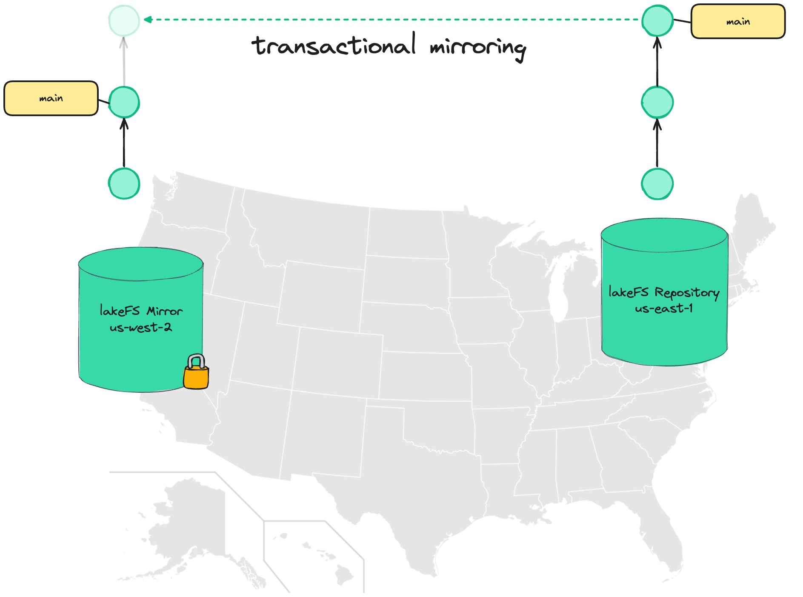

# Mirroring
{: .d-inline-block }
lakeFS Cloud
{: .label .label-green }

{: .note}
> Mirroring is only available for [lakeFS Cloud]().





## What is lakeFS mirroring? 

Mirroring in lakeFS allows replicating a lakeFS repository ("source") into read-only copies ("mirror") in different locations.

Unlike conventional mirroring, data isn't simply copied between regions - lakeFS Cloud tracks the state of each commit, advancing the commit log on the mirror only once a commit has been fully replicated and all data is available.




<iframe width="420" height="315" src="https://www.youtube.com/embed/NhOWGVjQrrA"></iframe>

## Uses cases

### Disaster recovery

Typically, object stores provide a replication/batch copy API to allow for disaster recovery: as new objects are written, they are asynchronously copied to other geo locations. 

In the case of regional failure, users can rely on the other geolocations which should contain relatively-up-to-date state.

The problem is reasoning about what managed to arrive by the time of disaster and what hasn't:
* have all the necessary files for a given dataset arrived?
* in cases there are dependencies between datasets, are all dependencies also up to date?
* what is currently in-flight or haven't even started replicating yet?

Reasoning about these is non-trivial, especially in the face of a regional disaster, however ensuring business continuity might require that we have these answers.

Using lakeFS mirroring makes it much easier to answer: we are guaranteed that the latest commit that exists in the replica is in a consistent state and is fully usable, even if it isn't the absolute latest commit - it still reflects a known, consistent, point in time.


### Data Locality

For certain workloads, it might be cheaper to have data available in multiple regions: Expensive hardware such as GPUs might fluctuate in price, so we'd want to pick the region that currently offers the best pricing. The difference could easily offset to cost of the replicated data.

The challenge is reproducibility - Say we have an ML training job that reads image files from a path in the object store. Which files existed at the time of training?

If data is constantly flowing between regions, this might be harder to answer than we think. And even if we know - how can we recreate that exact state if we want to run the process again (for example, to rebuild that model for troubleshooting).

Using consistent commits solves this problem - with lakeFS mirroring, it is guaranteed that a commit ID, regardless of location, will always contain the exact same data.

We can train our model in region A, and a month later feed the same commit ID into another region - and get back the same results.


## Setting up mirroring

### Configuring bucket replication on S3

The objects within the repository are copied using your cloud provider's object store replication mechanism.
For AWS S3, please refer to the [AWS S3 replication documentation](https://docs.aws.amazon.com/AmazonS3/latest/userguide/replication-how-setup.html) to make sure your lakeFS repository's [storage namespace](../understand/glossary.html#storage-namespace) (source) is replicated to the region you'd like your mirror to be located on (target).

After setting the replication rule, new objects will be replicated to the destination bucket. 

In order to replicate the existing objects, we'd need to manually copy them - however, we can use [S3 batch jobs](https://docs.aws.amazon.com/AmazonS3/latest/userguide/s3-batch-replication-batch.html) to do this.


### Creating a lakeFS user with a "replicator" policy

On our source lakeFS installation, under **Administration** create a new user that will be used by the replication subsystem.
The user should have the following [RBAC policy](../reference/security/rbac.html) attached:

```json
{
   "id": "ReplicationPolicy",
   "statement": [
      {
         "action": [
            "fs:ReadRepository",
            "fs:CreateRepository",
            "fs:UpdateRepository",
            "fs:DeleteRepository",
            "fs:ListRepositories",
            "fs:AttachStorageNamespace",
            "fs:ReadObject",
            "fs:WriteObject",
            "fs:DeleteObject",
            "fs:ListObjects",
            "fs:CreateCommit",
            "fs:CreateMetaRange",
            "fs:ReadCommit",
            "fs:ListCommits",
            "fs:CreateBranch",
            "fs:DeleteBranch",
            "fs:RevertBranch",
            "fs:ReadBranch",
            "fs:ListBranches"
         ],
         "effect": "allow",
         "resource": "*"
      }
   ]
}
```

**Alternatively**, we can create a policy with a narrower scope, only for a specific repository and/or mirror:

```json
{
   "id": "ReplicationPolicy",
   "statement": [
      {
         "action": [
            "fs:ListRepositories"
         ],
         "effect": "allow",
         "resource": "*"
      },
      {
         "action": [
            "fs:ReadRepository",
            "fs:ReadObject",
            "fs:ListObjects",
            "fs:ReadCommit",
            "fs:ListCommits",
            "fs:ReadBranch",
            "fs:ListBranches"
         ],
         "effect": "allow",
         "resource": "arn:lakefs:fs:::repository/{sourceRepositoryId}"
      },
      {
         "action": [
            "fs:ReadRepository",
            "fs:CreateRepository",
            "fs:UpdateRepository",
            "fs:DeleteRepository",
            "fs:AttachStorageNamespace",
            "fs:ReadObject",
            "fs:WriteObject",
            "fs:DeleteObject",
            "fs:ListObjects",
            "fs:CreateCommit",
            "fs:CreateMetaRange",
            "fs:ReadCommit",
            "fs:ListCommits",
            "fs:CreateBranch",
            "fs:DeleteBranch",
            "fs:RevertBranch",
            "fs:ReadBranch",
            "fs:ListBranches"
         ],
         "effect": "allow",
         "resource": "arn:lakefs:fs:::repository/{mirrorId}"
      },
      {
         "action": [
            "fs:AttachStorageNamespace"
         ],
         "effect": "allow",
         "resource": "arn:lakefs:fs:::namespace/{DestinationStorageNamespace}"
      }
   ]
}
```

Once a user has been created and the replication policy attached to it, create an access key and secret to be used by the mirroring process.


### Authorizing the lakeFS Mirror process to use the replication user

Please [contact Treeverse customer success](mailto:support@treeverse.io?subject=Setting up replication) to connect the newly created user with the mirroring process  


### Configuring repository replication

Replication has a stand-alone HTTP API. In this example, we'll use cURL, but feel free to use any HTTP client or library:

```bashhttps://treeverse.us-east-1
curl --location 'https://<ORGANIZATION_ID>.<SOURCE_REGION>.lakefscloud.io/service/replication/v1/repositories/<SOURCE_REPO>/mirrors' \
--header 'Content-Type: application/json' \
-u <ACCESS_KEY_ID>:<SECRET_ACCESS_KEY> \
-X POST \
--data '{
    "name": "<MIRROR_NAME>",
    "region": "<MIRROR_REGION>",
    "storage_namespace": "<MIRROR_STORAGE_NAMESPACE>"
}'
```
Using the following parameters:

* `ORGANIZATION_ID` - The ID as it appears in the URL of your lakeFS installation (e.g. `https://my-org.us-east-1.lakefscloud.io/`)
* `SOURCE_REGION` - The region where our source repository is hosted
* `SOURCE_REPO` - Name of the repository acting as our replication source. It should exist
* `ACCESS_KEY_ID` & `SECRET_ACCESS_KEY` - Credentials for your lakeFS user (make sure you have the necessary RBAC permissions as [listed below](#rbac))
* `MIRROR_NAME` - Name used for the read-only mirror to be created on the destination region
* `MIRROR_STORAGE_NAMESPACE` - Location acting as the replication target for the storage namespace of our source repository

### Mirroring and Garbage Collection

Garbage collection won't run on mirrored repositories. 
Deletions from garbage collection should be replicated from the source:
1. Enable [DELETED marker replication](https://docs.aws.amazon.com/AmazonS3/latest/userguide/delete-marker-replication.html) on the source bucket.
1. Create a [lifecycle policy](https://docs.aws.amazon.com/AmazonS3/latest/userguide/object-lifecycle-mgmt.html) on the destination bucket to delete the objects with the DELETED marker.

## RBAC

These are the required RBAC permissions for working with the new cross-region replication feature:

Creating a Mirror:

| Action                     | ARN                                           |
|----------------------------|-----------------------------------------------|
| `fs:CreateRepository`      | `arn:lakefs:fs:::repository/{mirrorId}`       |
| `fs:MirrorRepository`      | `arn:lakefs:fs:::repository/{sourceRepositoryId}` |
| `fs:AttachStorageNamespace` | `arn:lakefs:fs:::namespace/{storageNamespace}`|

Editing Mirrored Branches:

| Action                  | ARN                                           |
|-------------------------|-----------------------------------------------|
| `fs:MirrorRepository`   | `arn:lakefs:fs:::repository/{sourceRepositoryId}` |

Deleting a Mirror:

| Action               | ARN                                     |
|----------------------|-----------------------------------------|
| `fs:DeleteRepository`| `arn:lakefs:fs:::repository/{mirrorId}` |

Listing/Getting Mirrors for a Repository:

| Action                | ARN |
|-----------------------|-----|
| `fs:ListRepositories` | `*` |


## Other replication operations

### Listing all mirrors for a repository

```bash
curl --location 'https://<ORGANIZATION_ID>.<SOURCE_REGION>.lakefscloud.io/service/replication/v1/repositories/<SOURCE_REPO>/mirrors' \
-u <ACCESS_KEY_ID>:<SECRET_ACCESS_KEY> -s
```

### Getting a specific mirror

```bash
url --location 'https://<ORGANIZATION_ID>.<SOURCE_REGION>.lakefscloud.io/service/replication/v1/repositories/<SOURCE_REPO>/mirrors/<MIRROR_ID>' \
-u <ACCESS_KEY_ID>:<SECRET_ACCESS_KEY> -s
```

### Deleting a specific mirror

```bash
curl --location --request DELETE 'https://<ORGANIZATION_ID>.<SOURCE_REGION>.lakefscloud.io/service/replication/v1/repositories/<SOURCE_REPO>/mirrors/<MIRROR_ID>' \
-u <ACCESS_KEY_ID>:<SECRET_ACCESS_KEY>
```

## Limitations

1. Mirroring is currently only supported on [AWS S3](https://aws.amazon.com/s3/) and [lakeFS Cloud for AWS](https://lakefs.cloud)
1. Read-only mirrors cannot be written to. Mirroring is one-way, from source to destination(s)
1. Currently, only branches are mirrored. Tags and arbitrary commits that do not belong to any branch are not replicated
1. [lakeFS Hooks](./hooks) will only run on the source repository, not its replicas
1. Replication is still asynchronous: reading from a branch will always return a valid commit that the source has pointed to, but it is not guaranteed to be the **latest commit** the source branch is pointing to.
