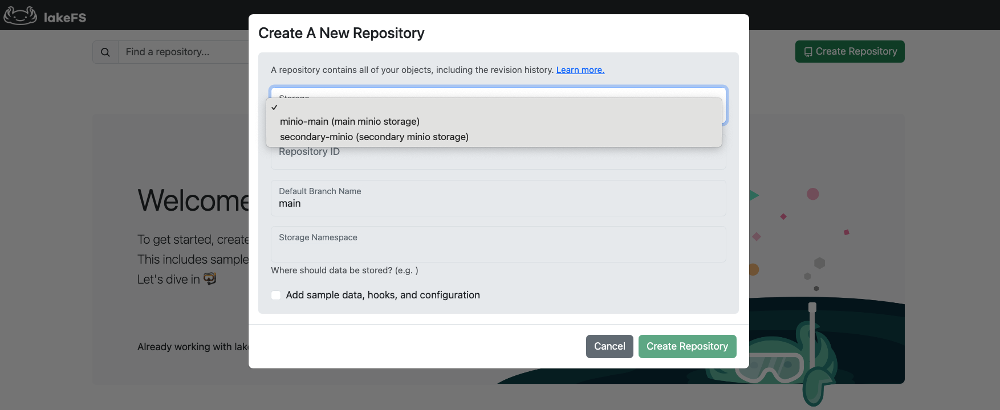
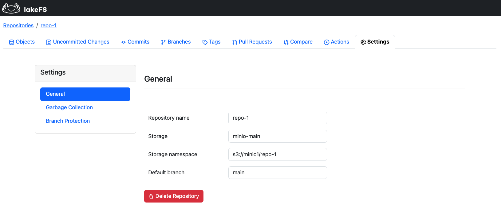

# Multi-Storage Backend Support

lakeFS Enterprise
{: .label .label-purple }

{: .note}
> Multi-storage backend support is only available for licensed [lakeFS Enterprise]() customers.<br>
> [Contact us](https://lakefs.io/contact-sales/) to get started!   



## What is Multi-storage Backend Support? 

lakeFS multi-storage backend support enables seamless data management across multiple storage systems — 
on-premises, across public clouds, or hybrid environments. This capability makes lakeFS a unified data management platform
for all organizational data assets, which is especially critical in AI/ML environments that rely on diverse datasets stored
in multiple locations.

With a multi-store setup, lakeFS can connect to and manage any combination of supported storage systems, including AWS S3,
Azure Blob, Google Cloud Storage, other S3-compatible storage, and even local storages. 

{: .note}
> Multi-storage backends support is available from version v1.51.0 of lakeFS Enterprise.

## Use Cases

1. **Distributed Data Management**:
   * Eliminate data silos and enable seamless cross-cloud collaboration.
   * Maintain version control across different storage providers for consistency and reproducibility.
   * Ideal for AI/ML environments where datasets are distributed across multiple storage locations.

2. **Unified Data Access**:
  * Access data across multiple storage backends using a single, consistent [URI format](../understand/model.md#lakefs-protocol-uris).

3. **Centralized Access Control & Governance**:
   * Access permissions and policies can be centrally managed across all connected storage systems using lakeFS [RBAC](../security/rbac.md).
   * Compliance and security controls remain consistent, regardless of where the data is stored.
   
## Configuration

To configure your lakeFS server to connect to multiple storage backends, define them under the `blockstores`
section in your server configurations. The `blockstores.stores` field is an array of storage backends, each with its own configuration.  

For a complete list of available options, refer to the [server configuration reference](../reference/configuration.md#blockstores).   

{: .note}
> **Note:** If you're upgrading from a single-store lakeFS setup, refer to the [upgrade guidelines](#upgrading-from-single-to-multi-store)
> to ensure a smooth transition.

### Example Configurations

<div class="tabs">
  <ul>
    <li><a href="#on-prem">On-prem</a></li>
    <li><a href="#multi-cloud">Multi-cloud</a></li>
    <li><a href="#hybrid">Hybrid</a></li>
  </ul>
  
  <div markdown="1" id="on-prem">

This example setup configures lakeFS to manage data across two separate MinIO instances.

```yaml
blockstores:
    signing:
      secret_key: "some-secret"
    stores:
        - id: "minio-prod"
          description: "Primary on-prem MinIO storage for production data"
          type: "s3"
          s3:
            force_path_style: true
            endpoint: 'http://minio-prod.local'
            discover_bucket_region: false
            credentials:
              access_key_id: "prod_access_key"
              secret_access_key: "prod_secret_key"
        - id: "minio-backup"
          description: "Backup MinIO storage for disaster recovery"
          type: "s3"
          s3:
            force_path_style: true
            endpoint: 'http://minio-backup.local'
            discover_bucket_region: false
            credentials:
              access_key_id: "backup_access_key"
              secret_access_key: "backup_secret_key"
```

  </div>

  <div markdown="2" id="multi-cloud">

This example setup configures lakeFS to manage data across two public cloud providers: AWS and Azure.

```yaml
blockstores:
    signing:
      secret_key: "some-secret"
    stores:
        - id: "s3-prod"
          description: "AWS S3 storage for production data"
          type: "s3"
          s3:
            region: "us-east-1"
        - id: "azure-analytics"
          description: "Azure Blob storage for analytics data"
          type: "azure"
          azure:
            storage_account: "analytics-account"
            storage_access_key: "EXAMPLE45551FSAsVVCXCF"

```
  </div>

  <div markdown="3" id="hybrid">

This hybrid setup allows lakeFS to manage data across both cloud and on-prem storages.
```yaml
blockstores:
    signing:
      secret_key: "some-secret"
    stores:
        - id: "s3-archive"
          description: "AWS S3 storage for long-term archival"
          type: "s3"
          s3:
            region: "us-west-2"
        - id: "minio-fast-access"
          description: "On-prem MinIO for high-performance workloads"
          type: "s3"
          s3:
            force_path_style: true
            endpoint: 'http://minio.local'
            discover_bucket_region: false
            credentials:
              access_key_id: "minio_access_key"
              secret_access_key: "minio_secret_key"

```
  </div>
</div>

### Key Considerations

* Unique Blockstore IDs: Each storage backend must have a unique id.
* Persistence of Blockstore IDs: Once defined, an id must not change.
* S3 Authentication Handling:
    * All standard S3 authentication methods are supported.
    * If static credentials are provided, lakeFS will use them. Otherwise, it will fall back to the AWS credentials chain. 
      This means that for setups with multiple storages of type `s3`, static credentials are required for all but one.

### Upgrading from Single to Multi-Store

When upgrading from a single storage backend to a multi-store setup, follow these guidelines:
* Use the new `blockstores` structure, **replacing** the existing `blockstore` configuration. Note that `blockstore` and `blockstores` 
  configurations are mutually exclusive - lakeFS does not support both simultaneously. 
* Define all previously available [single-blockstore settings](../reference/configuration.md#blockstore) under their respective storage backends.
* The `signing.secret_key` remains a required global setting.
* Set `backward_compatible: true` for the existing storage backend to ensure:
  * Existing repositories continue using the original storage backend.
  * Newly created repositories default to this backend unless explicitly assigned a different one, to ensure a non-breaking upgrade process. 

### Adding or Removing a Storage Backend

To add a storage backend, update the server configuration with the new storage entry and restart the server.

To remove a storage backend:
* Delete all repositories associated with the storage backend.
* Remove the storage entry from the configuration.
* Restart the server.

{: .warning}
> Repositories linked to a removed storage backend will result in unexpected behavior. Ensure all necessary cleanup is done before removal.

### Listing Connected Storage Backends

The [Get Config](https://docs.lakefs.io/reference/api.html#/config/getConfig) API endpoint now returns a list of storage
configurations. In multi-store setups, this is the recommended method to list connected storage backends and view their details.

### Common Configuration Errors & Fixes

| Issue                                                               | Cause | Solution                                                 |
|---------------------------------------------------------------------|-------|----------------------------------------------------------|
| Blockstore ID conflicts                                             | Duplicate `id` values in `stores` | Ensure each storage backend has a unique ID              |
| Missing `backward_compatible`                                       | Upgrade from single to multi-store without setting the flag | Add `backward_compatible: true` for the existing storage |
| Unsupported configurations in OSS or unlicensed Enterprise accounts | Using multi-store features in an unsupported setup | Contact us to start using the feature                    |

## Working with Repositories  

After setting up lakeFS Enterprise to connect with multiple storage backends, this section explains how to use these 
connected storages when working with lakeFS.

With multiple storage backends configured, lakeFS repositories are now linked to a specific storage backend. Together with
the repository's [storage namespace](../understand/model.md#concepts-unique-to-lakefs), this defines the exact location in
the underlying storage where the repository's data is stored.

The choice of storage backend impacts the following lakeFS operations:

### Creating a Repository

In a multi-store setup, users must specify a storage ID when creating a repository. This can be done using the following methods:
* API: Use the `storage_id` parameter in the [Create Repository endpoint](https://docs.lakefs.io/reference/api.html#/repositories/createRepository).  
* CLI: Use the `storage-id` flag with the [repo create](../reference/cli.md#lakectl-repo-create) command:
```bash
lakectl repo create lakefs://my-repo s3://my-bucket --storage-id my-storage
```
**Note**: The `--storage-id` flag is currently hidden in the CLI. 
* UI: Select a storage backend from the dropdown menu.

* High-level Python SDK: TODO

**Important notes:**
* In multi-store setups where a storage backend is marked as `backward_compatible = true`, repository creation requests
without a storage ID will default to this storage.
* If no storage backend is marked as `backward_compatible`, repository creation requests without a storage ID will fail.
* Each repository is associated with a single backend and uses a single location.

### Viewing Repository Details

To check which storage backend is associated with a repository:
* API – The [List Repositories](https://docs.lakefs.io/reference/api.html#/repositories/listRepositories) response includes the storage ID.
* UI – The storage ID is displayed in the repository settings page.


### Importing Data into a Repository

Importing data into a repository is supported when the following conditions are met:
* The credentials used for the repository's backing blockstore allow access to the storage location.
* The storage location is in the same region as the repository's backend.

## Limitations 

### Unsupported storage backends

Multi-storage backend support has been validated on:
* Self-managed S3-compatible object storage (e.g., MinIO)
* Amazon S3
* Local storage

While this feature is designed to support any blockstore combination, testing for Azure and GCS in multi-store setups is 
still in progress.

{: .note}
> **Note:** Other untested combinations may still work. You are encouraged to try them and share feedback.

### Unsupported clients

The following clients do not currently support working with multiple storage backends. However, we are actively working 
to bridge this gap: 
* [Spark-based GC](../howto/garbage-collection/index.md)
* [Spark client](../reference/spark-client.md)
* [lakeFS Hadoop FileSystem](../integrations/spark.md#lakefs-hadoop-filesystem)
* [Everest](../reference/mount.md)
