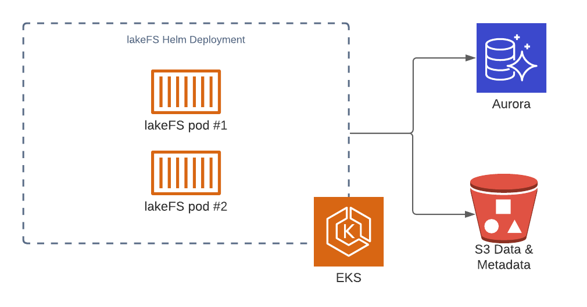

# Sizing guide




Note: For a scalable managed lakeFS service with guaranteed SLAs, try [lakeFS Cloud](https://lakefs.cloud)
{: .note }

## System Requirements

### Operating Systems and ISA
lakeFS can run on MacOS and Linux. Windows binaries are available but not rigorously tested - 
we don't recommend deploying lakeFS to production on Windows.
x86_64 and arm64 architectures are supported for both MacOS and Linux.

### Memory and CPU requirements
lakeFS servers require a minimum of 512mb of RAM and 1 CPU core. 
For high throughput, additional CPUs help scale requests across different cores. 
"Expensive" operations such as large diff or commit operations can take advantage of multiple cores. 

### Network
If using the data APIs such as the [S3 Gateway](../understand/architecture.md#s3-gateway), 
lakeFS will require enough network bandwidth to support the planned concurrent network upload/download operations.
For most cloud providers, more powerful machines (i.e., more expensive and usually containing more CPU cores) also provide increased network bandwidth.

If using only the metadata APIs (for example, only using the Hadoop/Spark clients), network bandwidth is minimal, 
at roughly 1Kb per request.

### Disk
lakeFS greatly benefits from fast local disks. 
A lakeFS instance doesn't require any strong durability guarantees from the underlying storage, 
as the disk is only ever used as a local caching layer for lakeFS metadata and not for long-term storage.
lakeFS is designed to work with [ephemeral disks](https://docs.aws.amazon.com/AWSEC2/latest/UserGuide/ssd-instance-store.html){: target="_blank" } - 
these are usually based on NVMe and are tied to the machine's lifecycle. 
Using ephemeral disks lakeFS can provide a very high throughput/cost ratio, 
probably the best that could be achieved on a public cloud, so we recommend those.

A local cache of at least 512 MiB should be provided. 
For large installations (managing >100 concurrently active branches, with >100M objects per commit),
we recommend allocating at least 10 GiB - since it's a caching layer over a relatively slow storage (the object store), 
see [Important metrics](#important-metrics) below to understand how to size this: it should be big enough to hold all commit metadata for actively referenced commits.


### lakeFS KV Store

lakeFS uses a key-value database to manage branch references, authentication and authorization information 
and to keep track of currently uncommitted data across branches.  
Please refer to the relevant driver tab for best practices, requirements and benchmarks.

#### Storage
The dataset stored in the metadata store is relatively modest as most metadata is pushed down into the object store. 
Required storage is mostly a factor of the amount of uncommitted writes across all branches at any given point in time: 
in the range of 150 MiB per every 100,000 uncommitted writes. 

We recommend starting at 10 GiB for a production deployment, as it will likely be more than enough.

<div class="tabs">
  <ul>
    <li><a href="#postgres-ram">PostgreSQL</a></li>
    <li><a href="#dynamodb-ram">DynamoDB</a></li>
  </ul>
<div markdown="1" id="postgres-ram">

**RAM**  
Since the data size is small, it's recommended to provide enough memory to hold the vast majority of that data in RAM.
Cloud providers will save you the need to tune this parameter - it will be set to a fixed percentage the chosen instance's available RAM (25% on AWS RDS, 30% on Google Cloud SQL).
It is recommended that you check with your selected cloud provider for configuration and provisioning information for you database.
For self-managed database instances follow these best practices

Ideally, configure the [shared_buffers](https://www.postgresql.org/docs/current/runtime-config-resource.html#GUC-SHARED-BUFFERS){: target="_blank" }
of your PostgreSQL instances to be large enough to contain the currently active dataset.
Pick a database instance with enough RAM to accommodate this buffer size at roughly x4 the size given for `shared_buffers`. For example, if an installation has ~500,000 uncommitted writes at any given time, it would require about 750 MiB of `shared_buffers`
that would require about 3 GiB of RAM.

**CPU**  
PostgreSQL CPU cores help scale concurrent requests. 1 CPU core for every 5,000 requests/second is ideal.
</div>
<div markdown="1" id="dynamodb-ram">
lakeFS will create a DynamoDB table for you, defaults to on-demand capacity setting. No need to specify how much read and write throughput you expect your application to perform, as DynamoDB instantly accommodates your workloads as they ramp up or down.

You can customize the table settings to provisioned capacity which allows you to manage and optimize your costs by allocating read/write capacity in advance (see [Benchmarks](#benchmarks))

**Notes**:
* Using DynamoDB on-demand capacity might generate unwanted costs if the table is abused, if you'd like to cap your costs, make sure to change the table to use provisioned capacity instead.  
* lakeFS doesn't manage the DynamoDB's table lifecycle, we've included the table creation in order to help evaluating the system with minimal effort, any change to the table beyond the table creation - will need to be handled manually or by 3rd party tools.

**RAM**  
Managed by AWS.

**CPU**  
Managed by AWS.
</div>
</div>

## Scaling factors

Scaling lakeFS, like most data systems, moves across two axes: throughput of requests (amount per given timeframe) and latency (time to complete a single request).

### Understanding latency and throughput considerations

Most lakeFS operations are designed to be very low in latency.
Assuming a well-tuned local disk cache (see [Storage](#storage) above),
most critical path operations
(writing objects, requesting objects, deleting objects) are designed to complete in **<25ms at p90**.
Listing objects obviously requires accessing more data, but should always be on-par with what the underlying object store can provide,
and in most cases, it's actually faster.
At the worst case, for directory listing with 1,000 common prefixes returned, expect a latency of **75ms at p90**.

Managing branches (creating them, listing them and deleting them) are all constant-time operations, generally taking **<30ms at p90**.

Committing and merging can take longer, as they are proportional to the amount of **changes** introduced.
This is what makes lakeFS optimal for large Data Lakes -
the amount of changes introduced per commit usually stays relatively stable while the entire data set usually grows over time.
This means lakeFS will provide predictable performance:
committing 100 changes will take roughly the same amount of time whether the resulting commit contains 500 or 500 million objects.

See [Data Model](../understand/how/versioning-internals.md) for more information.

Scaling throughput depends very much on the amount of CPU cores available to lakeFS.
In many cases, it's easier to scale lakeFS across a fleet of smaller cloud instances (or containers)
than scale up with machines that have many cores. In fact, lakeFS works well in both cases.
Most critical path operations scale very well across machines.

## Benchmarks

<div class="tabs">
  <ul>
    <li><a href="#postgres-ram">PostgreSQL</a></li>
    <li><a href="#dynamodb-ram">DynamoDB</a></li>
  </ul>
<div markdown="1" id="postgres-ram">

### PostgresSQL
All benchmarks below were measured using 2 x [c5ad.4xlarge](https://aws.amazon.com/ec2/instance-types/c5/){: target="_blank" } instances
on [AWS us-east-1](https://docs.aws.amazon.com/AWSEC2/latest/UserGuide/using-regions-availability-zones.html#concepts-available-regions).
Similar results can be achieved on Google Cloud using a `c2-standard-16` machine type, with an attached [local SSD](https://cloud.google.com/compute/docs/disks/local-ssd).
On Azure, you can use a `Standard_F16s_v2` virtual machine.

The PostgreSQL instance that was used is a [db.m6g.2xlarge](https://docs.aws.amazon.com/AmazonRDS/latest/UserGuide/Concepts.DBInstanceClass.html){: target="_blank" }
(8 vCPUs, 32 GB RAM). Equivalent machines on Google Cloud or Azure should yield similar results.

The example repository we tested against contains the metadata of a large lakeFS installation,
where each commit contains **~180,000,000** objects (representing ~7.5 Petabytes of data).

All tests are reproducible using the [lakectl abuse command](../reference/cli.html#lakectl-abuse),
so use it to properly size and tune your setup. All tests are accompanied by the relevant `lakectl abuse` command that generated them.

### Random reads

This test generates random read requests to lakeFS,
in a given commit. Paths are requested randomly from a file containing a set of preconfigured (and existing) paths.


**command executed:**

```shell
lakectl abuse random-read \
    --from-file randomly_selected_paths.txt \
    --amount 500000 \
    --parallelism 128 \
    lakefs://example-repo/<commit hash>
```

**Note** lakeFS version <= v0.33.1 uses '@' (instead of '/') as separator between repository and commit hash.

**Result Histogram (raw):**

```
Histogram (ms):
1	0
2	0
5	37945
7	179727
10	296964
15	399682
25	477502
50	499625
75	499998
100	499998
250	500000
350	500000
500	500000
750	500000
1000	500000
5000	500000
min	3
max	222
total	500000
```

So 50% of all requests took <10ms, while 99.9% of them took <50ms

**throughput:**

Average throughput during the experiment was **10851.69 requests/second**

### Random Writes

This test generates random write requests to a given lakeFS branch.
All the paths are pre-generated and don't overwrite each other (as overwrites are relatively rare in a Data Lake setup).

**command executed:**

```shell
lakectl abuse random-write \
    --amount 500000 \
    --parallelism 64 \
    lakefs://example-repo/main
```

**Note** lakeFS version <= v0.33.1 uses '@' (instead of '/') as separator between repository and branch.


**Result Histogram (raw):**

```
Histogram (ms):
1	0
2	0
5	30715
7	219647
10	455807
15	498144
25	499535
50	499742
75	499784
100	499802
250	500000
350	500000
500	500000
750	500000
1000	500000
5000	500000
min	3
max	233
total	500000
```

So, 50% of all requests took <10ms, while 99.9% of them took <25ms.

**throughput:**

The average throughput during the experiment was **7595.46 requests/second**.

### Branch creation

This test creates branches from a given reference.

**command executed:**

```shell
lakectl abuse create-branches \
    --amount 500000 \
    --branch-prefix "benchmark-" \
    --parallelism 256 \
    lakefs://example-repo/<commit hash>
```

**Note** lakeFS version <= v0.33.1 uses '@' (instead of '/') as separator between repository and commit hash.

**Result Histogram (raw):**

```
Histogram (ms):
1	0
2	1
5	5901
7	39835
10	135863
15	270201
25	399895
50	484932
75	497180
100	499303
250	499996
350	500000
500	500000
750	500000
1000	500000
5000	500000
min	2
max	304
total	500000
```

So, 50% of all requests took <15ms, while 99.9% of them took <100ms.

**throughput:**

The average throughput during the experiment was **7069.03 requests/second**.
</div>
<div markdown="1" id="dynamodb-ram">

### DynamoDB
All benchmarks below were measured using m5.xlarge instance on AWS us-east-1.

The DynamoDB table that was used was provisioned with 500/1000 read/write capacity.

The example repository we tested against contains the metadata of a large lakeFS installation, where each commit contains ~100,000,000 objects (representing ~3.5 Petabytes of data).

All tests are reproducible using the lakectl abuse command, so use it to properly size and tune your setup. All tests are accompanied by the relevant lakectl abuse command that generated them.

### Random reads

This test generates random read requests to lakeFS,
in a given commit. Paths are requested randomly from a file containing a set of preconfigured (and existing) paths.


**command executed:**

```shell
lakectl abuse random-read \
    --from-file randomly_selected_paths.txt \
    --amount 500000 \
    --parallelism 128 \
    lakefs://example-repo/<commit hash>
```

**Result Histogram (raw): Provisioned read capacity units = 1000
Provisioned write capacity units = 1000**

```
Histogram (ms):
1	0
2	0
5	0
7	0
10	0
15	0
25	122
50	47364
75	344489
100	460404
250	497912
350	498016
500	498045
750	498111
1000 498176
5000 499478
min	18
max	52272
total 500000
```

**Result Histogram (raw): Provisioned read capacity units = 500
Provisioned write capacity units = 500**

```
Histogram (ms):
1	0
2	0
5	0
7	0
10	0
15	1
25	2672
50	239661
75	420171
100	470146
250	486603
350	486715
500	486789
750	487443
1000	488113
5000	493201
min	14
max	648085
total	499998
```

### Random Writes

This test generates random write requests to a given lakeFS branch.
All the paths are pre-generated and don't overwrite each other (as overwrites are relatively rare in a Data Lake setup).

**command executed:**

```shell
lakectl abuse random-write \
    --amount 500000 \
    --parallelism 64 \
    lakefs://example-repo/main
```

**Result Histogram (raw): Provisioned read capacity units = 1000
Provisioned write capacity units = 1000**

```
Histogram (ms):
1	0
2	0
5	0
7	0
10	0
15	0
25	24
50	239852
75	458504
100	485225
250	493687
350	493872
500	493960
750	496239
1000	499194
5000	500000
min	23
max	4437
total	500000
```
**Result Histogram (raw): Provisioned read capacity units = 500
Provisioned write capacity units = 500**

```
Histogram (ms):
1	0
2	0
5	0
7	0
10	0
15	0
25	174
50	266460
75	462641
100	484486
250	490633
350	490856
500	490984
750	492973
1000 495605
5000 498920
min	21
max	50157
total 500000
```

### Branch creation

This test creates branches from a given reference.

**command executed:**

```shell
lakectl abuse create-branches \
    --amount 500000 \
    --branch-prefix "benchmark-" \
    --parallelism 256 \
    lakefs://example-repo/<commit hash>
```

**Result Histogram (raw): Provisioned read capacity units = 1000
Provisioned write capacity units = 1000**

```
Histogram (ms):
1	0
2	0
5	0
7	0
10	0
15	0
25	0
50	628
75	26153
100	58099
250	216160
350	307078
500	406165
750	422898
1000	431332
5000	475848
min	41
max	430725
total	490054
```

**Result Histogram (raw): Provisioned read capacity units = 500
Provisioned write capacity units = 500**

```
Histogram (ms):
1	0
2	0
5	0
7	0
10	0
15	0
25	0
50	3132
75	155570
100	292745
250	384224
350	397258
500	431141
750	441360
1000 445597
5000 469538
min	39
max	760626
total 497520
```

</div>
</div>

## Important metrics

lakeFS exposes metrics using the [Prometheus protocol](https://prometheus.io/docs/introduction/overview/){: target="_blank" }. 
Every lakeFS instance exposes a `/metrics` endpoint that could be used to extract them. 

Here are a few notable metrics to keep track of when sizing lakeFS:

`api_requests_total` - Tracks throughput of API requests over time.

`api_request_duration_seconds` - Histogram of latency per operation type.

`gateway_request_duration_seconds` - Histogram of latency per [S3 Gateway](../understand/architecture.md#s3-gateway) operation.

<div class="tabs">
  <ul>
    <li><a href="#postgres">PostgreSQL</a></li>
    <li><a href="#dynamodb">DynamoDB</a></li>
  </ul>
<div markdown="1" id="dynamodb">

`dynamo_request_duration_seconds` - Time spent doing DynamoDB requests.

`dynamo_consumed_capacity_total` - The capacity units consumed by operation.

`dynamo_failures_total` - The total number of errors while working for kv store.

</div>
</div>

## Reference architectures

Below are a **few example architectures for lakeFS deployment.** 

### Reference Architecture: Data Science/Research environment

**Use case:** Manage Machine learning or algorithms development. 
Use lakeFS branches to achieve both isolation and reproducibility of experiments. 
Data being managed by lakeFS is both structured tabular data, 
as well as unstructured sensor and image data used for training. 
Assuming a team of 20-50 researchers, with a dataset size of 500 TiB across 20M objects.

**Environment:** lakeFS will be deployed on Kubernetes. 
managed by [AWS EKS](https://aws.amazon.com/eks/){: target="_blank" } 
with PostgreSQL on [AWS RDS Aurora](https://aws.amazon.com/rds/aurora/postgresql-features/){: target="_blank" }

**Sizing:** Since most of the work is done by humans (vs. automated pipelines), most experiments tend to be small in scale, 
reading and writing 10s to 1000s of objects. 
The expected amount of branches active in parallel is relatively low, around 1-2 per user, 
each representing a small amount of uncommitted changes at any given point in time. 
Let's assume 5,000 uncommitted writes per branch = ~500k. 

To support the expected throughput, a single moderate lakeFS instance should be more than enough, 
since requests per second would be on the order of 10s to 100s. 
For high availability, we'll deploy 2 pods with 1 CPU core and 1 GiB of RAM each.

Since the PostgreSQL instance is expected to hold a very small dataset 
(at 500k, expected dataset size is `150MiB (for 100k records) * 5 = 750MiB`). 
To ensure we have enough RAM to hold this, we'll need 3 GiB of RAM, so, a very moderate Aurora instance `db.t3.large` (2 vCPUs, 8 GB RAM) will be more than enough.
An equivalent database instance on GCP or Azure should give similar results.




### Reference Architecture: Automated Production Pipelines

**Use case:** Manage multiple concurrent data pipelines using Apache Spark and Airflow. 
Airflow DAGs start by creating a branch for isolation and for CI/CD. 
Data being managed by lakeFS is structured, tabular data. The total dataset size is 10 PiB, spanning across 500M objects. 
The expected throughput is 10k reads/second + 2k writes per second across 100 concurrent branches.

**Environment:** lakeFS will be deployed on Kubernetes. 
managed by [AWS EKS](https://aws.amazon.com/eks/){: target="_blank" } 
with PostgreSQL on [AWS RDS](https://aws.amazon.com/rds/aurora/postgresql-features/){: target="_blank" }

**Sizing:** Data pipelines tend to be bursty in nature: 
reading in a lot of objects concurrently, doing some calculation or aggregation, and then writing many objects concurrently. 
The expected amount of branches active in parallel is high, 
with many Airflow DAGs running per day, each representing a moderate amount of uncommitted changes at any given point in time. 
Let's assume 1,000 uncommitted writes/branch * 2500 branches = ~2.5M records. 

To support the expected throughput, looking the benchmarking numbers above, 
we're doing roughly 625 requests/core, so 24 cores should cover our peak traffic. We can deploy `6 * 4 CPU core pods`.

On to the PostgreSQL instance - at 500k, the expected dataset size is `150MiB (for 100k records) * 25 = 3750 MiB`. 
To ensure we have enough RAM to hold this, we'll need at least 15 GiB of RAM, so we'll go with a `db.r5.xlarge` (4 vCPUs, 32GB RAM) Aurora instance.
An equivalent database instance on GCP or Azure should give similar results.


